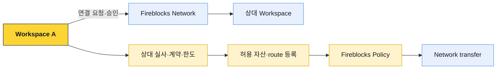

# 외부 연동과 책임

Fireblocks Network, AML·Travel Rule provider, Address Registry 같은 기능은 상대 발견과 거래 통제를 보완한다. 연결돼 있다는 사실만으로 법적 관계, 상대 실사, 고객 원장과 규제 의무가 자동 완결되지는 않는다.

## Fireblocks Network

Fireblocks Network는 기관 고객이 서로 검색·연결하고 자산을 이체하는 P2P 네트워크다. 연결 승인과 자동화된 주소 확인을 통해 수동 주소 전달 위험을 줄일 수 있다.

Network connection은 다음을 대신하지 않는다.

- 상대 법인·VASP·수탁기관의 KYC·KYB와 계약
- 관할·제재·AML 위험평가
- 자산·네트워크·tag·memo별 입금 route 검증
- 트래블룰 정보 교환과 수취인 일치 확인
- 거래 한도·정산 조건·오류 반환 책임

## Smart Transfer

Smart Transfer는 연결된 당사자들이 ticket과 여러 자산 이동을 사용해 정산을 조정하는 워크플로다. 일반 transfer와 같은 단일 outgoing transaction으로 축약하지 않는다.

제품의 `완료`가 여러 블록체인 leg의 원자적 커밋을 의미하는 것은 아니다.

## AML screening

Fireblocks는 외부 AML provider와 screening 흐름을 연결할 수 있다. Provider에 따라 Clear·Accept, Review·Pending, Reject·Block, Error·Unavailable 같은 결과가 전달된다.

## 트래블룰

트래블룰은 온체인 transaction과 별도의 VASP 간 개인정보 교환이다. Fireblocks·Notabene 연동은 메시지 교환을 지원하지만 법적 적용, 상대 도달성, IVMS101 데이터와 개인지갑 증명을 자동으로 완결하지 않는다.

## Address·counterparty 정보

Address Registry나 Network directory의 결과는 상대 발견과 교차 확인 신호로 사용한다. 조회되지 않는다는 사실만으로 개인지갑·불법 주소·미준수 VASP라고 판정하지 않는다. 지원 범위, 상대 opt-in, product entitlement와 데이터 최신성 때문에 결과가 없을 수 있다.

반대로 registry에서 법인이 조회된다고 그 주소의 현재 소유권, 수취 고객과 트래블룰 완료가 모두 증명되는 것도 아니다.
