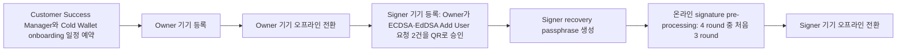
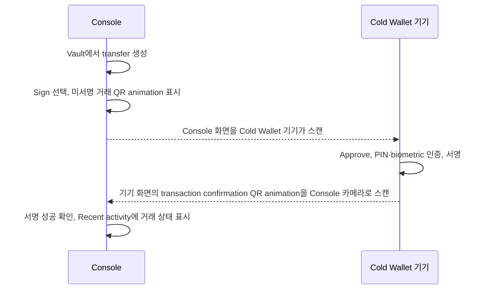

# Cold Wallet 공개 운영 절차

Fireblocks Cold Wallet은 세 번째 MPC key share를 air-gapped 모바일 기기에 두고 Console과 기기 사이의 서명 데이터를 QR animation으로 전달한다. 이 문서는 2026-09-01에 확인한 Fireblocks 공식 문서, 금융위원회 자료, 거래소 공개자료를 기준으로 제품 절차와 공개 범위를 정리한다.

## Hot·Warm·Cold 구분

Fireblocks는 세 번째 MPC key share의 위치와 승인 방식으로 세 유형을 구분한다.

| 유형 | 세 번째 MPC key share | 승인 방식 |
|---|---|---|
| Hot Wallet | API Co-Signer의 API user | 자동화 가능 |
| Warm Wallet | 인터넷에 연결된 모바일 기기 | Fireblocks mobile app |
| Cold Wallet | air-gapped 모바일 기기 | 양방향 QR 스캔 |

Workspace는 Hot·Warm 또는 Cold Wallet-only로 구성되며 한 workspace에 두 유형을 섞지 않는다. Cold Wallet workspace를 생성하려면 Customer Success Manager와 onboarding 일정을 잡아야 한다. 계약에 해당 제품이 포함돼 있어야 한다. [Fireblocks Cold Wallet 개요](https://support.fireblocks.io/hc/en-us/articles/4405965412114-About-Fireblocks-Cold-Wallet), [기능 구분](https://developers.fireblocks.com/docs/capabilities)

## 등록부터 서명까지

기기 등록은 초기 준비 절차이고 거래 서명은 거래마다 반복되는 절차다. 두 흐름을 분리해 표시한다.

### 기기 준비

### 거래 1건 서명

위 거래 도식의 양방향 화살표는 네트워크 연결이 아니라 한쪽 화면의 QR animation을 다른 쪽 카메라로 스캔하는 데이터 이동 방향이다.

### 1. Owner 기기 등록

Owner 기기를 Signer 기기보다 먼저 구성한다. Fireblocks 공식 절차는 다음 조건을 명시한다.

- 새 iOS 기기와 Apple Configurator 2를 실행할 Mac을 사용한다.
- 기기를 Supervised Mode로 준비하고 MDM에는 enroll하지 않는다.
- SIM card를 설치하지 않는다.
- 앱 설치와 workspace 가입 단계에서는 인터넷에 연결한다.
- 2FA, biometric, passcode, recovery passphrase를 설정한다.
- 등록 후 Apple ID에서 로그아웃하고 Bluetooth·Wi-Fi를 끈 뒤 Airplane Mode를 켠다.
- 재시작 후에도 Bluetooth와 Wi-Fi가 꺼져 있도록 제한 profile을 적용한다. 해당하는 기기·iOS version에는 Single App Mode도 적용한다.

[Owner Cold Wallet 기기 등록](https://support.fireblocks.io/hc/en-us/articles/360021911260-Provisioning-an-Owner-s-Cold-Wallet-device)

### 2. Signer 기기 등록과 pre-processing

Signer 기기는 Owner 기기가 준비된 뒤 등록한다. Owner는 ECDSA와 EdDSA에 대한 두 개의 Add User 요청을 각각 양방향 QR animation으로 승인한다. Signer는 recovery passphrase를 만든 뒤 signature pre-processing을 실행한다.

Signature pre-processing은 MPC-CMP 통신 4 round 중 처음 3 round를 미리 완료하고 pre-processed signature를 기기에 저장하는 단계다. 이때는 Fireblocks cloud co-signer와 통신하므로 인터넷 연결을 사용한다. 실제 거래의 마지막 round는 QR 스캔으로 완료한다.

Pre-processing을 마치면 Apple ID에서 로그아웃하고 Bluetooth·Wi-Fi를 끈 뒤 Airplane Mode를 켠다. 제한 profile을 적용하고 해당하는 기기·iOS version에는 Single App Mode를 적용한다.

Fireblocks는 일반적으로 2년 이상 사용할 수 있는 pre-processed signature를 기기에 적재한다고 설명한다. ECDSA 또는 EdDSA의 잔여 용량이 초기 용량의 10% 미만이면 Audit Log event를 발행한다. [Signer Cold Wallet 기기 등록](https://support.fireblocks.io/hc/en-us/articles/360020781559-Provisioning-a-Signer-s-Cold-Wallet-device)

### 3. 거래 서명

1. Vault에서 transfer를 생성하면 Console의 Cold Wallet signing panel에 요청이 나타난다.
2. Console에서 `Sign`을 선택해 거래 정보가 담긴 QR animation을 표시한다.
3. Signer가 Cold Wallet app으로 Console QR animation을 스캔하고 `Approve`를 선택한 뒤 PIN과 biometric ID로 인증한다.
4. Cold Wallet app이 transaction confirmation QR animation을 만든다.
5. Console에서 `Confirm mobile scan`을 선택하고 컴퓨터 카메라로 transaction confirmation QR animation을 스캔한다.
6. Console이 서명 성공을 확인하고 `Recent activity`에 거래 상태를 표시한다.

Cold Wallet 거래는 생성 후 8시간 안에 서명되지 않으면 timeout으로 취소된다. [Cold Wallet 거래 서명](https://support.fireblocks.io/hc/en-us/articles/360021915320-Signing-transactions-with-your-Cold-Wallet-device)

## Hot·Cold workspace 간 이동

Fireblocks는 Hot·Cold workspace 간 자산 이동 경로로 P2P Network를 안내한다. 새 P2P Network connection은 요청 측과 상대 측의 Admin Quorum이 모두 승인해야 한다. P2P transfer는 secure hardware enclave 안의 encrypted tunnel로 routing되며 Automated Address Authentication은 주소를 메신저나 복사·붙여넣기로 전달하는 단계를 줄인다.

공개 문서에서는 개별 transfer의 approval flow, Hot→Cold와 Cold→Hot의 방향별 차이, Support 개입 여부를 확인하지 못했다. [Fireblocks P2P Network](https://support.fireblocks.io/hc/en-us/articles/6107038882460-About-the-P2P-Network)

## 백업·복구에서 확인되는 범위

Fireblocks의 공개 `Mobile Key Share Backup and Recovery` 문서는 일반 mobile key share 복구를 설명한다.

- 기기 OS cloud backup에는 Fireblocks key share material이 포함되지 않는다.
- Biometric 설정 변경, PIN 분실, 기기 분실·파손·교체, Fireblocks app 삭제는 mobile key share에 접근할 수 없게 되는 사유다.
- Owner 기기의 mobile key share recovery에는 Fireblocks Support와 경우에 따라 Disaster Recovery Service provider의 도움이 필요하다.
- Owner recovery에는 recovery passphrase를 쓰거나 다른 signing user의 mobile device를 쓰는 방법이 안내된다.

이 문서만으로 Cold Wallet 전용 workspace key backup 전체 절차를 확정할 수는 없다. [Mobile Key Share Backup and Recovery](https://support.fireblocks.io/hc/en-us/articles/360016261160-Mobile-Key-Share-Backup-and-Recovery)

## 한국 규제 기준

금융위원회의 가상자산이용자보호법 하위규정은 이용자 가상자산 경제적 가치의 80% 이상을 Cold Wallet에 보관하도록 정했다. 경제적 가치는 가상자산 종류별 보관 수량에 전월 말일 기준 최근 1년간 일평균 원화환산액을 곱해 합산한다. 사업자는 하루 중 특정 시점의 보관 수량을 기준으로 비율을 매일 점검하고 80% 이상을 상시 유지할 내부통제장치를 마련해야 한다. [금융위원회 하위규정](https://www.fsc.go.kr/no010101/81214), [금융위원회 Q&A](https://www.fsc.go.kr/po020201/83937?curPage=2)

## 거래소·커스터디 업체 공개 사례

| 기관 | 공개 내용 | 기준과 제약 |
|---|---|---|
| 빗썸 | 자산의 95.6%를 Cold Wallet에 분리 보관 | 2025-12-31 기준 공식 공지. 세부 서명·리밸런싱 절차는 미공개. [출처](https://feed.bithumb.com/notice/1651735) |
| Coinbase Singapore | 고객 자산 중 소수만 settlement wallet에 두고 대부분은 offline vault storage에 보관. maximum·low balance threshold에 따라 두 보관 영역 사이에서 자산 이동 | 싱가포르 법인의 소비자 보호 공개에 한정. [출처](https://www.coinbase.com/en-gb/legal/consumer_protection_disclosures/singapore) |
| Coinbase Global | 수탁 자산의 Hot Wallet 비중을 일반적으로 2% 이하로 유지하려고 한다고 기재 | 2024 Q3 Form 10-Q p.84의 시점 정보. 2026년 현재 비율로 단정하지 않음. [출처](https://investor.coinbase.com/files/doc_events/2024/Oct/30/Coinbase-Global-Inc-Q3-2024-10Q.pdf) |
| Gemini | segregated custody asset 전체와 exchange wallet asset 대부분을 offline air-gapped storage에 보관 | 정확한 exchange Cold 비율과 상세 리밸런싱 절차는 미공개. [출처](https://www.gemini.com/institutions/custody) |
| Bitstamp | 공개 글에서 자금과 자산의 약 95%를 offline cold storage, 5%를 즉시 출금용 Hot Wallet에 보관한다고 설명 | 2022-11-14 게시물의 수치. 2026년 현재 운영 비율로 단정하지 않음. [출처](https://blog.bitstamp.net/post/what-does-a-safe-exchange-look-like/) |

기관별 수치는 산정 방법, 기준일, 자산 범위, 법적 관할이 다르다. 한국의 80% 규제 기준과 거래소가 공개한 보관 비율을 같은 의미로 비교하지 않는다.

## 공개 문서에서 확정되지 않은 항목

- Cold Wallet의 첫 번째·두 번째 MPC share 위치와 전체 share 분포
- Cold Wallet 전용 user-role 전체 표
- Approval Group 지원 여부를 포함한 최신 governance 제약
- 개별 Hot·Cold transfer의 approval flow와 방향별 차이
- Cold Wallet 전용 workspace key backup 전체 절차
- 거래소별 키 조각 분포, 서명 정족수, 기기 보관 장소, 담당자 동선과 비상 절차

## 조사자료

- [Fireblocks 공식 문서 스냅숏](../../../sources/fireblocks-cold-wallet/2026-09-01__fireblocks-public-docs.md)
- [규제·거래소 공개자료 스냅숏](../../../sources/fireblocks-cold-wallet/2026-09-01__regulation-exchange-disclosures.md)
- [Source manifest](../../../sources/fireblocks-cold-wallet/manifest.yml)
- [Mode C source note](../../../../sources/fireblocks/source-notes/cold-wallet-operating-model.md)
