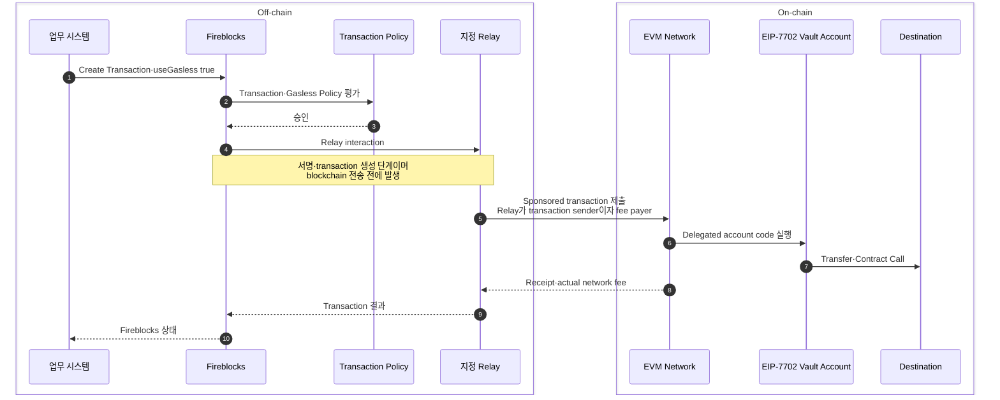
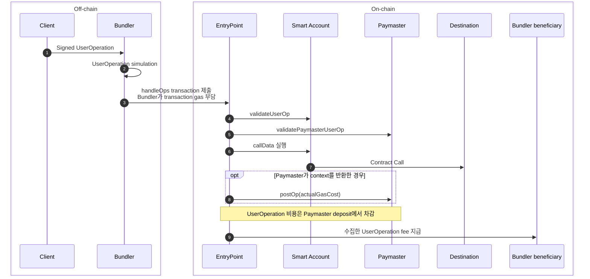

# 자산 실행 승인자와 fee payer

가스 대납은 자산 실행을 승인하는 계정과 network fee의 재원을 제공하는 계정·예치금을 분리하는 구조다. 자산 소유자는 Transfer·Contract Call을 승인하고, Relay 또는 Bundler가 On-chain transaction을 제출한다.

대납은 수수료를 없애지 않는다. 네트워크가 부과한 비용을 누가 먼저 지불하고, 최종적으로 누구에게 어떻게 정산할지를 바꾼다.

## 방식별 fee payer

| 방식 | On-chain transaction sender | 체인에 제출할 때의 fee payer | 실행 후 비용 귀속 |
|---|---|---|---|
| 계정 직접 지불 | 자산 소유 EOA | 같은 EOA의 native token | 해당 계정에 확정 |
| EIP-7702 Relay | Relay | Relay가 통제하는 fee account | Local·External Relay 잔고 또는 Fireblocks-managed Relay 청구 |
| ERC-4337 Paymaster | Bundler | Bundler가 `handleOps` transaction의 gas 부담 | EntryPoint가 Paymaster deposit에서 UserOperation 비용을 차감 |

EIP-7702 Relay와 ERC-4337 Paymaster는 같은 흐름의 옵션이 아니다. 전자는 Relay가 일반 transaction을 제출하는 구조이고, 후자는 Bundler가 `UserOperation`을 모아 EntryPoint에 제출하는 구조다.

## EIP-7702 Relay — Fireblocks Universal Gasless

이 흐름에서 Relay는 transaction을 제출하면서 자신의 fee account에 있는 native token으로 network fee를 낸다. 제출 뒤 다른 주체의 입금을 기다리는 단계는 없다.

보관된 Fireblocks 공식 문서에서 확인되는 비용 재원은 다음과 같다.

| Relay 설정 | network fee 재원 | 이후 정산 |
|---|---|---|
| Local Relay | 같은 Workspace에서 Relay로 지정한 Vault Account | Relay Vault 잔고에서 차감 |
| External Workspace Relay | 외부 Workspace의 Relay Vault Account | Workspace·법인 간 정산 |
| Fireblocks Gasless Relay | Fireblocks-managed Relay | Fireblocks가 선지불하고 월말 인보이스 청구 |

Fireblocks 공개 문서는 Relay가 비용을 부담한다는 경계까지 설명한다. Relay 내부 transaction payload와 delegated account code의 세부 호출 순서는 공개 근거 없이 다이어그램에 추가하지 않는다.

## ERC-4337 Paymaster

[ERC-4337 명세](https://eips.ethereum.org/EIPS/eip-4337)는 Bundler가 `handleOps` transaction을 제출하고, EntryPoint가 각 UserOperation의 비용을 Account 또는 Paymaster deposit에서 모은 뒤 Bundler가 지정한 `beneficiary`에 지급하도록 정의한다. Paymaster는 Bundler transaction의 sender가 아니며, Fireblocks Universal Gasless가 Paymaster를 사용한다는 근거도 없다.

## 거래를 볼 때 분리할 항목

| 확인 항목 | 의미 |
|---|---|
| 자산 실행 승인자 | Transfer·Contract Call을 허용한 계정과 서명 |
| On-chain transaction sender | transaction을 네트워크에 제출한 주소 |
| Protocol fee payer | transaction 처리에 필요한 native token을 제공한 계정·예치금 |
| Sponsorship 승인자 | 어떤 요청의 비용을 부담할지 결정한 Policy·Service·Paymaster |
| 최종 비용 부담자 | 실비·구독료를 회사·고객·외부 법인 중 누구에게 귀속할지 결정 |
| 정산 근거 | Transaction Hash·Receipt·Relay 사용 내역·인보이스 |

자산을 옮길 권한과 가스비를 내는 권한은 별개다. Relay가 수수료를 부담해도 임의로 고객 자산을 이동할 권한이 생기지 않는다. 반대로 자산 소유자의 서명이 유효해도 Gasless Policy·Relay·Paymaster 검증에서 거절되면 거래는 제출되지 않을 수 있다.

## 대납 구조가 해결하는 운영 문제

EVM 토큰 전송은 토큰과 별도로 체인의 기본 자산을 수수료로 요구한다. 고객별 수탁 계정에 스테이블코인만 입금돼도 해당 계정이 직접 토큰을 보내려면 ETH 같은 기본 자산이 필요하다.

고객 계정이 많아지면 문제는 거래 한 건의 가스비보다 다음 운영으로 확대된다.

- 계정별 기본 자산 잔고와 충전 임계값 관리
- 여러 체인의 기본 자산 조달·보관·회계 처리
- Sweep 전에 필요한 선충전 거래와 추가 수수료
- 수수료 부족, Relay 거절, Pending·Revert의 구분
- 고객 부담·회사 부담·벤더 청구 간 비용 귀속과 대사

## 문서 구성

| 문서 | 다루는 경계 |
|---|---|
| [가스비 지불 모델](01-fee-payment-models.md) | 직접 지불·자동 충전·Relay·Paymaster의 자산 보유와 정산 차이 |
| [승인·계정 실행 모델](02-authorization-and-account-models.md) | ERC-3009·ERC-2771·ERC-4337·EIP-7702의 권한 검증과 실행 경로 |
| [Fireblocks Gasless](03-fireblocks-gasless.md) | Gas Station과 Gasless Service, Relay 구성, Policy·API 경계 |
| [보안·비용·운영](04-security-cost-operations.md) | 실패 시점, 위임 코드, 비용 청구, 모니터링과 대사 |

블록체인 매니저가 채택한 방식과 Sweep·출금 적용은 [블록체인매니저 가스 대납 적용](../../블록체인매니저/가스대납/00-overview.md)에 별도로 기록한다.

## 공통 용어

| 용어 | 의미 |
|---|---|
| **Gas** | EVM 실행에 사용한 연산량 |
| **Network fee** | 사용한 gas와 당시 수수료 단가로 결정되는 체인 비용 |
| **Relay·Relayer** | 다른 주체의 승인 요청을 받아 온체인 거래를 제출하고 수수료를 선지불하는 주체 |
| **Sponsor** | 거래 비용을 최종적으로 부담하거나 대납을 승인하는 주체 |
| **Paymaster** | ERC-4337에서 대납 조건을 검증하고 EntryPoint 예치금으로 비용을 부담하는 컨트랙트 |
| **Meta-transaction** | 자산 소유자의 승인·서명과 온체인 거래 제출을 분리한 실행 방식 |
| **Account delegation** | EOA가 지정한 컨트랙트 코드를 자신의 실행 코드처럼 사용하도록 설정하는 EIP-7702 구조 |
