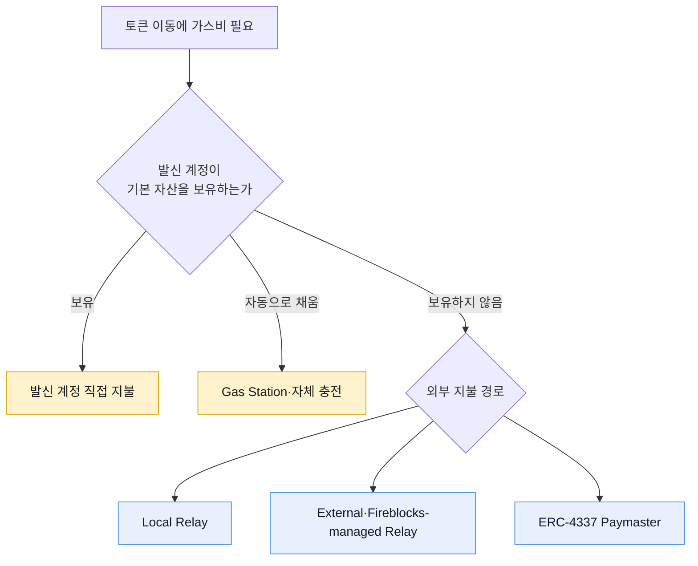

# 직접 지불·충전·대납

EVM 거래 수수료는 토큰이 아니라 체인의 기본 자산으로 지불한다. ERC-20 토큰 전송도 발신 계정 또는 별도 수수료 지불자가 ETH·MATIC 같은 기본 자산을 사용한다.

수탁 지갑의 선택지는 기본 자산을 각 계정에 넣는 방식과 자산 이동 계정 밖에서 비용을 부담하는 방식으로 나뉜다.

## 지불 모델 비교

| 모델 | On-chain transaction sender | network fee 재원 | 최종 정산 | 주요 운영 책임 |
|---|---|---|---|---|
| 계정 직접 지불 | 자산 발신 EOA | 같은 EOA의 native token | 해당 계정에 확정 | 계정별 잔고·충전·Dust 관리 |
| 자동 충전 | 자산 발신 EOA | 충전받은 EOA의 native token | 해당 계정에 확정 | 임계값·충전 실패·중앙 재원 관리 |
| Fireblocks Local Relay | Relay Vault Account | Relay Vault의 base asset | Relay Vault 잔고에서 차감 | Relay 잔고·nonce·Policy·가용성 |
| Fireblocks External Relay | 외부 Workspace의 Relay | 외부 Relay Vault의 base asset | Workspace·법인 간 정산 | 법인 간 비용 귀속·SLA·정책 연결 |
| Fireblocks-managed Relay | Fireblocks Relay | Fireblocks가 base asset 선지불 | 월말 실비·구독료 인보이스 | 사용량·청구 대사·벤더 장애 대응 |
| ERC-4337 Paymaster | Bundler | Bundler가 bundle transaction gas를 부담하고 EntryPoint가 Paymaster deposit에서 UserOperation 비용 수취 | Paymaster deposit 차감 또는 사용자 토큰 회수 | Deposit·Stake·검증 정책·Bundler 연동 |

## 충전과 대납의 경계

자동 충전은 운영 자동화이지만 대납은 아니다. 발신 계정이 기본 자산을 받고 직접 수수료를 내기 때문이다. Fireblocks도 [Gas Station](https://developers.fireblocks.com/docs/work-with-gas-station)을 Vault Account 자동 충전 기능으로 설명하며, Gasless Service와 별도 제품으로 구분한다.

## 수탁 계정 규모에 따른 차이

고객별 Vault에서 중앙 Vault로 토큰을 모으는 Sweep은 발신 Vault마다 거래 권한과 가스비가 필요하다.

| 운영 항목 | 계정 직접 지불·자동 충전 | Relay·Paymaster |
|---|---|---|
| 기본 자산 배포 | 고객 Vault마다 필요 | 자산 보유 Vault에는 불필요할 수 있음 |
| 충전 거래 | Sweep 전에 추가될 수 있음 | 없음 |
| 기본 자산 재고 | 고객 Vault와 중앙 재원 | Relay 또는 Paymaster 예치금에 집중 |
| 실패 원인 | 잔고 부족·충전 지연 | Relay 거절·정책·예치금·벤더 가용성 |
| 회계 자료 | 온체인 계정별 차감 | Relay 사용량·예치금·벤더 청구서 |

Relay를 쓰면 운영 항목이 사라지는 것이 아니라 집중되는 위치가 바뀐다. Local Relay는 수많은 Vault의 base asset을 Relay 한 곳으로 모으고, Fireblocks-managed Relay는 base asset 조달을 벤더에 넘기는 대신 계약·청구·가용성 의존을 만든다.

## 네이티브 자산 전송

토큰 대납 지원이 네이티브 자산 전송까지 포함한다는 뜻은 아니다. 네이티브 자산은 이동 대상과 수수료 자산이 같아 제품별 처리 방식이 다르다.

[Fireblocks Sweep to Omnibus 공식 문서](https://developers.fireblocks.com/reference/sweep-to-omnibus-1)는 Universal Gasless가 ERC-20·ERC-721·ERC-1155 Sweep을 지원하지만 네이티브 ETH 전송은 Relay하지 않는다고 구분한다. 네이티브 자산을 취급하는 서비스는 Gasless만으로 기본 자산 보유를 완전히 제거했다고 판단하면 안 된다.

## 비용 귀속

가스비를 누가 온체인에서 먼저 냈는지와 고객에게 비용을 어떻게 부과할지는 별도 결정이다.

- 회사 부담: Sponsor가 비용을 흡수하고 고객 원장에는 반영하지 않는다.
- 고객 부담: 실제 수수료 또는 정책 단가를 고객 원장에서 차감한다.
- 토큰 지불: Paymaster가 기본 자산을 내고 고객에게 USDC 같은 토큰을 회수한다.
- 계약 후불: Fireblocks-managed Relay가 먼저 내고 월 청구서로 회사에 청구한다.

고객 비용 계산에는 체인 실비, 벤더 구독료, 실패·재시도 비용, 환율과 반올림 정책이 섞일 수 있다. 온체인 지불 모델만으로 고객 과금 정책이 결정되지는 않는다.
