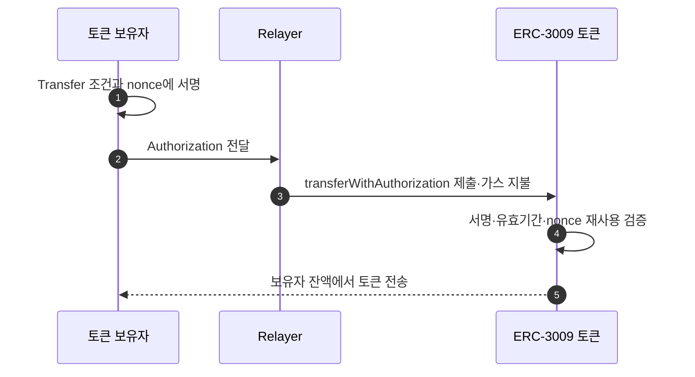
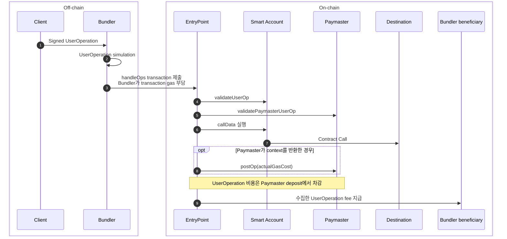

# 서명과 온체인 제출의 분리

가스 대납 모델은 자산 소유자가 Transfer·Contract Call을 승인하고 다른 주체가 On-chain transaction을 제출할 수 있어야 한다. ERC-3009·ERC-2771·ERC-4337·EIP-7702는 이 분리를 서로 다른 계층에서 구현한다.

## 모델별 적용 계층

| 모델 | 분리를 구현하는 위치 | 자산 소유자의 승인 | 제출·가스 지불 | 적용 제약 |
|---|---|---|---|---|
| ERC-3009 | 토큰 컨트랙트 | EIP-712 Transfer Authorization | 누구나 서명을 제출하고 가스 지불 | 해당 함수를 구현한 토큰만 가능 |
| ERC-2771 | Trusted Forwarder와 수신 컨트랙트 | Forward Request 서명 | Gas Relay가 Forwarder 호출 | 수신 컨트랙트가 Forwarder를 신뢰해야 함 |
| ERC-4337 | Smart Account·EntryPoint | UserOperation 서명 | Bundler가 `handleOps` 제출, EntryPoint가 Account·Paymaster deposit에서 비용 수취 | Smart Account와 Bundler 인프라 필요 |
| EIP-7702 | EOA의 코드 위임 | Authorization Tuple과 위임 코드의 계정 검증 | Outer transaction sender가 제출·gas 지불 | 위임 코드의 권한·수명·초기화 통제 필요 |

이 모델들은 한 줄의 세대 교체 관계가 아니다. ERC-3009와 ERC-2771은 특정 토큰·수신 컨트랙트 수준에서 동작하고, ERC-4337은 별도 계정 실행 파이프라인을 제공한다. EIP-7702는 기존 EOA가 컨트랙트 코드를 위임받게 하며 ERC-4337 계정 구현과 함께 사용할 수 있다.

## ERC-3009 — 토큰이 서명을 검증

[ERC-3009](https://eips.ethereum.org/EIPS/eip-3009)는 토큰 보유자가 `from`·`to`·금액·유효기간·nonce를 포함한 EIP-712 메시지에 서명하고, 제3자가 `transferWithAuthorization`을 호출하도록 정의한다.

검증 로직이 토큰 안에 있으므로 일반 ERC-20에 자동으로 적용되지 않는다. 명세는 현재 Draft 상태이며, 구현 토큰의 함수·도메인·nonce 규칙을 실제 컨트랙트 기준으로 확인해야 한다.

## ERC-2771 — 수신 컨트랙트가 원 서명자를 복원

[ERC-2771](https://eips.ethereum.org/EIPS/eip-2771)은 Gas Relay가 Trusted Forwarder를 호출하고, Forwarder가 원 서명자 주소를 calldata 끝에 붙여 수신 컨트랙트로 전달하는 모델이다.

수신 컨트랙트는 다음 조건을 구현해야 한다.

1. 호출한 Forwarder가 신뢰 목록에 있는지 확인한다.
2. 신뢰한 Forwarder의 호출이면 calldata에서 원 서명자를 복원한다.
3. `msg.sender` 대신 복원한 주소를 업무 발신자로 사용한다.

일반 ERC-20의 `transfer`는 `msg.sender` 잔액을 사용하므로 ERC-2771 지원 없이 Forwarder가 대신 호출하면 Relay의 잔액을 움직이게 된다. 이 때문에 ERC-2771은 이미 배포된 임의의 토큰 전송을 범용으로 대납하는 방식이 아니다.

OpenGSN은 ERC-2771 구조에 Relay Server·RelayHub·Paymaster를 더한 공용 Relay 구현이다. 여기서 Paymaster는 어떤 요청을 부담할지 판단하고 RelayHub 예치금으로 Relay Server에 비용을 상환한다. ERC-4337의 Paymaster와 목적은 유사하지만 사용하는 계정·컨트랙트·정산 경로는 다르다.

## ERC-4337 — UserOperation 실행 파이프라인

[ERC-4337](https://eips.ethereum.org/EIPS/eip-4337)은 일반 트랜잭션 대신 `UserOperation`을 사용한다. Bundler가 여러 UserOperation을 수집·시뮬레이션하고 EntryPoint의 `handleOps`로 제출한다.

Bundler는 `handleOps` transaction의 sender로서 transaction gas를 부담한다. EntryPoint는 실행 전에 Paymaster의 deposit과 `validatePaymasterUserOp` 결과를 확인하고, 실행 뒤 UserOperation 비용을 deposit에서 차감한다. 모든 UserOperation 처리가 끝나면 수집한 비용을 Bundler가 `handleOps`에 지정한 `beneficiary`로 보낸다. `beneficiary`는 Bundler transaction sender와 같은 주소일 필요가 없다.

UserOperation 실행이 Revert해도 네트워크가 소비한 비용은 Paymaster가 부담한다. Paymaster 운영에는 EntryPoint Deposit·Stake, 검증 로직과 Bundler 연동이 포함된다. [ERC-4337 명세](https://eips.ethereum.org/EIPS/eip-4337)와 [공식 Paymaster 문서](https://docs.erc4337.io/paymasters/index.html)는 Paymaster deposit에서 UserOperation 비용을 차감하고, 검증 공격과 예치금 고갈을 통제하도록 설명한다.

## EIP-7702 — EOA에 코드 위임

[EIP-7702](https://eips.ethereum.org/EIPS/eip-7702)는 Final 상태의 Core 표준이다. Set Code 거래에 Authorization Tuple `[chain_id, address, nonce, y_parity, r, s]`을 넣으면 EOA의 코드 위치에 `0xef0100 || delegate address`가 기록된다.

Authorization Tuple은 EOA가 어느 코드를 위임할지 승인한다. 이 서명 자체가 토큰 전송을 승인하는 것은 아니며, 실제 Transfer·Contract Call 권한은 위임된 account code가 검증한다. Set Code transaction의 gas는 outer transaction sender가 지불한다.

주소·키·잔액은 그대로 유지되지만 이후 호출은 위임 대상 컨트랙트의 코드로 실행된다. 명세가 직접 제시하는 용도는 다음과 같다.

- 여러 동작을 한 거래로 묶는 Batching
- 다른 계정이 수수료를 부담하는 Sponsorship
- 한도·대상·기간을 좁힌 Sub-key 권한

위임은 일회성 서명과 다르다. 자동 만료되지 않으며 새 위임으로 덮어쓰거나 0 주소로 재위임해 해제할 때까지 계정 상태로 남는다. 위임 코드는 계정 자산에 광범위하게 접근할 수 있으므로 코드 주소·바이트코드·감사 결과·초기화 상태가 운영 통제 대상이다.

## ERC-4337과 EIP-7702의 결합

현재 ERC-4337 명세는 EIP-7702 Authorization을 UserOperation과 함께 Bundler에 전달하는 경로를 포함한다. EIP-7702 계정이 ERC-4337 EntryPoint를 사용하는 Smart Account처럼 동작할 수 있다는 뜻이다.

| 구분 | EIP-7702 단독 Sponsorship | ERC-4337과 결합 |
|---|---|---|
| 제출 객체 | Set Code 또는 위임 계정 대상 트랜잭션 | UserOperation + EIP-7702 Authorization |
| 실행 조정 | Sponsor와 위임 코드 | Bundler·EntryPoint·위임된 Smart Account |
| 비용 부담 | 외부 거래 제출자 | 계정 또는 Paymaster |
| 운영 인프라 | Relay·Sponsor | Bundler·EntryPoint·선택적 Paymaster |

따라서 EIP-7702를 ERC-4337의 대체재로만 분류하면 실제 결합 경로를 놓친다. 제품이 어느 경로를 쓰는지는 API·거래 유형·EntryPoint 사용 여부로 확인해야 한다.

## 보안 경계

| 모델 | 핵심 신뢰 대상 | 실패했을 때의 위험 |
|---|---|---|
| ERC-3009 | 토큰의 서명·nonce 구현 | Authorization 재사용·Front-running·잘못된 도메인 |
| ERC-2771 | Trusted Forwarder와 신뢰 설정 | 원 서명자 위조 |
| ERC-4337 | Smart Account·EntryPoint·Paymaster 검증 | 예치금 고갈·검증 DoS·잘못된 Sponsor 정책 |
| EIP-7702 | 위임 대상 코드와 초기화 | 계정 전체 권한 노출·영속 위임 오용·스토리지 충돌 |

대납 시스템은 가스비 지불자만 바꾸는 기능으로 보이지만, 실제 보안 경계는 원 서명자를 복원하거나 계정 코드를 실행하는 로직에 형성된다.
