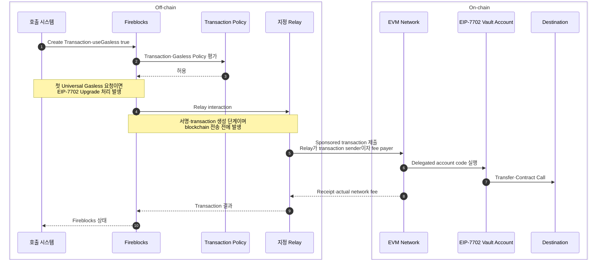

# Gas Station과 Gasless Service

Fireblocks의 Gas Station은 Vault Account에 기본 자산을 자동 충전하고, Gasless Service는 별도 Relay가 가스비를 부담한다. 둘 다 고객별 Vault의 수수료 운영을 줄이지만 기본 자산의 보유 위치와 거래 실행 경로가 다르다.

| 구분 | Gas Station | Gasless Service |
|---|---|---|
| 방식 | 발신 Vault에 기본 자산 자동 충전 | 지정 Relay가 가스비 부담 |
| 온체인 수수료 지불 | 발신 Vault | Relay |
| 고객 Vault의 기본 자산 | 필요 | 지원 거래에서는 불필요 |
| 중앙 운영 재원 | Gas Station 재원 Vault | Local·External Relay 또는 Fireblocks |
| 제품 관계 | 자동 충전 제품 | 별도 프로토콜을 사용하는 대납 제품 |

[Fireblocks Gas Station 공식 문서](https://developers.fireblocks.com/docs/work-with-gas-station)는 입출금을 감지한 뒤 설정값에 따라 Vault를 자동 충전한다고 설명한다. Gasless Service는 같은 기능의 다른 이름이 아니라 서명 계정과 수수료 지불자를 분리하는 별도 실행 모델이다.

## Limited와 Universal Gasless

[Fireblocks Universal Gasless 공식 문서](https://support.fireblocks.io/hc/en-us/articles/19948199000092-Universal-Gasless)는 제품 범위를 다음과 같이 구분한다.

| 제품 | 기반 | 적용 범위 |
|---|---|---|
| Limited Gasless | ERC-3009·ERC-2771 | 해당 기능을 구현한 특정 토큰·Tokenization 동작 |
| Universal Gasless | EIP-7702 | 호환 EVM의 ERC-20·ERC-721·ERC-1155 Transfer·Contract Call·Mint·Burn |

Universal Gasless는 첫 Gasless 거래 과정에서 Vault Account에 EIP-7702 위임을 설정한다. Fireblocks는 이를 Smart Contract Wallet로 Upgrade한다고 표현한다. Vault 주소와 키는 유지되고 계정에 위임 코드가 연결된다.

## Relay 구성

| Relay | 기본 자산 보유자 | 적용 상황 | 남는 책임 |
|---|---|---|---|
| This Workspace | 같은 Workspace의 전용 Vault | 기본 자산을 Relay 한 곳에서 관리 | Relay 잔고·Policy·Co-signer |
| External Workspace | 다른 Workspace·법인 | 법인·규제 경계 밖에서 가스비 부담 | Workspace 간 계약·정책·비용 귀속 |
| Fireblocks Relay | Fireblocks | Workspace 안의 기본 자산 보유를 제거 | 프리미엄 계약·사용량·월 청구 대사 |

External Workspace는 다른 조직의 Relay 서비스를 뜻할 수도 있고, 같은 조직의 별도 법인이 비용을 부담하는 구조일 수도 있다. 어느 경우든 자산 소유 Workspace와 비용 부담 Workspace의 감사·계약 관계를 기록해야 한다.

## 거래 흐름

Relay는 On-chain transaction을 제출하면서 자신의 fee account에 있는 base asset으로 network fee를 낸다. Fireblocks 공개 문서는 Relay interaction이 서명·transaction 생성 단계에서 발생하며 blockchain 전송 전에 끝난다고 설명한다. Relay 내부 payload와 delegated account code의 세부 호출 순서는 공개 문서에서 확인되지 않으므로 위 그림은 그 내부 단계를 더 세분하지 않는다.

Relay는 가스비를 부담하지만 토큰 이동 권한을 만들지 않는다. 자산 이동은 Vault의 서명과 Fireblocks Policy, 토큰 승인 또는 위임된 account code의 검증을 통과해야 한다.

## 지원 체인과 변동 경계

2026-05-18 보관 원문의 Universal Gasless 통합 Mainnet은 Ethereum·Optimism·Base·Arbitrum One·Polygon PoS·BNB Smart Chain이다. Fireblocks Relay 문서는 더 넓은 EVM 호환 체인 지원을 설명하지만, Universal Gasless 통합 여부와 Relay 계약 지원 범위는 같은 목록이 아니다.

지원 여부는 다음 세 조건을 따로 확인한다.

1. 대상 체인이 EIP-7702를 지원하는가
2. Fireblocks Workspace에서 Universal Gasless가 통합됐는가
3. 선택한 Relay와 자산·작업이 계약상 지원되는가

고정된 체인 목록을 제품 계약 대신 사용하지 않는다. Mainnet·Testnet, Transfer·Contract Call, 토큰 유형별 지원을 활성화 시점에 확인한다.

## 설정과 Policy

Universal Gasless 설정에는 Relay와 기본 동작을 선택하는 항목이 있다.

- On by default
- Off by default
- Off, 거래별 재정의 가능

첫 Upgrade와 Relay 실행에는 별도 Policy 경계가 붙는다.

| Policy·구성 | 역할 |
|---|---|
| Vault Account Upgrade Policy | EIP-7702 위임이 설정된 Vault의 Gasless 실행 허용 |
| Gasless-Orchestrator Contract Call Rule | Relay Workspace에서 Gasless Orchestrator가 시작한 호출 허용 |
| API Co-signer | Relay Workspace의 자동 서명·승인 |
| Initiator·Signer 분리 | Gasless Orchestrator와 실제 서명자를 같은 주체로 두지 않음 |

Local·External Workspace가 Relay 역할을 할 때 Relay 잔고뿐 아니라 Policy와 API Co-signer 가용성도 거래 성공 조건이 된다.

## API 경계

Fireblocks [Create Transaction API](https://developers.fireblocks.com/api-reference/transactions/create-a-new-transaction)는 `useGasless` Boolean으로 Workspace 기본 설정을 거래별 재정의한다.

| 입력·오류 | 의미 |
|---|---|
| `useGasless: true` | 해당 거래를 Gasless 경로로 요청 |
| `useGasless: false` | 기본 설정과 달리 직접 수수료 경로 요청 |
| Error 1455 | Workspace 또는 Asset에 Gasless 구성이 없음 |

Gasless 요청 실패를 일반 거래로 자동 재제출하면 동일 업무가 서로 다른 수수료·정책 경로로 실행될 수 있다. 직접 지불 Fallback은 호출 시스템이 명시적으로 결정하고 멱등키와 기존 거래 접수 여부를 확인해야 한다.

## 네이티브 자산과 Non-EVM

Universal Gasless의 EVM 토큰 지원과 네이티브 ETH 전송은 구분된다. 보관된 Fireblocks Sweep 자료는 네이티브 ETH 자체의 Sweep에는 Gas Station을 사용한다고 명시한다.

Solana Gasless는 EIP-7702가 아니라 Fee Payer 모델이다. Local Relay와 토큰 소유 Vault가 함께 서명하며 키 세트 조건이 붙는다. Tron GasFree도 별도 메커니즘이므로 EVM Universal Gasless의 Policy·계정 Upgrade 설명을 그대로 적용하지 않는다.
