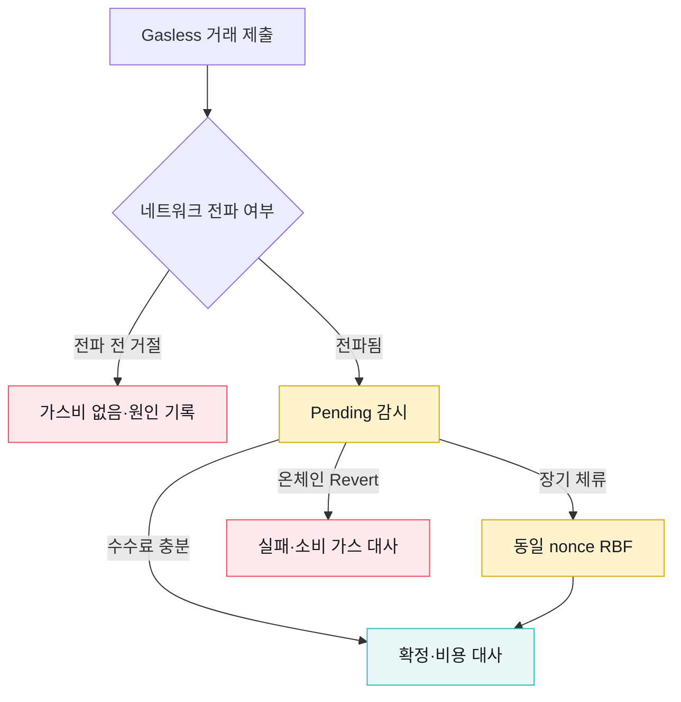

# 대납 거래의 실패와 비용

가스 대납은 기본 자산 조달을 줄이지만 Relay·위임 코드·대납 정책·비용 정산이라는 새 운영 경계를 만든다. 실패가 체인 전파 전인지, Pending 이후인지, 온체인 실행 중인지에 따라 비용과 복구 방식이 달라진다.

## 실패 시점과 비용 발생

| 시점 | 예시 | 온체인 가스 소비 | 처리 기준 |
|---|---|---|---|
| 요청 검증 전 | 필수 필드·지원 자산·Gasless 설정 오류 | 없음 | 요청 반려, 설정·입력 수정 |
| Policy·Relay 검증 | Policy 차단·Relay 거절·잔고 부족 | 없음 | 실패 원인 기록, 임의 직접 지불 전환 금지 |
| 서명·거래 생성 | Co-signer 장애·Upgrade 승인 실패 | 없음 | 결과 불명과 명시적 거절 구분 |
| 네트워크 전파 후 Pending | 수수료 부족·nonce 대기·네트워크 혼잡 | 아직 확정되지 않음 | 동일 nonce 조회, Boost·대기 판단 |
| 온체인 Revert | 컨트랙트 조건 실패·Allowance 부족 | 발생 | 실패 상태와 소비 가스 기록 |
| 확정 | 토큰 이동 완료 | 발생 | 거래·비용·업무 결과 대사 |

Fireblocks 담당자의 2026-08-18 개별 답변에 따르면 Fireblocks Relay에서 온체인 Revert는 네트워크가 가스를 소비했으므로 청구되고, Policy·검증 단계에서 Broadcast 전에 차단된 요청은 네트워크 비용이 발생하지 않는다. [Fireblocks Gasless Relay 공식 문서](https://support.fireblocks.io/hc/en-us/articles/23508430639516-Using-the-Fireblocks-Gasless-Relay)는 Relay의 가스 선지불·월말 통합 청구와 자동 boost 미지원을 별도로 설명한다.

## Pending과 RBF

Fireblocks Gasless Relay는 Stuck 거래를 자동 Boost하지 않는다. Pending 거래는 동일 nonce의 네트워크 상태와 Fireblocks 거래 상태를 확인한 뒤 RBF로 교체한다.

같은 nonce의 RBF 교체 거래가 확정되면 원본과 교체분을 두 건의 독립 실행으로 합산하지 않는다. 담당자 답변 기준 Fireblocks Relay 청구에는 실제 네트워크에 포함된 교체 거래 비용이 반영되며, 대체된 원본을 중복 청구하지 않는다.

## EIP-7702 위임 상태

EIP-7702 위임은 거래 옵션이 아니라 계정 코드 상태다. 다음 항목을 Vault 단위로 감사할 수 있어야 한다.

| 항목 | 확인 내용 |
|---|---|
| 위임 여부 | Account Code가 Delegation Indicator인지 |
| 위임 대상 | `0xef0100` 뒤의 Delegate 주소 |
| 코드 식별 | Delegate의 Bytecode Hash·버전·감사 결과 |
| 설정 근거 | 어떤 거래·승인·Policy로 위임됐는지 |
| 초기화 | 위임 코드의 초기화 완료와 재초기화 방지 |
| 해제·교체 | 0 주소 해제 또는 새 코드 재위임 절차 |

[EIP-7702 명세](https://eips.ethereum.org/EIPS/eip-7702)는 위임 코드가 계정에 제한 없이 접근할 수 있으므로 Wallet이 임의 코드 Authorization 서명을 제공해서는 안 된다고 경고한다. 서비스는 주소가 유지된다는 이유로 Upgrade 전후 계정을 같은 실행 모델로 간주하면 안 된다.

위임 계정은 기존 전제를 바꾼다.

- EOA 주소에 코드가 없다는 가정
- `tx.origin == msg.sender`가 직접 EOA 호출이라는 가정
- 계정 nonce가 사용자 거래 한 건마다 단순히 1씩 증가한다는 가정
- 잔액 감소의 원인이 항상 해당 주소가 제출한 일반 거래라는 가정

대사·보안 탐지·외부 컨트랙트 Allowlist가 이 전제에 의존하는지 확인한다.

## Relay와 Paymaster 보안

| 경계 | 주요 위험 | 통제 |
|---|---|---|
| Relay Policy | 허용되지 않은 자산·목적지·호출 대납 | 자산·체인·Operation·목적지·한도 제한 |
| Relay 자금 | 잔고 고갈·비용 폭증 | 잔고·사용량 경보, 일·월 한도 |
| Paymaster | 검증 DoS·예치금 고갈 | Simulation·Stake·Deposit 경보·검증 코드 감사 |
| Co-signer | 자동 승인 경로 침해 | Initiator 분리·Callback 검증·Fail-close |
| Delegate Code | 계정 권한 탈취·업그레이드 위험 | 코드 해시 고정·감사·변경 승인·해제 절차 |
| Fallback | Gasless 실패 후 중복 일반 거래 | 멱등키·기존 Vendor ID·nonce 확인 |

대납 여부는 업무 거래 허용 여부와 같지 않다. 잔액·주소·컴플라이언스·고객 승인 검증을 통과한 거래만 대납 경로에 들어가고, Relay는 그 결정을 확대하거나 변경하지 않는다.

## 비용 정산

같은 담당자 답변에서 Fireblocks-managed Relay 과금은 다음과 같이 확인됐다.

| 항목 | 확인된 조건 |
|---|---|
| 선지불 | Fireblocks가 네트워크 가스비를 먼저 지불 |
| 청구 주기 | 월말 통합 인보이스 |
| 통화 | USD, 기존 Fireblocks 계약 결제 절차 |
| 가스 단가 | 당시 네트워크 Base Fee·Priority Fee와 실제 Gas Used |
| 가스 마크업 | 없음 |
| 서비스 비용 | 별도 월 구독료 |
| 건별 Relay 수수료 | 없음 |
| 건별 가스 상한 | Fireblocks Relay 사용 시 지정 불가 |

계약 조건은 Workspace·계약 시점에 따라 달라질 수 있으므로 청구서와 활성 계약을 정본으로 삼는다.

## 대사 기준

월 청구 대사는 최소 세 집합을 연결한다.

1. 업무 거래 식별자와 Fireblocks Transaction ID
2. 온체인 Transaction Hash·Receipt의 Gas Used와 Effective Gas Price
3. Fireblocks Relay 사용 내역과 월 인보이스 항목

대사 결과는 다음을 구분한다.

- 확정 거래의 온체인 실비와 청구 금액 일치
- Revert 거래의 소비 가스와 청구 포함
- Broadcast 전 거절의 미청구
- RBF 원본·교체 거래의 동일 nonce 연결
- 환율·청구 통화 변환과 월 구독료의 별도 계정 처리

가스비를 고객에게 전가한다면 네트워크 실비 확정 시점과 고객 원장 차감 시점을 분리하고, Revert·RBF·환불 정책을 제품 약관과 함께 정해야 한다.

## 운영 지표

- Gasless 요청·성공·Relay 거절·Policy 차단 건수
- 체인·자산·Operation별 Pending 시간
- RBF·Revert 비율과 소비 가스
- Relay·Paymaster 잔고 또는 사용 한도
- EIP-7702 Upgrade 성공·실패와 Delegate Code 분포
- 온체인 실비와 청구서 차이
- Gasless 실패 뒤 직접 지불 Fallback 시도와 중복 차단 건수
