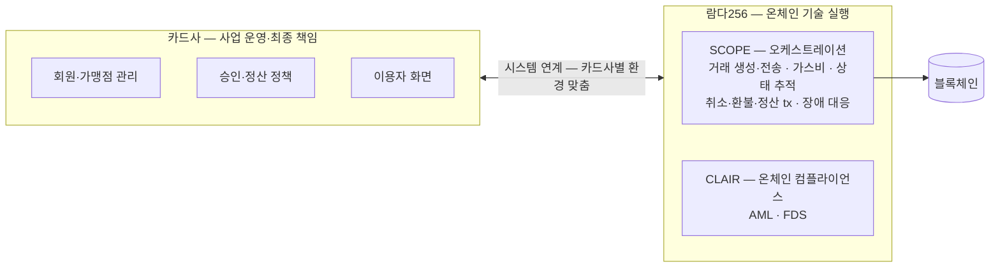
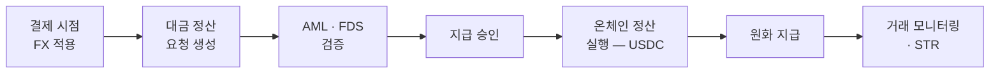

# 기존 결제망과 연결되는 두 지점

스테이블코인이 결제 수단이 되려면 기존 결제망과 두 갈래로 연결돼야 한다. 하나는 회원·승인·취소·환불·정산까지 카드사 시스템과 잇는 **카드 인프라 전 과정 연계**, 다른 하나는 가맹점이 원화를 받는 **디지털자산→원화 오프램프**다. 2026년 국내에서 람다256 이 앞 갈래는 검증을 마쳤고 오프램프는 검증을 진행 중이다. 두 PoC 모두 상용화가 아니라 기술 검증이고 실제 도입은 스테이블코인 법·제도 정비와 금융당국 정책에 달려 있다.

## PoC 1 — 카드업권 결제·정산 (여신금융협회 + 9개 카드사, 2026-07 완료)

카드사의 기존 인프라(회원 관리·가맹점 시스템·결제 승인·정산·FDS)를 스테이블코인 결제 환경과 연계할 수 있는지의 검증이다.

검증 범위는 카드 결제 전 과정이다: 스테이블코인 발행·분배 → 결제 승인·취소·환불 → 정산 → 정책지원금·카드포인트 활용 → 온체인 AML·FDS

구현을 확인한 항목은 블록체인 거래 생성·전송, 가스비 처리, 거래 상태 추적, 취소·환불·정산 트랜잭션 처리, 장애 대응 체계다. 표준 플랫폼 외에 카드사별 정책·프로세스를 반영한 전용 시스템 구축 가능성도 확인.

역할 분담은 다음과 같다:

| 주체 | 맡는 것 |
|---|---|
| 카드사 | 결제수단 제공, 이용자 화면, 승인·정산 정책, 가맹점 관리 — **사업 운영과 최종 책임** |
| 람다256 | 블록체인 온체인 기술 실행과 기술 구조화 — SCOPE (디지털자산 오케스트레이션) + CLAIR (온체인 컴플라이언스) |

카드사가 블록체인을 직접 운영하지 않으면서 스테이블코인 결제·정산을 수행하는 분업이다.

SCOPE 와 CLAIR 사이의 내부 호출 관계, 카드사 시스템이 어느 지점에서 어떤 API 를 부르는지는 공개 자료에 없어 그리지 않는다.

## PoC 2 — 오프램프 정산 (케이뱅크 + 케이에스넷, 진행 중 · 약 5개월)

가맹점이 USDC 를 원화로 받는 쪽의 검증이다.

검증하는 흐름은 다음과 같다: 결제 시점 FX 적용 → 대금 정산 요청 생성 → AML·FDS 검증 → 지급 승인 → 온체인 정산 실행 → 원화 지급 → 거래 모니터링·의심거래보고(STR)

각 단계를 세 회사 중 누가 수행하는지는 기사가 역할(아래 표)과 흐름을 따로 서술해 단계별 귀속은 그리지 않는다.

| 주체 | 맡는 것 |
|---|---|
| 케이뱅크 | 환율(FX) 적용, 원화 지급, AML·STR 운영 체계 |
| 케이에스넷 (KSNET) | 결제 인프라, 가맹점 원화 정산, 실물 운영 정책 검증 |
| 람다256 | SCOPE (온체인 정산) + CLAIR (온체인 컴플라이언스) |

## 발표 자료에도 남아 있는 확인 항목

- SCOPE 의 월렛 커스터디·키 관리 구조가 MPC 인지 수탁인지는 두 PoC 기사 모두에 없다
- 취소·환불을 온체인에서 역방향 전송으로 표현하는지, 발행 주체의 소각·재발행으로 표현하는지 미공개
- 오프램프 PoC 의 FX 적용·지급 승인·원화 지급 각 단계를 세 회사 중 누가 수행하는지

세미나 발표에서 확인된 PG·VAN 처리 단계, 온체인 AML의 검사 시점, 스마트 컨트랙트 변경 통제와 역할 경계는 [PoC의 운영·통제와 온체인 실행 위험](02-poc-operation-and-onchain-risk.md)에 정리했다. 발표 자료에도 나오지 않은 항목은 [남은 확인 질문](01-seminar-questions.md)에서 관리한다.

## 참고 — 람다256 의 운영 인증

람다256 은 국내 블록체인 업계 최초로 SOC 2 Type II 인증을 획득했다 (람다256 공식 발표 기준).

출처: [카드업권 PoC 공식 발표 — 람다256](https://www.lambda256.io/news/press-release/lambda256-credit-card-industry-stablecoin-poc-ko) · [케이뱅크·KSNET 오프램프 공식 발표 — 람다256](https://www.lambda256.io/news/press-release/lambda256-begins-digital-asset-settlement-off-ramp-and-aml-verification-project-with-kbank-and-ksnet-ko).
