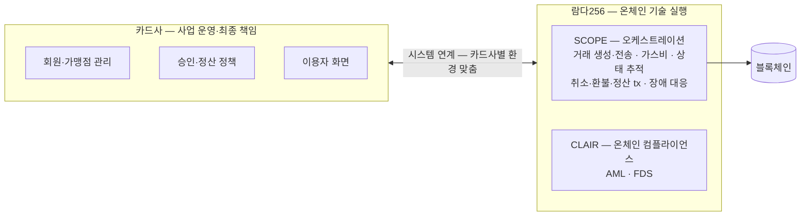
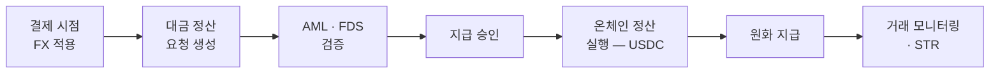

# 기존 결제망과 만나는 두 지점

스테이블코인이 결제 수단이 되려면 기존 결제망과 두 갈래로 연결돼야 한다 — **카드 인프라 전 과정 연계**(회원·승인·취소·환불·정산까지 카드사 시스템과 잇는 것)와, 가맹점이 원화를 받는 **디지털자산→원화 오프램프**다. 2026년 국내에서 람다256 이 앞 갈래는 검증을 마쳤고, 오프램프는 검증을 진행 중이다. 두 PoC 모두 상용화가 아니라 기술 검증이고, 실제 도입은 스테이블코인 법·제도 정비와 금융당국 정책에 달려 있다.

## PoC 1 — 카드업권 결제·정산 (여신금융협회 + 9개 카드사, 2026-07 완료)

카드사의 기존 인프라(회원 관리·가맹점 시스템·결제 승인·정산·FDS)를 스테이블코인 결제 환경과 연계할 수 있는지의 검증이다.

**검증 범위** — 카드 결제 전 과정: 스테이블코인 발행·분배 → 결제 승인·취소·환불 → 정산 → 정책지원금·카드포인트 활용 → 온체인 AML·FDS

**구현 확인 사항** — 블록체인 거래 생성·전송, 가스비 처리, 거래 상태 추적, 취소·환불·정산 트랜잭션 처리, 장애 대응 체계. 표준 플랫폼 외에 카드사별 정책·프로세스를 반영한 전용 시스템 구축 가능성도 확인.

**역할 분담** — 이 구조가 개념적으로 중요하다:

| 주체 | 맡는 것 |
|---|---|
| 카드사 | 결제수단 제공, 이용자 화면, 승인·정산 정책, 가맹점 관리 — **사업 운영과 최종 책임** |
| 람다256 | 블록체인 온체인 기술 실행과 기술 구조화 — SCOPE (디지털자산 오케스트레이션) + CLAIR (온체인 컴플라이언스) |

카드사가 블록체인을 직접 운영하지 않으면서 스테이블코인 결제·정산을 수행하는 분업이다. 우리 시스템의 Service 백엔드(업무 원장·정책·고객 책임)와 [블록체인 매니저](../../블록체인매니저/개요/00-overview.md)(온체인 실행·번역)의 분리와 같은 모양이고, 이 대응은 팀의 해석이다.

SCOPE 와 CLAIR 사이의 내부 호출 관계, 카드사 시스템이 어느 지점에서 어떤 API 를 부르는지는 공개 자료에 없어 그리지 않는다.

## PoC 2 — 오프램프 정산 (케이뱅크 + 케이에스넷, 진행 중 · 약 5개월)

가맹점이 USDC 를 원화로 받는 쪽의 검증이다.

**검증 흐름**: 결제 시점 FX 적용 → 대금 정산 요청 생성 → AML·FDS 검증 → 지급 승인 → 온체인 정산 실행 → 원화 지급 → 거래 모니터링·의심거래보고(STR)

각 단계를 세 회사 중 누가 수행하는지는 기사가 역할(아래 표)과 흐름을 따로 서술해 단계별 귀속은 그리지 않는다.

| 주체 | 맡는 것 |
|---|---|
| 케이뱅크 | 환율(FX) 적용, 원화 지급, AML·STR 운영 체계 |
| 케이에스넷 (KSNET) | 결제 인프라, 가맹점 원화 정산, 실물 운영 정책 검증 |
| 람다256 | SCOPE (온체인 정산) + CLAIR (온체인 컴플라이언스) |

## 공개 자료에 없는 것

- **월렛 커스터디·키 관리 구조** — SCOPE 의 커스터디 모델(MPC 인지, 수탁 구조인지)은 두 PoC 기사 모두에 없다
- **취소·환불의 온체인 표현** — 역방향 전송인지, 발행 주체의 소각·재발행인지 미공개
- 온체인 AML·FDS 가 결제 흐름의 어느 지점에 끼는지의 구체 위치

이 항목들은 wiki open question 으로 추적 중이고, 세미나·발표 자료에서 확인되면 갱신한다.

## 참고 — 람다256 의 운영 인증

람다256 은 국내 블록체인 업계 최초로 SOC 2 Type II 인증을 획득했다 (람다256 공식 발표 기준).

출처: [카드업권 PoC 공식 발표 — 람다256](https://www.lambda256.io/news/press-release/lambda256-credit-card-industry-stablecoin-poc-ko) · [케이뱅크·KSNET 오프램프 공식 발표 — 람다256](https://www.lambda256.io/news/press-release/lambda256-begins-digital-asset-settlement-off-ramp-and-aml-verification-project-with-kbank-and-ksnet-ko). 보조: [카드업권 기사 보관본](https://github.com/eunsujeo/eunpus/blob/main/sources/stablecoin/markdown/2026-08-20__startupn-kr__lambda256-stablecoin-card-poc.md) · [오프램프 기사 보관본](https://github.com/eunsujeo/eunpus/blob/main/sources/stablecoin/markdown/2026-08-20__etoday-co-kr__lambda256-kbank-ksnet-offramp-poc.md).
