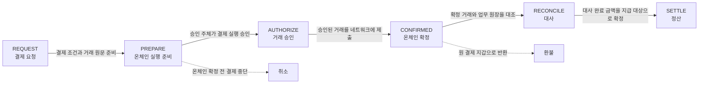
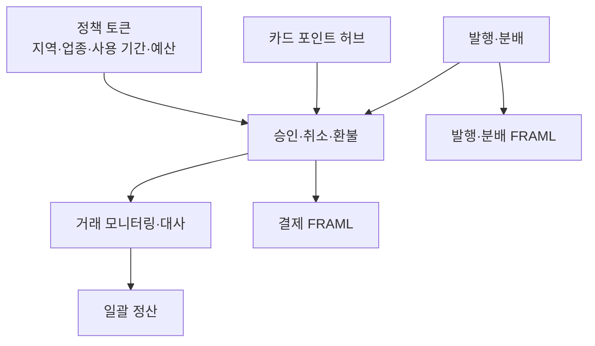
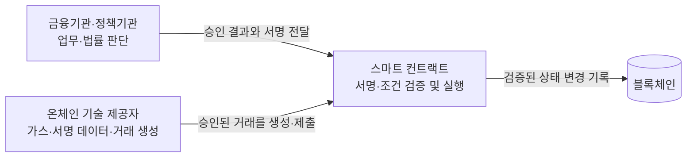

# 결제 가능성에서 운영 통제로

람다256 발표 자료는 스테이블코인 결제를 기존 결제망에 연결한 PoC 결과와 온체인 실행 계층의 통제 구조를 함께 다룬다. PoC에서 실사용 가능성은 확인했으며, 상용화 단계의 과제는 거래 처리 자체보다 승인·정산·컴플라이언스·변경 통제에 있다.

## PoC에서 확인한 범위

| 구분 | 발표 자료의 검증 내용 |
|---|---|
| 오프라인 결제 | 상용 PoS의 QR 결제, 승인 시간 3초 이내, 이용자 가스비 0원 |
| 이용자 접점 | 별도 전용 앱 설치 없이 카메라로 결제 페이지에 진입하고 기존 형식의 전표까지 출력 |
| 결제 후 처리 | 내부 거래 정보와 온체인 대사, 확정 건 일괄 집금·분배, 전액·부분·다회 환불, 발생 시각 기준 당일 정산 반영 |
| 정책성 자금 | 지역·업종·사용 기간·예산 조건을 결제 시점에 적용하고 정책 담당자가 신청·집행 현황을 실시간 확인 |
| 포인트 연계 | 카드 포인트와 스테이블코인의 전환·역전환, 참여사 통합 모니터링 |
| 온체인 실행 | Ethereum·Base·Solana·Arbitrum에서 거래 실행 |
| 비용·시험 | 온체인 거래 1건당 2~3원 수준, 통합 시험 142개 사례 |

발표 자료에서 제시한 승인 시간과 거래 비용은 해당 PoC 구성에서 측정한 값이다. 발표 자료는 다른 네트워크·혼잡도·수수료 정책에서의 성능과 단가를 제시하지 않는다.

## 상용 PoS 데모의 두 연결 지점

데모는 테스트넷에서 10,000원 상당의 카페 결제를 실행했다. QR은 단순 표시 화면이 아니라 PoS와 고객 지갑, 온체인 실행과 PG 백엔드를 연결하는 매개다.

QR이 생성되는 지점에서 기존 결제 ID와 고객 지갑·체인·토큰이 한 결제로 묶인다. 상용 PoS가 이미 QR을 표시할 수 있어 단말 교체 없이 대면 결제 접점을 구성했다.

| 주체 | 그대로인 것 | 새로 생기는 것 |
|---|---|---|
| 소비자 | 별도 앱 설치·회원 가입 없이 QR을 스캔하는 동작 | 지갑 연결, 결제 조건 확인, 서명 1회 |
| 가맹점 직원 | 금액 입력 → QR → 승인 → 전표의 동작과 처리 시간 | 없음 |
| 가맹점 사업자 | 원화 입금, 부가세, 승인번호, 정산 주기 | 정산 원천이 온체인 거래로 변경 |
| 금융사·PG | 승인·취소·환불 판단, 정산 정책, 고객 응대와 최종 책임 | 실행 계층이 온체인으로 이동 |
| 정책 당국 | 예산 편성·집행 관리 | 조건 위반 결제의 사전 차단과 실시간 집행 현황 확인 |

## 기존 PG·VAN 흐름과 온체인 상태

결제는 요청부터 정산까지 한 번에 끝나는 작업이 아니다. 발표 자료는 기존 PG·VAN의 처리 단계에 온체인 거래 상태를 연결하고, 확정 전 취소와 확정 후 환불을 구분했다.

- 온체인 확정 전에는 결제를 취소할 수 있다.
- 온체인 확정 뒤에는 취소가 아니라 환불로 처리한다.
- 환불 자산은 원 결제 지갑으로만 반환한다.
- 전액 환불뿐 아니라 부분 환불과 반복 환불을 처리한다.
- 대사와 정산은 온체인 확정과 분리된 후속 단계다.

발표 자료는 환불의 업무 조건과 반환 지갑을 제시하지만, 역방향 전송·소각·재발행 중 어떤 컨트랙트 동작을 사용했는지는 제시하지 않는다.

## 카드업권 공동 PoC의 기능 범위

공동 PoC는 발행과 결제만 확인하지 않고 카드업권의 기존 업무 범위를 함께 연결했다.

정책성 자금의 사용 가능 여부는 결제가 끝난 뒤 보고하는 조건이 아니라 결제 실행 전에 적용하는 조건이다. 지역·업종·사용 기간·예산 중 하나라도 허용 범위를 벗어나면 온체인 실행으로 넘어가지 않는 구조다.

정책자금은 지역을 법정동 코드로 검사하고, 업종은 화이트리스트·블랙리스트로 통제하며, 시작일·종료일과 신청·집행액을 함께 확인한다. 예를 들어 서울시 정책자금을 부산 가맹점에서 사용하려는 결제는 실행 단계에서 자동 차단된다. 정책 담당자는 수행 회사로부터 별도 데이터를 전달받지 않고 신청·집행 현황을 직접 조회한다.

카드 포인트 연계는 참여사의 고객 데이터를 중앙 DB에 모으지 않는다. 전환·역전환을 공통 온체인 이벤트로 기록하고 참여사가 해당 이벤트를 각각 조회한다. 거래 사실은 공유하지만 고객 정보는 온체인 기록에 포함하지 않으며, 사후 데이터 교환과 기관 간 정보 제공 동의에 의존하던 대사 방식을 실시간 정합으로 바꾼다.

## 온체인 AML의 세 검사 시점

발표 자료는 모든 위험 검사를 결제 전에 몰아넣지 않는다. 제재·고위험 주소와 자금 출처는 선제 차단이 필요하지만, 거래 행동은 실제 거래가 쌓인 뒤에야 판단할 수 있기 때문이다.

| 시점 | 검사·조치 | 배치 이유 |
|---|---|---|
| 결제 전 | 제재·고위험 주소, 자금 출처 사전 검사 | 부적격 거래가 자산 이동으로 이어지기 전에 차단 |
| 자금 보유 중 | 주소 위험도의 지속 재검사 | 최초 승인 뒤 주소 위험도가 바뀌는 상황 반영 |
| 원화 지급 전 | 최종 보류·중단 판단 | 법정화폐 지급 전에 마지막 통제 지점 확보 |
| 결제 후 | 고빈도·고액·집중·분산·순환·휴면 지갑 활성화 분석 | 행동 패턴은 거래 이력 없이는 판단할 수 없고, 결제 전 수행하면 지연 증가 |

따라서 `승인 전 검사`와 `사후 모니터링`은 서로 대체하지 않는다. 주소 위험과 자금 출처는 거래 전후에 반복 검사하고, 행동 분석은 사후에 수행한다.

사전 검사에서 제재 대상 지갑이 확인되면 결제가 실패하고 이용자 화면에 차단 사유를 표시한다. 스크리닝 실행 시각, 매칭 목록, 공식 등재일과 판정 결과를 감독 대응 자료로 보존한다. 자금 출처 검사에는 믹서와 미신고 거래소 경유 여부가 포함되고, 사후 행동 분석에는 단기 고빈도 거래(structuring·layering), 단건·누적 고액, 집합·분산·순환 이동과 휴면 지갑의 급격한 활동이 포함된다.

## 스마트 컨트랙트가 결정하지 않는 것

발표 자료에서 금융기관과 정책기관은 업무·법률 판단을 담당하고, 스마트 컨트랙트는 이미 결정된 조건과 서명을 검증해 실행한다. 컨트랙트가 고객 적격성, 환불 승인, 정산 승인, AML 결과를 스스로 판단하는 구조가 아니다.

컨트랙트 보안의 목적은 판단을 대신하는 데 있지 않다. 승인된 결정을 우회할 수 없게 만들고, 승인되지 않은 주체가 목적지·금액·정책을 바꾸지 못하게 하는 데 있다.

| 업무 구간 | 오프체인의 판단 | 스마트 컨트랙트의 실행 |
|---|---|---|
| 결제 승인 | 결제 조건 확정, 승인 판단, 고객 고지 | 서명 검증과 자금 이동의 원자적 실행 |
| 승인 취소·환불 | 환불 여부와 범위 결정 | 원 결제 지갑으로만 반환하도록 강제 |
| 배치 정산 | 정산 대상·금액 확정과 서명 | 서명 검증 후 일괄 분배, 한 건이라도 실패하면 전체 실패 |
| 정책자금 | 지역·업종·기간 조건 설정 | 결제 시점에 조건을 검사하고 위반 거래 거절 |
| 포인트 전환 | 전환 비율과 정책 결정 | 전환·역전환을 공개 이벤트로 기록 |

## 서버 실행과 스마트 컨트랙트 실행의 차이

| 요구사항 | 서버로 구현 | 스마트 컨트랙트로 구현 |
|---|---|---|
| 조건부 실행 강제 | 운영자 권한으로 우회 가능 | 운영자도 코드의 조건을 우회할 수 없음 |
| 제3자 검증 | 운영자가 로그를 제출해야 검증 가능 | 제3자가 원장 상태를 상시 검증 가능 |
| 대사·증적 | 별도의 사후 대사 배치 필요 | 거래 자체가 증적이 되어 실시간 정합 가능 |
| 다자 정산 | 중앙 원장의 운영 주체에 대한 합의 필요 | 데이터를 한곳에 모으지 않고 공통 원장 공유 |

그 대가로 확정된 실행을 취소·정정할 수 없고, 코드와 상태를 공격자도 볼 수 있으며, 배포한 코드는 그대로 남는다.

## 온체인 정산의 제약과 통제의 전치

발표 자료는 온체인 정산의 제약을 `불가역`, `공개`, `무중단`으로 정리한다. 착오·사기 이체를 되돌리기 어렵고, 코드와 상태가 공개되며, 24시간 운영에서 별도 점검 시간을 두기 어렵기 때문에 사고 후 탐지·복구만으로는 기존 보안 운영 모델을 그대로 적용할 수 없다.

이에 따라 통제를 실행 이후가 아니라 실행 이전으로 옮긴다.

- 고객 자산 지갑의 개인키를 보유하지 않아 탈취할 키를 두지 않는다.
- 검증을 통과하지 못하면 실행 자체가 성립하지 않게 해 우회할 게이트를 두지 않는다.
- 업무 지시·온체인 거래·내부 원장을 상시 대사해 숨겨진 자금 이동을 남기지 않는다.

이 구조에서는 키가 침해돼도 실행 함수의 목적지를 바꿀 수 없고, 거래 시점에 증적이 생기며, 정책 위반 거래가 실행 단계에서 거절된다. 반면 정책 변경의 유연성, 긴급 대응 속도, 체인 가용성, 거래 패턴 공개와 권한 거버넌스의 운영 부담을 감수한다.

## 금융기관과 온체인 제공자의 책임 경계

| 업무 | 금융기관의 사업·법률 책임 | 온체인 기술사업자의 기술 책임 |
|---|---|---|
| 결제 준비 | 결제수단 채택, 이용자 경험 제공, 결제 조건 최종 확정 | 체인별 선택지, 예상 가스 산정, 서명 대상 데이터 생성 |
| 결제 승인 | 최종 결제 승인에 대한 사업 책임 | 온체인 거래 생성·전송·결과 반환 |
| 상태 관리 | 결제 결과에 따른 운영 책임 | 확정 상태 추적, Revert·Reorg 조치 |
| 취소·환불 | 환불 여부와 범위 결정의 최종 책임 | 온체인 거래 실행과 상태 반영 |
| 정산 | 대상·주기·지급 조건 확정과 서명 | 정산 데이터 생성·실행·상태 추적 |
| 규제 준수 | KYC·AML 적용, 거래 제한 정책과 최종 책임 | 기술 사양 제공, 인가가 필요한 영역의 파트너 연계 설계 |

온체인 제공자는 거래를 기술적으로 구성하고 제출하지만 금융기관의 서명 없이 자산을 이동하지 못한다. 최종 실행의 발동 조건은 금융기관이 만든 서명이다.

## 감사와 증빙

정산 지시의 파일·전문, 온체인 `txHash`, 회계·결산의 원장 반영, 은행 이체의 `Payout ref`를 하나의 거래 식별 관계로 연결한다.

1. 지시·온체인·원장의 3면 대사를 상시 수행하고 불일치를 즉시 탐지한다. 대사는 사후 배치가 아니라 거래 상태의 일부다.
2. 스크리닝 실행 시각, 매칭 목록, 공식 등재일과 판정 결과를 수정할 수 없는 스냅샷으로 보존한다. 제출한 보고서도 사후 수정할 수 없게 한다.
3. 감사팀과 감독기관은 거래 성립 사실과 자금 이동 경로를 재생(replay)해 확인한다. 검사 시점에 제출 자료를 새로 조립하지 않는다.

온체인 기록은 지울 수 없으므로 어떤 증적을 온체인에 남기고 어떤 고객·개인 정보를 오프체인에 보관할지가 개인정보 보호의 경계가 된다.

## 실행 함수와 변경 함수의 분리

스마트 컨트랙트는 스스로 실행되지 않는다. 자동 처리로 보이는 작업에도 트랜잭션을 보내는 외부 호출자가 있으며, 호출자의 권한과 변경 경로를 분리해 통제한다.

| 구분 | 실행 빈도 | 통제 기준 |
|---|---:|---|
| 실행 함수 | 매일·상시 | `executeSettlement(bytes32 batchId)`처럼 목적지 파라미터를 제거해 정해진 경로로만 이동 |
| 설정·변경 함수 | 분기·연 단위 | `setMerchantAccount`, `setFeeRate`처럼 불가피한 계좌·요율 변경만 허용하고 다중서명 → 24~48시간 Timelock → 감시·Pause 적용 |

Setter 호출 권한은 단일 지갑이 아니라 금융사·사업자·보안팀의 다중서명 컨트랙트에 부여한다. 다중서명 정족수를 통과해도 변경은 즉시 실행되지 않고 Timelock 대기열에 머문다.

변경 감시 대상은 다음과 같다.

- Timelock 대기열에 들어온 변경
- 다중서명의 정족수와 서명자 변경
- 컨트랙트 업그레이드와 facet 변경
- 소유자·역할·관리자 변경
- 온체인 잔액과 내부 회계의 불변조건 위반

온체인 이벤트를 내부 변경 승인 기록과 대조하면 승인되지 않은 변경만 경보 대상으로 좁힐 수 있다. Timelock 대기 시간 안에 이상을 발견하면 변경이 실행되기 전에 Pause를 호출한다.

| 침해 범위 | 남아 있는 방어 | 결과 |
|---|---|---|
| 정산 서버 키 탈취 | 실행 함수에 목적지 파라미터가 없음 | 자금을 공격자 목적지로 이동할 수 없음 |
| 관리자 단일 키 탈취 | 다중서명 정족수 미달 | Setter 호출 불가 |
| 다중서명까지 통과 | Timelock 대기와 모니터링 | 반영 전 Pause로 동결 가능 |
| Pause 기능이 없는 구성 | 경보와 자산 상한만 사용 | 부분 손실 가능 |

## 통제의 한계와 상용화 과제

모니터링은 노드 이벤트를 직접 수신하고, 배포 때 등록한 ABI·권한 맵으로 변경 이벤트를 분류한 뒤 오프체인 변경관리 승인 이력과 대조한다. Setter 큐 등록, 다중서명 정족수 도달과 서명자 변경, 구현체·facet 교체 예고, 소유권·역할·Admin 변경, `에스크로 잔액 ≠ 미정산 합계`를 감시한다.

Pause도 온체인 트랜잭션이다. Private relay·MEV 보호를 사용해 우선 채택을 시도하더라도 공격 거래가 먼저 확정되거나 한 블록 안에서 공격이 끝나면 사후 대응만 가능하다. Timelock과 변경 감시는 저빈도 관리 변경에 유효하지만 모든 실시간 공격을 되돌리는 장치는 아니다.

발표 자료는 상용화 단계에 남은 항목을 다음과 같이 정리한다.

- 기존 결제망과 온체인 계층 사이의 오류 코드 대응표와 운영 절차서
- QR 단말기의 물리적 통제
- 커스터디 서명자 연계
- 온램프·오프램프 연계
- 불가역성, 공개성, 즉시 패치 불가에 대응하는 운영 책임
- 잘못 설정한 정책도 그대로 강제되는 구성 오류 위험
- 체인 장애·거래 순서·확정 지연에 대한 의존성
- 거래 패턴 노출과 변경 거버넌스 부담

출처: 람다256, 「스테이블코인 PoC 사례와 온체인 실행 레이어의 리스크」 세미나 발표 자료, 28쪽.
