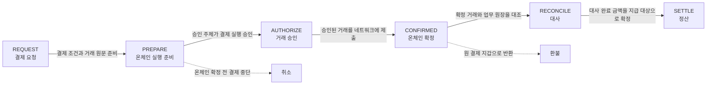
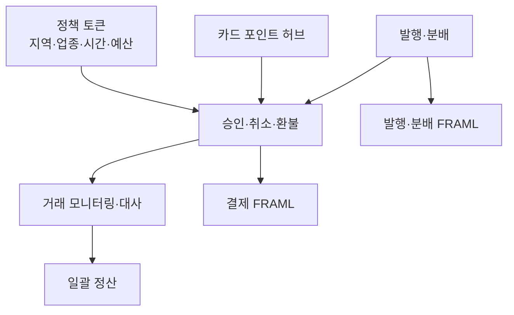
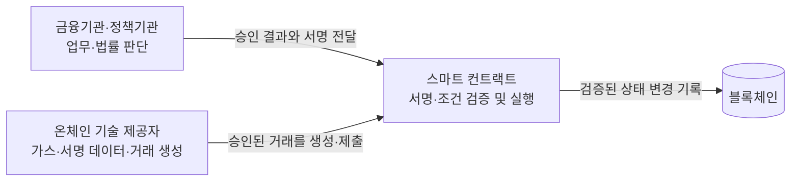

# 결제 가능성에서 운영 통제로

람다256 발표 자료는 스테이블코인 결제를 기존 결제망에 연결한 PoC 결과와 온체인 실행 계층의 통제 구조를 함께 다룬다. PoC에서 실사용 가능성은 확인했으며, 상용화 단계의 과제는 거래 처리 자체보다 승인·정산·컴플라이언스·변경 통제에 있다.

## PoC에서 확인한 범위

| 구분 | 발표 자료의 검증 내용 |
|---|---|
| 오프라인 결제 | 상용 PoS의 QR 결제, 승인 시간 3초 이내, 이용자 가스비 0원 |
| 이용자 접점 | 별도 전용 앱 없이 결제하고 기존 영수증 발행 절차 유지 |
| 결제 후 처리 | 대사, 정산, 전액·부분·반복 환불, 일괄 수납·분배 |
| 정책성 자금 | 지역·업종·시간·예산 조건을 결제 시점에 적용 |
| 포인트 연계 | 카드 포인트와 스테이블코인 사이의 전환 |
| 온체인 실행 | Ethereum·Base·Solana·Arbitrum에서 거래 실행 |
| 비용·시험 | 온체인 거래 1건당 2~3원 수준, 통합 시험 142개 사례 |

발표 자료에서 제시한 승인 시간과 거래 비용은 해당 PoC 구성에서 측정한 값이다. 네트워크·혼잡도·수수료 정책이 다른 환경의 고정 성능이나 고정 단가를 뜻하지 않는다.

## 기존 PG·VAN 흐름과 온체인 상태

결제는 요청부터 정산까지 한 번에 끝나는 작업이 아니다. 발표 자료는 기존 PG·VAN의 처리 단계에 온체인 거래 상태를 연결하고, 확정 전 취소와 확정 후 환불을 구분했다.

- 온체인 확정 전에는 결제를 취소할 수 있다.
- 온체인 확정 뒤에는 취소가 아니라 환불로 처리한다.
- 환불 자산은 원 결제 지갑으로만 반환한다.
- 전액 환불뿐 아니라 부분 환불과 반복 환불을 처리한다.
- 대사와 정산은 온체인 확정과 분리된 후속 단계다.

발표 자료는 환불의 업무 조건과 반환 지갑을 제시하지만, 역방향 전송·소각·재발행 중 어떤 컨트랙트 동작을 사용했는지는 제시하지 않는다.

## 카드업권 공동 PoC의 기능 범위

공동 PoC는 발행과 결제만 확인하지 않고 카드업권의 기존 업무 범위를 함께 연결했다.

정책성 자금의 사용 가능 여부는 결제가 끝난 뒤 보고하는 조건이 아니라 결제 실행 전에 적용하는 조건이다. 지역·업종·시간·예산 중 하나라도 허용 범위를 벗어나면 온체인 실행으로 넘어가지 않는 구조다.

## 온체인 AML의 세 검사 시점

발표 자료는 모든 위험 검사를 결제 전에 몰아넣지 않는다. 제재·고위험 주소와 자금 출처는 선제 차단이 필요하지만, 거래 행동은 실제 거래가 쌓인 뒤에야 판단할 수 있기 때문이다.

| 시점 | 검사·조치 | 배치 이유 |
|---|---|---|
| 결제 전 | 제재·고위험 주소, 자금 출처 사전 검사 | 부적격 거래가 자산 이동으로 이어지기 전에 차단 |
| 자금 보유 중 | 주소 위험도의 지속 재검사 | 최초 승인 뒤 주소 위험도가 바뀌는 상황 반영 |
| 원화 지급 전 | 최종 보류·중단 판단 | 법정화폐 지급 전에 마지막 통제 지점 확보 |
| 결제 후 | 고빈도·고액·집중·분산·순환·휴면 지갑 활성화 분석 | 행동 패턴은 거래 이력 없이는 판단할 수 없고, 결제 전 수행하면 지연 증가 |

따라서 `승인 전 검사`와 `사후 모니터링`은 서로 대체하지 않는다. 주소 위험과 자금 출처는 거래 전후에 반복 검사하고, 행동 분석은 사후에 수행한다.

## 스마트 컨트랙트가 결정하지 않는 것

발표 자료에서 금융기관과 정책기관은 업무·법률 판단을 담당하고, 스마트 컨트랙트는 이미 결정된 조건과 서명을 검증해 실행한다. 컨트랙트가 고객 적격성, 환불 승인, 정산 승인, AML 결과를 스스로 판단하는 구조가 아니다.

컨트랙트 보안의 목적은 판단을 대신하는 데 있지 않다. 승인된 결정을 우회할 수 없게 만들고, 승인되지 않은 주체가 목적지·금액·정책을 바꾸지 못하게 하는 데 있다.

## 금융기관과 온체인 제공자의 책임 경계

| 주체 | 책임 |
|---|---|
| 금융기관 | 사업·법률 책임, 결제·환불·정산·AML의 최종 판단, 실행 서명 |
| 온체인 제공자 | 기술 선택지와 가스 정보 제공, 서명 대상 데이터 구성, 거래 생성·제출, 상태·재구성(reorg)·실행 실패(revert) 처리 |

온체인 제공자는 거래를 기술적으로 구성하고 제출하지만 금융기관의 서명 없이 자산을 이동하지 못한다. 최종 실행의 발동 조건은 금융기관이 만든 서명이다.

## 실행 함수와 변경 함수의 분리

스마트 컨트랙트는 스스로 실행되지 않는다. 자동 처리로 보이는 작업에도 트랜잭션을 보내는 외부 호출자가 있으며, 호출자의 권한과 변경 경로를 분리해 통제한다.

| 구분 | 실행 빈도 | 통제 기준 |
|---|---:|---|
| 실행 함수 | 높음 | 승인된 값만 실행하고 임의의 목적지 입력을 허용하지 않음 |
| 설정·변경 함수 | 낮음 | 다중서명 → 24~48시간 Timelock → 변경 감시 → 필요 시 Pause |

변경 감시 대상은 다음과 같다.

- Timelock 대기열에 들어온 변경
- 다중서명의 정족수와 서명자 변경
- 컨트랙트 업그레이드와 facet 변경
- 소유자·역할·관리자 변경
- 온체인 잔액과 내부 회계의 불변조건 위반

온체인 이벤트를 내부 변경 승인 기록과 대조하면 승인되지 않은 변경만 경보 대상으로 좁힐 수 있다. Timelock 대기 시간 안에 이상을 발견하면 변경이 실행되기 전에 Pause를 호출한다.

## 통제의 한계와 상용화 과제

Pause도 온체인 트랜잭션이다. 공격 거래가 먼저 확정되거나 한 블록 안에서 공격이 끝나면 사후 경보만으로 막을 수 없다. Timelock과 변경 감시는 저빈도 관리 변경에 유효하지만 모든 실시간 공격을 되돌리는 장치는 아니다.

발표 자료는 상용화 단계에 남은 항목을 다음과 같이 정리한다.

- 기존 결제망과 온체인 계층 사이의 오류 코드 대응표와 운영 절차서
- QR 단말기의 물리적 통제
- 커스터디 서명자 연계
- 온램프·오프램프 연계
- 불가역성, 공개성, 즉시 패치 불가에 대응하는 운영 책임
- 잘못 설정한 정책도 그대로 강제되는 구성 오류 위험
- 체인 장애·거래 순서·확정 지연에 대한 의존성
- 거래 패턴 노출과 변경 거버넌스 부담

출처: 람다256, 「스테이블코인 PoC 사례와 온체인 실행 레이어의 리스크」 세미나 발표 자료, 28쪽.
