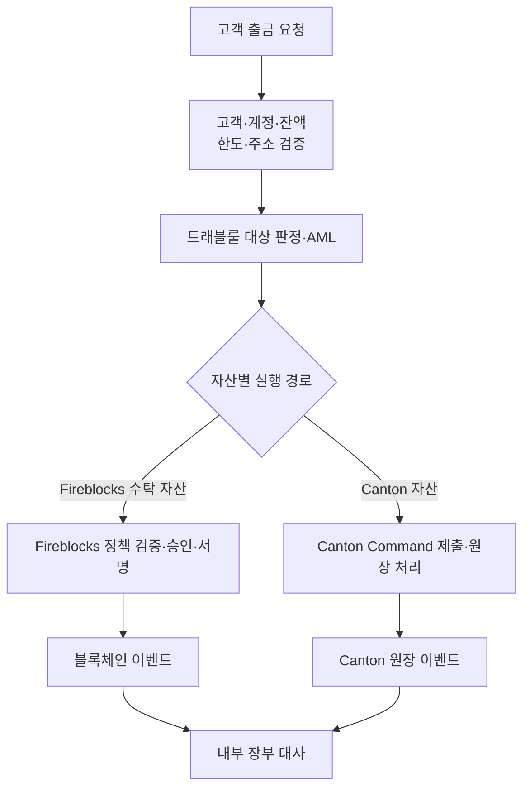

# 디지털 자산

이 카테고리는 우리 팀이 다루는 디지털 자산의 규제, 네트워크, 수탁 실행 구조와 책임 경계를 정리한다.

- **트래블룰**: 누구에게 어떤 정보를 전달하고, 입출금 흐름의 어디에서 검사하는가
- **Canton Network**: 거래를 공개하지 않고 검증하는 구조에서 Party·Contract·Holding을 어떻게 다루는가
- **Fireblocks**: 키·정책·승인·서명·체인 연동을 어떤 운영 모델로 제공하는가
- **가스 대납**: 자산 이동 권한과 네트워크 수수료 지불 책임을 어떻게 분리하는가
- **스테이블코인 결제**: 스테이블코인이 카드 인프라·원화 오프램프와 어떻게 연결되는가
- **에이전트 결제**: AI 에이전트가 HTTP 왕복 안에서 유료 자원에 지불하는 구조는 무엇인가
- **양자내성암호**: 양자 위협의 시간표에서 월렛·커스터디가 지금 전환할 수 있는 평면은 어디인가

## 주제별 문서

### [트래블룰](../트래블룰/00-overview.md)

규제·출금 흐름·IVMS101 데이터 필드·솔루션 연동을 여러 문서로 나누어 다룬다.

### [Canton Network](../Canton%20Network/00-overview.md)

프라이버시 원장, Party·Participant, Holding과 전송 흐름을 여러 문서로 나누어 설명한다.

### [Fireblocks](../Fireblocks/00-overview.md)

Workspace·Vault·MPC·Policy·자동 서명·Webhook 운영을 여러 문서로 나누어 정리한다.

### [가스 대납](../가스대납/00-overview.md)

직접 지불·자동 충전·Relay·Paymaster와 ERC-3009·ERC-2771·ERC-4337·EIP-7702의 실행 구조를 구분한다.

### [스테이블코인 결제](../스테이블코인%20결제/00-korea-poc.md)

카드 인프라 전 과정 연계와 디지털자산→원화 오프램프, 국내 PoC 두 건의 구조와 역할 분담을 다룬다.

### [에이전트 결제](../에이전트%20결제/00-overview.md)

x402·MPP 프로토콜과 AWS AgentCore payments 의 승인·서명·정산 분리, 통제 모델을 다룬다.

### [양자내성암호](../양자내성암호/00-overview.md)

양자 위협의 규모와 시나리오(HNDL 포함), 체인 네이티브 서명의 제약과 지금 전환 가능한 평면을 다룬다.

## 주제 간 업무 연결

출금은 하나의 고정된 벤더 경로를 통과하지 않는다. 고객·계정·잔액·한도·주소 검증과 트래블룰 대상 판정을 마친 뒤 자산별 실행 어댑터로 분기하고, 실행 결과는 다시 내부 원장으로 모인다.

이 흐름에서 각 계층은 서로를 대체하지 않는다.

| 질문 | 주로 답하는 문서 |
|---|---|
| 상대 VASP에 어떤 신원 정보를 보내야 하는가? | 트래블룰 |
| 자산과 거래를 누가 볼 수 있으며 잔액은 어떻게 표현되는가? | Canton Network |
| 누가 거래를 승인하고 어떤 키로 서명하는가? | Fireblocks |
| 토큰 이동 계정이 기본 자산 없이 거래하려면 누가 가스비를 부담하는가? | 가스 대납 |
| 고객의 실제 의사와 내부 잔액이 맞는가? | 우리 업무 시스템의 책임 |

## 공통 용어

| 용어 | 이 문서 묶음에서의 의미 |
|---|---|
| **VASP** | 가상자산 이전·보관 등 규제 대상 서비스를 제공하는 사업자 |
| **Party** | Canton 원장에서 권리와 의무를 갖는 신원 |
| **Participant** | Party를 호스팅하고 관련 원장을 저장·검증하는 Canton 노드 |
| **Validator** | Canton Global Synchronizer에 연결되는 운영 역할·배포 묶음. 문맥에 따라 Participant를 포함 |
| **Workspace** | Fireblocks의 사용자·정책·키·감사 격리 단위 |
| **Vault Account** | Fireblocks workspace 안의 자산 운영 단위 |
| **Policy** | Fireblocks outgoing transaction의 허용·추가 승인·차단 규칙 |
| **Callback Handler** | API Co-signer가 자동 서명하기 전에 우리 로직으로 요청을 검증하는 서버 |
| **ACS** | Canton의 현재 Active Contract Set. Party가 볼 수 있는 활성 계약 집합 |
| **Relay** | 자산 소유자의 승인을 받아 거래를 제출하고 네트워크 수수료를 선지불하는 주체 |
| **Paymaster** | ERC-4337에서 대납 조건을 검증하고 EntryPoint 예치금으로 가스비를 부담하는 컨트랙트 |
