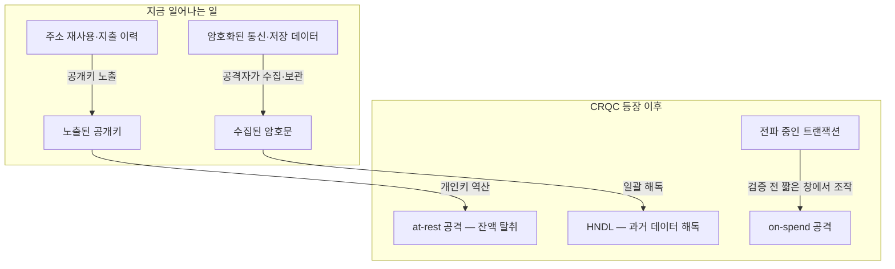

# 무엇이 언제 깨지는가

양자내성암호(PQC, Post-Quantum Cryptography)는 양자 컴퓨터로도 풀기 어려운 수학 문제를 쓰는 암호 체계다. 문제가 되는 쪽은 현행 공개키 암호다 — 블록체인 서명에 쓰는 타원곡선(secp256k1 의 ECDSA)과 통신 구간 암호화가 전환 대상으로 논의된다.

## 위협의 규모

발표 자료가 인용한 2026년 연구는 secp256k1을 대상으로 회로 A `논리 큐빗 1,200개·Toffoli 게이트 9,000만 회`, 회로 B `논리 큐빗 1,450개·Toffoli 게이트 7,000만 회`를 제시한다. 여기서 구분할 것은 **논리 큐빗 ≠ 물리 큐빗** 이다 — 발표 자료는 논리 큐빗 1,200개 규모의 회로에 필요한 물리 큐빗을 50만 개 미만으로 설명하며, 그 규모의 양자 컴퓨터(CRQC)는 현존하지 않는다. 즉각적 위험이 아니라 전환 기간을 역산해 준비할 엔지니어링 문제다.

## 공격 시나리오 둘 + 지금 진행 중인 것

| 시나리오 | 대상 | 시간대 |
|---|---|---|
| **at-rest 공격** | 이미 노출된 공개키 (재사용된 주소, 지출 이력이 있는 주소) | 더 가까움 |
| **on-spend 공격** | 트랜잭션이 전파되고 검증되기 전 짧은 창에서의 조작 | 더 멂 |

그리고 **HNDL (Harvest Now, Decrypt Later)** 이 있다. 암호화된 통신·데이터를 지금 수집해 두었다가 CRQC 가 등장하면 일괄 해독하는 공격이다. 수집 행위는 지금 일어날 수 있어서 "이미 현실에서 진행 중인 위협"으로 설명된다. 통신·저장 구간이 HNDL 의 대상이고, 이 평면은 체인을 기다릴 필요 없이 지금 전환할 수 있다 — Fireblocks 의 내부 스택 감사(인증서·저장 암호화·TLS)가 그 예다.

노출된 공개키와 수집된 암호문은 CRQC 가 등장하는 순간 소급해서 위험해진다 — 그래서 주소 재사용을 줄여 공개키 노출을 피하는 것과 통신·저장 전환은 지금의 일이다.

## 표준 — NIST

서명 쪽 NIST 최종 표준은 ML-DSA(FIPS 204)·SLH-DSA(FIPS 205) 둘이고, FN-DSA(FALCON) 는 표준화 대상으로 선정돼 FIPS 206 이 개발 중이다. Round 2 추가 후보도 진행 중이다. Fireblocks 는 이 셋과 Round 2 후보를 검토 대상으로 명시했다.

## 국내 정책 일정

2025-09 관계부처 합동 「범국가 양자내성암호 체계 전환 종합 추진계획」 — **2035년까지 전체 IT 인프라 전환** 목표. 양자 과학기술·양자산업 육성법 개정안이 국회 통과·국무회의 의결을 마쳤다. 공공·금융의 암호 체계 전환 요구가 이 일정에서 나온다.

## 문서 구성

| 문서 | 다루는 경계 |
|---|---|
| [월렛·커스터디의 PQC 전환 경로](01-wallet-pqc-transition.md) | 체인 종속성 문제, 전환 가능한 평면 분리, Fireblocks 준비 4축, 통신 보안 제품의 접근 |
| [디지털 월렛의 PQC 전환 범위와 실행 순서](03-wallet-pqc-seminar.md) | On-Spend 공격, 알고리즘·계층별 경계, 스마트 계정 경로, 인벤토리와 전환 순서 |

## 공통 용어

| 용어 | 의미 |
|---|---|
| **CRQC** | Cryptographically Relevant Quantum Computer — 현행 암호를 실제로 깰 규모의 양자 컴퓨터 |
| **HNDL** | Harvest Now, Decrypt Later — 지금 수집, 나중 해독 |
| **논리/물리 큐빗** | 오류 정정을 거친 연산 단위 / 하드웨어 큐빗. 논리 1개 ≈ 물리 수백 개 |
| **ML-DSA · SLH-DSA · FN-DSA** | NIST PQC 서명 알고리즘 — 앞 둘은 최종 표준(FIPS 204·205), FN-DSA 는 FIPS 206 개발 중 |
| **암호 민첩성 (crypto agility)** | 알고리즘을 시스템 개조 없이 교체할 수 있게 하는 설계 성질 |

출처: [Fireblocks 공식 블로그 (2026-04, VP Research)](https://www.fireblocks.com/blog/google-quantum-research-institutional-crypto-security) · [PQC 발표회 기사](https://www.newstheai.com/news/articleView.html?idxno=20703)
