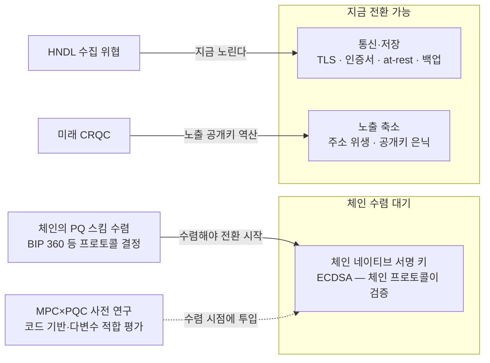

# 서명 키는 체인에 묶여 있다

월렛의 PQC 전환은 **체인 네이티브 서명은 사업자가 못 바꾼다**는 경계에서 갈린다. EOA·프로토콜 서명의 검증은 체인이 하므로, 비트코인·이더리움이 ECDSA 를 쓰는 한 그 평면에서는 커스터디 사업자·월렛이 혼자 PQC 서명으로 갈 수 없다 — 현재 Fireblocks 커스터디 모델(MPC 로 네이티브 서명 생성)이 이 경우다. 예외 경로는 있다: 이더리움 스마트 계정([승인·계정 실행 모델](../가스대납/02-authorization-and-account-models.md)의 ERC-4337 계열)은 컨트랙트에 검증 로직이 있으므로 다른 서명 방식을 채택할 수 있다 — 다만 가스 비용·체인 지원 범위 검토가 필요한 별도 경로다. 네이티브 평면의 전환 순서는 체인이 정하고 사업자 몫은 그 전에 준비를 끝내 두는 일이다.

## 전환 가능한 평면 셋

| 평면 | 지금 가능한가 | 무엇을 하나 |
|---|---|---|
| **체인 네이티브 서명** | 아니다 — 체인 수렴 대기 (스마트 계정은 예외 경로 — 도입부) | 체인별 PQ 전환 논의 추적 (비트코인 BIP 360/P2MR, 이더리움, 솔라나). 수렴 시점에 쓸 MPC 구성 사전 연구 |
| **통신·저장** | 지금 가능 | TLS·저장 암호화·인증서·인증 메커니즘의 PQC 전환 — HNDL 의 수집 대상이 되는 평면 |
| **노출 축소** | 지금 가능 | 주소 위생 — 공개키가 드러나는 면적 자체를 줄인다 |

## Fireblocks 의 준비 4축 (2026-04 공식 블로그)

1. 주요 네트워크의 PQ 전환 논의를 재단과 직접 협의하며 추적한다 (체인 계층)
2. PQC 서명을 co-signer 모델에 통합하는 매핑을 연구한다 (MPC 프로토콜). 연구팀 평가로는 **코드 기반·다변수 PQC 가 MPC 에 자연스럽게 적합**할 수 있다. "체인이 수렴할 때 MPC 구성이 준비돼 있어야 하고, 그 순간부터 시작하면 안 된다"
3. 인증서·저장 암호화·인증·TLS·제3자 통합을 PQ 준비 기준으로 감사한다 (내부 스택)
4. 표준 기구에 참여한다

현재 조치는 주소 위생이다: P2WPKH 기본값 (지출 전까지 공개키 은닉), 주소 재사용 금지, Fireblocks Network 의 자동 주소 로테이션. at-rest 공격 면적을 줄이는 지금의 방어다. 전체 PQC 전략 문서는 2026 하반기 공개 예고.

## 한컴위드의 접근 — 지금 가능한 평면부터

한컴 엑스에프웹(xFWeb)은 월렛이 아니라 웹 통신 구간 제품이지만, "지금 가능한 평면" 전환의 사례다: 기존 TLS 채널 위에 **애플리케이션 계층의 PQC 암호 통신을 얹는 계층형 하이브리드** — 인프라 전면 교체 없이 HNDL 에 대응한다. **암호 민첩성** 기반 설계로 레거시 수정을 최소화하고 KCMVP 암호 모듈에 KCMVP 검증은 아직 받지 않은 PQC 알고리즘 모듈을 추가 개발해 자사 디지털 금융 플랫폼(온토리움 등)에 적용한다는 전략이다.

두 회사의 방향은 같다 — 서명 키(체인 종속)는 기다리며 준비하고 통신·저장(HNDL 대상)은 하이브리드로 지금 전환한다.

출처: [Fireblocks 공식 블로그](https://www.fireblocks.com/blog/google-quantum-research-institutional-crypto-security) · [한컴 xFWeb 출시 기사](https://www.dailysecu.com/news/articleView.html?idxno=207405) · [한컴위드 THE SHIFT 기사](https://www.newstheai.com/news/articleView.html?idxno=20703).
