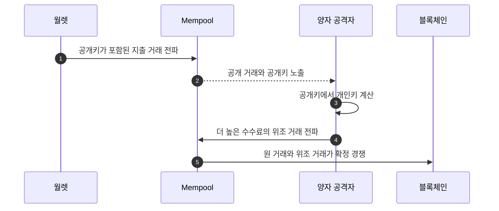
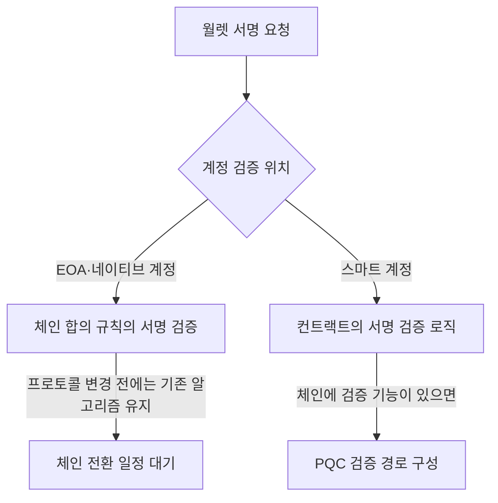

# 체인이 정하는 서명과 서비스가 바꿀 수 있는 암호

한컴위드 발표 자료는 디지털 월렛의 PQC 전환을 체인 서명, 서비스 통신, 키 보관, 이용자 인증으로 나눠 다룬다. 체인 네이티브 서명 알고리즘은 합의 규칙이므로 개별 월렛 사업자가 단독으로 바꿀 수 없지만, 통신·저장·인증과 커스터디 운영 구간은 체인 전환 전에 준비할 수 있다.

## 전환 시점을 판단하는 식

발표 자료는 Mosca의 식으로 전환 시점을 설명한다.

```text
보호해야 하는 기간(X) + 전환에 걸리는 기간(Y) > 양자 공격 가능 시점까지의 기간(Z)
```

이 부등식이 성립하면 양자 컴퓨터가 아직 현행 서명을 깨지 못하더라도 전환을 시작해야 한다. 장기간 보호해야 하는 데이터와 키는 전환 기간을 포함해 역산해야 하기 때문이다.

## 블록체인 월렛의 두 공격 시간대

일반적인 암호화 데이터의 `Harvest Now, Decrypt Later`와 블록체인 자산의 `On-Spend`는 노출 시점이 다르다.

| 구분 | 노출 경로 | 공격 시간 |
|---|---|---|
| 일반 금융 데이터 | 암호문을 지금 수집해 보관 | 양자 컴퓨터 등장 뒤 과거 암호문 해독 |
| 블록체인 자산 | 지출 트랜잭션에서 공개키가 드러남 | 트랜잭션 전파부터 블록 확정 전까지 개인키 계산·위조 거래 경쟁 |
| 이미 공개된 블록체인 키 | 주소 재사용 또는 과거 지출로 공개키 노출 | 양자 컴퓨터가 공격 가능해진 시점부터 지속 노출 |



발표 자료는 이 시나리오에서 개인키 계산에 남는 시간을 9분, 비트코인의 10분 블록 시간 안 공격 성공 가능성을 41%로 제시했다. 또한 공개키가 노출된 비트코인을 약 670만 BTC, 전체의 약 32%로 설명했다. 이 수치는 발표 자료가 사용한 공격 모델과 체인 상태를 전제로 한다.

발표 자료가 인용한 Google Quantum AI의 2026년 3월 30일 자료에서는 secp256k1 공격에 약 1,200개의 논리 큐빗이 필요하다고 설명한다. RSA-2048 공격에 필요한 논리 큐빗이 수천 개 규모인 것과 비교해 블록체인 ECDSA 키의 전환 우선순위를 제시한다.

## 공개키 서명과 키 교환의 알고리즘 분리

PQC 전환에서는 하나의 알고리즘이 기존 RSA·ECC의 모든 역할을 대신하지 않는다.

| 목적 | 발표 자료의 알고리즘·표준 | 하지 않는 일 |
|---|---|---|
| 키 캡슐화·통신 키 합의 | ML-KEM, NIST FIPS 203 | 전자서명 생성 |
| 전자서명 | ML-DSA, NIST FIPS 204 | 통신 키 교환 |

키와 서명 데이터의 크기도 달라진다. 발표 자료의 비교에서 ML-DSA-65 공개키는 1,952바이트, 서명은 3,309바이트이며 RSA-2048 공개키와 서명은 각각 256바이트다. secp256k1과 비교하면 ML-DSA 공개키는 약 59배, 서명은 약 46배, 개인키는 약 126배 크다.

크기 증가는 월렛 백업, 트랜잭션 크기, 네트워크 수수료와 처리량에 영향을 준다. BIP-39 니모닉을 기존 방식 그대로 PQC 개인키 백업에 대응시키기도 어렵다.

암호 민첩성(crypto agility)은 알고리즘을 시스템 전체 개조 없이 교체할 수 있게 하는 설계다. 발표 자료는 표준화 과정에서 탈락한 SIKE 사례를 들어, 현재 선택한 PQC 알고리즘도 교체할 수 있어야 한다고 설명한다.

## 발표 자료의 정책 전환 일정

| 지역 | 발표 자료의 일정·활동 |
|---|---|
| 국내 | 금융감독원의 검증 사업, 금융보안원의 연구, KISA·과학기술정보통신부의 시범 사업 확대와 연구개발 |
| 미국 | 고위험 키 교환은 2030년, 전자서명은 2031년 전환 목표 |
| 유럽연합 | 고위험 시스템은 2030년 전환 목표 |
| 영국 | 전체 전환은 2035년 목표 |

일정은 모든 시스템을 같은 날 일괄 교체한다는 의미가 아니다. 암호 자산 인벤토리, 장기 보호 데이터, 외부 벤더와 체인 의존성을 기준으로 우선순위를 정하고 하이브리드 구간을 운영한다.

## 월렛의 전환 지점

| 계층 | 현재 사용 예 | 전환 주체와 난이도 |
|---|---|---|
| 월렛·커스터디 | 개인키, 서명 권한, 주소 풀, HSM·KMS·MPC | 사업자가 관리하는 구간부터 인벤토리와 통제 준비 가능 |
| 서비스 통신 | JSON-RPC·HTTPS, X25519·RSA·ECDSA | 서비스 운영자가 하이브리드 통신으로 선행 전환 가능 |
| 트랜잭션 검증 | Ethereum secp256k1 ECDSA | 체인 합의 규칙 변경 필요 |
| 검증자 서명 | Ethereum BLS12-381 | 체인 로드맵과 합의 필요 |
| 온체인 계정 검증 | EOA의 `ecrecover`, 스마트 컨트랙트 검증 로직 | EOA는 체인 종속, 스마트 계정은 컨트랙트 검증으로 별도 경로 가능 |

전환 난이도는 서비스 통신, 트랜잭션 서명, 체인 합의 순으로 높아진다. 기존 금융 시스템은 서버·인증서·라이브러리를 운영 주체가 통제하므로 하이브리드 전환이 가능하지만, 블록체인은 주소와 서명의 유효성을 전체 노드가 같은 규칙으로 검증한다.

## 커스터디와 비수탁 월렛의 차이

| 월렛 형태 | 사업자가 먼저 바꿀 수 있는 범위 | 체인 결정에 남는 범위 |
|---|---|---|
| 커스터디 | HSM·KMS·MPC 운영, 키 저장, 백업, share 전송, 서비스 인증과 통신 | 최종 체인 서명 알고리즘과 주소 형식 |
| 비수탁 | 클라이언트 통신, 이용자 인증, 앱 저장 영역 | 이용자 단말 지원과 체인의 서명·주소 전환에 크게 의존 |
| MPC 월렛 | share 저장·전송과 참여자 통신 | MPC가 만드는 최종 서명은 체인이 허용한 알고리즘이어야 함 |

MPC는 개인키를 한곳에 모으지 않지만 체인 종속성을 없애지는 않는다. share의 전송과 저장은 PQC로 보호할 수 있어도, 최종 서명은 네트워크가 검증할 수 있는 형식이어야 한다.

## 스마트 계정을 통한 별도 전환 경로

체인 프로토콜이 PQC 서명을 채택할 때까지 기다리는 경로와 스마트 계정에서 검증 로직을 교체하는 경로는 구분해야 한다.



발표 자료는 Ethereum의 ERC-4337·EIP-8141 계열 계정 추상화를 체인 하드포크 없이 검증 로직을 바꾸는 경로로 설명한다. 동시에 스마트 컨트랙트에서 PQC 서명을 직접 검증하면 약 172만 가스가 들고, EIP-8051의 precompile 제안은 이를 약 4,500 가스로 낮추는 방향을 제시한다고 설명한다.

체인 수준 사례로 Bitcoin BIP-360, Ethereum 전환 로드맵, Solana Winternitz Vault를 다루고, 스마트 계정 사례로 Freedom Factory PQ1과 기관 커스터디 적용을 제시한다.

## 단말과 체인 지원 상태

발표 자료는 Android 17 beta가 Keystore·TEE·Verified Boot 영역에서 ML-DSA 지원을 준비하고, iOS 26의 CryptoKit이 ML-KEM·ML-DSA와 양자 안전 TLS를 지원하는 흐름을 제시한다. 단말 보안 영역의 알고리즘 지원은 월렛 앱이 키를 생성·저장·사용하는 기반이 되지만, 단말 지원만으로 체인 네이티브 서명의 검증 규칙이 바뀌지는 않는다.

체인 측에서는 스마트 컨트랙트 검증 비용과 precompile 제공 여부가 실제 사용 가능성을 가른다. 단말·서비스 계층의 지원과 체인 검증 계층의 지원은 별도 일정으로 관리해야 한다.

## 서비스 계층에서 시작하는 하이브리드 전환

발표 자료는 앱과 서버 사이의 TLS에 `X25519 + ML-KEM-768` 하이브리드 구성을 먼저 적용하는 순서를 제시한다. 한쪽 알고리즘이 깨져도 다른 한쪽이 유지되면 세션 키를 보호하는 방식이다.

전환 순서는 다음과 같다.

1. 앱과 서버 사이 TLS 키 합의를 하이브리드로 전환한다.
2. 백엔드 내부 암호와 서비스 간 통신을 전환한다.
3. 웹 월렛과 관리자 콘솔의 통신·인증을 전환한다.
4. 커스터디 키 관리, MPC share 전송, 사용자 인증·PKI를 전환한다.
5. 체인별 네이티브 서명 전환 일정에 맞춰 주소와 서명 체계를 변경한다.

발표 자료는 Toss Payments의 결제 통신 구간 PQC 적용 사례를 단계적·다년간 하이브리드 전환 사례로 제시한다.

## 준비 인벤토리와 일정

월렛이 사용하는 암호 자산을 먼저 식별해야 전환 순서와 책임자를 정할 수 있다.

| 확인 항목 | 기록할 내용 |
|---|---|
| 체인 | Bitcoin·Ethereum·Solana 등 키가 사용되는 네트워크 |
| 키 목적 | 거래 서명, 서비스 인증, 통신 암호화, 백업 암호화 |
| 보관 위치 | Secure Element·TEE·HSM·MPC·백업 저장소 |
| 통제 주체 | 이용자, 월렛 사업자, 커스터디 벤더, 체인 프로토콜 |
| 교체 가능 지점 | 설정·라이브러리 변경으로 가능한지, 주소 이전이나 합의 변경이 필요한지 |

발표 자료의 실행 순서는 2026년에 암호 자산과 통제 구간을 식별하고, 2027년에 월렛 벤더의 PQC 지원 일정을 확인하며, 2028년 이후에는 컨소시엄·체인 공동 전환 항목을 다루는 방식이다.

출처: 한컴위드, 「디지털 월렛의 PQC 전환 — 체인이 정하는 알고리즘, 서비스가 설계하는 전환」 세미나 발표 자료, 20쪽.
