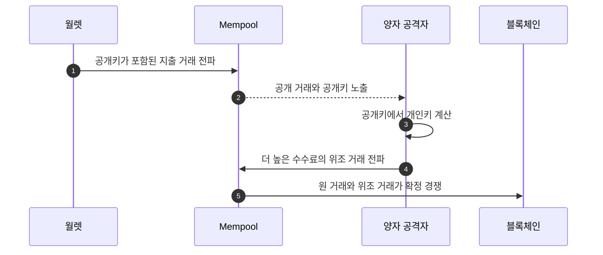
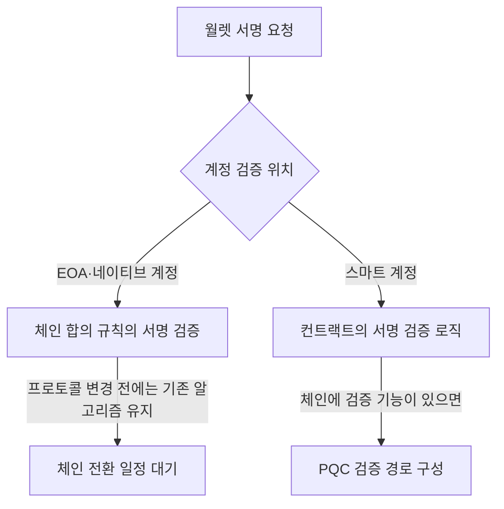

# 체인이 정하는 서명과 서비스가 바꿀 수 있는 암호

한컴위드 발표 자료는 디지털 월렛의 PQC 전환을 체인 서명, 서비스 통신, 키 보관, 이용자 인증으로 나눠 다룬다. 체인 네이티브 서명 알고리즘은 합의 규칙이므로 개별 월렛 사업자가 단독으로 바꿀 수 없지만, 통신·저장·인증과 커스터디 운영 구간은 체인 전환 전에 준비할 수 있다.

## 전환 시점을 판단하는 식

발표 자료는 Mosca의 식으로 전환 시점을 설명한다.

```text
보호해야 하는 기간(X) + 전환에 걸리는 기간(Y) > 양자 공격 가능 시점까지의 기간(Z)
```

이 부등식이 성립하면 양자 컴퓨터가 아직 현행 서명을 깨지 못하더라도 전환을 시작해야 한다. 장기간 보호해야 하는 데이터와 키는 전환 기간을 포함해 역산해야 하기 때문이다.

## 블록체인 월렛의 두 공격 시간대

일반적인 암호화 데이터의 `Harvest Now, Decrypt Later`와 블록체인 자산의 `On-Spend`는 노출 시점이 다르다.

| 구분 | 노출 경로 | 공격 시간 |
|---|---|---|
| 일반 금융 데이터 | 암호문을 지금 수집해 보관 | 양자 컴퓨터 등장 뒤 과거 암호문 해독 |
| 블록체인 자산 | 지출 트랜잭션에서 공개키가 드러남 | 트랜잭션 전파부터 블록 확정 전까지 개인키 계산·위조 거래 경쟁 |
| 이미 공개된 블록체인 키 | 주소 재사용 또는 과거 지출로 공개키 노출 | 양자 컴퓨터가 공격 가능해진 시점부터 지속 노출 |



발표 자료는 이 시나리오에서 개인키 계산에 남는 시간을 9분, 비트코인의 10분 블록 시간 안 공격 성공 가능성을 41%로 제시했다. 또한 공개키가 노출된 비트코인을 약 670만 BTC, 전체의 약 32%로 설명했다. 이 수치는 발표 자료가 사용한 공격 모델과 체인 상태를 전제로 한다.

발표 자료가 인용한 Google Quantum AI의 2026년 3월 30일 자료는 Shor 알고리즘 기반 ECDLP-256 해독 회로 두 가지를 제시한다.

| 회로 | 논리 큐빗 | Toffoli 게이트 |
|---|---:|---:|
| A | 1,200개 | 9,000만 회 |
| B | 1,450개 | 7,000만 회 |

발표 자료는 secp256k1 공격에 필요한 물리 큐빗을 50만 개 미만, 실행 시간을 수 분 수준으로 설명한다. RSA-2048에는 논리 큐빗 수천 개가 필요하며, 물리 큐빗 추정치가 2019년 2,000만 개에서 2025년 100만 개 미만으로 낮아지고 추가로 약 10분의 1을 줄이는 연구가 진행 중이라고 비교한다. 이 비교를 근거로 금융권 인증서보다 블록체인 서명이 먼저 공격 임계점에 도달할 수 있으며, 월렛은 PQC 전환의 후순위가 아니라고 정리한다.

On-Spend 공격에서는 공개키로 개인키를 계산한 공격자가 수신자를 바꾼 위조 거래를 만들고 수수료 경쟁을 건다. Ethereum에서는 같은 nonce에 더 높은 가스비를 적용하고, Bitcoin에서는 같은 UTXO와 Replace-By-Fee(RBF)를 사용한다. 더 높은 수수료의 위조 거래가 먼저 블록에 포함되면 탈취가 완료된다. 발표 자료는 확정된 온체인 거래를 되돌릴 2차 방어선은 없으며, 방어선은 서비스 계층에 둬야 한다고 정리한다.

## 공개키 서명과 키 교환의 알고리즘 분리

PQC 전환에서는 하나의 알고리즘이 기존 RSA·ECC의 모든 역할을 대신하지 않는다.

| 목적 | 발표 자료의 알고리즘·표준 | 하지 않는 일 |
|---|---|---|
| 키 캡슐화·통신 키 합의 | ML-KEM, NIST FIPS 203 | 전자서명 생성 |
| 전자서명 | ML-DSA, NIST FIPS 204 | 통신 키 교환 |

키와 서명 데이터의 크기도 달라진다. 발표 자료의 비교에서 ML-DSA-65 공개키는 1,952바이트, 서명은 3,309바이트이며 RSA-2048 공개키와 서명은 각각 256바이트다. RSA-2048과 비교하면 각각 약 8배와 13배다. secp256k1과 비교하면 ML-DSA 공개키는 `33B → 1,952B`로 약 59배, 서명은 `64~72B → 3,309B`로 약 46배, 개인키는 `32B → 4,032B`로 약 126배 크다.

크기 증가는 월렛 백업, 트랜잭션 크기, 네트워크 수수료와 처리량에 영향을 준다. BIP-39 니모닉을 기존 방식 그대로 PQC 개인키 백업에 대응시키기도 어렵다.

NIST는 2016년부터 2024년까지 8년간 공개 공모와 전 세계 암호학계의 공개 공격·심사를 거쳐 FIPS 203·204·205를 2024년 8월 확정했다. 발표 자료는 이 절차가 현존 최고 수준의 검증이지만 절대 안전을 보장하지는 않는다고 설명한다.

암호 민첩성(crypto agility)은 알고리즘을 시스템 전체 개조 없이 교체할 수 있게 하는 설계다. 최종 라운드 유력 후보였던 SIKE가 2022년 일반 PC에서 약 1시간이 걸리는 고전적 공격에 깨진 사례처럼 격자 기반 문제도 미래 취약 가능성을 배제할 수 없다. 따라서 알고리즘을 애플리케이션에 고정하는 일회성 교체가 아니라, 상위 계층을 유지한 채 ML-KEM·ML-DSA·K-PQC 구현을 바꿀 수 있는 추상화 계층과 하이브리드 운영이 필요하다.

## 발표 자료의 정책 전환 일정

| 지역 | 발표 자료의 일정·활동 |
|---|---|
| 국내 | 금융결제원이 2026년 7월 인증·전자서명 환경의 금융 분야 PQC 적용 가능성을 검증, 금융보안원이 해외 금융권 전환 동향과 `quantum-ready` 체계를 연구, KISA·과학기술정보통신부가 시범 전환·신규 연구개발 확대와 암호 민첩성을 명시 |
| 미국 | 고위험 키 교환은 2030년, 전자서명은 2031년 전환 목표 |
| 유럽연합 | 고위험 시스템은 2030년 전환 목표 |
| 영국 | 전체 전환은 2035년 목표 |

미국 일정은 2035년 목표를 2026년 6월 행정명령으로 앞당긴 일정으로 설명한다. 국내 금융권은 권고·실증 단계이고 정부·공공은 제도 기반 전환 준비 단계다. 발표 자료는 금융권 기준이 구체화되기 전에 정부·공공 사례와 금융권의 현재 상태를 비교해 기술 범위를 확인하도록 제시한다.

## 월렛의 전환 지점

| 계층 | 현재 사용 예 | 전환 주체와 난이도 |
|---|---|---|
| 월렛·커스터디 | 개인키, 서명 권한, 주소 풀, HSM·KMS·MPC | 사업자가 관리하는 구간부터 인벤토리와 통제 준비 가능 |
| 서비스 통신 | JSON-RPC·HTTPS, X25519(ECDHE) 키 교환, RSA·ECDSA 서버 인증, AES-GCM·ChaCha20 대칭키 암호 | 서비스 운영자가 하이브리드 통신으로 선행 전환 가능 |
| 트랜잭션 검증 | Ethereum secp256k1 ECDSA | 체인 합의 규칙 변경 필요 |
| 검증자 서명 | Ethereum BLS12-381 | 체인 로드맵과 합의 필요 |
| 온체인 계정 검증 | EOA의 `ecrecover`, 스마트 컨트랙트 검증 로직 | EOA는 체인 종속, 스마트 계정은 컨트랙트 검증으로 별도 경로 가능 |

전환 난이도는 서비스 통신, 트랜잭션 서명, 체인 합의 순으로 높아진다. 발표 자료는 이를 `PQC-1 앱–서버 통신`, `PQC-2 스마트 계정 PQC 서명`, `PQC-3 EOA·BLS 교체`로 나눈다. 기존 금융 시스템은 서버·인증서·라이브러리를 운영 주체가 통제하므로 하이브리드 전환이 가능하지만, 블록체인은 주소와 서명의 유효성을 전체 노드가 같은 규칙으로 검증한다.

발표 자료의 이더리움 기반 서비스 범위에는 DApp·DeFi·NFT·게임·DAO와 결제·토큰화·기업 서비스, 오라클·브리지·백엔드가 포함된다. 서비스 요청은 RPC로 들어오지만 거래 결과는 온체인에서 검증되므로, 서비스 통신의 암호를 바꾸는 일과 거래·검증 서명을 바꾸는 일은 별도 작업이다.

## 커스터디와 비수탁 월렛의 차이

| 월렛 형태 | 사업자가 먼저 바꿀 수 있는 범위 | 체인 결정에 남는 범위 |
|---|---|---|
| 커스터디 | 거래소·은행·커스터디 사업자가 HSM·KMS·MPC와 핫·콜드 월렛, 고객 계정 DB·입금 주소 풀, 키 생성·보관·서명 인프라를 직접 운영 | 최종 체인 서명 알고리즘과 주소 형식 |
| 비수탁 | 클라이언트 통신, 이용자 인증, 앱 저장 영역 | 이용자 단말 지원과 체인의 서명·주소 전환에 크게 의존 |
| MPC 월렛 | share 저장·전송과 참여자 통신 | MPC가 만드는 최종 서명은 체인이 허용한 알고리즘이어야 함 |

MPC는 개인키를 한곳에 모으지 않지만 체인 종속성을 없애지는 않는다. share의 전송과 저장은 PQC로 보호할 수 있어도, 최종 서명은 네트워크가 검증할 수 있는 형식이어야 한다.

기존 금융 시스템은 키를 교체해도 계좌번호를 유지할 수 있지만, 블록체인 월렛은 개인키·공개키·주소가 연결되어 있어 주소 체계 변경이 합의와 하드포크 문제로 이어진다. 비수탁 월렛은 단말과 체인의 지원에 의존하며, 체인 전체 변경 전의 우회 경로는 스마트 계정과 계정 추상화로 제한된다.

## 스마트 계정을 통한 별도 전환 경로

체인 프로토콜이 PQC 서명을 채택할 때까지 기다리는 경로와 스마트 계정에서 검증 로직을 교체하는 경로는 구분해야 한다.



발표 자료에서 ERC-4337 스마트 계정은 검증 로직을 컨트랙트에 두어 하드포크 없이 PQC 서명을 검증하는 현재 경로다. EIP-8141은 계정 인증을 ECDSA에서 분리하는 제안으로 2026년 하반기 검토 대상으로 제시됐다. 두 경로를 같은 도입 상태로 취급하지 않는다.

스마트 컨트랙트에서 PQC 서명을 검증하는 현재 구현은 약 172만 가스이며 ECDSA 약 18.9만 가스보다 약 9배 높다. EIP-8051 precompile은 프로토콜이 ML-DSA-44를 수용할 경우 약 4,500 가스로 검증하는 제안 단계의 경로다.

체인 수준 사례와 발표 시점의 상태는 다음과 같다.

- Bitcoin BIP-360: 2026년 2월 제안된, 공개키를 노출하지 않는 P2MR 출력 형식이다.
- Ethereum: 2026년 1월 재단 PQ 전담팀 구성, 2026년 2월 로드맵 발표, L1 목표는 2029년이다.
- Solana Winternitz Vault: 일회성 해시 서명과 트랜잭션마다 새 일회성 키를 사용해 공개키 재사용을 막는 선택 기능이다. 네트워크 전체 업그레이드가 아닌 별도 월렛이며 선행 구현·실증 사례로 제시됐다.
- Freedom Factory PQ1: SPHINCS+ 계열 서명을 ERC-4337 스마트 계정과 결합한 하드웨어 지갑으로 2026년 7월 28일 발표됐고, 2026년 4분기 출시 예정으로 제시됐다. 체인 알고리즘을 기다리지 않는 사례다.
- 규제 대상 기관 커스터디: 키 인프라 교체에 수년이 필요할 것으로 전망되는 전환 준비 단계이며, 컴플라이언스 이벤트를 기준으로 접근한다.

## 단말과 체인 지원 상태

발표 자료는 Android 17 beta의 Keystore가 ML-DSA-65·87 네이티브 지원과 TEE 내부 서명을 제공하고, Verified Boot에 ML-DSA를 적용하며, Play 하이브리드 서명을 지원한다고 정리한다. iOS 26은 CryptoKit에 ML-KEM-768·1024와 ML-DSA-65·87을 추가하고 URLSession·Network 프레임워크에 양자 안전 TLS를 기본 적용한다고 설명한다. 격자 기반 서명·검증은 모바일에서 수 밀리초 수준으로 제시됐다.

체인 측에서는 스마트 컨트랙트 검증 비용과 precompile 제공 여부가 실제 사용 가능성을 가른다. 단말의 Secure Element·TEE 저장 슬롯 제약은 시드 기반 키 생성으로 우회할 수 있지만, BIP-39 니모닉 백업 체계를 PQC 키에 그대로 적용할 수는 없다. 단말·서비스 계층의 지원과 체인 검증 계층의 지원은 별도 일정으로 관리해야 한다.

## 서비스 계층에서 시작하는 하이브리드 전환

발표 자료는 앱과 서버 사이의 TLS 1.3 ECDHE 구간에 `X25519 + ML-KEM-768` 하이브리드 키 교환을 먼저 적용한다. 이 구간에는 로그인·본인 확인·거래 요청·정책 응답과 시드 백업 암호문·복구 코드가 흐르며, 현재 ECDHE 키 교환은 수집 후 해독이 가능해 HNDL 대상이 된다.

전환 뒤에도 RSA·ECDSA 서버 인증서를 유지해 호환성을 보존하고, 체인 합의나 하드포크 없이 적용한다. 미지원 클라이언트는 기존 키 교환 방식으로 처리한다. 적용에는 서버와 SDK의 교체·개발·솔루션 도입이 필요하다.

전환 순서는 다음과 같다.

1. 월렛 앱과 서버 채널에 구간 암호 제품 또는 TLS 1.3 지원 라이브러리의 하이브리드 키 교환을 적용하고, 인증서는 기존 체계를 유지하거나 하이브리드·PQC 인증서로 전환한다.
2. 백엔드의 서명·암호화·키 관리, PQC 지원 암호 모듈, 키 관리와 DB 암호화 솔루션을 전환하고 암호화 키 길이 증가(`128 → 256`)를 반영한다.
3. 웹 월렛과 관리자 콘솔에 PQC 기반 웹 전송 구간 암호화 솔루션을 적용한다.
4. 커스터디의 HSM·KMS·키 백업 암호화, MPC share 전송·저장 채널, 사용자 로그인·본인 확인·내부 인증서 PKI를 전환한다.
5. 체인별 EIP·BIP와 계정 추상화 경로를 추적해 네이티브 서명과 주소 체계를 전환한다.

발표 자료는 Toss Payments의 국내 금융·IT 최초 NIST 표준 PQC 결제 적용 사례를 전환 방법론으로 제시한다. 자체 IDC·클라우드·결제 클라이언트의 통신 구간에 우선순위에 따라 적용하고, HTTP/3 도입, 취약 Cipher Suite 제거, 2025년까지 TLS 1.3 전환, 2026년 PQC 하이브리드 적용 순으로 호환성·성능·운영 안정성을 검증했다. 자체 IDC와 클라우드에 동시에 적용하고, 가맹점·클라이언트 웹 브라우저·레거시 호환성을 사전 검증하며, 미지원 환경은 기존 방식과 병행해 서비스 중단 없이 단계적으로 전환했다.

## 준비 인벤토리와 일정

월렛이 사용하는 암호 자산을 먼저 식별해야 전환 순서와 책임자를 정할 수 있다.

| 확인 항목 | 기록할 내용 |
|---|---|
| 체인 | Bitcoin·Ethereum·Solana 등 키가 사용되는 네트워크 |
| 키 목적 | 거래 서명키, 데이터키, 세션키 등 용도 구분 |
| 보관 위치 | Secure Element·TEE·HSM·MPC·백업 저장소 |
| 통제 주체 | 이용자, 월렛 사업자, 커스터디 벤더, 체인 프로토콜 |
| 교체 가능 지점 | 설정·라이브러리 변경으로 가능한지, 주소 이전이나 합의 변경이 필요한지 |

발표 자료는 지금 할 일을 세 가지로 정리한다.

1. 월렛의 암호 자산 인벤토리에 착수해 어떤 체인·키를 누가 통제하는지 현황을 파악한다. 인벤토리가 없으면 견적과 일정도 산정할 수 없다.
2. 통제 가능한 앱–서버 TLS와 커스터디 키 관리 구간부터 예산에 반영하고 하이브리드 성능을 실측한다.
3. EIP·BIP 진행과 단말 로드맵을 추적하고 계정 추상화 경로를 점검한다.

실행 일정은 2026년에 통제 가능 구간을 식별하고, 2027년에 월렛 벤더의 PQC 지원 일정을 확인하며, 2028년 이후 협의체 공동 대응 항목을 도출하는 순서다. 발표의 결론은 통제할 수 없는 체인 구간과 지금 바꿀 수 있는 서비스 구간을 나누는 것이 전환의 시작이라는 것이다.

출처: 한컴위드 길광은, 「디지털 월렛의 PQC 전환 — 체인이 정하는 알고리즘, 서비스가 설계하는 전환」, 디지털 월렛 보안 협의체 세미나 발표 자료, 2026-08-28, 20쪽.
