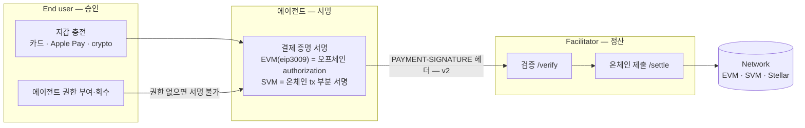

# 승인·서명·정산의 분리

에이전트 결제는 AI 에이전트가 HTTP 요청 과정에서 유료 자원의 대가를 사람 개입 없이 지불하는 구조다. 여기서 유료 자원은 API·MCP 서버·웹 콘텐츠다. 결제 수단의 중심은 스테이블코인이고 — x402 v2 는 asset 에 법정화폐 통화 코드(ISO 4217)도 허용하며 AWS 는 법정화폐 지원을 로드맵에 두고 있다 — 전통 결제 시스템이 감당하지 못하는 소액(센트 단위 이하) 마이크로트랜잭션이 첫 용도다.

구체 예로: 리서치 에이전트가 유료 시세 API 를 호출하면, 서버가 데이터 대신 HTTP `402 Payment Required` 와 "이 응답은 0.01 USDC" 라는 결제 요구를 돌려준다. 에이전트는 지갑으로 결제 증명에 서명한 뒤, **실패했던 그 요청을 결제 증명 헤더만 더해 그대로 다시 보내고** 이번에는 데이터를 받는다. 사전 충전·권한 부여(지갑 hub 화면 — 아래 역할 표)를 마친 뒤에는, 개별 결제가 별도 화면 없이 이 왕복 안에서 끝난다 — 402 는 HTTP 표준에 예약만 돼 있던 상태 코드이고 이 프로토콜들이 그 자리를 실제 결제에 사용한다.

사람이 가입해 월정액을 내는 구독(스트리밍 등)을 대체한다기보다, AWS 프리뷰의 초점은 기계가 소비하는 자원의 **건당** 사용이다 — 시세 데이터 조회 1건, 페이월 기사 1건, 유료 MCP tool 호출 1번, 비공개 패키지 레지스트리·샌드박스 실행 환경 (AWS 프리뷰가 명시한 대상). 소비자 구매(항공권·호텔 등)는 AWS 가 확장 로드맵으로만 언급했다.

## 세 역할

| 역할 | 하는 일 |
|---|---|
| Agent developer | 에이전트를 만들고 결제 인프라(지출 가드레일·credential 정책)를 설정한다 |
| End user | 에이전트 지갑에 자금을 충전하고 지출 권한·한도를 부여·회수한다 |
| Merchant | API·콘텐츠에 가격을 붙이고, 결제 확인 후 자원을 전달한다 |

## 두 프로토콜 — x402 와 MPP

흐름은 같고 챌린지·응답을 싣는 헤더가 다르다.

| | x402 v2 | x402 v1 | MPP (Machine Payments Protocol) |
|---|---|---|---|
| 결제 요구 | 402 + `PAYMENT-REQUIRED` 헤더 | 402 + JSON 응답 본문 | 402 + `WWW-Authenticate: Payment` 챌린지 |
| 결제 증명 재시도 | `PAYMENT-SIGNATURE` 헤더 | `X-PAYMENT` 헤더 | `Authorization` 헤더 |
| 정산 결과 | `PAYMENT-RESPONSE` 헤더 | `X-PAYMENT-RESPONSE` 헤더 | — |

x402 의 표준 관리는 x402 Foundation (Coinbase 개발 후 이전), MPP 는 오픈 표준이다.

AWS AgentCore payments 는 x402 v1·v2 와 MPP 를 모두 지원한다.

## 이 구조에서 분리해서 볼 세 단계

[가스 대납 문서](../가스대납/00-overview.md)의 "자산 실행 승인자와 fee payer 분리"와 같은 프레임이 여기도 적용된다.

| 단계 | 주체 | 내용 |
|---|---|---|
| 승인 | End user | 지갑 충전과 에이전트 권한 부여 — 여기서 노출 상한이 정해진다 |
| 서명 | 에이전트 (지갑 인프라 경유) | **결제 증명 생성·서명** — EVM 은 오프체인 authorization (기본 eip3009 방식), SVM 은 온체인 tx 부분 서명 |
| 정산 | Facilitator / Sponsor | 서명된 결제 증명(또는 부분 서명 tx)을 검증·완성해 온체인에 제출한다 — 수수료도 이 단계 주체가 부담 |

에이전트가 서명하는 것은 "이 금액을 이 수취인에게, 이 시간 창 안에서" 라는 이체 승인(authorization)이고 체인에 올리는 것은 facilitator 다 — 여기까지가 **exact EVM 의 기본 eip3009 방식** 의 모습이다. SVM 은 형태가 다르다: 클라이언트가 `TransferChecked` 가 담긴 온체인 트랜잭션을 직접 구성해 **부분 서명**하고 `extra.feePayer` 로 지정된 sponsor(merchant 자체 또는 제3자 facilitator)가 서명을 더해 제출한다. 어느 쪽이든 수수료는 facilitator/sponsor 몫이라 에이전트 지갑에 기본 자산(가스비)이 필요 없다.

## 문서 구성

| 문서 | 다루는 경계 |
|---|---|
| [x402 프로토콜](01-x402-protocol.md) | 402 흐름, PaymentRequirements·PaymentPayload, exact scheme(EIP-3009), facilitator 계약 |
| [AWS AgentCore payments](02-agentcore-payments.md) | 관리형 자원 모델, credential 격리, 세션 한도, 결제 흐름 |
| [세미나 확인 질문](03-seminar-questions.md) | 공개 자료로 확인 못 한 항목의 세션 질문 목록 |

## 공통 용어

| 용어 | 의미 |
|---|---|
| **402 Payment Required** | HTTP 표준에 예약돼 있던 상태 코드 — 이 프로토콜들이 결제 요구에 사용 |
| **Scheme** | 자금 이동의 논리 방식 — `exact` (정확 금액 이체) · `upto` (최대 금액 승인, 실제 청구는 사용량으로 정산 — LLM 토큰 과금 등) · `batch-settlement` (요청 시 커밋만 받고 정산은 배치) · `auth-capture` (승인 후 나중 확정 청구 — 환불 경로 내장). 목록은 확장 가능 (스냅샷 기준 — 01장) |
| **Merchant** | 유료 자원을 파는 쪽의 역할 — 스펙 용어로는 resource server 와 같은 주체. 쇼핑몰이 아니라 유료 API 제공자·페이월 콘텐츠 서버·유료 MCP 서버 운영자를 가리킨다. 가격을 402 로 제시하고 결제 확인 후 자원을 전달한다 |
| **Facilitator** | 결제 증명의 검증(`/verify`)과 온체인 정산(`/settle`)을 대행하는 서비스 역할 — merchant 자체 또는 제3자 |
| **Authorization (EIP-3009)** | 토큰 이체를 오프체인 서명으로 위임하는 표준 — from·to·value·유효 시간 창·nonce. exact EVM 의 기본(eip3009) 방식 — Permit2·ERC-7710 방식도 있다 |
| **EIP-712** | 구조화 데이터 서명 표준 — 도메인(컨트랙트·체인)과 타입 필드를 정해 서명해서, 지갑이 서명 내용을 구조화해 표시할 수 있게 하고 서로 다른 체인·컨트랙트·앱 문맥 간 서명 충돌을 막는다. 같은 문맥 안의 재사용 방지는 EIP-3009 의 nonce·유효 시간 창 몫이다. 서명된 이체 승인을 이 서식으로 만든다 |
| **Microtransaction** | 센트 단위 이하 소액 결제 — 전통 결제망의 최소 거래 비용 때문에 스테이블코인을 쓰는 이유 |

출처: [x402 공식 저장소](https://github.com/x402-foundation/x402) · [AWS AgentCore payments 동작 방식](https://docs.aws.amazon.com/bedrock-agentcore/latest/devguide/payments-how-it-works.html) · [AWS AgentCore payments 핵심 개념](https://docs.aws.amazon.com/bedrock-agentcore/latest/devguide/payments-concepts.html)
