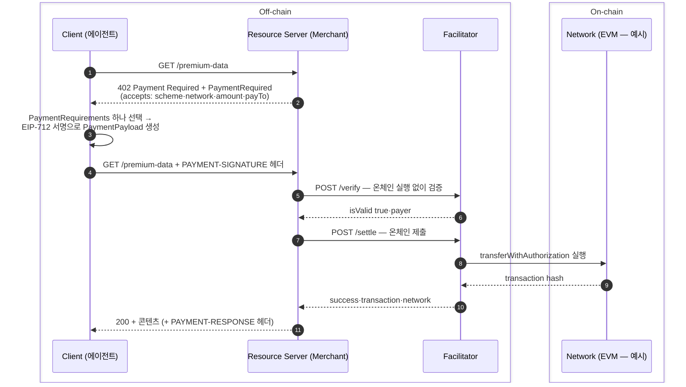

# 결제 요구에서 온체인 정산까지

x402 는 HTTP 402 상태 코드로 결제를 협상하고 결제 증명의 검증·정산을 facilitator 가 대행하는 프로토콜이다. 스펙은 v1·v2 두 본이 관리되고 v2 가 최신이다.

이 문서 작성 시점의 스펙 기준 scheme 은 4종이다 — **exact** (정확 금액 이체, 이 문서의 중심) · **upto** (최대 금액을 승인하고 실제 청구는 사용량으로 정산 — LLM 토큰 과금 같은 종량제용) · **batch-settlement** (요청 시 암호학적 커밋만 받고 접근을 즉시 허용, 정산은 배치 — 가스가 건 가치보다 클 때) · **auth-capture** (최대 금액을 승인해 두고 나중에 확정 청구 — escrow 2단계 또는 환불 가능한 단발. exact 와 달리 void·refund·reclaim 반환 경로 내장). scheme 목록은 확장 가능해 시점에 따라 늘어날 수 있다. 아래 시퀀스는 **exact EVM 의 기본 eip3009 방식 기준 예시**다 — SVM 은 서명 형태가 다르다 (아래 비교표).



## 단계 재생 — 402 왕복에서 nonce 소진까지

시퀀스의 각 단계에서 무엇이 서명되고 무엇이 아직 체인에 없는지를 단계별로 본다.

```anim
x402-payment
```

## PaymentRequired 응답 — 서버가 제시하는 것

| 필드 | 의미 |
|---|---|
| `x402Version` | 2 |
| `resource` | 자원 정보 — URL·설명·MIME type |
| `accepts[]` | 수용 가능한 결제 방식 목록 (아래 PaymentRequirements) |

실제 포맷은 이렇다 — transport 스펙의 예시 `PAYMENT-REQUIRED` 헤더(base64 로 인코딩되어 실린다)를 디코드한 것:

```json
{
  "x402Version": 2,
  "error": "PAYMENT-SIGNATURE header is required",
  "resource": {
    "url": "https://api.example.com/premium-data",
    "description": "Access to premium market data",
    "mimeType": "application/json"
  },
  "accepts": [
    {
      "scheme": "exact",
      "network": "eip155:84532",
      "amount": "10000",
      "asset": "0x036CbD53842c5426634e7929541eC2318f3dCF7e",
      "payTo": "0x209693Bc6afc0C5328bA36FaF03C514EF312287C",
      "maxTimeoutSeconds": 60,
      "extra": { "name": "USDC", "version": "2" }
    }
  ]
}
```

`accepts` 가 **배열**인 것이 요점이다 — 서버는 결제 옵션을 여러 개 제시할 수 있고(네트워크·자산·scheme 이 다른 제안 각각이 완결된 한 원소) 클라이언트는 자기 지갑이 지원하는 **하나를 골라** 그 조건대로 서명한다. 재시도 payload 의 해당 필드가 단수형 `accepted` (선택한 PaymentRequirements) 인 이유다. 복수를 결제하는 것이 아니라, 복수 제시 → 단수 선택이다.

`accepts[]` 의 PaymentRequirements:

| 필드 | 의미 |
|---|---|
| `scheme` | 결제 scheme (예: `exact`) |
| `network` | CAIP-2 형식 네트워크 식별자 (예: `eip155:84532`) |
| `amount` | 원자 단위 토큰 수량 — JSON 문자열 타입 (`"10000"`) |
| `asset` | 토큰 컨트랙트 주소 또는 ISO 4217 통화 코드 |
| `payTo` | 수취인 지갑 주소 |
| `maxTimeoutSeconds` | 결제 완료 최대 시간 |

필드 이름이 token 이 아니라 **asset** 인 이유: 이 필드가 토큰과 법정화폐를 한 자리에서 받기 때문이다. 토큰이면 컨트랙트 주소를, 법정화폐면 컨트랙트 주소가 없으므로 국제 통화 코드 표준인 **ISO 4217** (`USD`·`KRW` 같은 3글자 코드) 를 넣는다. `network` 가 특정 체인 이름 대신 CAIP-2 범용 식별자를 쓰는 것도 같은 의도다 — 결제 수단·레일을 추상화한 프로토콜이라서다.

## exact EVM — 기본 eip3009 방식

exact EVM 은 자산 이동 방식(assetTransferMethod)이 셋이다 — **eip3009** (기본), **Permit2** (EIP-3009 미지원 ERC-20 의 범용 대안 — Permit2 allowance 가 사전에 필요하며, 직접 승인하면 클라이언트 가스가 든다. facilitator 가 승인 가스를 대납하거나 EIP-2612 permit 서명으로 갈음하는 확장도 스펙에 있다), **ERC-7710** (delegation 을 쓰는 스마트 계정용). `PaymentRequired.extra` 에 지정이 없으면 클라이언트는 eip3009 를 기본으로 쓴다. 이 절은 기본 방식을 다룬다.

eip3009 에서 클라이언트가 만드는 PaymentPayload 의 핵심은 **EIP-712 서명 + EIP-3009 authorization** 이다. [승인·계정 실행 모델](../가스대납/02-authorization-and-account-models.md)에서 다룬 ERC-3009 Transfer with Authorization 그대로다 — 토큰 보유자가 오프체인에서 서명하고 제3자가 그 서명으로 `transferWithAuthorization` 을 온체인 실행한다. 그래서 가스리스다.

| authorization 필드 | 의미 |
|---|---|
| `from` / `to` | 결제자·수취인 지갑 |
| `value` | 원자 단위 금액 (JSON 문자열 타입) — 검증에서 **정확히 일치**해야 한다 |
| `validAfter` / `validBefore` | 유효 시간 창 (Unix) |
| `nonce` | 32바이트 랜덤 — 같은 서명의 재사용(재생)을 막는다 |

역할을 가르면 이렇다. **EIP-3009** 는 이체 승인의 내용(무엇을·누구에게·언제까지)과 집행 함수 `transferWithAuthorization` 을 정한다. **EIP-712** 는 그 승인의 서명 서식이다 — 구조화 서명이라 지갑이 "0.01 USDC 를 0x2096… 에게" 처럼 서명 내용을 표시할 수 있다. **facilitator** 는 서명된 이체 승인을 체인에 제출한다.

facilitator 의 검증 순서: EIP-712 서명 → 결제자 잔액 → 금액 정확 일치 → 시간 창 → 파라미터 매칭 → 트랜잭션 시뮬레이션. 실패는 `insufficient_funds`, `invalid_exact_evm_payload_signature` 같은 에러 코드 enum 으로 돌아온다.

### exact EVM vs exact SVM

같은 exact scheme 이라도 두 네트워크의 실행 모델이 달라 서명물부터 다르다. Solana(SVM)에서는 클라이언트가 온체인 트랜잭션 자체를 구성해 부분 서명하고 sponsor 가 완성한다. SVM 열의 근거는 core 개요가 아니라 상세 network binding(`schemes/exact/scheme_exact_svm.md`)이다.

| 항목 | exact EVM (eip3009) | exact SVM |
|---|---|---|
| 클라이언트가 서명하는 것 | **오프체인 authorization** (EIP-3009 이체 승인, EIP-712 서식) — 트랜잭션이 아니다 | **온체인 트랜잭션 자체를 구성해 부분 서명** — fee payer 서명 자리가 비어 있다 |
| 온체인 실행 | facilitator 가 `transferWithAuthorization` 호출로 트랜잭션 생성·제출 | sponsor 가 `feePayer` 서명을 더해 클라이언트가 만든 트랜잭션을 그대로 제출 |
| 전송 명령 | ERC-20 `transferWithAuthorization` | `TransferChecked` — top-level 또는 다른 프로그램의 CPI 내부 명령 허용 (스마트 지갑이 성립하는 근거) |
| 제출·수수료 부담 | facilitator (제출자가 가스 부담) | `extra.feePayer` 로 지정된 sponsor — merchant 자체 또는 제3자 facilitator |
| 금액 규칙 | 요구 금액과 **정확히 일치** (불일치 = 에러) | 요구 금액 **이상이면 허용** (스마트 지갑 내부 수수료 반올림 수용), 미달은 거절 |
| 재사용·만료 방지 | authorization 의 nonce(32B) + validAfter/validBefore 시간 창 | 트랜잭션 수명 = recentBlockhash 기반 (서버가 `extra.recentBlockhash` 를 줄 수 있다) |
| 검증 방식 | 6단계 — 서명 → 잔액 → 금액 정확 일치 → 시간 창 → 파라미터 매칭 → 시뮬레이션 | 2경로 — 표준 지갑: 정적 명령어 레이아웃 fast path (3~7 명령) / 스마트 지갑: 시뮬레이션 기반 (프로그램 allowlist 전제). Compute Unit 상한·목적지 ATA 검증 병행 |
| 클라이언트 가스 | 불필요 (가스리스) | 불필요 (수수료는 sponsor 몫) |

EVM 에는 Permit2·ERC-7710 방식도 있으며 (위 exact EVM 절), 이 표는 기본 eip3009 방식과 SVM 을 비교한다 — 예컨대 Permit2 는 사전 allowance 가 필요해, 직접 승인 경로에서는 "클라이언트 가스 불필요" 가 성립하지 않는다 (대납·permit 확장을 쓰면 성립). 공통점은 신뢰 모델이다 — 어느 쪽이든 sponsor·facilitator·서버가 움직일 수 있는 자금은 클라이언트가 서명한 결제 증명의 범위 안이다.

## Facilitator 계약

| 엔드포인트 | 역할 |
|---|---|
| `POST /verify` | payload + requirements 를 받아 **온체인 실행 없이** 검증만 — `{isValid, payer}` |
| `POST /settle` | scheme 별 정산 수행 — exact·upto 는 트랜잭션을 실행하고 batch-settlement 는 커밋을 저장한 뒤 후속 redemption 에서 가치가 이전된다 — `{success, transaction, network, payer}` |
| `GET /supported` | 지원 scheme·네트워크·확장·서명자 주소 |

merchant 는 verify 만 먼저 호출해 콘텐츠를 줄지 판단하고, settle 로 실제 정산할 수 있다. facilitator 와 서버가 할 수 있는 자금 이동은 클라이언트가 서명한 결제 증명의 범위 안으로 제한된다.

정산 상태는 셋으로 다룬다. 브로드캐스트 후 확인이 불명확하면 facilitator 가 `settlement_pending` 과 트랜잭션 해시를 반환하고 호출자는 그 해시로 온체인 상태를 대조한다 — 이 상태에서는 정산도 nonce 소진도 확정이 아니다. 성공이 확인되면 nonce 가 소진되어 같은 authorization 으로는 재정산할 수 없다. 실패가 확인된 때에만 새 authorization 을 만든다. 성공 여부가 불명한 채 새 nonce 로 서명하면 그것은 새로운 유효 결제가 되어 이중 지불이다.

## v1 과 v2

v2 에서 네트워크 식별자가 CAIP-2 형식이 됐고 PaymentRequired·PaymentPayload 구조가 재편성됐으며(ResourceInfo 분리) extensions 확장이 추가됐다. AgentCore Payments는 두 버전을 모두 지원한다.

출처: [x402 v2 원문 스펙 (기준 고정본)](https://github.com/x402-foundation/x402/blob/7d5363a6d51750dc246041f2b0ed5819dd46a0d7/specs/x402-specification-v2.md) · [x402 공식 저장소](https://github.com/x402-foundation/x402)
