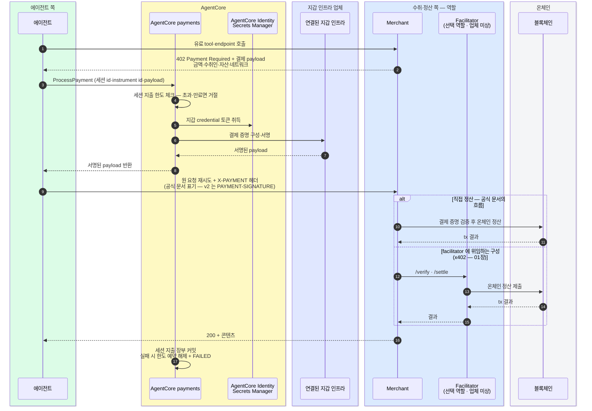

# 지갑 credential 을 에이전트에게 주지 않는 구조

AgentCore Payments는 에이전트의 x402·MPP 결제를 대행하는 관리형 서비스다 (2026-05 프리뷰 — US East·US West·Frankfurt·Sydney). 핵심 설계는 지갑 credential 을 에이전트 코드가 아니라 서비스 계층에 격리하는 것이다 — 에이전트는 결제를 "요청" 할 수 있을 뿐, 키를 만질 수 없다.

## 자원 모델

| 자원 | 무엇 | 경계 |
|---|---|---|
| **PaymentManager** | 계정 단위 최상위 자원 | 인증 방식(`AWS_IAM`·`CUSTOM_JWT`)과 IAM role 을 정한다. 앱·환경·팀 단위로 분리 |
| **PaymentConnector** | 외부 지갑 인프라 통합 | 타입 2종 — `CoinbaseCDP` · `StripePrivy`. Manager 하나에 여러 커넥터 가능 |
| **PaymentCredentialProvider** | 벤더 credential 저장 | 커넥터와 1:1. API key·wallet secret 을 AgentCore Identity를 통해 Secrets Manager에 저장, runtime 에는 토큰만 발급 |
| **PaymentSession** | 상호작용 하나의 지출 컨텍스트 | 만료 시간 + 선택적 한도 (`maxSpendAmount`·`currency`). 서명 실패 시 차감 자동 롤백 |
| **PaymentInstrument** | embedded crypto wallet | 체인별 별도 instrument (주소를 체인 간 공유 불가). 유일 타입 = `EMBEDDED_CRYPTO_WALLET` |

## 역할과 구성요소

x402 프로토콜은 client·server·facilitator·sponsor 역할을 정의하고, AgentCore는 이 중 지불 측 기능을 관리형 서비스와 지갑 커넥터로 구성한다.

| 등장 요소 | 유형 | 설명 |
|---|---|---|
| AgentCore Payments | 관리형 서비스 | 결제 세션과 지갑 credential 연결을 관리 |
| 지갑 인프라 (PaymentConnector) | 커넥터 (택 1) | `CoinbaseCDP` 또는 `StripePrivy` 타입 중 선택해 연결 |
| 유료 자원 발견 | 서비스 | x402 Bazaar MCP 서버 |
| Merchant | 역할 | API·콘텐츠를 파는 누구든 |
| Facilitator | 역할 | 검증·정산 대행 — merchant 자체 또는 제3자가 담당할 수 있음 |
| End user · Agent developer | 역할 | 사용자: 충전·권한 부여/회수 · 개발자: Manager·Connector 구성 |

## 자금과 권한 — 노출 상한은 충전액

instrument 는 생성 직후 잔액 0 USDC 이고, **사용자가 명시적으로 권한을 부여하기 전에는 에이전트가 거래할 수 없다.** 충전과 권한 부여·회수는 연결된 wallet hub 프론트엔드에서 한다 — crypto 이체 또는 카드·간편결제·ACH.

## 결제 흐름

MPP 를 쓰면 챌린지가 `WWW-Authenticate: Payment` 헤더로 오고 재시도가 `Authorization` 헤더로 가는 것만 다르다.

## 통제 모델의 경계

문서에 정의된 통제:

- **IAM 역할 분리** — 공식 문서는 Administrator·관리(instrument·세션 생성)·실행(ProcessPayment)·서비스 4-role 모델을 제공하고 **세션 생성 권한과 ProcessPayment 를 같은 역할에 두지 말라고 명시한다** — 같은 역할이면 공격자가 상향된 한도의 새 세션을 만들어 기존 한도를 우회할 수 있어서다. 관리 role 에는 ProcessPayment 명시적 Deny
- 세션당 지출 한도 (`maxSpendAmount`·`currency`) 와 만료 시간
- 사용자의 에이전트 권한 부여·회수
- credential 의 Secrets Manager 격리 — 에이전트 코드의 credential 직접 접근을 차단한다
- Observability (로그·대시보드·지출 메트릭)

Payments 의 PaymentSession 기본 통제는 금액·통화·만료 중심이고 merchant·asset 별 결제 정책식은 공개 문서에서 확인되지 않는다. Facilitator·sponsor의 수수료와 정산 모델도 해당 공개 문서에서 확인되지 않는다.

## 유료 자원 발견

- **AgentCore Gateway** — 유료 MCP 서버·API 연결. **x402 Bazaar** 통합으로 기존 유료 MCP tool 을 발견
- **AgentCore Browser** — x402 를 지원하는 페이월 웹사이트에 접근

출처: [AgentCore Payments 동작 방식](https://docs.aws.amazon.com/bedrock-agentcore/latest/devguide/payments-how-it-works.html) · [핵심 개념](https://docs.aws.amazon.com/bedrock-agentcore/latest/devguide/payments-concepts.html) · [IAM 역할 분리](https://docs.aws.amazon.com/bedrock-agentcore/latest/devguide/payments-iam-roles.html) · [공식 발표 블로그](https://aws.amazon.com/blogs/machine-learning/agents-that-transact-introducing-amazon-bedrock-agentcore-payments-built-with-coinbase-and-stripe/). 지역·파트너 사실은 발표 블로그, 자원 모델·흐름은 동작 방식·핵심 개념 문서, 권한 통제는 IAM 역할 문서 기준.
