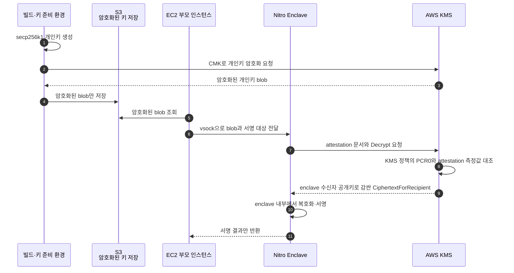
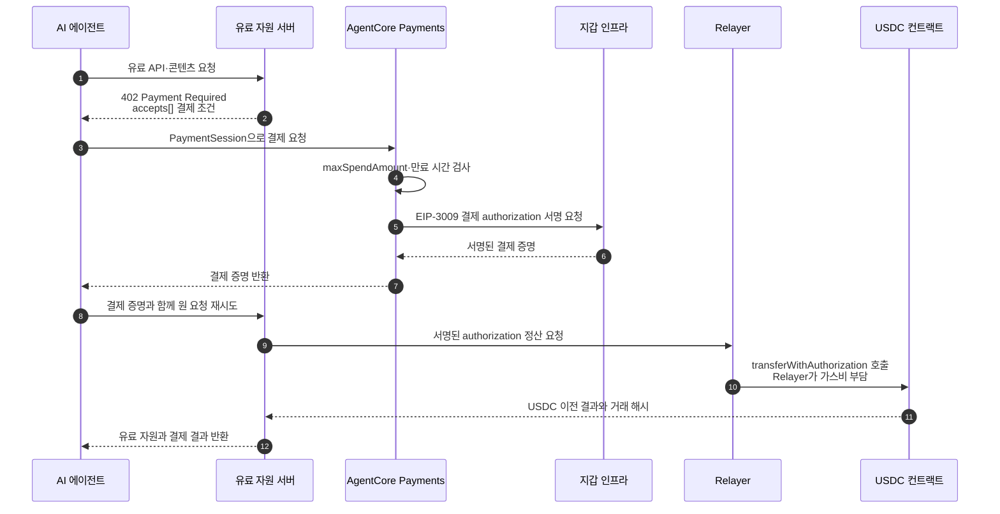
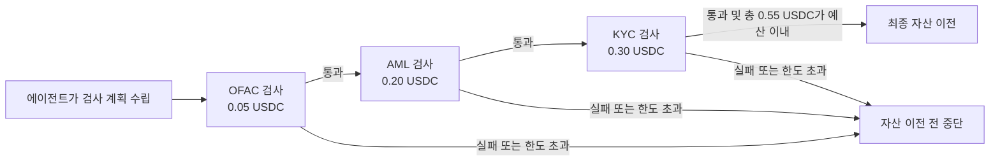
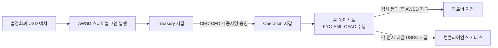
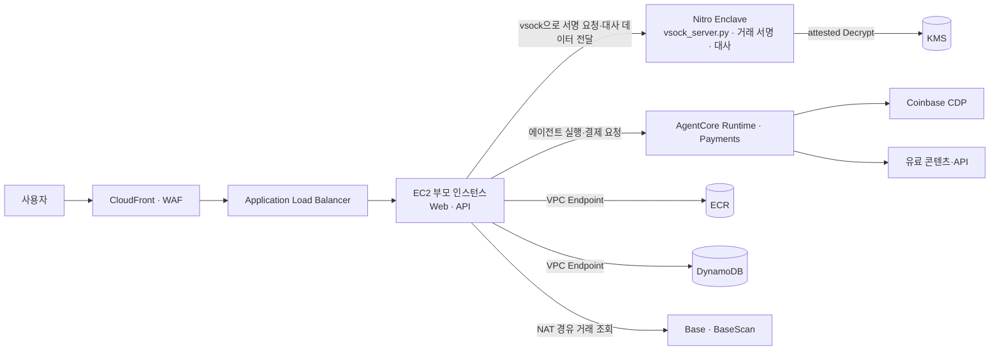

# 평문 키를 노출하지 않는 서명과 자율 결제

AWS 담당자의 「Do Agents Dream of Electronic Payments?」 발표는 Web3 월렛 키 관리와 AI 에이전트 결제를 하나의 실행 구조로 연결한다. 첫 부분은 KMS와 Nitro Enclaves를 이용해 개인키 평문을 격리하고, 두 번째 부분은 AgentCore Payments와 x402를 이용해 한도 안에서 결제를 자동 실행하는 구조다.

## Web3 키 관리 선택지

| 서비스 | 키를 다루는 방식 | 발표 자료의 경계 |
|---|---|---|
| AWS Secrets Manager | 애플리케이션이 비밀 값을 조회 | 서명 시점에는 애플리케이션 메모리에 평문 개인키가 도달 |
| AWS KMS | 키를 KMS 내부에 보관하고 지원 알고리즘으로 서명 | 관리형 다중 테넌트 서비스이며 KMS가 지원하는 서명 방식 안에서 사용 |
| AWS CloudHSM | 전용 HSM에서 키와 암호 연산을 고객이 통제 | 전용 장비의 비용과 고가용성 운영이 필요 |
| AWS Nitro Enclaves | EC2 부모 인스턴스와 격리된 실행 환경 제공 | 키 저장소가 아니라 격리 실행과 attestation을 제공 |

발표 아키텍처는 `KMS + Nitro Enclaves`와 envelope encryption을 선택한다. KMS는 암호화 키와 복호화 정책을 관리하고, Nitro Enclave는 복호화된 개인키를 사용해 서명하는 실행 공간을 제공한다.

## KMS Sign이 아니라 Decrypt를 통제하는 이유

KMS의 attestation 연계 대상은 `Decrypt`, `GenerateDataKey`, `GenerateRandom`이며 `Sign` API에는 attestation 조건을 적용할 수 없다. 발표 아키텍처는 이 제약 때문에 KMS가 직접 서명하는 대신, 특정 enclave 코드만 개인키를 복호화하도록 통제한다.

평문 개인키는 S3, EC2 부모 인스턴스, 애플리케이션 로그로 나오지 않는다. S3에는 KMS로 암호화된 blob만 보관하고, KMS가 반환하는 복호화 결과도 enclave의 수신자 공개키로 다시 암호화한 `CiphertextForRecipient` 형태다. 최종 unwrap과 서명은 enclave 안에서만 수행한다.

## PCR0가 통제하는 실행 코드

PCR0는 Enclave Image File(EIF), 즉 enclave에서 실행할 코드 이미지의 SHA-384 측정값이다. KMS 키 정책에 허용 PCR0를 넣으면 IAM 호출자가 누구인지뿐 아니라 어떤 코드 이미지가 실행 중인지까지 복호화 조건으로 사용할 수 있다.

같은 이미지에서는 배포 시간·인스턴스·리전이 달라도 같은 PCR0가 나온다. PCR0가 달라지는 원인은 재현되지 않는 빌드 결과, 다른 PCR 사용, 빌드 도구 체인 버전 차이와 같이 이미지 내용이나 측정 조건이 달라진 경우다.

이 통제는 신뢰 기준을 `누가 호출했는가`에서 `어떤 코드가 실행 중인가`로 확장한다. 새 버전을 배포하면 새 EIF의 PCR0를 KMS 정책에 반영해야 하며, 승인되지 않은 이미지에서는 개인키를 복호화할 수 없다.

## AgentCore의 결제 구성요소

발표 자료는 AgentCore를 다음 모듈로 구성한다.

| 모듈 | 역할 |
|---|---|
| Runtime | 에이전트 실행 환경 |
| Gateway | API·MCP 도구 연결 |
| Memory | 에이전트 기억과 상태 |
| Identity | 외부 서비스 credential 관리 |
| Code Interpreter | 격리된 코드 실행 |
| Observability | 호출·결제 추적과 관측 |
| Browser | 웹사이트 탐색과 페이월 접근 |
| Payments | 결제 세션과 서명·결제 처리 |

지갑은 Coinbase CDP 또는 Stripe Privy를 연결하고, 외부 지갑 credential은 Identity에서 관리한다. 에이전트 코드가 지갑 비밀 값을 직접 보관하지 않는다.

## HTTP 402 결제 흐름

PaymentSession은 `maxSpendAmount`와 만료 시간으로 에이전트가 사용할 수 있는 범위를 제한한다. 결제 자산은 USDC이며, EIP-3009 authorization을 사용하므로 이용자 지갑은 거래 가스비를 직접 보유하지 않아도 된다. Relayer가 `transferWithAuthorization`을 호출하고 가스비를 부담한다.

CloudWatch와 X-Ray는 에이전트 호출, 결제 세션, 온체인 결과를 추적하는 관측 지점으로 사용한다.

## 발표 자료의 적용 대상

- 유료 데이터셋과 리서치 자료
- 실시간 시장 데이터
- 브라우저 에이전트가 접근하는 페이월
- 정보·추론·토큰 사용량 단위 과금
- 필요할 때만 사용하는 저장 공간
- 유료 컴플라이언스 검사

전통 카드 결제에서는 최소 수수료와 지역 제약 때문에 1달러 미만 결제가 어렵다. 발표 자료는 스테이블코인과 x402를 이 소액·건별 결제 구간에 적용한다.

## 컴플라이언스 검사를 구매하는 에이전트

발표 사례에서 에이전트는 자산을 이전하기 전에 OFAC, AML, KYC 검사를 순서대로 실행한다. 각 검사는 x402로 결제하는 별도 유료 서비스이며, 정책 예산과 세 검사 결과를 모두 통과해야 최종 자산 이전으로 넘어간다.

결제 세션과 서명 오케스트레이션은 온체인 정산과 분리된다. 검사가 실패하거나 예산을 초과하면 최종 자산을 이동하기 전에 중단하며, 성공하면 거래 해시를 반환해 BaseScan에서 온체인 결과를 확인한다.

## 데모의 자금 흐름

발표 데모는 법정화폐 예치부터 스테이블코인 발행, 회사 지갑 통제, 에이전트 검사, 파트너 지급을 한 흐름으로 구성한다.

## 발표 아키텍처의 배치 경계

이 배치가 보존하려는 조건은 세 가지다.

1. 개인키 평문을 enclave 밖에 노출하지 않는다.
2. AI 에이전트는 PaymentSession의 규칙과 예산 안에서만 자율 결제한다.
3. 결제와 자산 이전 결과를 온체인 거래와 감사 로그로 추적한다.

출처: AWS 담당자, 「Do Agents Dream of Electronic Payments? — Web3 Wallet Key Management & AI Agent Autonomous Payments」 세미나 발표 자료, 19쪽.
