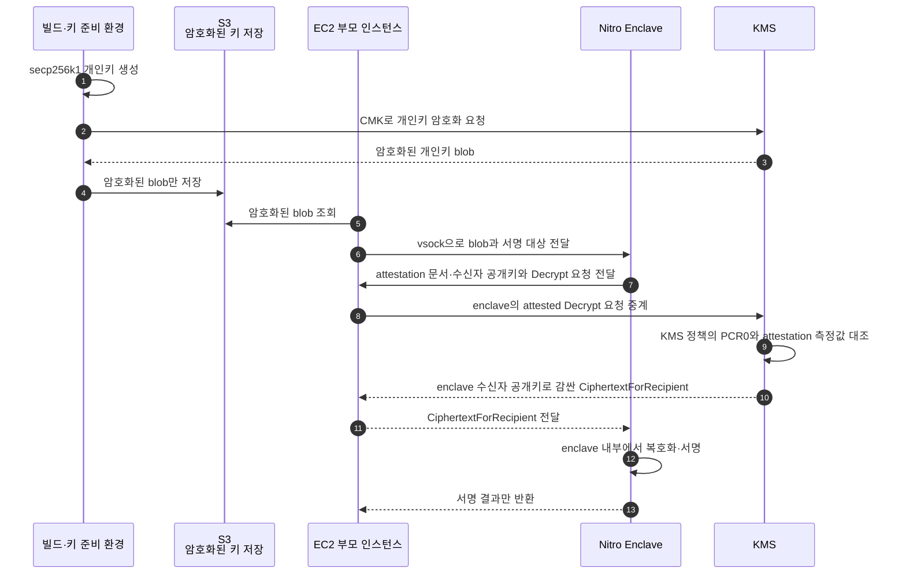
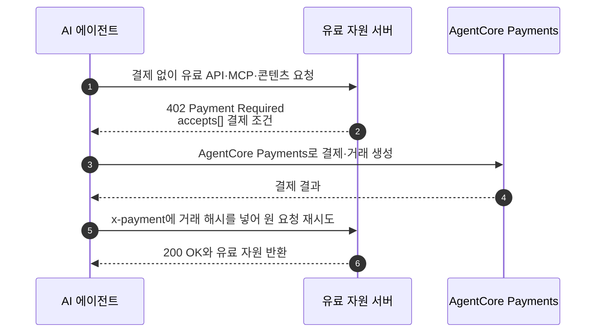
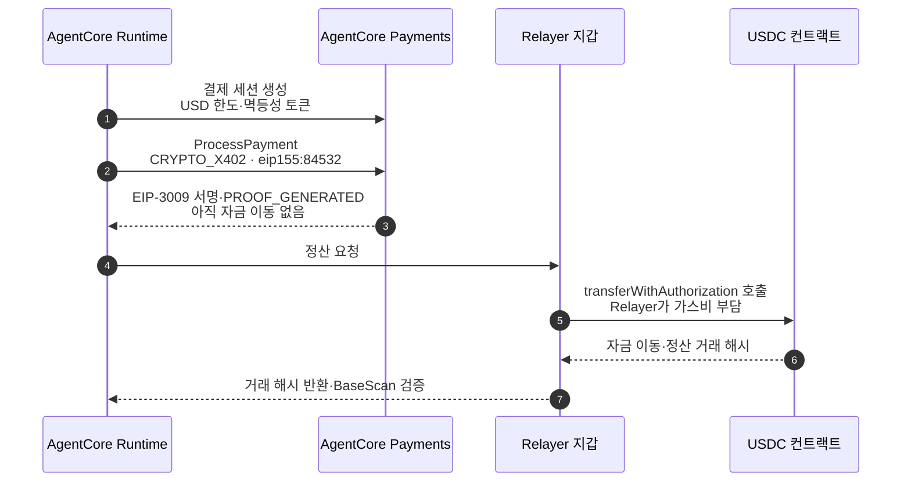
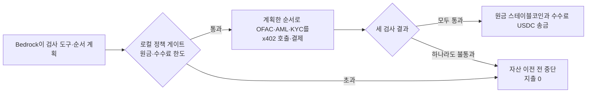
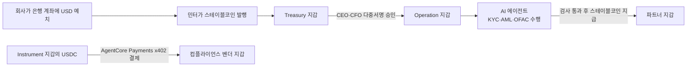
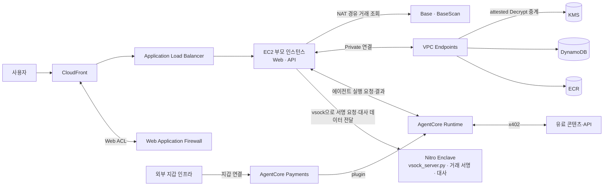

# 평문 키를 노출하지 않는 서명과 자율 결제

「Do Agents Dream of Electronic Payments?」 발표는 Web3 월렛 키 관리와 AI 에이전트 결제를 하나의 실행 구조로 연결한다. 첫 부분은 KMS와 Nitro Enclaves를 이용해 개인키 평문을 격리하고, 두 번째 부분은 AgentCore Payments와 x402를 이용해 한도 안에서 결제를 자동 실행하는 구조다.

## Web3 키 관리 선택지

발표 자료는 네 서비스를 `저장소`, `서명 실행`, `격리`의 역할로 구분한다. 공통 판단 기준은 서명 과정에서 평문 개인키가 어디에 나타나는가다.

| 항목 | Secrets Manager | KMS | CloudHSM | Nitro Enclaves |
|---|---|---|---|---|
| 평문 키 노출 | 애플리케이션 메모리에 노출 | 없음 | 없음 | enclave 밖에는 없음 |
| 키 위치 | 암호화해 저장하지만 애플리케이션이 꺼내 사용 | HSM 내부, 추출 불가 | 전용 HSM 내부, 추출 불가 | 분리 메모리에서만 복호화 |
| secp256k1 서명 | 애플리케이션이 직접 실행 | KMS 네이티브 `Sign` | PKCS#11로 실행 | enclave 내부에서 실행 |
| 테넌시 | 공유 | 공유·다중 테넌트 | 단일 전용 | 단일 EC2 인스턴스의 격리 환경 |
| 비용·운영 | 매우 낮음 | 낮음·서버리스 | 높음·고가용성 직접 운영 | 중간·attestation 운영 |
| 규정·증명 | 별도 보증 없음 | FIPS 140-2 Level 3 | FIPS 140-2 Level 3 | attestation 증명 |
| 발표 자료의 서명 키 적합성 | 부적합 | 기본값 | 규제용 | 최고 보증 |

발표 아키텍처는 `KMS + Nitro Enclaves`와 envelope encryption을 선택한다. KMS는 암호화 키와 복호화 정책을 관리하고, Nitro Enclave는 복호화된 개인키를 사용해 서명하는 실행 공간을 제공한다.

Nitro Enclaves 자체는 키 저장소가 아니다. 격리된 실행 환경과 attestation을 제공하며, 암호화된 키 blob은 S3에, 복호화 권한과 감싸는 키는 KMS에 둔다.

## KMS Sign이 아니라 Decrypt를 통제하는 이유

KMS의 attestation 연계 대상은 `Decrypt`, `GenerateDataKey`, `GenerateRandom`이며 `Sign` API에는 attestation 조건을 적용할 수 없다. 발표 아키텍처는 이 제약 때문에 KMS가 직접 서명하는 대신, 특정 enclave 코드만 개인키를 복호화하도록 통제한다.

secp256k1 개인키는 32바이트 데이터 키이며, KMS 고객 관리 키(CMK)가 AES-256-GCM으로 이 데이터 키를 감싼다. 평문 개인키는 S3, EC2 부모 인스턴스, 애플리케이션 로그로 나오지 않는다. S3에는 KMS로 암호화된 blob만 보관하고, KMS가 반환하는 복호화 결과도 enclave의 수신자 공개키로 다시 암호화한 `CiphertextForRecipient` 형태다. 최종 unwrap과 ECDSA 서명은 enclave 안에서만 수행한다.

## PCR0가 통제하는 실행 코드

PCR0는 Enclave Image File(EIF), 즉 enclave에서 실행할 코드와 운영체제 이미지 전체의 SHA-384 측정값이다. 한 바이트만 달라도 값이 달라진다. attestation 문서에는 PCR 값, enclave 공개키와 nonce가 들어가고 서비스 루트 인증서로 서명되어 위조할 수 없다. KMS 키 정책의 `RecipientAttestation:PCR0` 조건과 일치하면 `Decrypt`를 허용하고, 불일치하면 승인되지 않은 코드로 판단해 거부한다.

같은 바이트의 EIF에서는 배포 시간·인스턴스·리전이 달라도 같은 PCR0가 나온다. PCR0가 달라 보이는 원인은 세 가지다.

- Docker 태그·타임스탬프·의존성 변화로 재현되지 않는 빌드가 만들어진 경우
- PCR0 이미지, PCR8 서명 인증서, PCR1 커널·부트, PCR3·4 IAM 역할·인스턴스처럼 다른 PCR을 비교한 경우
- `nitro-cli`나 커널을 포함한 도구 체인 버전이 달라진 경우

발표 사례에서 PCR0가 `31f91cd3…`에서 `469d73cc…`로 바뀐 이유는 배포 시점이 아니라 기능 추가로 enclave 코드가 바뀌었기 때문이다.

이 통제는 신뢰 기준을 `누가 호출했는가`에서 `어떤 코드가 실행 중인가`로 확장한다. 새 버전을 배포하면 새 EIF의 PCR0를 KMS 정책에 반영해야 하며, 승인되지 않은 이미지에서는 개인키를 복호화할 수 없다.

따라서 root 권한이나 IAM 호출 권한을 탈취한 주체도 승인된 코드를 실행해 PCR0가 일치해야만 `Decrypt`를 통과한다. 이때도 복호화 결과는 enclave 공개키로 봉인되므로 EC2 부모 인스턴스에서 평문 개인키를 받을 수 없다.

## AgentCore의 결제 구성요소

발표 자료는 AgentCore를 다음 모듈로 구성한다.

| 모듈 | 역할 |
|---|---|
| Runtime | 에이전트를 서버리스로 실행하고 세션을 격리 |
| Gateway | 도구·API를 MCP로 연결 |
| Memory | 단기·장기 컨텍스트 저장 |
| Identity | 인증과 권한 위임 |
| Code Interpreter | 격리 샌드박스에서 코드 실행 |
| Observability | 추적·감사·모니터링 |
| Browser | 관리형 브라우저 자동화 |
| Payments | 결제 세션과 서명·결제 처리 |

지갑은 지원되는 외부 지갑 커넥터를 연결하고, credential은 Identity에서 관리한다. 에이전트 코드가 지갑 비밀 값을 직접 보관하지 않는다.

## HTTP 402 결제 핸드셰이크

이 그림은 발표 자료가 제시한 x402 핸드셰이크의 요약이다. 발표 자료는 x402와 MPP가 모두 HTTP `402 Payment Required`를 사용하며, 요청 수신부터 지갑 서명과 결제 증명 반환까지 에이전트 측 전 과정을 관리한다고 설명한다.

PaymentSession은 `maxSpendAmount`와 만료 시간으로 에이전트가 사용할 수 있는 범위를 제한하고 초과 시 거절한다. 지갑 credential은 AgentCore Identity에 보관한다.

## EIP-3009 서명과 온체인 정산

발표 자료는 결제 세션 생성, 결제 증명 생성, 온체인 정산을 별도 시점으로 나눈다.

결제 자산은 USDC다. `PROOF_GENERATED`는 서명된 결제 증명이 만들어진 상태이며 자금이 이동한 상태가 아니다. 이후 Relayer가 `transferWithAuthorization`을 호출하고 가스비를 부담하면서 온체인 정산이 이뤄진다. 발표 자료는 이 분리를 `서명`과 `정산`의 분리로 설명한다.

CloudWatch와 X-Ray는 에이전트 호출, 결제 세션, 온체인 결과를 추적하는 관측 지점으로 사용한다.

## 발표 자료의 적용 대상

- 유료 데이터셋과 리서치 자료
- 실시간 시장 데이터
- 브라우저 에이전트가 접근하는 페이월
- 정보·추론·토큰 사용량 단위 과금
- 필요할 때만 사용하는 저장 공간
- 유료 컴플라이언스 검사

전통 카드 결제에서는 최소 수수료와 지역 제약 때문에 1달러 미만 결제가 어렵다. 발표 자료는 스테이블코인과 x402를 달러 미만부터 1센트의 수천분의 1까지의 소액·건별 결제 구간에 적용한다.

## 컴플라이언스 검사를 구매하는 에이전트

발표 사례의 사용자 의도는 크로스보더 송금 요청이다. AgentCore Runtime에서 Bedrock(Claude)이 송금에 필요한 OFAC·AML·KYC 도구와 실행 순서를 계획한다. 각 검사는 파이프라인 안에서 x402로 호출·결제하는 별도의 인라인 유료 단계이며, 결과를 받으려면 검사비를 지불해야 한다.

| 검사 | 발표 자료의 검사 내용 | 결제 금액 |
|---|---|---:|
| KYC | 고객 신원 확인 | 0.30 USDC |
| AML | 자금세탁 방지 스크리닝 | 0.20 USDC |
| OFAC | 제재 대상 조회 | 0.05 USDC |

결제 전에 로컬 정책 게이트가 원금 한도와 수수료 한도를 모두 확인한다. PaymentSession에서 지출 한도와 결제 그룹을 적용한다. 세 검사와 정책 한도를 모두 통과해야 원금 스테이블코인과 수수료 USDC를 송금한다. 한도 초과나 검사 불통과 시 지출 0으로 중단하고, 승인권자가 조건을 해제한 뒤 다음 시도에서 다시 진행할 수 있다.

결제 세션과 서명 오케스트레이션은 온체인 정산과 분리된다. 성공한 각 컴플라이언스 결제와 최종 송금은 각각 BaseScan 거래로 남아 `감사 1건 = 거래 1건`으로 확인할 수 있다. CloudWatch와 X-Ray에서는 전체 결제 호출을 추적하고, 온체인에서는 서비스별 수취 지갑을 통해 누가 얼마를 받았는지 확인한다. 발표 예시의 총 검사비는 `0.55 USDC = OFAC 0.05 + AML 0.20 + KYC 0.30`이다.

## 데모의 자금 흐름

발표 데모는 법정화폐 예치부터 스테이블코인 발행, 회사 지갑 통제, 에이전트 검사, 파트너 지급을 한 흐름으로 구성한다.

## 발표 아키텍처의 배치 경계

이 배치가 보존하려는 조건은 세 가지다.

1. 개인키 평문을 어디에도 노출하지 않는다.
2. AI 에이전트는 PaymentSession의 규칙과 예산 안에서만 자율 결제한다.
3. 결제와 자산 이전 결과를 온체인 거래와 감사 로그로 추적한다.

출처: 「Do Agents Dream of Electronic Payments? — Web3 Wallet Key Management & AI Agent Autonomous Payments」 세미나 발표 자료, 19쪽.
