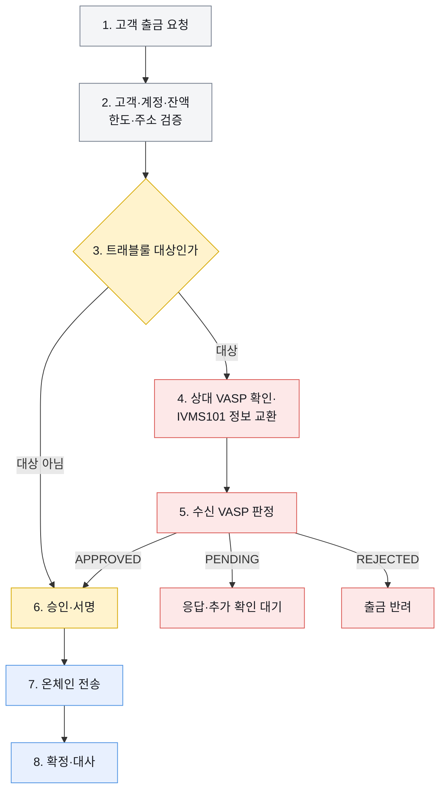

# 트래블룰 업무 구조

트래블룰은 VASP 사이에서 송금인·수취인 정보를 별도 채널로 교환하고, 그 판정 결과를 출금 승인과 입금 가용 처리에 반영하는 업무다.

출금 요청에서 온체인 확정·대사까지의 처리 순서는 다음과 같다.

## 시스템별 책임

| 영역 | 하는 일 | 직접 보관하는 데이터 | 하지 않는 일 |
|---|---|---|---|
| 업무 시스템 | 고객·계정·잔액·출금 의사 확인, 전체 상태 관리 | 고객 식별자, 주문·출금 상태, 내부 원장 | VASP 간 암호화 프로토콜 구현 |
| 트래블룰 게이트 | 대상 판정, 상대 VASP 선택, 어댑터 호출, 판정 정규화 | 요청 식별자, 상대 VASP, 판정·오류·감사 기록 | 키 서명, 온체인 전송 |
| 트래블룰 솔루션 | IVMS101 교환, 상대 연결, 암호화, 콜백 | 제품별 검증 기록과 암호화 데이터 | 고객 잔액 확정, 출금 승인 최종 결정 |
| Fireblocks | Policy, 승인, MPC 서명, 트랜잭션 제출 | Vault·자산·거래·승인·서명 기록 | 고객 KYC 정본, 업무 잔액 정본 |
| 블록체인·Canton | 자산 이전과 원장 확정 | 원장 상태와 트랜잭션 | 오프체인 신원정보 교환 |

## 규제 기준과 시스템 적용

법령과 감독규정은 트래블룰 대상 거래, 송신·수신 VASP의 의무, 교환할 신원정보와 거래 제한 조건을 정한다. 이 문서 묶음은 변동되는 금액 기준과 시행일을 고정값으로 복제하지 않고, 우리 시스템이 규제 정책을 적용하는 경계를 기록한다.

| 규제 기준 | 시스템에 반영하는 위치 |
|---|---|
| 대상 금액·거래 유형 | 트래블룰 게이트의 버전 관리된 대상 판정 정책 |
| 송신 VASP 제공 정보 | IVMS101 매핑과 상대 VASP별 필수 필드 정책 |
| 수신 VASP 확인·거절 조건 | 입금 보류·추가 확인·반환 판정 |
| 해외 VASP·개인지갑 통제 | 상대 도달성·관할 위험·주소 통제 증명 정책 |

각 판정에는 적용한 정책 버전과 판정 시각을 남긴다. 규정이 바뀌어도 과거 거래는 당시 적용한 정책으로 재현할 수 있어야 한다.

## 업무에서 구분할 네 가지 대상

| 대상 | 상대방 | 신원정보 교환 | 운영 통제 |
|---|---|---|---|
| 국내 연동 VASP | 국내 신고 VASP | 연동망을 통한 사전 교환 | 상대·주소·수취인 대조 후 출금 |
| 해외 VASP | 해외 규제 사업자 | 상대가 지원하는 프로토콜로 교환 | 관할권·사업자 위험평가와 도달성 확인 |
| 개인지갑 | 고객 또는 제3자의 비수탁 주소 | VASP 간 IVMS101 교환 상대 없음 | 소유·통제 증명, 고객 관계, 위험도에 따른 정책 적용 |
| 출처 미확인 입금 | 송신자를 바로 식별할 수 없음 | 사전 메시지 또는 거래 보고 탐색 | 가용 처리 보류, 추가 확인, 반환 여부 결정 |

## 트래블룰 문서 구성

| 문서 | 다루는 범위 |
|---|---|
| [출금 처리](./01-withdrawal-flow.md) | 고객 요청부터 상대 검증, 온체인 제출, 결과 보고까지 |
| [IVMS101 필드](./02-ivms101-field-reference.md) | 표준 엔티티, 개인·법인·VASP 필드, 코드와 제약 |
| [표준과 VerifyVASP](./03-ivms101-verifyvasp-mapping.md) | InterVASP 정본과 VerifyVASP 제품 payload의 필드 매핑 |
| [입금 처리](./04-deposit-flow.md) | 사전 보고, 온체인 감지, 가용 보류, 반환 |
| [개인지갑](./05-self-hosted-wallet.md) | 소유·통제 증명과 위험 기반 정책 |
| [솔루션 비교](./06-solutions-and-reachability.md) | VerifyVASP·CODE·Notabene 구조와 도달성 |
| [게이트 운영](./07-gateway-operations.md) | 상태, 멱등성, 재시도, 콜백, 개인정보와 장애 대응 |

## 구현할 때 지키는 경계

- 온체인 트랜잭션과 IVMS101 메시지는 별개의 채널로 이동한다.
- 트래블룰 통과는 잔액·주소·수수료·블록체인 상태 검증을 대신하지 않는다.
- 제품 API의 필드명과 InterVASP 표준 필드명을 같은 스키마로 취급하지 않는다.
- 출금은 트래블룰 판정이 끝나기 전에 서명 가능한 상태로 보내지 않는다.
- 입금은 온체인 확정과 고객 가용 잔액 반영을 분리한다.
- 개인정보 원문을 불필요한 서비스와 로그에 복제하지 않는다.
