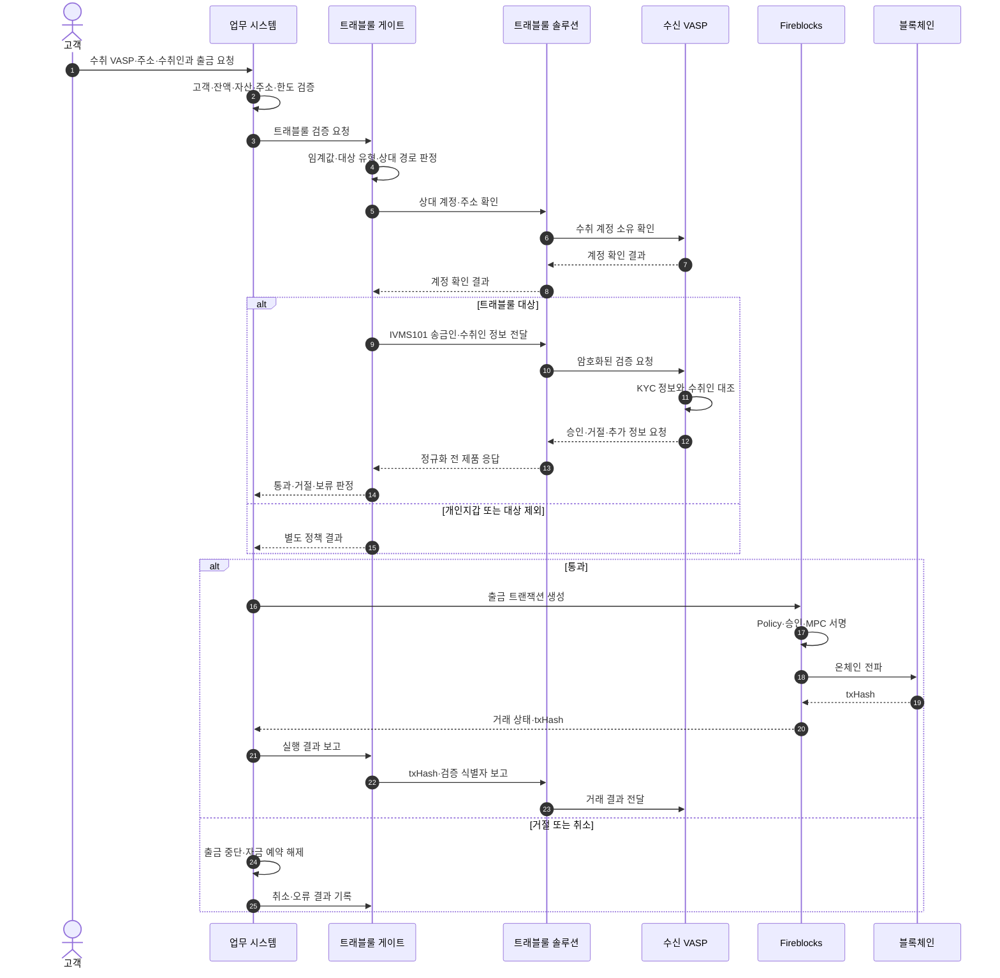
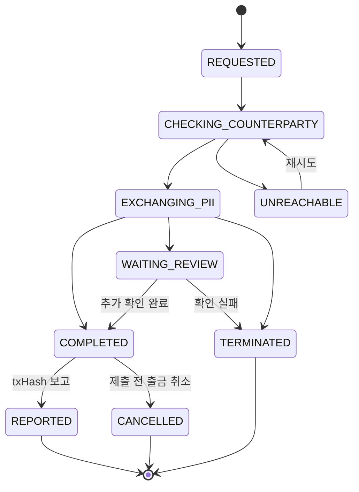

# 트래블룰 출금 처리

VASP로 보내는 출금은 온체인 트랜잭션을 먼저 만들고 나중에 개인정보를 맞추는 흐름이 아니다. 상대 VASP와 수취인을 확인하고 필요한 정보를 교환한 뒤, 업무 시스템이 출금을 허용한 경우에만 승인·서명·전파 단계로 넘긴다.

## 전체 시퀀스



## 1. 고객 요청을 업무 요청으로 고정한다

출금 요청에는 최소한 다음 정보가 필요하다.

| 값 | 생성 주체 | 용도 |
|---|---|---|
| 고객·계정 식별자 | 인증 세션·업무 시스템 | KYC 정본과 잔액 소유자 연결 |
| 자산·네트워크 | 고객 선택과 자산 마스터 | 임계값 환산, 주소 규칙, Fireblocks asset ID 결정 |
| 출금 수량 | 고객 | 원화 환산, 한도, 수수료, 트래블룰 대상 판정 |
| 목적지 주소·memo/tag | 고객 | 계정 확인과 실제 온체인 목적지 |
| 목적지 유형 | 고객 선택과 주소 분석 | VASP·개인지갑·내부 전송 분기 |
| 수신 VASP | 고객 선택 또는 디렉터리 탐색 | 트래블룰 라우팅 |
| 수취인 이름·법인명 | 고객 | 수신 VASP의 KYC 데이터와 대조 |
| 요청 멱등키 | 클라이언트 또는 업무 시스템 | 중복 검증·중복 출금 방지 |

트래블룰을 호출하기 전에 고객 상태, 출금 가능 잔액, 자산 지원 여부, 주소 형식, 네트워크 일치, memo/tag 필수 여부를 먼저 검증한다. 트래블룰 솔루션은 잘못 선택한 체인이나 부족한 잔액을 대신 검증하지 않는다.

## 2. 금액과 상대 유형을 판정한다

한국의 100만원 기준은 출금 요청 시점에 금융정보분석원 고시의 환산 기준을 적용한다. 환산 결과와 사용한 가격·시각·가격 출처를 함께 보존해야 나중에 대상 판정을 재현할 수 있다.

```text
travel_rule_amount = withdrawal_quantity × reference_price
```

판정 결과는 단순한 `true/false`보다 다음처럼 이유를 남기는 편이 낫다.

| 결과 | 의미 | 다음 단계 |
|---|---|---|
| `VASP_REQUIRED` | 정보 교환 대상 VASP 출금 | 상대·수취인 검증 |
| `VASP_BELOW_THRESHOLD` | 국내 기준 미만 VASP 출금 | 내부 정책과 상대 관할 기준 확인 |
| `SELF_HOSTED` | 개인지갑 | 소유·통제 증명 정책 |
| `INTERNAL` | 같은 사업자 내부 이전 | 내부 계정 이전 규칙 |
| `UNKNOWN` | 목적지 유형을 확정하지 못함 | 자동 출금 금지, 추가 확인 |

임계값 미만이라고 해서 모든 상대가 자동 수락하는 것은 아니다. 수신국·수신 VASP가 더 엄격한 기준을 적용하면 정보가 없는 입금이 보류될 수 있다.

## 3. 상대 VASP와 주소를 확인한다

솔루션마다 명칭은 다르지만 다음 질문에 답해야 한다.

1. 선택한 VASP가 현재 연결 가능한가?
2. 해당 VASP가 선택한 네트워크와 자산을 받을 수 있는가?
3. 목적지 주소가 수신 VASP가 관리하는 계정인가?
4. 요청에 사용할 VASP 식별자는 무엇인가?
5. 국내 상호연동 경로와 글로벌 경로 중 어느 어댑터를 사용해야 하는가?

VerifyVASP에서는 송신 VASP의 Enclave가 중앙 서버를 통해 수신 Enclave로 계정·사용자 검증 요청을 중계한다. CODE와 Notabene는 식별자와 API 흐름이 다르므로 게이트 내부의 공통 모델과 제품 어댑터를 분리한다.

## 4. IVMS101 데이터를 구성한다

송금인 정보는 우리 KYC 정본에서 가져오고, 수취인 정보는 고객 입력과 상대 VASP의 추가 요구를 결합한다.

| 영역 | 대표 값 | 정본 |
|---|---|---|
| 송금인 | 개인·법인 이름, 계정 식별자, 조건부 주소·식별번호·생년월일 | 우리 KYC·고객 DB |
| 수취인 | 이름·법인명, 목적지 계정 식별자, 상대 요청 필드 | 고객 입력·상대 요청 |
| 송신 VASP | 법인명과 식별정보 | 사업자 기준정보 |
| 수신 VASP | 상대 VASP 식별정보 | 솔루션 디렉터리·실사 정보 |
| 거래 정보 | 자산, 수량, 네트워크, 목적지 주소 | 출금 요청·자산 마스터 |

IVMS101 정본에서 선택 필드인 값이 제품 API나 상대 관할 규칙에서는 필수일 수 있다. 따라서 `표준 스키마 검증`, `제품 API 검증`, `업무 필수 검증`을 별도 단계로 둔다.

## 5. 처리 상태와 업무 판정을 분리한다

제품별 상태를 업무 시스템이 직접 알게 하지 않는다. 게이트는 검증이 어디까지 진행됐는지를 나타내는 **처리 상태**와, 업무 시스템이 출금 가능 여부를 결정할 때 사용하는 **업무 판정**을 별도로 관리한다.



처리 상태를 업무 판정으로 바꾸는 기준은 게이트 운영 문서의 네 가지 판정과 일치시킨다.

| 처리 상태·조건 | 업무 판정 | 업무 처리 |
|---|---|---|
| 정책상 VASP 간 정보 교환 대상이 아님 | `NOT_REQUIRED` | 잔액·주소·승인 조건 확인 후 진행 가능 |
| `REQUESTED`, `CHECKING_COUNTERPARTY`, `EXCHANGING_PII` | `PENDING` | 자동 제출 금지, 응답 대기 |
| `WAITING_REVIEW` | `PENDING` | 추가 정보 또는 운영자 확인 |
| `UNREACHABLE` | `PENDING` | 제한된 재시도 후 운영 큐로 이동 |
| `COMPLETED` | `APPROVED` | 출금 승인·서명 단계 진입 가능 |
| `TERMINATED` | `REJECTED` | 출금 반려, 고객에게 노출 가능한 사유로 변환 |

검증 유효시간이 끝난 `EXPIRED`는 다섯 번째 업무 판정이 아니다. 기존 검증을 종결하고 새 `attempt`를 `PENDING`으로 시작한다. `REPORTED`와 `CANCELLED`도 상대 판정이 아니라 온체인 결과 보고의 진행 상태다.

## 6. 통과 결과를 서명 직전에 다시 확인한다

트래블룰을 통과한 뒤 실제 트랜잭션이 바뀌면 이전 판정을 재사용할 수 없다. 다음 값으로 검증 결과를 출금 요청에 묶는다.

- 고객·계정 식별자
- 자산·네트워크
- 수량 또는 허용 오차 정책
- 목적지 주소와 memo/tag
- 수신 VASP
- 수취인 정보의 해시 또는 버전
- 트래블룰 검증 식별자와 유효시간

Fireblocks 트랜잭션을 만들기 직전에 이 값이 그대로인지 확인한다. 주소·수량·상대가 바뀌었으면 검증을 폐기하고 처음부터 다시 수행한다.

## 7. 프로토콜이 요구하는 온체인 결과를 보고한다

연동 프로토콜이 결과 보고를 요구하는 경우, 검증 통과만 하고 거래 결과를 보고하지 않으면 수신 VASP가 사전 검증과 실제 입금을 연결하기 어렵다. 성공 시 `txHash`, 네트워크, 실행 시각, 검증 식별자를 보고하고, 프로토콜이 정의한 범위에서 전파 전 취소·실패 결과도 전달한다.

VerifyVASP 공개 흐름은 검증 성공 후 온체인 전송을 실행하고 `Report Transaction Result API`로 txHash를 전달하는 순서를 설명한다. 출금 중단은 `Report Error API`로 전달한다.

## 재시도와 멱등성

| 구간 | 재시도 원칙 |
|---|---|
| 상대 조회 | 짧은 지수 백오프, 디렉터리 장애와 미등록 상대 구분 |
| 계정·수취인 검증 | 같은 멱등키 사용, 새 검증 생성 여부를 제품 규칙에 맞춤 |
| 콜백 처리 | 이벤트 ID·검증 ID로 중복 제거 |
| Fireblocks 생성 | 업무 출금 ID를 외부 참조값으로 사용 |
| txHash 보고 | 같은 검증 ID와 txHash 조합으로 반복 보고 가능하게 설계 |

타임아웃은 거절과 다르다. 상대가 거절한 것인지, 응답을 받지 못한 것인지 상태와 고객 메시지를 분리한다.

## 감사 기록

개인정보 전체를 공용 로그에 남기지 않고도 다음 사실은 재현할 수 있어야 한다.

- 누가 언제 출금을 요청했는가
- 어떤 환산값으로 트래블룰 대상이 되었는가
- 어떤 상대와 어떤 솔루션 경로를 사용했는가
- 어떤 필드 묶음과 스키마 버전을 사용했는가
- 상대 판정과 내부 최종 결정은 무엇이었는가
- 누가 수동 승인·거절했는가
- 어떤 Fireblocks 거래와 txHash로 이어졌는가
- 상대에게 결과 보고가 완료되었는가

PII 원문이 필요한 법정 보관 영역과 일반 운영 로그를 분리하고, 접근권한·암호화·보존기간·삭제 절차를 각각 둔다.
