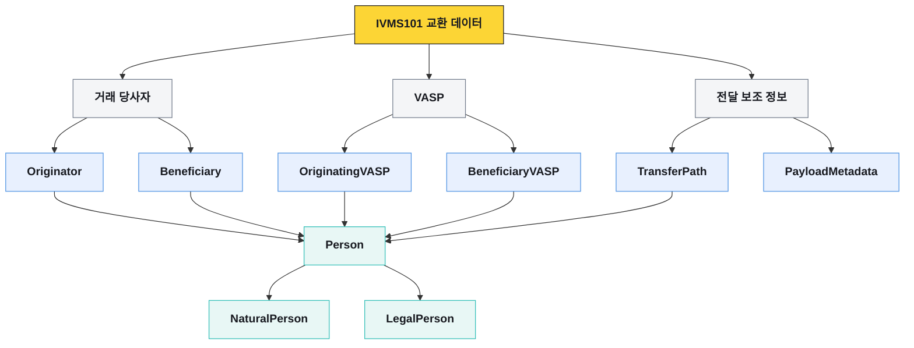

# IVMS101 데이터 모델과 필드

IVMS101은 VASP 사이에서 교환하는 송금인·수취인 정보를 같은 구조로 표현하기 위한 데이터 모델이다. 표준 정본은 InterVASP가 배포한 **IVMS101.2023 Issue 1 FINAL**이며, InterVASP는 2024년 6월 4일 갱신본을 공개했다.

이 페이지의 이름·다중성·타입은 InterVASP 정본을 따른다. VerifyVASP 같은 제품이 사용하는 JSON 필드명과 필수 조건은 다음 페이지에서 별도로 다룬다.

## 객체 구조

InterVASP 정본은 여섯 엔티티를 각각 정의한다. 정본에는 여섯 엔티티를 하나로 감싸는 `IVMS101` 루트 JSON 스키마가 없다. 제품이 `ivms101`이라는 루트 객체를 제공하더라도 그것은 제품의 조립 규칙이다.

## 여섯 데이터 엔티티

| 엔티티 | 필드 | 다중성 | 타입 | 의미 |
|---|---|---:|---|---|
| `Originator` | `originatorPerson` | `[1..n]` | `Person` | 송금인 개인·법인과 계정 식별자 |
| `Beneficiary` | `beneficiaryPerson` | `[1..n]` | `Person` | 수취인 개인·법인과 계정 식별자 |
| `OriginatingVASP` | `originatingVASP` | `[0..1]` | `Person` | 송신 VASP 정보 |
| `BeneficiaryVASP` | `beneficiaryVASP` | `[0..1]` | `Person` | 수신 VASP 정보 |
| `TransferPath` | `transferPath` | `[0..n]` | `IntermediaryVASP` | 중간 VASP의 순서 있는 경로 |
| `PayloadMetadata` | `transliterationMethod` | `[0..n]` | 코드 | 비라틴 문자 변환 방식 |
| `PayloadMetadata` | `payloadVersion` | `[1..1]` | 코드 | IVMS payload 버전 |

엔티티·컴포넌트 이름은 UpperCamelCase, 하위 요소는 lowerCamelCase를 사용한다. 실제 JSON 직렬화 이름은 제품 API 스키마를 우선한다.

## Person

`Person`은 송금인·수취인·VASP·중간 VASP에서 공통으로 재사용된다.

| 필드 | 다중성 | 타입 | 규칙 |
|---|---:|---|---|
| `naturalPerson` | `[0..1]` | `NaturalPerson` | 대상이 개인일 때 사용 |
| `legalPerson` | `[0..1]` | `LegalPerson` | 대상이 법인·단체일 때 사용 |
| `accountNumber` | `[0..n]` | `Max512Text` | 거래 처리 계정 식별자, 대소문자 구분 |

`naturalPerson`과 `legalPerson` 중 하나는 반드시 존재해야 한다. 둘을 동시에 넣는 구조로 사용하지 않는다.

`accountNumber`는 반드시 블록체인 주소만 뜻하지 않는다. 제품과 자산 특성에 따라 지갑 주소, memo/tag를 포함한 계정 표현, 고객을 유일하게 식별하는 내부 값이 될 수 있다. 값의 생성 규칙은 연동 제품 문서로 확정한다.

## NaturalPerson

| 필드 | 다중성 | 타입 | 업무 의미 |
|---|---:|---|---|
| `name` | `[1..1]` | `NaturalPersonName` | 개인 이름 |
| `geographicAddress` | `[0..n]` | `Address` | 개인 주소 |
| `nationalIdentification` | `[0..1]` | `NationalIdentification` | 국가 발급 식별정보 |
| `customerIdentification` | `[0..1]` | `Max50Text` | VASP 내부 고객번호 |
| `dateAndPlaceOfBirth` | `[0..1]` | `DateAndPlaceOfBirth` | 생년월일과 출생지 |
| `countryOfResidence` | `[0..1]` | `CountryCode` | ISO 3166-1 alpha-2 거주국 또는 `XX` |

개인은 `name` 외에 다음 중 하나가 필요하다.

- `HOME`, `BIZZ`, `GEOG` 중 하나인 `geographicAddress`
- `customerIdentification`
- `nationalIdentification`
- `dateAndPlaceOfBirth`

`nationality`는 InterVASP IVMS101.2023의 `NaturalPerson` 필드가 아니다. VerifyVASP 구현에서 제공하는 확장 필드와 구분한다.

## LegalPerson

| 필드 | 다중성 | 타입 | 업무 의미 |
|---|---:|---|---|
| `name` | `[1..1]` | `LegalPersonName` | 법인·단체 이름 |
| `geographicAddress` | `[0..n]` | `Address` | 본점·사업장 주소 |
| `customerIdentification` | `[0..1]` | `Max50Text` | VASP 내부 법인 고객번호 |
| `nationalIdentification` | `[0..1]` | `NationalIdentification` | 법인등록번호·사업자번호·LEI 등 |
| `countryOfRegistration` | `[0..1]` | `CountryCode` | ISO 3166-1 alpha-2 등록국 또는 `XX` |

법인은 `name` 외에 다음 중 하나가 필요하다.

- `GEOG` 타입의 `geographicAddress`
- `customerIdentification`
- `nationalIdentification`

`dateOfIncorporation`은 InterVASP IVMS101.2023의 `LegalPerson` 필드가 아니다. 제품 확장 필드로 들어오는 경우 표준 필드와 분리해서 저장한다.

## 개인 이름

### NaturalPersonName

| 필드 | 다중성 | 타입 | 의미 |
|---|---:|---|---|
| `nameIdentifier` | `[1..n]` | `NaturalPersonNameID` | 라틴 문자 기반 이름 |
| `localNameIdentifier` | `[0..n]` | `LocalNaturalPersonNameID` | 현지 문자 이름 |
| `phoneticNameIdentifier` | `[0..n]` | `LocalNaturalPersonNameID` | 발음 표기 이름 |

### NaturalPersonNameID

| 필드 | 다중성 | 타입 | 의미 |
|---|---:|---|---|
| `primaryIdentifier` | `[1..1]` | `Max100Text` | 성·family name. 분리할 수 없으면 전체 이름 |
| `secondaryIdentifier` | `[0..1]` | `Max100Text` | 이름·forename·middle name |
| `naturalPersonNameIdentifierType` | `[1..1]` | 코드 | 이름의 종류 |

`LocalNaturalPersonNameID`는 `primaryIdentifier`, `secondaryIdentifier`, `nameIdentifierType`을 사용한다. 표준 구조표와 예제 사이에 `naturalPersonNameIdentifierType`·`nameIdentifierType` 표기 차이가 있으므로 직렬화 시 제품 스키마를 확인한다.

| 코드 | 의미 |
|---|---|
| `ALIA` | 별칭 |
| `BIRT` | 출생 이름 |
| `MAID` | 혼인 전 이름 |
| `LEGL` | 법적·공식 이름 |
| `MISC` | 기타 이름 |

## 법인 이름

### LegalPersonName

| 필드 | 다중성 | 타입 | 의미 |
|---|---:|---|---|
| `nameIdentifier` | `[1..n]` | `LegalPersonNameID` | 라틴 문자 기반 법인명 |
| `localNameIdentifier` | `[0..n]` | `LocalLegalPersonNameID` | 현지 문자 법인명 |
| `phoneticNameIdentifier` | `[0..n]` | `LocalLegalPersonNameID` | 발음 표기 법인명 |

### LegalPersonNameID

| 필드 | 다중성 | 타입 | 의미 |
|---|---:|---|---|
| `legalPersonName` | `[1..1]` | `Max100Text` | 법인명 |
| `legalPersonNameIdentifierType` | `[1..1]` | 코드 | 법인명의 종류 |

| 코드 | 의미 |
|---|---|
| `LEGL` | 법적·공식 등록 법인명 |
| `SHRT` | 축약 법인명 |
| `TRAD` | 상업적으로 사용하는 명칭 |

## Address

`Address`는 개인과 법인이 함께 사용한다.

| 필드 | 다중성 | 타입 | 의미 |
|---|---:|---|---|
| `addressType` | `[1..1]` | 코드 | `HOME`, `BIZZ`, `GEOG` |
| `department` | `[0..1]` | `Max50Text` | 부서 |
| `subDepartment` | `[0..1]` | `Max70Text` | 하위 부서 |
| `streetName` | `[0..1]` | `Max70Text` | 도로명 |
| `buildingNumber` | `[0..1]` | `Max16Text` | 건물 번호 |
| `buildingName` | `[0..1]` | `Max35Text` | 건물명 |
| `floor` | `[0..1]` | `Max70Text` | 층 |
| `postBox` | `[0..1]` | `Max16Text` | 사서함 |
| `room` | `[0..1]` | `Max70Text` | 호실 |
| `postcode` | `[0..1]` | `Max16Text` | 우편번호 |
| `townName` | 정본 내 표기 차이 | `Max35Text` | 도시·마을 이름 |
| `townLocationName` | `[0..1]` | `Max35Text` | 도시 안의 위치 |
| `districtName` | `[0..1]` | `Max35Text` | 구·군 |
| `countrySubDivision` | `[0..1]` | `Max35Text` | 주·도 |
| `addressLine` | `[0..7]` | `Max70Text` | 자유 형식 주소 줄 |
| `country` | `[1..1]` | `CountryCode` | ISO 3166-1 alpha-2 또는 `XX` |

주소에는 다음 조합 중 하나가 들어가야 한다.

- `addressLine` 한 개 이상
- `streetName`과 `buildingName`
- `streetName`과 `buildingNumber`

InterVASP PDF 안에서 `postcode`·`postCode`와 `townName` 다중성 표기가 일치하지 않는 부분이 있다. 임의로 정규화하지 않고, 실제 제품 스키마와 상대 요구를 확인한다.

| `addressType` | 의미 |
|---|---|
| `HOME` | 집 주소 |
| `BIZZ` | 직장 주소 |
| `GEOG` | 일반 지리적 주소 |

## DateAndPlaceOfBirth

| 필드 | 다중성 | 타입 | 의미 |
|---|---:|---|---|
| `dateOfBirth` | `[1..1]` | `Date` | `YYYY-MM-DD` 출생일 |
| `placeOfBirth` | `[1..1]` | `Max70Text` | 도시·주·국가 등 출생지 |

일부 제품 문서에 `dataAndPlaceOfBirth`라는 오기가 있으므로 실제 API에는 스키마가 요구하는 `dateAndPlaceOfBirth`를 사용한다.

## NationalIdentification

| 필드 | 다중성 | 타입 | 의미 |
|---|---:|---|---|
| `nationalIdentifier` | `[1..1]` | `Max35Text` | 개인·법인 식별번호 |
| `nationalIdentifierType` | `[1..1]` | 코드 | 식별번호 종류 |
| `countryOfIssue` | `[0..1]` | `CountryCode` | 개인 식별번호 발급국 |
| `registrationAuthority` | `[0..1]` | `RegistrationAuthority` | 법인 식별번호 등록기관 |

| 코드 | 대상 | 의미 |
|---|---|---|
| `ARNU` | 개인 | 외국인 식별번호 |
| `CCPT` | 개인 | 여권번호 |
| `RAID` | 법인 | 등록기관이 부여한 법인·사업자번호 |
| `DRLC` | 개인 | 운전면허번호 |
| `FIIN` | 개인 | 외국인 투자자번호 |
| `TXID` | 개인·법인 | 과세당국 번호 |
| `SOCS` | 개인 | 사회보장번호·주민등록번호 |
| `IDCD` | 개인 | 국가 발급 신분증 번호 |
| `LEIX` | 법인 | ISO 17442 LEI |
| `MISC` | 개인·법인 | 기타 식별번호 |

법인 식별번호에는 다음 규칙이 적용된다.

- `nationalIdentifierType`은 `RAID`, `LEIX`, `TXID`, `MISC` 중 하나다.
- `LEIX`가 아니면 `registrationAuthority`가 필요하다.
- `LEIX`이면 `registrationAuthority`를 넣지 않는다.
- 법인은 `countryOfIssue`를 넣지 않는다.
- `LEIX`이면 `nationalIdentifier`는 20자리 LEI 형식을 충족해야 한다.

## 송신·수신 VASP

| 모델 | 필드 | 다중성 | 타입 |
|---|---|---:|---|
| `OriginatingVASP` | `originatingVASP` | `[0..1]` | `Person` |
| `BeneficiaryVASP` | `beneficiaryVASP` | `[0..1]` | `Person` |

VASP는 일반적으로 `LegalPerson`으로 표현하고 법인명과 국가·등록 식별정보를 사용한다. VerifyVASP에서는 중앙 서버가 송신·수신 VASP 정보를 자동으로 채우는 흐름이 있으므로 VASP 요청 payload에서 생략될 수 있다. 이는 표준에서 필드가 사라진 것이 아니라 제품이 디렉터리 정보로 보강하는 것이다.

## TransferPath

| 필드 | 다중성 | 타입 | 의미 |
|---|---:|---|---|
| `transferPath` | `[0..n]` | `IntermediaryVASP` | 중간 VASP의 순서 있는 배열 |
| `IntermediaryVASP.intermediaryVASP` | `[1..1]` | `Person` | 중간 VASP 정보 |
| `IntermediaryVASP.sequence` | `[1..1]` | `Number` | 0부터 시작하는 전달 경로 순서 |

`sequence`는 0부터 시작해 중복과 누락 없이 이어져야 한다. VerifyVASP 공개 포맷은 `TransferPath`를 현재 지원하지 않는다고 설명하므로 제품 간 중간 경로가 필요한 경우 지원 여부를 별도로 확인한다.

## PayloadMetadata

| 필드 | 다중성 | 타입 | 의미 |
|---|---:|---|---|
| `transliterationMethod` | `[0..n]` | 코드 | 현지 문자를 라틴 문자로 변환한 방식 |
| `payloadVersion` | `[1..1]` | 코드 | payload가 따르는 IVMS 버전 |

`payloadVersion`의 정본 타입은 `PayloadVersionCode`다. InterVASP 본문과 예제의 값 표기가 완전히 일치하지 않는 부분이 있으므로 수신 제품이 요구하는 값을 계약 테스트로 고정한다.

## 정본 제약 C1~C12

| 제약 | 적용 내용 |
|---|---|
| `C1` | 개인은 이름 외에 주소·고객번호·국가식별정보·생년월일/출생지 중 하나를 제공 |
| `C2` | `dateAndPlaceOfBirth`를 쓰면 출생일과 출생지를 모두 제공 |
| `C3` | 주소·발급국·거주국·등록국의 국가 코드는 ISO 3166-1 alpha-2 또는 `XX` |
| `C4` | 법인은 이름 외에 `GEOG` 주소·고객번호·국가식별정보 중 하나를 제공 |
| `C5` | 법인 이름에는 최소 하나의 `nameIdentifier` 필요 |
| `C6` | 개인 이름에는 최소 하나의 `nameIdentifier` 필요 |
| `C7` | 법인 식별번호 유형은 `RAID`, `LEIX`, `TXID`, `MISC`로 제한 |
| `C8` | 주소는 자유 형식 줄 또는 도로명과 건물명/번호 조합 필요 |
| `C9` | 식별번호 유형에 따라 발급국·등록기관 사용 규칙 적용 |
| `C10` | `LEIX`가 아니면 법인 등록기관 정보 필요 |
| `C11` | `LEIX`이면 20자리 LEI 형식을 사용하고 등록기관 필드를 넣지 않음 |
| `C12` | `TransferPath.sequence`는 0부터 시작하는 연속된 고유 순서 |

## 공통 문자·형식 규칙

- 별도 언급이 없으면 문자열 비교는 대소문자를 구분하지 않지만 `accountNumber`는 구분한다.
- 기본 이름은 라틴 문자로 표현하고 현지어·발음 표기는 별도 배열에 둔다.
- 국가 코드는 ISO 3166-1 alpha-2를 사용하며 알 수 없거나 해당하지 않으면 허용 범위에서 `XX`를 사용한다.
- 날짜는 `YYYY-MM-DD`를 사용한다.
- 빈 문자열을 선택 필드의 값으로 보내지 않는다. 값이 없으면 필드를 생략한다.
- 제품이 표준보다 짧은 최대 길이를 요구하면 제품 제한을 따른다.

## 표준 필수와 실제 전송 필수

표준의 `[0..1]`은 항상 보내지 않아도 된다는 뜻이지, 실제 거래에서 요구되지 않는다는 뜻은 아니다.

