# IVMS101과 VerifyVASP 필드 매핑

InterVASP 정본과 VerifyVASP API는 같은 개인정보 의미를 사용하지만 객체 이름, 계층, 필수 조건이 완전히 같지는 않다. 표준 모델을 그대로 직렬화해 VerifyVASP에 보내거나, VerifyVASP payload를 IVMS101 정본이라고 부르면 구현과 감사 양쪽에서 오류가 생긴다.

```mermaid
flowchart LR
    KYC[KYC·고객 데이터] --> STD[내부 IVMS101 표준 모델]
    STD --> RULE[관할·상대 요구 필드 적용]
    RULE --> MAP[VerifyVASP 매퍼]
    MAP --> API[User Verification Payload]
    API --> VV[VerifyVASP Enclave]

    classDef source fill:#f4f5f7,stroke:#707a8a,color:#181a20
    classDef control fill:#fff3cd,stroke:#d6a800,color:#181a20
    classDef external fill:#e8f0fe,stroke:#4a90e2,color:#181a20
    class KYC,STD source
    class RULE,MAP control
    class API,VV external
```



## 모델 계층의 주요 차이

| 의미 | InterVASP IVMS101.2023 | VerifyVASP User Verification | 처리 |
|---|---|---|---|
| 송금인 배열 | `Originator.originatorPerson[]` | `originator.originatorPersons[]` | 복수형으로 변환 |
| 수취인 배열 | `Beneficiary.beneficiaryPerson[]` | `beneficiary.beneficiaryPersons[]` | 복수형으로 변환 |
| 계정 식별자 | 각 `Person.accountNumber[]` | `originator.accountNumber[]`, `beneficiary.accountNumber[]` | Person 밖으로 이동 |
| 송신 VASP | `OriginatingVASP.originatingVASP` | 요청에서 생략 가능 | Central Server 디렉터리로 보강 |
| 수신 VASP | `BeneficiaryVASP.beneficiaryVASP` | 요청에서 생략 가능 | `beneficiaryVaspId`로 라우팅 |
| 중간 VASP | `TransferPath.transferPath[]` | 공개 포맷에서 미지원 | 지원 여부를 별도 확인 |
| payload 버전 | `PayloadMetadata.payloadVersion` | `payload.version` | 동등한 필드로 단정하지 않음 |
| 개인 국적 | 표준 필드 없음 | `naturalPerson.nationality` | 제품 확장 필드 |
| 법인 설립일 | 표준 필드 없음 | `legalPerson.dateOfIncorporation` | 제품 확장 필드 |

표준에서는 여러 Person마다 계정 식별자를 둘 수 있지만 VerifyVASP는 송금인·수취인 객체마다 배열 하나를 둔다. Person이 여러 명일 때 어느 계정이 어느 Person에 대응하는지 공개 포맷만으로는 표현하기 어렵다. 공동 소유·복수 대표자 같은 사례는 계약 테스트와 운영 규칙을 별도로 둔다.

## Person과 이름 매핑

| 표준 경로 | VerifyVASP 경로 | 차이 |
|---|---|---|
| `Person.naturalPerson` | `<person>.naturalPerson` | 계층 동일 |
| `Person.legalPerson` | `<person>.legalPerson` | 계층 동일 |
| `NaturalPerson.name` | `<natural>.name` | 동일 |
| `NaturalPerson.geographicAddress[]` | `<natural>.geographicAddress[]` | 동일 |
| `NaturalPerson.nationalIdentification` | `<natural>.nationalIdentification` | 동일 |
| `NaturalPerson.customerIdentification` | `<natural>.customerIdentification` | 동일 |
| `NaturalPerson.dateAndPlaceOfBirth` | `<natural>.dateAndPlaceOfBirth` | 영문 API 기준 동일 |
| `NaturalPerson.countryOfResidence` | `<natural>.countryOfResidence` | 동일 |
| 표준에 없음 | `<natural>.nationality` | VerifyVASP 확장 |
| `LegalPerson.name` | `<legal>.name` | 동일 |
| `LegalPerson.geographicAddress[]` | `<legal>.geographicAddress[]` | 동일 |
| `LegalPerson.customerIdentification` | `<legal>.customerIdentification` | 동일 |
| `LegalPerson.nationalIdentification` | `<legal>.nationalIdentification` | 동일 |
| `LegalPerson.countryOfRegistration` | `<legal>.countryOfRegistration` | 동일 |
| 표준에 없음 | `<legal>.dateOfIncorporation` | VerifyVASP 확장 |

개인 이름의 기본 배열은 같지만 이름 유형 필드가 다르다.

| 표준 | VerifyVASP | 처리 |
|---|---|---|
| `NaturalPersonNameID.naturalPersonNameIdentifierType` | `nameIdentifier[].nameIdentifierType` | 제품 이름으로 변환 |
| `LocalNaturalPersonNameID.nameIdentifierType` | `localNameIdentifier[].nameIdentifierType` | 동일 |
| `LegalPersonNameID.legalPersonNameIdentifierType` | `nameIdentifier[].legalPersonNameIdentifierType` | 동일 |

한국어 포맷 예시의 `dataAndPlaceOfBirth`는 타입명·영문 API와 맞지 않는다. 실제 구현에는 `dateAndPlaceOfBirth`를 사용하고 OpenAPI 계약 테스트로 고정한다.

## 주소와 식별번호 매핑

Address 하위 필드는 대체로 같은 이름을 사용한다.

| 표준 필드 | VerifyVASP 필드 | 확인 사항 |
|---|---|---|
| `addressType` | `geographicAddress[].addressType` | 제품이 허용하는 코드 확인 |
| `streetName` | `geographicAddress[].streetName` | 동일 |
| `buildingNumber` | `geographicAddress[].buildingNumber` | 동일 |
| `buildingName` | `geographicAddress[].buildingName` | 동일 |
| `postcode` 또는 정본 일부의 `postCode` | `geographicAddress[].postcode` | 제품은 `postcode` 사용 |
| `townName` | `geographicAddress[].townName` | 제품 문서에서는 선택 필드로 설명 |
| `addressLine[]` | `geographicAddress[].addressLine[]` | 동일 |
| `country` | `geographicAddress[].country` | ISO 3166-1 alpha-2 |

NationalIdentification도 이름은 같지만 제품 예시를 검증 없이 복사하지 않는다.

| 표준·제품 공통 필드 | 처리 |
|---|---|
| `nationalIdentifier` | 개인·법인 식별번호 원문. 최소 권한 저장소에서 조회 |
| `nationalIdentifierType` | `ARNU`, `CCPT`, `RAID`, `TXID`, `SOCS`, `IDCD`, `LEIX` 등 |
| `countryOfIssue` | 개인 식별번호 발급국 |
| `registrationAuthority` | 법인 등록기관. LEI 여부에 따른 제약 적용 |

VerifyVASP 한국어 예시에 보이는 `registrationAuthority: "RA0000099"`는 InterVASP 정규식의 `RA`와 숫자 6자리 형식과 맞지 않는다. 테스트 데이터로 재사용하지 않는다.

## 송신 VASP의 검증 요청

검증 요청은 자산·거래 정보와 IVMS101 개인정보를 함께 보낸다.

| 필드 | 필수 | 값의 출처 |
|---|---|---|
| `keyType` | 필수 | 공개키 운용 정책. `PerVasp`, `PerAddress`, `PerVerification` |
| `beneficiaryVaspId` | 필수 | VerifyVASP 목록과 내부 VASP 마스터의 매핑 |
| `assetInfo.symbol` | 필수 | 출금 자산 |
| `assetInfo.network` | 조건부 | 실제 출금 네트워크 |
| `assetInfo.amount` | 필수 | 출금 수량 |
| `assetInfo.isExceedingThreshold` | 필수 | 규제 기준 환산 결과 |
| `assetInfo.tradePrice` | 필수 | 법정화폐 환산 금액 |
| `assetInfo.tradeCurrency` | 필수 | `KRW` 등 환산 통화 |
| `assetInfo.tradeISODatetime` | 필수 | 시세 적용 시각 |
| `requiredBeneficiaryInfo` | 조건부 | 상대에게 반환받을 개인정보 코드 |
| `payload.version` | 필수 | VerifyVASP envelope 버전 |
| `payload.ivms101.originator` | 필수 | 우리 송금 고객 KYC와 계정 식별자 |
| `payload.ivms101.beneficiary` | 필수 | 수취인 입력값과 목적지 주소 |

### 자연인 출금 예시

```json
{
  "keyType": "PerVasp",
  "beneficiaryVaspId": "beneficiary-vasp-id",
  "assetInfo": {
    "symbol": "BTC",
    "network": "Bitcoin",
    "amount": "0.025",
    "isExceedingThreshold": true,
    "tradePrice": "2500000",
    "tradeCurrency": "KRW",
    "tradeISODatetime": "2026-08-18T09:30:00Z"
  },
  "requiredBeneficiaryInfo": "ACCOUNT_NUMBER,NATURAL_PERSON_NAME",
  "payload": {
    "version": "1.0",
    "ivms101": {
      "originator": {
        "originatorPersons": [
          {
            "naturalPerson": {
              "name": {
                "nameIdentifier": [
                  {
                    "primaryIdentifier": "KIM",
                    "secondaryIdentifier": "MINSU",
                    "nameIdentifierType": "LEGL"
                  }
                ]
              },
              "customerIdentification": "customer-1234",
              "countryOfResidence": "KR"
            }
          }
        ],
        "accountNumber": ["originator-account-id"]
      },
      "beneficiary": {
        "beneficiaryPersons": [
          {
            "naturalPerson": {
              "name": {
                "nameIdentifier": [
                  {
                    "primaryIdentifier": "LEE",
                    "secondaryIdentifier": "JISU",
                    "nameIdentifierType": "LEGL"
                  }
                ]
              }
            }
          }
        ],
        "accountNumber": ["bc1q-destination-address"]
      }
    }
  }
}
```

예시의 이름·계정·금액은 형식을 설명하기 위한 값이다. 실제 요청에서는 상대 관할과 `requiredBeneficiaryInfo`에 따라 주소·생년월일·식별번호 등이 추가될 수 있다.

동기 성공 응답은 최종 승인 결과가 아니다. 요청 접수 시 `verificationUuid`를 받고, 최종 `VERIFIED`, `DENIED`, `ERROR`는 Callback 또는 결과 조회로 확인한다.

## 수신 VASP가 받는 값

| 필드 | 처리 |
|---|---|
| `verificationUuid` | 사전 검증·콜백·txHash 보고를 연결하는 키 |
| `assetInfo.*` | 자산·네트워크·수량·환산값 검증 |
| `requiredBeneficiaryInfo` | 반환할 수취인 필드의 최소 범위 |
| `originatingVaspId` | 송신 VASP 실사·정책 조회 |
| `ivms101.originator` | 송금인 AML·제재·위험 검토 |
| `ivms101.beneficiary.beneficiaryPersons[]` | 우리 고객 정보와 이름 대조 |
| `ivms101.beneficiary.accountNumber[]` | 우리 소유 주소·계정인지 확인 |

수신 VASP는 받은 주소를 다른 주소로 고쳐서 승인하지 않는다. 주소·이름·KYC 상태가 맞지 않으면 명시적으로 거절한다.

## 수신 VASP의 검증 응답

| 필드 | 필수 | 값 |
|---|---|---|
| `result` | 필수 | `VERIFIED`, `DENIED`, `ERROR` |
| `reason` | 필수 | 성공은 `OK`, 거절은 제품 reason 코드 |
| `message` | 조건부 | 누락 필드·제공 불가 필드·구체적 오류 |
| `version` | 조건부 | VerifyVASP envelope 버전 |
| `ivms101.beneficiary` | 필수 | 검증한 수취인 정보와 계정 식별자 |

| `DENIED` reason | 의미 |
|---|---|
| `UNKNOWN-SYMBOL` | 지원하지 않는 자산 |
| `UNKNOWN-NETWORK` | 지원하지 않거나 확인 불가능한 네트워크 |
| `UNKNOWN-ADDRESS` | 우리 VASP의 주소가 아님 |
| `LACK-OF-INFORMATION` | 송금인 검증 정보 부족 |
| `UNAVAILABLE-INFORMATION` | 요청받은 수취인 정보를 제공할 수 없음 |
| `BLACKLISTED` | 제재·차단 정책에 해당 |
| `UNVERIFIED-KYC` | 수취 고객 KYC 미완료 |
| `MISMATCHED-NAME` | 수취인 이름 불일치 |
| `NOT-ALLOWED` | 내부 정책상 거절 |
| `UNDEFINED-ERROR` | 별도 코드가 없는 오류 |

`requiredBeneficiaryInfo`에 없는 개인정보를 편의상 추가 반환하지 않는다. 필요한 값이 없으면 승인 대신 `UNAVAILABLE-INFORMATION`으로 처리한다.

## 온체인 실행 결과 보고

검증 승인 뒤 실제 전송이 발생하면 검증 건과 txHash를 연결한다.

| 필드 | 필수 | 값 |
|---|---|---|
| `verificationUuid` | 필수 | 출금 전에 생성된 검증 UUID |
| `txHash` | 필수 | 실제 블록체인 transaction hash 또는 ID |
| `vout` | 선택 | UTXO 출력 인덱스 |

수신 VASP는 `TX_REPORT` 콜백의 `verificationUuid`, `txHash`, `vout`을 감지한 입금과 대조한다. 검증은 있었지만 보고가 누락되면 verification UUID를 이용한 상태 조회 경로를 사용한다.

## 구현 구조

표준과 제품 모델을 한 DTO로 합치지 않는다.

```text
KycPerson
  → IvmsPerson               표준 의미·제약 C1~C12
  → JurisdictionProfile      관할별 필수 개인정보
  → CounterpartyRequirement  상대 요청 필드
  → VerifyVaspPayload        제품 JSON 이름·필수 조건
```

각 변환 단계는 다음을 기록한다.

- 입력 스키마와 출력 스키마 버전
- 추가·삭제·이동한 필드
- 필드 값의 원천 시스템
- 적용한 관할 프로필과 상대 요구
- 검증 실패 경로와 오류 코드
- 개인정보 원문을 남기지 않는 요청 해시

IVMS101 적합성 테스트는 표준 모델에서, VerifyVASP 계약 테스트는 제품 payload에서 각각 수행한다.
