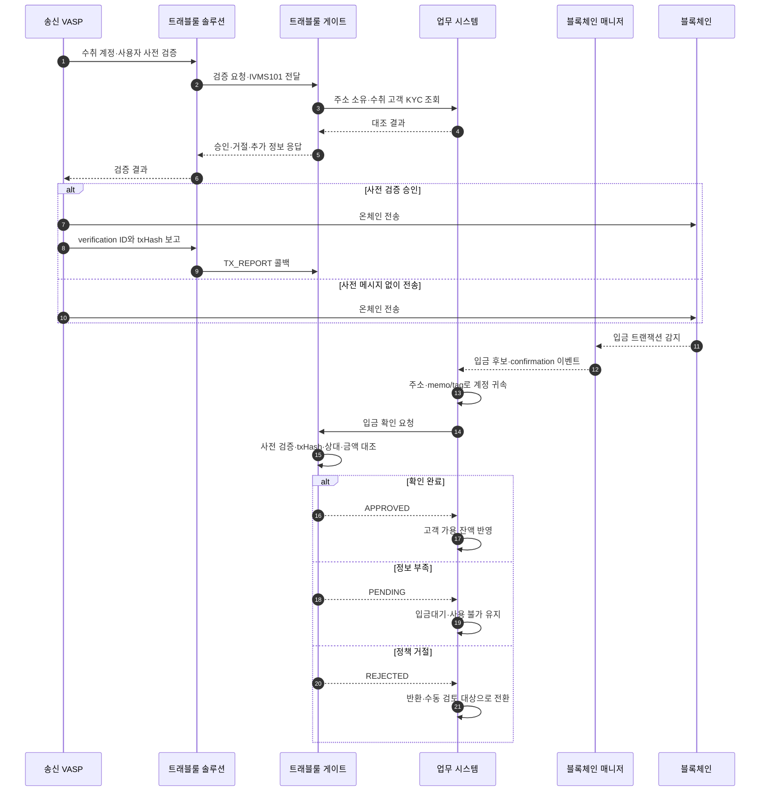
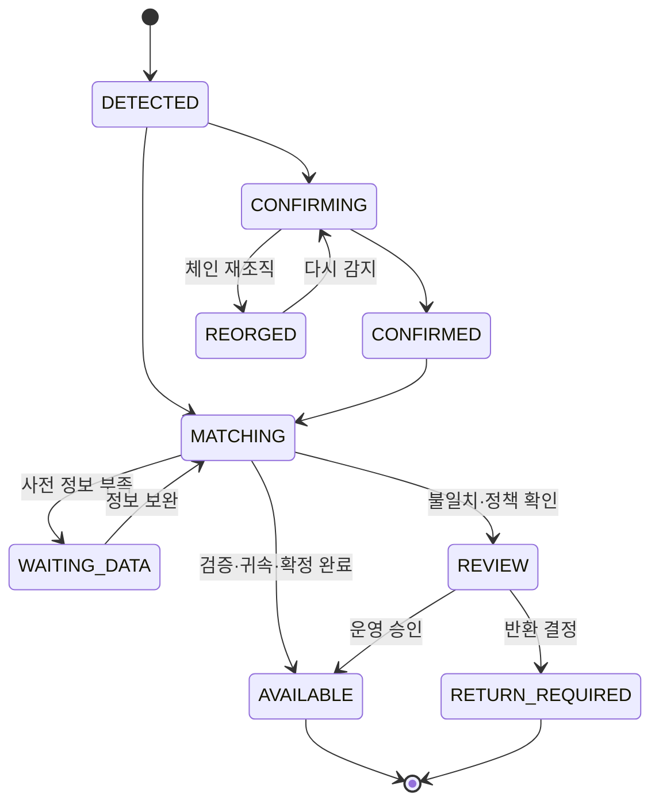

# 트래블룰 입금 처리

입금은 블록체인에 기록되는 것을 막을 수 없다. 따라서 온체인 입금 확정과 고객 잔액 가용 처리를 분리하고, 송신 VASP·송금인·사전 검증 정보를 확인한 뒤에만 사용할 수 있는 잔액으로 전환한다.

```text
온체인 확정 = 블록체인에서 필요한 confirmation을 얻음
입금 귀속   = 목적지 주소·memo/tag로 고객 계정을 찾음
입금 가용   = 온체인 확정 AND 귀속 완료 AND 컴플라이언스 통과
```

## 전체 시퀀스



## 입금 후보가 처음 들어왔을 때

블록체인 매니저는 규제 판정을 하지 않고 다음 원장 사실을 전달한다.

| 값 | 용도 |
|---|---|
| 네트워크·자산 | 지원 자산과 confirmation 정책 결정 |
| txHash | 사전 검증 보고와 연결 |
| vout 또는 log index | 한 트랜잭션 안의 실제 입금 출력 구분 |
| from·to 주소 | 송신 경로 탐색과 고객 주소 귀속 |
| memo·tag | 공유 주소형 자산의 고객 귀속 |
| 수량 | 사전 검증 예정 금액과 대조 |
| block number·time | 확정·재조직·감사 처리 |

주소 귀속은 업무 시스템의 책임이다. 트래블룰 게이트가 `to` 주소를 보고 고객 계정을 임의로 결정하지 않는다.

## 사전 검증 기록과 실제 입금 연결

안전한 연결은 한 필드만 비교하지 않는다.

| 대조값 | 역할 |
|---|---|
| `verificationUuid` 또는 제품 transfer ID | 사전 검증 건의 기본 키 |
| `txHash`와 `vout` | 실제 온체인 거래 연결 |
| 수신 VASP | 우리 VASP를 대상으로 한 요청인지 확인 |
| 목적지 주소·memo/tag | 검증 주소와 실제 도착 주소 대조 |
| 자산·네트워크 | 동일 심벌의 다른 체인 혼동 방지 |
| 수량 | 예상 금액과 실제 금액의 정책 허용범위 확인 |
| 수취 고객 | 사전 검증한 고객과 실제 귀속 고객 대조 |

txHash 보고가 도착하기 전에 온체인 입금을 먼저 감지할 수 있다. 두 이벤트의 순서를 가정하지 않고 양쪽 모두 저장한 뒤 나중에 합류시킨다.



## 입금 경로별 판정

| 경로 | 확인 근거 | 기본 처리 |
|---|---|---|
| 사전 검증·txHash 보고 모두 있음 | 검증 ID와 온체인 거래 완전 대조 | 통과 시 가용 |
| 사전 검증은 있으나 txHash 보고 누락 | 검증 ID로 송신 측 상태 조회 | 조회 완료까지 보류 |
| txHash 보고가 먼저 도착 | 보고를 저장하고 온체인 감지 대기 | 두 이벤트 합류 후 판정 |
| 개인지갑에서 입금 | 등록 주소 또는 소유 증명 | 정책 통과까지 보류 |
| 사전 메시지 없는 VASP 입금 | TXID·주소 기반 상대 탐색, 고객 소명 | 정보 확보 전 보류 |
| 알 수 없는 출처 | 자동 승인 근거 없음 | 수동 검토·반환 후보 |

CODE는 사전 교환이 완료되지 않은 입금에 대해 TXID로 송신 VASP를 찾고 사후 정보 교환을 수행하는 Post-verification 흐름을 공식 문서에 설명한다. VerifyVASP의 공개 `Check Transaction Status`는 verification UUID 기반이므로 사전 검증 기록 자체가 없는 입금을 같은 방식으로 찾을 수 있다고 가정하지 않는다.

Notabene의 Deposit Assist는 온체인 입금 뒤 누락된 출처 유형, 송금인 정보, 개인지갑 소유 증명을 수집할 수 있다. 제품이 보완 UI를 제공하더라도 최종 가용 판정과 고객 잔액 전이는 우리 업무 시스템이 수행한다.

## 수신 검증 요청 처리

VerifyVASP 수신 API를 예로 들면 게이트는 다음 순서로 처리한다.

1. `verificationUuid` 중복 여부와 요청 서명을 확인한다.
2. 자산·네트워크를 지원하는지 확인한다.
3. 수취 주소가 우리 VASP 소유인지 업무 시스템에 조회한다.
4. 주소에 귀속된 고객의 KYC 상태를 확인한다.
5. 전달받은 수취인 이름과 고객 정본을 대조한다.
6. 송금인·송신 VASP에 제재·위험 정책을 적용한다.
7. 요청받은 수취인 정보 중 제공 가능한 최소 필드만 반환한다.
8. 검증 결과와 원인을 저장하고 응답한다.

이름 비교는 대소문자·공백·순서·로마자 표기 규칙을 명시적으로 버전 관리한다. 단순 문자열 완전 일치만 적용하면 정상 고객의 표기 차이를 과도하게 거절할 수 있고, 지나친 정규화는 다른 사람을 같은 사람으로 오인할 수 있다.

## `PENDING`을 끝내는 방법

입금대기는 무기한 상태가 아니다.

| 해소 경로 | 필요한 기록 |
|---|---|
| 송신 VASP의 txHash 보고 도착 | 검증 ID와 거래 대조 결과 |
| TXID 기반 송신 VASP 탐색 성공 | 상대 VASP와 사후 교환 결과 |
| 고객의 개인지갑 소유 증명 | 주소·증명 방식·검증 결과·유효기간 |
| 고객 소명과 증빙 승인 | 제출 자료, 검토자, 승인 사유 |
| 반환 결정 | 반환 대상·주소·승인자·법적 근거 |

타임아웃이 지났다는 이유만으로 자동 가용 처리하지 않는다. 시간이 지나면 `REVIEW` 또는 `RETURN_REQUIRED`로 옮겨 운영자가 다음 행동을 결정한다.

## 반환은 새로운 출금이다

입금 반환은 원래 거래를 취소하는 기능이 아니다. 이미 확정된 자산을 다시 보내는 별도 온체인 트랜잭션이다.

- 원 송신 주소가 실제 반환 가능한 주소인지 확인한다.
- 거래소 핫월렛·중간 주소·스마트 컨트랙트 주소로 단순 반환하지 않는다.
- 반환 수취인이 VASP인지 개인지갑인지 다시 분류한다.
- 필요하면 새로운 트래블룰 검증을 수행한다.
- 수수료 부담과 반환 수량을 명확히 결정한다.
- 일반 고객 출금과 다른 승인 정책과 감사 사유를 사용한다.
- 원 입금 ID와 반환 출금 ID를 양방향으로 연결한다.

운영자 화면의 `반환` 버튼이 곧바로 Fireblocks 거래를 생성하지 않도록 검토·승인·서명 단계를 분리한다.

## 대사와 감사

입금 한 건에 다음 식별자를 연결할 수 있어야 한다.

```text
blockchain txHash / vout
  ↔ blockchain-manager deposit ID
  ↔ business deposit ID
  ↔ customer account ID
  ↔ travel-rule verification / transfer ID
  ↔ counterparty VASP ID
  ↔ return withdrawal ID when applicable
```

감사 기록에는 판정에 사용한 규칙 버전, 상대 VASP, 개인정보 필드 목록, 자동·수동 결정, 확인 시각, 운영자, 반환 여부를 남긴다. 공용 로그에는 개인정보 원문 대신 검증 ID와 필드 존재 여부·해시를 남긴다.
