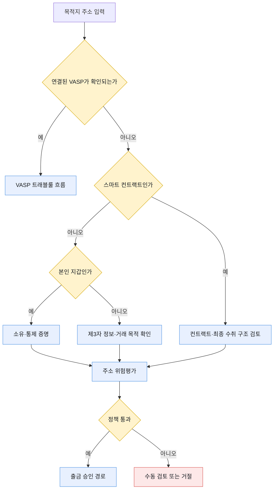

# 개인지갑 거래

개인지갑은 거래 상대편에 신원정보를 받아줄 VASP가 없다. 따라서 VASP 간 IVMS101 메시지를 보내는 대신, 주소를 누가 통제하는지와 고객이 주장한 송·수취 관계가 무엇인지 확인한다.

개인지갑이라는 이유만으로 위험이 낮거나 트래블룰 체계 밖이라고 단정하지 않는다. FATF 지침은 VASP와 비의무주체 사이의 가상자산 이전에도 위험 기반 조치를 요구하며, 구체적인 소유 증명과 거래 제한은 관할 규정과 VASP 정책에 따라 달라진다.

## 거래 상대 관계

| 관계 | 예 | 확인할 내용 |
|---|---|---|
| 고객 본인 지갑 | 고객의 MetaMask·하드웨어 지갑 | 고객과 주소의 통제 관계 |
| 제3자 개인지갑 | 가족·거래상대방의 지갑 | 수취인 신원과 거래 목적, 필요 시 수취인의 주소 통제 |
| VASP로 의심되는 미식별 주소 | 거래소 핫월렛이나 서비스 주소 | 실제 소유 VASP 탐색, 개인지갑으로 오분류 방지 |
| 스마트 컨트랙트 | 브리지·DeFi·결제 컨트랙트 | 계약 기능, 최종 수취 구조, 지원 정책 |
| 제재·위험 주소 | 블랙리스트·믹서·탈취 연관 | 출금 차단 또는 강화 검토 |



## 소유·통제 증명 방식

[Notabene의 개인지갑 출금 문서](https://devx.notabene.id/docs/create-outgoing-transfers.md)는 암호학적 서명, 소액 전송, 화면 캡처와 자기선언을 소유 관계 증명 방식으로 정의한다. 네 방식의 증명 강도는 같지 않다.

| 방식 | 확인되는 사실 | 강점 | 한계 |
|---|---|---|---|
| 암호학적 서명 | 해당 주소의 개인키로 메시지를 서명할 수 있음 | 온체인 자금 이동 없이 강한 통제 증명 | 체인·지갑별 서명 규격과 지원 차이 |
| 소액 전송 | 지정 금액을 요구한 방향으로 보낼 수 있음 | 대부분의 체인·지갑에 적용 가능 | 수수료·대기시간·오입금·재사용 문제 |
| 화면 캡처 | 사용자가 지갑 화면을 제출함 | 기술 지원이 어려운 지갑에도 적용 | 위조 가능, 수동 심사, 개인정보 노출 |
| 자기선언 | 사용자가 본인 통제라고 진술함 | 가장 간단한 사용자 경험 | 암호학적 통제 증명이 아님 |

가능하면 암호학적 서명을 우선하고, 지원하지 않는 지갑에는 위험도와 금액에 따라 소액 전송·수동 심사·자기선언을 조합한다.

## 암호학적 서명

사용자에게 거래 서명이 아닌 고정 형식의 오프체인 메시지를 제시한다.

```text
I certify that <chain> account <address>
is controlled by <customer-id>
for <vasp-domain>
at <UTC timestamp>
with nonce <random-nonce>
```

검증 시 다음을 확인한다.

- 메시지의 체인·주소가 등록 요청과 같은가
- 고객·서비스 도메인이 포함돼 다른 서비스에서 재사용되지 않는가
- 충분히 긴 일회용 nonce가 있는가
- timestamp가 허용 시간 안에 있는가
- 체인별 표준 방식으로 서명자를 복구할 수 있는가
- 복구한 주소가 요청 주소와 정확히 일치하는가
- 같은 nonce가 다시 사용되지 않았는가

Ethereum 계열의 `personal_sign`·EIP-191, Bitcoin의 메시지 서명처럼 체인마다 검증 방식이 다르다. 트랜잭션을 서명하거나 전파하는 API와 혼동하지 않는다.

## 소액 전송

소액 전송은 지정한 주소에서 정해진 수량을 보내도록 요구해 통제 여부를 확인한다.

1. 서버가 체인·자산·수량·만료시각을 포함한 challenge를 생성한다.
2. 고객이 등록하려는 주소에서 지정 주소로 소액을 전송한다.
3. 블록체인에서 송신 주소·수량·시간·confirmation을 확인한다.
4. challenge를 한 번만 성공 처리한다.
5. 실제 입금액의 귀속과 반환 정책을 적용한다.

UTXO 거래는 여러 입력 주소를 포함할 수 있다. 입력 하나의 서명 권한이 같은 트랜잭션의 모든 입력 통제를 어느 범위까지 증명하는지는 위험 정책으로 정하고, 단순히 모든 과거 UTXO 주소를 등록 주소로 추가하지 않는다.

## 화면 캡처와 자기선언

화면 캡처는 다음을 수동으로 확인한다.

- 지갑 앱·서비스 이름
- 전체 또는 충분히 긴 주소
- 고객 이름·계정과 연결되는 정보
- 촬영·제출 시점
- 이미지 조작 징후
- 불필요한 잔액·복구문구·개인정보가 포함되지 않았는지

복구문구·private key·keystore 파일은 어떤 경우에도 수집하지 않는다.

자기선언은 통제 증명이 아니라 고객 진술 기록이다. 금액·고객 위험도·주소 위험도가 낮은 경우에만 허용하거나 다른 증명과 결합한다.

## 주소 등록 데이터

| 필드 | 내용 |
|---|---|
| 고객 ID | 주소를 등록한 고객 |
| 체인·네트워크 | 주소가 유효한 네트워크 |
| 정규화 주소 | 체인 규칙을 적용한 비교값 |
| 원본 표시 주소 | checksum 등 사용자 표시용 값 |
| 관계 | 본인·제3자·법인·스마트 컨트랙트 |
| 증명 방식 | 서명·소액 전송·화면 캡처·자기선언 |
| 증명 결과 | 성공·실패·수동 승인 |
| 증명 시각·만료 | 재사용 가능 기간 |
| 위험평가 결과 | 제재·KYT·내부 위험도 |
| 증빙 위치 | 접근 통제된 저장소 식별자 |
| 승인자·사유 | 수동 처리 감사정보 |

주소 문자열만 화이트리스트에 넣지 않는다. 체인, 고객, 증명 버전, 만료, 위험평가 상태를 함께 저장한다.

## 출금 정책 예시

| 조건 | 처리 |
|---|---|
| 본인 지갑·유효한 암호학적 증명·저위험 | 자동 통과 후보 |
| 본인 지갑·자기선언만 있음·고액 | 추가 증명 또는 수동 검토 |
| 제3자 개인지갑 | 수취인 정보·목적·위험도 확인 |
| 주소 등록 후 즉시 고액 출금 | 대기시간·추가 인증·승인 적용 |
| 제재·탈취·믹서 연관 | 차단 또는 강화 검토 |
| VASP 주소로 재분류 | VASP 트래블룰 경로로 다시 처리 |
| 스마트 컨트랙트 | 지원 시나리오와 최종 수취 구조 확인 |

주소 증명을 통과했더라도 출금 요청의 고객 인증, 잔액, 한도, 자산·네트워크, Fireblocks Policy는 별도로 통과해야 한다.

## 개인지갑 입금

개인지갑 입금에는 VASP의 사전 메시지가 없을 수 있다.

| 상황 | 처리 |
|---|---|
| 등록된 본인 주소에서 입금 | 주소·체인·증명 유효기간과 위험도 대조 |
| 미등록 주소에서 입금 | 가용 보류 후 Deposit Assist·소명·소유 증명 |
| 여러 UTXO 입력 | 입력 구조와 실제 통제 관계를 위험 기반으로 판단 |
| 스마트 컨트랙트를 거친 입금 | 원 송신자 식별 가능성·프로토콜 구조 확인 |
| 출처를 증명하지 못함 | 수동 검토·반환 여부 결정 |

Notabene Deposit Assist는 온체인 입금 뒤 지갑 유형, 송금인, 소유 증명을 수집하는 흐름을 제공한다. 벤더가 수집한 증명도 우리 정책 엔진에서 허용 방식·유효기간·고객 관계를 다시 확인한다.

## 증명의 갱신과 폐기

- 고객이 지갑 소유권을 양도하거나 계정을 폐기하면 등록을 해지한다.
- 장기간 사용하지 않은 주소는 재증명을 요구한다.
- 지갑·체인 서명 규격의 취약점이 발견되면 해당 방식의 증명을 일괄 무효화할 수 있어야 한다.
- 제재·위험평가는 거래 시점마다 다시 수행한다.
- 화면 캡처 같은 증빙은 보존기간이 끝나면 안전하게 삭제한다.
- 등록 주소 삭제와 과거 감사 기록 삭제를 구분한다.

소유 증명은 특정 시점에 주소를 통제했다는 사실이다. 이후의 모든 거래가 정상이고 같은 사람이 계속 통제한다는 보장은 아니다.
