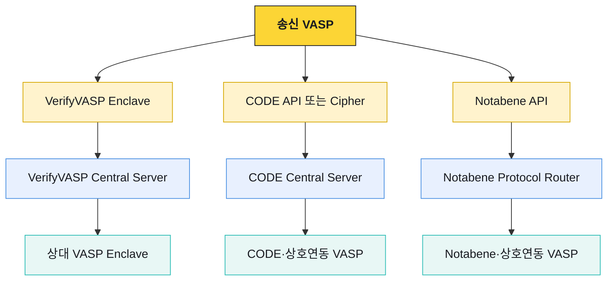

# 트래블룰 솔루션 비교

솔루션을 고를 때 기능 목록보다 먼저 확인할 것은 실제 거래 상대에게 도달할 수 있는가다. 같은 IVMS101을 사용하더라도 회원망, 상호운용 범위, 양사 실사, 관할 규칙, 자산·네트워크 지원이 맞지 않으면 거래할 수 없다.

## 세 솔루션의 기본 구조

| 항목 | VerifyVASP | CODE | Notabene |
|---|---|---|---|
| 기본 형태 | VASP 내부 Enclave·DB와 중앙 중계 | 중앙 API, 암호화 payload, 선택형 Cipher 모듈 | SaaS API·정책·웹훅·임베디드 UI |
| 출금 핵심 | 계정·사용자 사전 검증 후 txHash 보고 | 사전 승인 후 결과 보고 | transfer 생성·검증·정책 판정 |
| 입금 보완 | 사전 검증 ID 기반 상태 확인 | TXID 기반 Post-verification 지원 | Deposit Assist로 누락 정보 수집 |
| 개인정보 | VASP 간 E2EE, 중앙 서버 비복호화 설명 | VASP 간 암호화·요청 서명 | IVMS101 PII와 transfer 처리, self-encryption 경로 제공 |
| 개인지갑 | VASP 자체 정책과 결합 | 제품 흐름 확인 필요 | 서명·소액전송·화면·자기선언 지원 |
| 운영 부담 | Enclave·DB·공개 HTTPS·백업 운영 | API 서명·키·암호화와 수신 API 운영 | API·웹훅·정책·대시보드 운영 |

## VerifyVASP

[VerifyVASP의 TravelRule 구조](https://docs.verifyvasp.com/reference/travelrule-overview.md)는 각 VASP 인프라에 Enclave와 전용 DB를 배치하고 Central Server가 요청을 중계하는 형태다. VASP 백엔드는 Enclave API를 호출하고, Enclave가 암복호화와 중앙 서버 통신을 담당한다.

### 출금 흐름

1. 수신 VASP 목록과 계정·주소를 확인한다.
2. 송금인·수취인 IVMS101을 포함한 User Verification을 요청한다.
3. 요청 접수 시 verification UUID를 받고 비동기 결과를 기다린다.
4. 수신 VASP가 고객 KYC와 수취인 정보를 대조한다.
5. 승인되면 온체인 전송한다.
6. txHash·vout을 verification UUID에 연결해 보고한다.

### VASP가 운영할 표면

- Verify User Account API
- Verify User API
- Check Transaction Status API
- Callback API
- Enclave 전용 DB와 키·백업·보존 정책
- Central Server가 접근할 공개 HTTPS endpoint와 방화벽

Central Server가 개인정보를 복호화·저장하지 않는다는 설명은 Enclave 전용 DB의 검증정보·키 저장과 구분된다. `중앙 무저장`이 전체 시스템의 무저장을 뜻하지는 않는다.

## CODE

[CODE transaction flow](https://docs.codevasp.com/api/markdown/en/travel-rule/guides/01-General/03-Transaction-Flow)는 Pre-verification과 Post-verification 두 흐름을 제공한다.

### Pre-verification

1. VASP 목록과 공개키를 조회한다.
2. 목적지 주소가 수신 VASP 소유인지 확인한다.
3. 암호화한 개인정보와 거래 정보를 보내 자산 이전 승인을 요청한다.
4. 승인 후 온체인 전송한다.
5. 거래 결과를 상대에게 전달한다.

### Post-verification

사전 정보 교환을 완료하지 못한 입금은 TXID로 송신 VASP를 탐색하고, 탐색에 성공하면 필요한 정보를 사후 교환한다. 사전 기록이 없는 입금을 다룰 때 VerifyVASP의 verification UUID 기반 조회와 구분되는 중요한 차이다.

### 요청 보안

CODE 요청은 nonce, UTC 시각, 송신 VASP 공개키, Ed25519 서명, 송신 alliance 식별자를 헤더에 사용한다. 암호화된 요청에는 수신 VASP 공개키도 사용한다. 공개키가 교체돼 불일치 오류가 나면 새 키를 조회하고 제한적으로 재시도한다.

## Notabene

[Notabene outgoing transfer 문서](https://devx.notabene.id/docs/create-outgoing-transfers.md)는 transfer 생성, 상대 탐색, 개인정보 제공, 정책 판정과 개인지갑 소유 증명을 하나의 흐름으로 설명한다. 웹훅과 입금 보완은 별도 제품 기능으로 연결된다.

### 주요 특징

- IVMS101 기반 개인정보 모델
- 관할·금액별 Presentation Definition
- VASP와 개인지갑 분류
- 서명·소액전송·화면·자기선언 소유 증명
- Withdrawal Assist·Deposit Assist·Counterparty Assist
- Fireblocks와 travel rule message 연동
- 고객 측 암호화를 통한 직접 전달 경로

개인지갑에는 VASP 간 메시지를 보낼 상대가 없어 transfer 최종 상태가 `SENT`가 아니라 `SAVED`가 될 수 있다. 이 상태를 VASP 검증 성공과 같은 의미로 매핑하지 않는다.

## 상호운용과 도달성

[CODE 상호운용 문서](https://docs.codevasp.com/api/markdown/en/travel-rule/guides/02-Development/12-Interoperability-with-Other-Protocols)는 VerifyVASP·GTR·Sygna 등과의 기술 연결 범위와 운영 제약을 설명한다. 디렉터리에서 상대 VASP가 조회되더라도 양사의 정책 승인·방향·자산·네트워크 조건을 통과해야 실제 거래할 수 있다.
