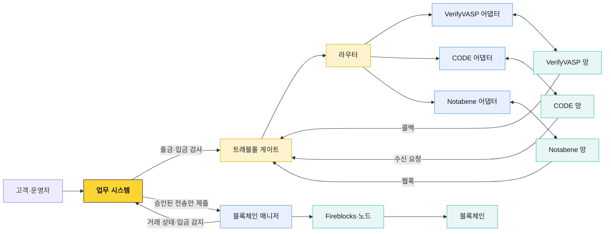
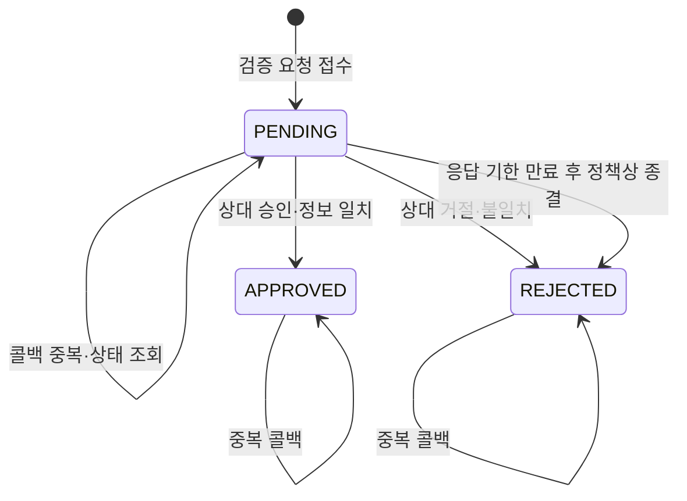
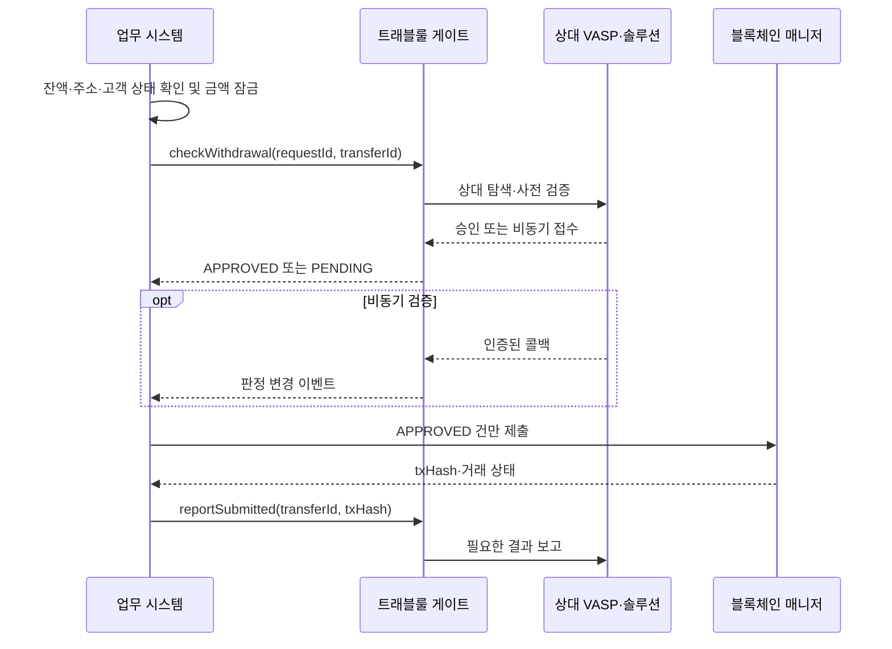

# 트래블룰 게이트 운영 설계

트래블룰 게이트는 업무 시스템과 VerifyVASP·CODE·Notabene 사이의 번역 계층이다. 벤더마다 다른 요청 형식과 상태를 공통 판정으로 바꾸고, 개인정보가 블록체인 실행 계층으로 번지지 않게 막는다. 출금 순서와 고객 잔액은 업무 시스템이, 온체인 실행은 블록체인 매니저가 계속 책임진다.

## 배치와 책임 경계



| 컴포넌트 | 정본으로 관리하는 것 | 이 경계 밖의 일 |
|---|---|---|
| 업무 시스템 | 고객·계정·주소 귀속, 출금 주문, 잔액 잠금과 가용 전이, 최종 업무 상태 | 벤더 암호화 프로토콜, 온체인 서명 |
| 트래블룰 게이트 | 상대 라우팅, 사전 검증, 수신 요청, 공통 판정, 벤더 식별자, 감사 기록 | 고객 원장, 거래 서명, 체인 재전송 |
| 블록체인 매니저 | Vault·자산 매핑, 제출, 트랜잭션 감시, 입금 감지 | PII 해석, 규제 판정, 고객 잔액 |
| 트래블룰 솔루션 | VASP 디렉터리, 메시지 전달, 프로토콜 상태 | 우리 고객·잔액·출금 상태의 정본 |

게이트가 `APPROVED`를 반환해도 출금이 자동으로 만들어지는 것은 아니다. 업무 시스템이 잔액·주소·승인 조건을 다시 확인한 뒤 블록체인 매니저에 제출한다. 반대로 블록체인 트랜잭션이 확정돼도 입금 귀속과 트래블룰 판정이 끝나지 않았다면 고객 가용 잔액으로 전환하지 않는다.

## 공통 처리 단계

벤더별 동작은 네 단계로 접는다.

| 단계 | 질문 | 결과 |
|---|---|---|
| `route` | 이 상대와 어느 망으로 통신할 수 있는가? | 벤더, 상대 VASP ID, 적용 정책 |
| `check` | 출금·입금을 진행해도 되는가? | 정규화한 판정과 사유 |
| `message` | 온체인 제출에 함께 넘길 산출물이 있는가? | 벤더 메시지 또는 없음 |
| `report` | txHash·최종 상태를 상대에게 알려야 하는가? | 보고 접수 ID와 처리 상태 |

제품별 차이는 어댑터 안에 둔다. 예를 들어 VerifyVASP는 비동기 User Verification 뒤 txHash를 보고하고, CODE는 사전 승인과 결과 보고를 수행한다. Notabene는 transfer를 만들고 정책 판정·상대 응답을 추적한다. 이 차이를 출금 서비스의 조건문으로 복제하지 않는다.

## 요청 계약

업무 시스템은 개인정보 전체를 임의의 JSON으로 넘기지 않는다. 게이트 계약이 요구하는 명시적 필드와 내부 참조 ID를 보낸다. IVMS101 원본과 제품 payload의 차이는 [IVMS101과 VerifyVASP 매핑](./03-ivms101-verifyvasp-mapping.md)을 따른다.

```json
{
  "requestId": "trq_01J...",
  "transferId": "wd_20260818_00042",
  "direction": "OUTGOING",
  "requestedAt": "2026-08-18T09:30:00+09:00",
  "asset": {
    "symbol": "USDC",
    "network": "ETH",
    "amount": "2500.00"
  },
  "originator": {
    "customerRef": "cus_28491",
    "accountRef": "acct_8127"
  },
  "beneficiary": {
    "name": "수취인 이름",
    "walletAddress": "0x...",
    "vaspRef": "vasp_kr_..."
  },
  "policyContext": {
    "country": "KR",
    "amountKrw": "3475000",
    "customerType": "NATURAL_PERSON"
  }
}
```

설계할 때 지킬 조건은 다음과 같다.

- 금액은 부동소수점 수가 아니라 문자열 decimal로 전달한다.
- `requestId`는 한 번의 게이트 호출, `transferId`는 업무 거래 전체를 식별한다.
- `customerRef`는 내부 참조다. 어댑터가 필요한 KYC를 권한 있는 저장소에서 읽거나 요청 계약에 정의된 최소 필드만 받는다.
- 자산 심볼만으로 네트워크를 추론하지 않는다. 같은 자산의 멀티체인 전송을 구분한다.
- 주소 정규화 규칙은 체인별로 적용한다. 대소문자를 일괄 변경하지 않는다.
- 원화 환산값에는 가격 시점·가격 출처를 감사 데이터로 함께 남긴다.

## 판정 모델

게이트가 업무 시스템에 노출하는 판정은 네 가지로 제한한다.

| 판정 | 의미 | 출금 처리 | 입금 처리 |
|---|---|---|---|
| `NOT_REQUIRED` | 현재 정책상 VASP 간 정보 교환 대상이 아님 | 잔액·주소·승인 조건 확인 후 진행 | 귀속·AML 조건을 충족하면 가용 검토 |
| `APPROVED` | 필요한 상대 확인과 정보 교환이 완료됨 | 제출 가능 상태로 전이 | 온체인 확정과 귀속까지 충족하면 가용 |
| `PENDING` | 상대 응답·수동 심사·추가 자료를 기다림 | 금액 잠금 유지, 제출 금지 | 고객 가용 전환 금지 |
| `REJECTED` | 상대 거절, 불일치, 정책 차단 또는 응답 기한 만료 후 정책상 종결 | 반려하고 잠금 해제 | 보류 계정 유지, 소명·반환 절차로 이동 |

`ERROR`를 업무 판정으로 추가하지 않는다. 네트워크 오류와 벤더 장애는 마지막으로 확정된 판정을 유지한 채 별도 기술 상태로 기록한다. 호출 실패를 `REJECTED`로 덮으면 재시도 가능한 장애와 실제 규제 거절을 구분할 수 없다.



승인과 거절은 기본적으로 종결 상태다. 벤더에서 이후 정정이 가능하더라도 기존 결과를 덮지 않고 새 검증 차수(`attempt`)를 만든다. 이미 온체인 제출한 거래의 사전 승인을 사후에 되돌려 거래를 없었던 것으로 만들 수는 없다.

출금 처리 문서의 `REQUESTED`, `CHECKING_COUNTERPARTY`, `EXCHANGING_PII`, `WAITING_REVIEW`, `UNREACHABLE`은 모두 처리 진행 상태이며 외부 판정으로는 `PENDING`이다. `COMPLETED`는 `APPROVED`, `TERMINATED`는 `REJECTED`로 변환한다.

## 제품 상태 정규화

어댑터는 벤더 원문 상태와 정규화 결과를 모두 저장한다. 아래 표는 분류 원칙이며, 실제 매핑은 연동 버전의 API 명세와 테스트 결과로 확정한다.

| 제품 흐름 | 예시 상황 | 공통 판정 | 기술 처리 |
|---|---|---|---|
| VerifyVASP User Verification | UUID 접수, 콜백 대기 | `PENDING` | 상태 조회 일정 등록 |
| VerifyVASP Callback | 상대 승인 | `APPROVED` | 원문·서명 검증 결과 저장 |
| VerifyVASP Callback | 상대 거절·정보 불일치 | `REJECTED` | 상대 사유를 내부 사유 코드로 변환 |
| CODE Pre-verification | 승인 응답 | `APPROVED` | 승인 ID와 상대 VASP 저장 |
| CODE Pre-verification | 거절 응답 | `REJECTED` | 서명·nonce 검증 기록 저장 |
| Notabene transfer | 상대 또는 정책 응답 대기 | `PENDING` | 웹훅과 조회 병행 |
| Notabene transfer | 필요한 검사가 완료됨 | `APPROVED` | vendor transfer ID 저장 |
| 개인지갑 | 별도 소유 검증 정책 적용 | 정책 결과 | VASP 경로와 섞지 않고 증명 방식 저장 |

벤더 오류 문자열을 고객 메시지에 그대로 노출하지 않는다. 내부 사유 코드는 최소한 다음 범주를 구분한다.

- `COUNTERPARTY_UNREACHABLE`: 디렉터리에는 있으나 실제 메시지 경로가 없음
- `BENEFICIARY_MISMATCH`: 수취인 정보가 상대 기록과 일치하지 않음
- `ADDRESS_NOT_OWNED`: 상대 VASP가 목적지 주소 소유를 확인하지 못함
- `POLICY_BLOCKED`: 내부 또는 상대 정책이 차단함
- `ADDITIONAL_INFO_REQUIRED`: 추가 정보나 운영자 판단이 필요함
- `TECHNICAL_RETRY`: 타임아웃·429·일시적인 서버 오류
- `VALIDATION_FAILED`: 필수 필드·코드·형식이 잘못됨

## 멱등성과 상관관계 ID

트래블룰 흐름에는 업무 요청, 벤더 검증, 온체인 거래가 서로 다른 시점에 만들어진다. 세 ID를 한 필드로 재사용하지 않는다.

| ID | 생성 주체 | 용도 |
|---|---|---|
| `transferId` | 업무 시스템 | 출금·입금 업무의 영구 식별자 |
| `requestId` | 호출자 | 게이트 API 멱등 키와 추적 키 |
| `verificationId` | 게이트 | 검증 차수별 내부 식별자 |
| `vendorReference` | 각 솔루션 | UUID, transfer ID 등 제품 조회 키 |
| `txHash` | 블록체인 | 제출 뒤 온체인 거래 식별자 |

같은 `requestId`와 같은 본문이 다시 오면 최초 결과를 반환한다. 같은 `requestId`에 다른 본문이 오면 `409 Conflict`로 거절한다. 본문 비교를 위해 민감한 원문 전체를 로그에 남기는 대신 정규화한 요청의 암호학적 해시를 저장한다.

`reportSubmitted(transferId, txHash)`도 멱등해야 한다. 타임아웃 뒤 호출자가 재시도했을 때 벤더에 결과 보고가 두 번 도착해도 동일 거래로 수렴해야 한다. 벤더가 자체 멱등 키를 지원하지 않으면 게이트의 발신함(outbox)이 한 번의 논리 보고와 여러 전송 시도를 구분한다.

## 콜백과 웹훅

인바운드 요청은 정상 경로의 일부다. 공개 endpoint를 열었다는 사실만으로 신뢰하지 않고 제품별 인증을 먼저 검증한다.

1. 원문 body와 인증 헤더를 변경하지 않은 채 수신한다.
2. 서명, 키 ID, timestamp·nonce, 허용 시간 오차를 제품 규칙에 따라 검증한다.
3. 이벤트 ID 또는 원문 해시로 중복 여부를 확인한다.
4. 유효한 이벤트를 inbox에 저장하고 빠르게 성공 응답한다.
5. 별도 처리기가 `vendorReference`로 검증 건을 찾아 상태를 전이한다.
6. 업무 시스템에 정규화한 결과를 event 또는 callback으로 알린다.

알 수 없는 `vendorReference`를 성공 처리로 버리지 않는다. 격리 큐에 보관하고 상대 VASP·시간·주소 등 허용된 메타데이터로 조사한다. 서명 실패 요청은 상태를 바꾸지 않으며 보안 경보와 제한된 감사 로그만 남긴다.

콜백 순서는 보장되지 않는다고 가정한다. `APPROVED` 뒤 늦게 도착한 `PENDING` 이벤트가 상태를 되돌리지 않도록 허용 전이표와 벤더 이벤트 시각·수신 시각을 함께 사용한다.

## 타임아웃과 재시도

타임아웃을 하나의 숫자로 두지 않는다.

| 시간 | 의미 | 만료 시 처리 |
|---|---|---|
| 연결 타임아웃 | 벤더와 TCP·TLS 연결을 맺는 시간 | 짧은 백오프로 기술 재시도 |
| 요청 타임아웃 | 한 API 응답을 기다리는 시간 | 조회 API로 접수 여부 확인 후 재시도 |
| 검증 SLA | 상대 VASP 답변을 기다리는 업무 시간 | 운영 큐로 승격, 고객 상태는 `PENDING` 유지 |
| 업무 만료 | 출금 요청을 더 유지하지 않을 최종 시점 | 정책에 따라 `REJECTED`, 잠금 해제와 고객 안내 |

재시도 대상은 연결 실패, 429, 일시적 5xx다. 형식 오류, 인증 실패, 명시적 상대 거절은 자동 재시도하지 않는다. 지수 백오프에 jitter를 적용하고 벤더의 `Retry-After`가 있으면 우선한다. API 생성 요청이 타임아웃 났다면 새 요청을 즉시 만들기 전에 멱등 키나 조회 API로 기존 접수 여부를 확인한다.

외부 VASP 출금은 게이트 상태를 확인할 수 없을 때 fail-close가 기본이다. 장애를 이유로 트래블룰 검증을 건너뛰지 않는다. 다만 내부 계정 간 이동, 임계 미만(현행 100만원 기준 — 시행령 개정 시행 후 폐지 예정, 출금 흐름 문서 참조), 검증된 개인지갑 등은 각자 정의된 정책으로 판정하며 `벤더 장애 예외`와 혼동하지 않는다.

## 개인정보 경계

IVMS101 데이터는 고객 서비스 전체에 복제하지 않는다.

| 위치 | 허용 데이터 | 금지 또는 제한 |
|---|---|---|
| 업무 시스템 | 고객 정본, 업무 ID, 필요한 판정 | 벤더 암호문·프로토콜 키의 불필요한 복제 |
| 트래블룰 게이트 | 최소 PII, 벤더 payload, 판정·감사 데이터 | 범용 애플리케이션 로그에 평문 PII 기록 |
| 블록체인 매니저 | transfer ID, 자산·주소·txHash, 실행 상태 | 성명·생년월일·신분증 번호 해석과 저장 |
| 관측 도구 | 마스킹한 ID, 지연·오류 코드, 벤더·상태 | request·response body, 인증 헤더, 암호화 키 |

DB와 백업은 암호화하고 키 접근 권한을 서비스 실행 계정과 제한된 운영 역할로 나눈다. 검색 편의를 위해 이름·주소 원문을 추가 색인하지 않는다. 보존 기간이 끝나면 본문과 파생 복제본, 재처리 큐, 백업의 삭제 정책이 함께 작동해야 한다.

운영 화면은 기본 마스킹하고 업무상 필요한 역할에만 일시적으로 원문을 보여준다. 조회·해제·내보내기는 모두 감사 이벤트로 남긴다. CS 티켓이나 메신저에 PII payload를 붙여 넣는 방식으로 장애를 처리하지 않는다.

## 출금 연결



블록체인 매니저 제출이 실패하면 트래블룰 승인을 무조건 재사용하지 않는다. 승인 유효기간, 금액·주소 변경 여부, 벤더 정책을 확인한다. 주소나 수취인, 자산, 금액이 바뀌면 새 검증으로 본다.

## 입금 연결

입금 가용 조건은 다음 세 조건의 교집합이다.

```text
고객 가용 잔액 반영
= 체인별 확정 임계 충족
  AND 내부 주소·계정 귀속 완료
  AND 트래블룰 판정 APPROVED 또는 정책상 NOT_REQUIRED
```

사전 요청과 txHash 보고가 있는 입금은 벤더 식별자·주소·자산·금액을 대조한다. 사전 기록이 없는 입금은 제품이 지원하는 TXID·상대 탐색이나 Deposit Assist 절차로 보완한다. 어느 경로로도 송신자를 확인하지 못한 건은 가용 처리하지 않고 운영 큐로 보낸다. 자세한 흐름은 [입금 처리](./04-deposit-flow.md)를 따른다.

반환은 입금을 취소하는 DB 수정이 아니라 새로운 온체인 출금이다. 반환 주소의 안전성, 수수료, 승인, 트래블룰 적용 여부를 다시 판단하고 원 입금과 반환 거래를 양방향으로 연결한다.

## 저장 모델

최소한 다음 레코드를 분리한다.

| 레코드 | 핵심 필드 |
|---|---|
| 검증 건 | `verificationId`, `transferId`, direction, attempt, verdict, reason, policy version |
| 라우팅 결과 | vendor, counterparty VASP ID, protocol, reachability evidence, decidedAt |
| 벤더 교환 | vendor reference, operation, request hash, raw status, sentAt, receivedAt |
| 상태 이력 | from, to, source event, occurredAt, receivedAt, actor |
| 온체인 연결 | network, asset, txHash, vout·index, reportedAt |
| 인바운드 inbox | event ID, signature result, body location, processing state |
| 아웃바운드 outbox | logical message ID, destination, attempt count, next retry, last error |

`policy version`을 반드시 남긴다. 같은 거래라도 임계값, 관할 규칙, 개인지갑 정책이 바뀌면 결과가 달라질 수 있기 때문이다. 감사 시에는 현재 정책이 아니라 판정 당시 정책을 재현할 수 있어야 한다.

## 모니터링과 운영 큐

서비스 정상 여부와 업무 적체를 분리해 본다.

| 신호 | 확인할 내용 | 경보 예시 |
|---|---|---|
| API 가용성 | 벤더별 성공률·p95 지연·429·5xx | 특정 벤더 오류율 급증 |
| 검증 적체 | `PENDING` 건수와 체류 시간 | 검증 SLA 초과 건 증가 |
| 콜백 품질 | 서명 실패·중복·미식별 reference | 연속 서명 실패, 미식별 이벤트 발생 |
| 상태 정합성 | 종결 상태 역전·불가능 전이 | `APPROVED → PENDING` 시도 |
| 보고 누락 | 제출됐지만 txHash 보고가 끝나지 않은 건 | outbox 재시도 한도 접근 |
| 입금 보류 | 확정됐지만 컴플라이언스 미완료인 금액·건수 | 고액·장기 보류 발생 |

운영 큐에는 사유, 현재 단계, 마지막 정상 응답, 다음 자동 처리 시각, 운영자가 할 수 있는 조치만 표시한다. `재시도` 버튼은 멱등 키를 유지하고, `강제 승인`은 일반 장애 해결 수단으로 제공하지 않는다. 정책상 수동 승인 기능이 필요하다면 이중 승인, 근거 입력, 만료 시간, 전용 감사 이벤트를 요구한다.

## 장애 대응 순서

1. 우리 API, DB, queue, vendor별 endpoint 중 장애 범위를 먼저 분리한다.
2. 출금 신규 제출을 우회시키지 말고 해당 경로를 `PENDING`으로 유지한다.
3. 콜백 수신은 가능하면 계속 받아 inbox에 적재한다.
4. 벤더 status page와 API 상태를 확인하고, 429와 5xx를 구분한다.
5. 복구 뒤 미처리 inbox와 outbox를 순서에 무관하게 재처리한다.
6. `APPROVED`지만 제출되지 않은 출금, 제출됐지만 보고되지 않은 출금, 확정됐지만 가용되지 않은 입금을 각각 대사한다.
7. PII가 로그·티켓으로 유출됐는지 별도 확인한다.

벤더를 바꾸는 것은 단순 endpoint 전환이 아니다. 상대 VASP가 새 망에서 실제로 도달 가능한지, 진행 중 검증을 어느 시스템이 끝낼지, vendor reference와 보존 데이터를 어떻게 조회할지 정한 뒤 전환한다.

## 배포 전 점검

- [ ] 지원 VASP 목록과 실제 상호연동 범위를 별도로 관리한다.
- [ ] 벤더별 sandbox에서 승인·거절·무응답·중복 콜백을 재현했다.
- [ ] 동일 멱등 키 재호출과 서로 다른 본문 충돌을 검증했다.
- [ ] 콜백 서명 실패, 오래된 timestamp, nonce 재사용을 차단했다.
- [ ] `PENDING` SLA와 최종 업무 만료가 정책으로 정의돼 있다.
- [ ] 출금은 `APPROVED` 전 블록체인 매니저로 제출되지 않는다.
- [ ] 입금은 체인 확정만으로 고객 가용 잔액이 되지 않는다.
- [ ] 개인정보가 애플리케이션·프록시·APM 로그에 남지 않는다.
- [ ] vendor reference·transfer ID·txHash로 양방향 추적할 수 있다.
- [ ] 장애 복구 후 inbox·outbox·업무 상태 대사 절차가 있다.
