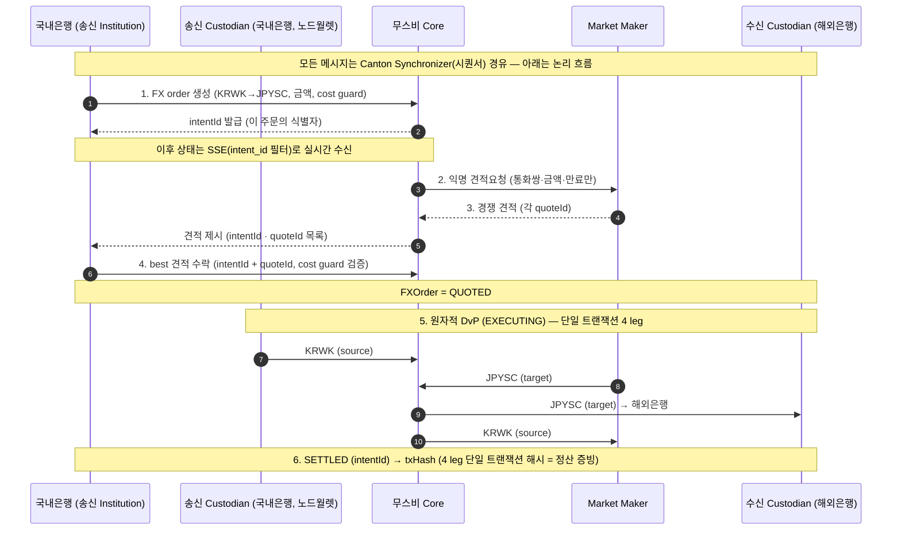

1차 PoC의 핵심: 무스비/캔톤을 왜 쓰는지(가치)를 항목별로 검증한다. 각 항목 = 가치(why) → 검증 방법(how, 어떤 인터페이스로 무엇을 보나) → 검증 가능성(1차 환경에서 실제로 가능한가) → 합격 기준(pass).

시나리오: 국내은행 KRWK ↔ 해외은행 JPYSC, 무스비 4-leg 원자 정산(고객 없음). 모델은 1장, 구성은 2장.

## 0. 국내은행이 가진 관측 수단 (검증 가능성의 전제)

1차 PoC에서 국내은행이 직접 볼 수 있는 것:

- **무스비 API / Console / Statements** — 주문·견적·정산 상태, 대시보드(`/api/v1/dashboard/stats`), 정산 확인서·트랜잭션 해시.
- **국내은행 Canton participant 원장(노드월렛)** — 국내은행 파티 뷰의 활성 컨트랙트(ACS)·FXOrder 상태·allocation·잔액·커밋 오프셋.
- **국내은행 KRWK 잔액** — 국내은행이 통제 → 실패 주입(잔액 부족 등) 가능.
- **Audit Exports**(Custodian) — 체결된 FXOrder + 4-leg `transactionHash`를 CSV/JSON으로 내보내기. **회계 장부 대조·규제 기록 보관용**. (여러 건 일괄 내보내기 API는 예정 — 지금은 주문 1건씩 `intentId`로 조회.)

직접 볼 수 **없는** 것(노드인프라/무스비 측):

- MM·수신 카운터파티·제3자(무관) 노드의 원장 뷰.
- 무스비 Core 내부 동작.

→ 따라서 **MM에 무엇이 보이나·제3자가 못 보나·DAML이 원장에서 강제하나**는 국내은행 뷰만으로는 부분적이며, 노드인프라 지원(제3자 노드 뷰·raw Ledger API·패키지)이 있어야 완전 검증된다. 아래 "검증 가능성"에 표시.

| # | 항목 | 검증 가능성 (1차) | 비고 |
|---|---|---|---|
| 1 | 원자적 DvP | **가능** | 정상+실패주입 모두 국내은행 뷰로 |
| 2 | 익명/프라이버시 | **제한적** | 국내은행 뷰는 가능, MM익명·제3자0건은 외부 뷰 필요 |
| 3 | 무스비 기능 정상동작 | **가능** | API/Console end-to-end |
| 4 | DAML 검증 | **적격기관 주도** | 소스/DAR + raw Ledger 확보 시 (a)소스리뷰·(b)재현·(c)거부테스트 |
| 5 | 보안 검토 | **부분** | 배포물 무결성·원장 권한 등; 일부 노드인프라 확인 (5절) |

---

## 1. 원자적 DvP — 검증 가능성: 가능

- **가치**: 국내은행이 KRWK를 먼저 보내고 해외은행이 JPYSC를 안 보내는 카운터파티(Herstatt) 리스크를 구조적으로 제거.
- **검증 방법**:
  - 정상 정산 1건 실행 → 국내은행 원장(ACS·잔액)에서 KRWK 차감과 JPYSC 입금이 **같은 트랜잭션**(같은 오프셋)에 일어나는지 확인 + Console/Statements에서 트랜잭션 해시 1개(4 leg를 덮는 단일 캔톤 트랜잭션 해시) 확인.
  - 실패 주입: 국내은행 KRWK 잔액을 부족하게 한 뒤 정산 시도 → 국내은행 leg 실패 → **전체 롤백**(잔액 무변동, FXOrder `FAILED`) 확인.
- **검증 가능성**: **가능** — 국내은행 leg(KRWK)는 국내은행이 통제하므로 정상·실패 모두 국내은행 뷰로 관측. (상대/MM leg 실패 주입은 노드인프라 협조 필요하나, 원자성 입증엔 국내은행 leg 실패로 충분.)
- **합격 기준**:
  - [ ] SETTLED 시 KRWK↓·JPYSC↑가 단일 트랜잭션에 동시 반영.
  - [ ] 국내은행 leg 실패 시 전체 롤백(부분 정산 없음, FAILED).

## 2. 익명 / 프라이버시 — 검증 가능성: 제한적

- **가치**: 거래 상대·금액·환율이 무관한 제3자에 비공개, MM도 송수신자 신원을 모름.
- **검증 방법**:
  - (국내은행 뷰) 국내은행 participant ACS에 **국내은행이 이해관계자인 컨트랙트만** 있는지 확인.
  - (FXOrder observer) 국내은행 FXOrder 컨트랙트의 **관찰자 집합**이 당사자+MM(견적 수락 후)로 한정되는지 확인.
  - (MM 익명) MM에 전달되는 RFQ 페이로드에 **신원 미포함**(통화쌍·금액·만료만)인지 — MM 측 뷰 또는 데이터 모델로 확인.
  - (제3자 0건) **무관한 제3자 노드** 뷰에서 이 거래 컨트랙트가 0건인지 확인.
- **검증 가능성**: **제한적** —
  - *가능*: 국내은행 뷰가 국내은행 컨트랙트만 보유함은 국내은행 participant로 직접 확인.
  - *외부 필요*: **MM 익명**은 MM 측 뷰/스키마, **제3자 0건**은 거래에 무관한 노드 뷰가 있어야 입증 → 노드인프라가 제3자(비당사자) 노드 뷰 또는 RFQ 스키마를 제공해야 완전 검증(6장 F).
- **합격 기준**:
  - [ ] 국내은행 participant ACS = 국내은행 거래만(무관 컨트랙트 없음).
  - [ ] (외부 뷰 확보 시) 제3자 노드에 이 거래 0건.
  - [ ] (확보 시) MM RFQ에 송수신 신원 미포함.

## 3. 무스비 기능 정상 동작 — 검증 가능성: 가능

- **가치**: 무스비 정산 레일(주문·RFQ·4-leg 정산)이 실제 네트워크에서 작동.
- **검증 방법**:
  - API/Console로 FX order 생성 → MM 경쟁 견적 → best 견적 수락 → 4-leg 정산 → SETTLED, end-to-end 1회. SSE로 상태 전이 실시간 관측.
  - cost guard(최악 환율 한도) 설정 후 한도 벗어난 견적 거부 확인.
  - 소요 시간 측정(~15초), Statements에서 정산 확인서·해시 조회.
- **검증 가능성**: **가능** — 전부 국내은행이 호출/관측하는 무스비 API·Console로 확인.
- **합격 기준**:
  - [ ] 주문→견적→정산 전 과정 완료(~15초 목표).
  - [ ] SETTLED + 트랜잭션 해시 1개.
  - [ ] cost guard 위반 견적 거부.
  - [ ] (선택) 동일 주문 재제출 시 `intentId`로 중복 방지(멱등성) 동작.

## 4. DAML 검증 — 적격기관 주도 (소스/DAR 확보 시)

- **가치**: 정산 컨트랙트(`FXOrder`) 로직·권한이 **앱이 아니라 원장에서** 강제됨. **DAML이 곧 국내은행 자산의 신뢰 경계** — 벤더에 맡기지 않고 적격기관이 직접(또는 제3자 감사) 검증한다.
- **전제**: ① `FXOrder` DAML이 우리 participant에 **배포·일치**, ② **DAML 소스(또는 최소 DAR)+패키지 ID** 공유, ③ 우리 participant **raw Ledger API 접근** (6장 C).
- **검증 방법 (3단계)**:
  - **(a) 소스 리뷰** — `FxDvp/FXOrder`의 **signatory·observer·choice·`require`(precondition)** 확인: 무단 인출 불가(operator 일방 이동 차단), 원자성(전부/전무), allocation 매칭, 기한, 프라이버시 경계(관찰자 범위).
  - **(b) 동작 재현** — Daml Script로 정상 정산 + 실패 시 전체 롤백 재현.
  - **(c) 거부 테스트** — raw Ledger API로 **잘못된 호출**(견적 수락 전 정산, 만료 후 실행, 권한 없는 이동, allocation 불일치)이 **원장에서 거부**되는지.
- **검증 가능성**: 소스/DAR + raw Ledger 접근을 확보하면 **(a)~(c)를 적격기관이 직접 검증** 가능. 미확보 시 상태 전이·정상 흐름 관찰(API)까지만 = 제한적 → 소스/접근 확보가 핵심(전제).
- **합격 기준**:
  - [ ] (a) signatory·권한·원자성·기한·관찰자 규칙이 컨트랙트에 명시됨을 확인.
  - [ ] (b) 정상 정산 + 실패 롤백을 Daml Script로 재현.
  - [ ] (c) 순서 위반·권한 없는·allocation 불일치 호출이 원장 단에서 거부됨.

---

## 5. 보안 검토 — 검증 가능성: 부분

> 보안도 "벤더에 위임하지 않고 적격기관이 직접 통제·검증"하는 영역 — DAML 검증(4절)과 같은 프레임이다. 아래는 계층별 검토 항목이고, 1차 우선순위는 **배포물 무결성(공급망)** 이다.
> 노드인프라에 확인할 보안 질의는 6장 A·C.

### A. 원장·DAML 권한 경계

- [ ] 서명자/관찰자 경계가 실제로 프라이버시를 강제하나(제3자 0건 — 2절).
- [ ] 무스비 Core가 단독으로 자산을 일방 이동 못 하나(4-leg co-sign 게이트 — 1·4절 거부 테스트).

### B. 네트워크·전송

- [ ] mTLS 인증서 **발급 주체가 무스비** — 우리가 그 신뢰 체인을 수용하나, 인증서 회전·폐기 절차.
- [ ] allowlist·egress(NAT) 통제, AWS Sandbox 망분리 경계(VPC) 검증.

### C. 인증·인가

- [ ] JWT 서명 키 보관·만료(기본 1h)·프로덕션 IdP. 토큰 유출 시 우리 Party로 호출 가능 → 보관·폐기 정책.
- [ ] role(institution/custodian) 강제가 백엔드에서 실제로 적용되나.

### D. 공급망(배포물 신뢰) — 1차 우선

- [ ] 노드월렛 SW·Musubi backend·participant 이미지·DAR이 **전부 노드인프라 제공** → 무결성(체크섬/서명)·출처(provenance) 검증.
- [ ] 우리 환경에서 도는 바이너리 중 **소스를 볼 수 있는 것**은 무엇인가(최소 DAML 소스 — 6장 C).

### E. AWS Sandbox 인프라

- [ ] Secrets 관리(JWT 서명 자격·DB·TLS 키), Postgres 암호화(at-rest)·접근통제, IAM 최소권한, 로깅/감사.

## 6. 정산 시나리오 (검증을 돌리는 흐름)

> 트랜잭션 해시 1개 = 4 leg를 덮는 단일 캔톤 트랜잭션 해시(규제 보고용 증빙). 각 단계가 검증 항목과 연결: 5=원자성(1), RFQ 2=익명(2), 전 과정=기능(3), 상태·권한=DAML(4).

## 7. 검증 전제 — 노드인프라에 요청할 것

"제한적" 항목을 완전 검증하려면 다음이 필요(→ 6장 C·F):

- **제3자(비당사자) 노드 뷰** — 프라이버시 "제3자 0건" 시연용.
- **MM 측 RFQ 페이로드/스키마** — MM 익명 확인용.
- **raw Ledger API 접근 + `FXOrder` 패키지/DAR id** — DAML 원장 강제 확인용.
- **실패 주입 협조** — 상대/MM leg 실패 케이스까지 보려면(국내은행 leg 실패만으론 국내은행 측 롤백까지).
