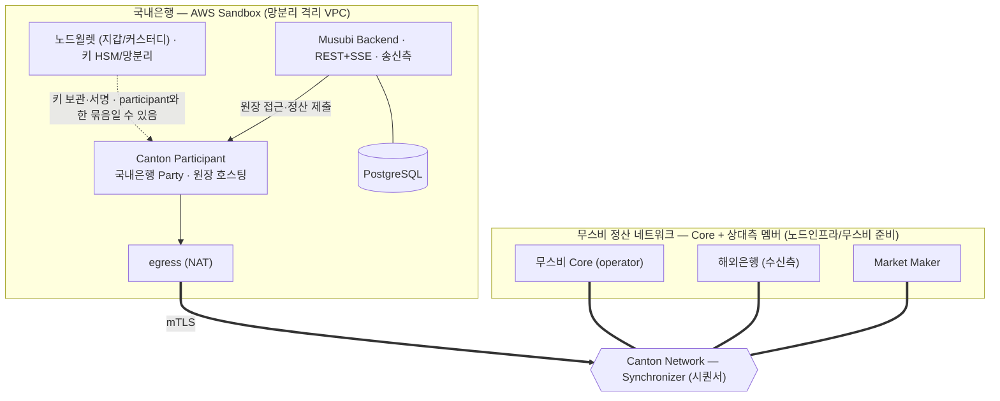
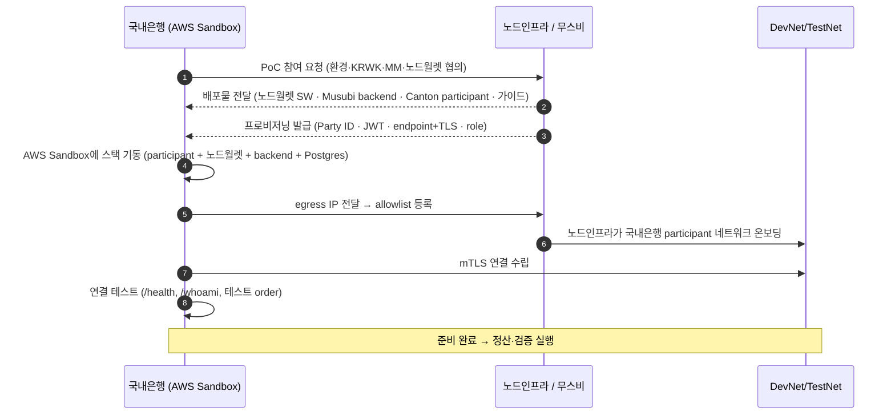

1차 PoC를 AWS Sandbox에서 DevNet 또는 TestNet으로 진행한다. 국내은행은 적격기관(송신 Institution + Custodian), 지갑은 노드월렛(고객 HSM 자가 키보유).

AWS Sandbox는 망분리 때문에 쓴다(은행 내부망 밖 격리) — 여기에 국내은행 스택을 띄운다. 받아야 할 것은 6장, 무스비 제품은 1장.

## 1. AWS Sandbox를 쓰는 이유

- 은행 내부망에서 외부 네트워크(DevNet/TestNet)에 연결하고 노드를 운영하기엔 망분리 제약이 크다 → **내부망과 분리된 AWS 격리 환경(Sandbox)** 에서 진행.
- 국내은행 내부 시스템 연동 최소화(1차 방침). **국내은행 스택은 전부 AWS Sandbox에**.

## 2. 구성 (AWS Sandbox에 국내은행 스택)

> Synchronizer는 **Canton Network 공용 인프라**, 무스비 Core·해외은행·Market Maker는 같은 Synchronizer에 붙는 **멤버**(각자 인프라).

- **노드월렛** = 노드인프라 제공 지갑 SW. **캔톤 네이티브 파티 호스팅(담당자 확인)** · 고객 HSM 자가 키보유·3-키 멀티시그·컴플라이언스 정책 엔진·망분리 내장(Fireblocks 옴니버스 대안). 공개 문서는 Solana 기준. (비교·출처는 4장)
- **배포 구성(footprint)**: participant + 노드월렛 + Musubi backend + Postgres. egress(NAT)로 정산 네트워크에 mTLS.
- **노드인프라/무스비 준비**: 수신 카운터파티·MM·무스비 Core·Synchronizer 접속 + 노드월렛 SW·Musubi backend·participant 배포물·프로비저닝.
- 컴퓨트는 EC2 또는 EKS(배포 자료 형식에 맞춤 — 6장 E). 은행 내부 시스템 연동 없음; 결과는 Console/Statements로 확인.
- **mTLS**(mutual TLS)는 양측이 인증서로 서로를 인증하는 TLS다(일반 TLS는 서버만 인증). 무스비가 발급한 TLS 인증서로 국내은행 participant와 정산 네트워크가 상호 인증해, 허가된 노드만 연결된다.

## 3. 온보딩 순서

## 4. 단계 체크리스트

1. **협의·확정** — 환경(DevNet/TestNet)·노드월렛·KRWK 발행·MM·카운터파티(6장 A·D).
2. **배포물·프로비저닝 수령** — 노드월렛 SW·Musubi backend·participant 이미지·가이드(C·E), Party ID·JWT·endpoint+TLS·role(B).
3. **AWS Sandbox 기동** — 격리 VPC/egress, participant + 노드월렛 + backend + Postgres, role·Party ID·Postgres·mTLS 구성. **정산 DAR(`FXOrder`) 업로드·일치 확인**(누가 하는지는 6장 C).
4. **온보딩** — egress IP allowlist 등록 → 노드인프라가 네트워크 온보딩 → mTLS 연결.
5. **연결 테스트** — `/health`, `/whoami`, 테스트 order 생성.
6. **검증 실행** — 3장의 항목별 검증(원자성·프라이버시·기능·DAML·캔톤).
7. **정리** — 합격 기준 확인, 대시보드(`/api/v1/dashboard/stats`) 모니터링.
