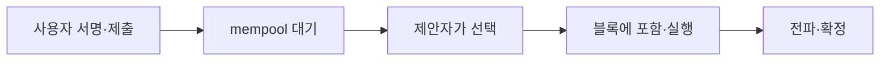

이더리움에서 트랜잭션 하나가 제출되어 블록에 담기고, 그 블록이 체인에 연결되기까지를 따라간다.
블록이 하나 늘 때마다 헤더의 어떤 필드가 바뀌는지까지가 이 글의 범위다.

## 1. 블록 = 헤더 + 바디

블록은 두 부분으로 되어 있다.

- **헤더** — 이 블록의 요약. 부모 블록의 해시(parentHash), 블록 번호, 시각, 각종 루트 해시가 들어간다.
- **바디** — 트랜잭션 목록. (검증자 인출 목록 등 몇 가지가 더 있다)

헤더의 루트 해시들은 바디와 상태의 요약이다. transactionsRoot 는 바디에 담긴 트랜잭션 전체를, stateRoot 는 트랜잭션 실행이 끝난 뒤의 전체 계정 상태를 각각 해시 하나로 요약한다. 그래서 바디나 상태가 한 바이트라도 다르면 헤더가 달라지고, 헤더가 달라지면 블록 해시도 달라진다.

## 2. 트랜잭션이 블록에 담기기까지

사용자가 트랜잭션에 서명해 노드에 보내면 바로 블록에 들어가는 게 아니다. 먼저 **mempool** 이라는 대기열에 쌓이고, 블록 제안자가 골라야 블록에 담긴다.



어떤 트랜잭션이 먼저 뽑히는지는 수수료가 정한다. 이더리움 수수료는 두 부분이다.

- **baseFee** — 프로토콜이 블록마다 정하는 최저 단가. 지불되면 소각된다.
- **tip (priority fee)** — 제안자에게 주는 웃돈.

블록에는 가스 한도가 있어 담을 수 있는 양이 정해져 있고, 제안자는 팁이 높은 트랜잭션부터 담는 것이 유리하다. 그래서 네트워크가 붐빌수록 팁을 올려야 빨리 포함된다.

## 3. 블록 생성 — 12초마다 열리는 슬롯

이더리움은 지분증명(PoS)으로 12초마다 **슬롯**이 하나 열리고, 슬롯마다 검증자 한 명이 그 슬롯의 **블록 제안자**로 무작위 선출된다.

슬롯은 누가 열어주는 게 아니라 시간표다. 비콘 체인이 시작된 시각(제네시스)부터 12초 간격으로 미리 잘라져 있어서, 모든 노드가 각자의 시계만 보고 지금이 몇 번 슬롯인지 같은 답을 얻는다. 그래서 슬롯마다 세 경우 중 하나가 된다 — 트랜잭션이 많으면 골라 담고, 하나도 없어도 바디만 빈 블록을 만들며, 제안자가 다운되어 있으면 그 슬롯은 블록 없이 지나간다(빈 슬롯). 빈 블록이라도 헤더는 바뀐다 — 5절에서 보듯 number·parentHash·timestamp·prevRandao 는 블록이 생길 때마다 기계적으로 바뀐다.

제안자의 "무작위 선출"도 마찬가지로 뽑아 주는 주체가 없다 — 체인에 쌓인 무작위 값(prevRandao)을 시드로 전원이 같은 추첨 계산을 돌린다:

```anim
proposer
```

제안자가 하는 일은 순서대로:

1. mempool 에서 트랜잭션을 골라 바디에 담는다.
2. 담은 트랜잭션을 순서대로 실행한다.
3. 실행 결과로 stateRoot·transactionsRoot·receiptsRoot 등 헤더 필드를 채운다.
4. parentHash 에 직전 블록의 해시를 넣고, 블록에 서명해 네트워크에 전파한다.

다른 검증자들은 전파된 블록을 검증하고 찬성 투표(attestation)를 보낸다. 아래 애니메이션이 이 과정을 단계별로 보여준다.

```anim
block-lifecycle
```

전파 직후의 블록은 아직 뒤집힐 수 있다. 에폭(32슬롯, 약 6.4분) 단위의 투표가 쌓여 **최종 확정(finality)** 되면 — 보통 두 에폭, 약 13분 — 그 이후로는 되돌릴 수 없다.

## 4. 자식 블록 — parentHash 로 이어지는 체인

새 블록 헤더의 parentHash 는 부모 블록 헤더의 해시다. 블록 해시는 헤더 전체를 해시한 값이므로:

- 부모 블록의 내용을 하나라도 바꾸면 → 부모의 해시가 달라진다
- 그러면 자식이 들고 있는 parentHash 와 안 맞아 → 연결이 끊긴다
- 과거 블록 하나를 고치려면 그 뒤의 블록을 전부 다시 만들어야 한다

이것이 블록체인의 변조가 사실상 불가능한 이유다.

전파 지연 등으로 같은 높이에 블록이 두 개 생기는 **포크**도 있다. 이때는 검증자 다수의 투표를 받은 가지가 살아남고 반대쪽 가지의 블록은 버려진다. 방금 포함된 트랜잭션이 확정 전까지 뒤집힐 수 있는 것도 이 때문이고, 입금 처리에서 컨펌 수를 기다리는 이유가 이것이다. 컨펌을 세는 법과 확정의 기준은 [1장](01-finality.md)에서 이어진다.

## 5. 블록마다 바뀌는 정보

블록이 하나 늘 때 헤더의 주요 필드가 언제 바뀌는지 정리하면 (blob 데이터 용량 등 일부 필드는 생략):

| 헤더 필드 | 언제 바뀌나 | 설명 |
|---|---|---|
| number | 매 블록 | 부모 번호 +1 |
| parentHash | 매 블록 | 부모 헤더의 해시 |
| timestamp | 매 블록 | 슬롯 시각. 12초 간격, 빈 슬롯을 건너뛰면 그만큼 더 벌어진다 |
| prevRandao | 매 블록 | 제안자 선출에 쓰이는 무작위 값 |
| stateRoot | 사실상 매 블록 | 실행 후 전체 계정 상태의 요약. 트랜잭션이 없어도 그 블록에 검증자 인출이 반영되면 달라진다 |
| transactionsRoot | 담긴 tx 에 따라 | 바디 트랜잭션 목록의 요약 |
| receiptsRoot · logsBloom | 담긴 tx 에 따라 | 실행 결과와 이벤트 로그의 요약 |
| gasUsed | 담긴 tx 에 따라 | 실제 소모된 가스 합계 |
| withdrawalsRoot | 담긴 인출에 따라 | 바디의 검증자 인출 목록 요약 |
| baseFeePerGas | 매 블록 재계산 | 직전 블록이 목표치보다 붐볐으면 인상, 한산했으면 인하. 한 블록에 최대 12.5% |
| feeRecipient | 제안자마다 | 팁을 받을 주소. 제안자가 지정 |
| gasLimit | 블록마다는 안 바뀜 | 블록 가스 한도. 검증자 신호로 한 블록에 1/1024 씩만 움직인다 — 이 계단으로 2025년 30M 에서 60M 까지 올랐다 |

정리하면 헤더 대부분은 매 블록 바뀐다. number·parentHash·timestamp·prevRandao 는 기계적으로 바뀌고, stateRoot 이하의 루트들은 "무엇을 담아 실행했는가"에 따라 바뀐다. 블록 단위로 보면 고정에 가까운 것은 gasLimit 정도다. 트랜잭션이 0개인 빈 블록이라도 "매 블록" 그룹은 전부 바뀐다.
