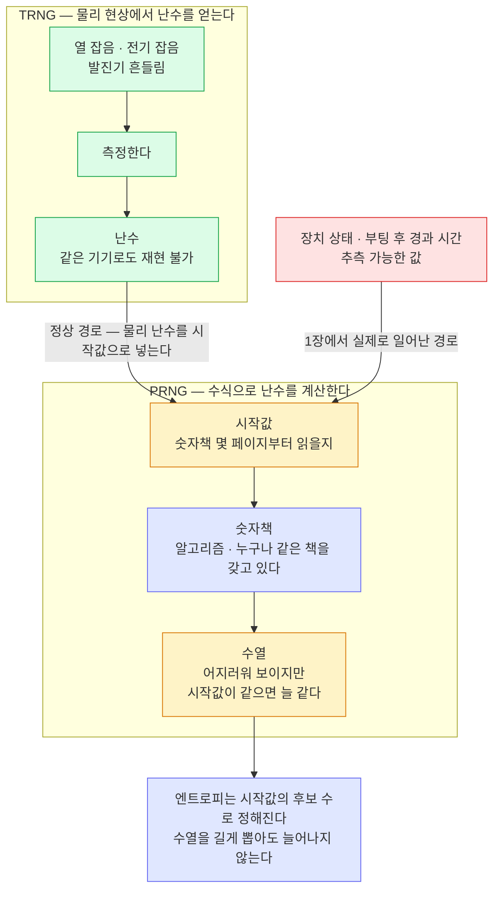

지갑의 개인키는 결국 난수 하나에서 파생된다. 그 난수가 약하면 알고리즘이 아무리 튼튼해도 지갑이 열린다.
엔트로피·니모닉·HD 파생·무작위 대입의 경제성까지, [1장 Coldcard 사건](01-coldcard-entropy-incident.md)을 읽는 데 필요한 바탕을 모았다.

## 엔트로피 — "몇 비트"가 뜻하는 것

엔트로피는 난수를 만드는 **과정이 얼마나 예측 불가능한지**를 나타내고, 단위로 비트를 쓴다. **1비트가 늘어날 때마다 공격자가 확인해야 할 후보가 두 배**가 된다 — 40비트면 2⁴⁰, 약 1.1조 개다.

| 엔트로피 | 경우의 수 | 전수 탐색 |
|---|---|---|
| 40 비트 | 약 1.1조 (1.1 × 10¹²) | **일반 장비로 가능** |
| 72 비트 | 약 4.7 × 10²¹ | 당장 털리진 않지만 **안전 기준 미달** — 1장에서 이 등급도 이전 대상이다 |
| 128 비트 | 약 3.4 × 10³⁸ | 탐색 불가 — 업계 기준선 |

비트가 선형이 아니라 **지수**라는 점이 핵심이다. 128 → 40 비트는 "3분의 1로 줄었다"가 아니라 **탐색 불가에서 실행 가능으로 넘어가는** 변화다. 1장이 그 실물 사례다.

두 가지를 덧붙여야 정확하다.

- **위 대응은 후보가 고르게 나올 때만 성립한다** — 어떤 값이 더 자주 나오도록 뭉쳐 있으면 후보 개수는 그대로여도 실제 강도는 그보다 낮다. 공격자는 자주 나오는 후보부터 찍기 때문이다. 1장에서 다루는 결함이 이 경우다.
- **엔트로피는 시드의 성질이 아니라 시드를 만든 과정의 성질이다** — 같은 24단어라도 주사위로 뽑았는지 부팅 시각으로 뽑았는지에 따라 엔트로피가 다르다. 그래서 이미 만들어진 니모닉을 들여다봐도 그것이 몇 비트짜리인지 알 수 없다. 1장의 사고가 5년간 드러나지 않은 이유가 여기 있다.

## TRNG 와 PRNG — 물리에서 온 난수와 계산으로 만든 난수

난수 생성기를 통틀어 RNG(Random Number Generator)라 하고, 만드는 방식에 따라 둘로 갈린다. 앞에 붙는 글자가 그 방식을 가리킨다 — **T 는 True 로 물리에서 온 진짜 난수**, **P 는 Pseudo 로 계산해서 난수처럼 보이게 만든 것**을 뜻한다.

| | TRNG — 물리에서 온 난수 | PRNG — 계산으로 만든 난수 |
|---|---|---|
| 출처 | 물리 현상 — 전기 잡음·열 잡음 등 | **시작값 하나로 계산해 만든 수열** |
| 예측 | 물리적으로 불가능 | **시작값을 알면 전부 재현 가능** |
| 하드웨어 지갑 | 지갑 시드를 만들 때 이걸 쓴다 | 암호용 PRNG 라도 시작값의 엔트로피가 부족하면 무의미하다 |

암호용으로 설계된 PRNG 는 **CSPRNG**(Cryptographically Secure PRNG)라 부른다. 출력을 여러 개 봐도 다음 값을 예측할 수 없게 만든 PRNG 인데, 시작값이 좁으면 소용없다는 점은 똑같다.

PRNG 를 **아주 긴 숫자책**으로 보면 이해가 쉽다. 숫자가 어지럽게 적힌 책이 있고 모두가 같은 책을 갖고 있다. PRNG 를 쓴다는 건 **몇 페이지부터 읽을지만 정하고** 거기서부터 숫자를 읽어 내려가는 것이다. 그 페이지 번호가 시작값이다.



색: **초록 = 물리에서 온 난수 · 남색 = 공개된 것이라 비밀이 아닌 부분 · 노랑 = 비밀이 실제로 담기는 자리 · 빨강 = 1장에서 무너진 지점**. 화살표 둘이 시작값으로 모이는 것이 요점이다 — 같은 PRNG 를 써도 시작값을 어디서 받았는지에 따라 안전한 난수와 40비트짜리 난수로 갈린다.

읽어낸 숫자는 규칙 없이 어지러워 보인다. 하지만 비밀은 숫자가 아니라 **페이지 번호 하나**에 있다. 책이 43억 페이지짜리면 공격자는 43억 페이지를 다 펼쳐 보면 되고, 숫자가 얼마나 어지러워 보이는지는 상관이 없다.

그래서 가장 중요한 결론은 이것이다. **PRNG 는 엔트로피를 만들어내지 못한다.** 출력을 1기가바이트 뽑아도 그 전체의 엔트로피는 처음 넣은 시작값의 엔트로피와 같다. PRNG 는 엔트로피를 늘리는 게 아니라 **적은 엔트로피를 길게 늘려 펴는** 장치다.

정상적인 하드웨어 지갑은 그래서 둘을 같이 쓴다 — **TRNG 로 시작값을 뽑고, 필요하면 CSPRNG 로 늘려 쓴다.** PRNG 의 위험은 "숫자가 무작위처럼 보이는지"가 아니라 **시작값에 얼마나 많은 엔트로피가 들어갔는지**에 달려 있다. 장치 상태나 부팅 후 경과 시간처럼 **추측 가능한 값**을 시작값으로 쓰면, 출력 수열은 난수처럼 보여도 후보 집합이 작아 전수 탐색이 가능해진다. 이것이 1장 사건의 정확한 지점이다.

## BIP-39 — 엔트로피가 단어가 되는 규칙

니모닉은 엔트로피를 사람이 종이에 적을 수 있는 단어 목록으로 인코딩한 것이다.

- **12단어** = 엔트로피 128비트 + 체크섬 4비트 = 132비트 → 11비트씩 12조각 (단어 목록 2048개 = 2¹¹)
- **24단어** = 엔트로피 256비트 + 체크섬 8비트 = 264비트
- 니모닉 → 시드: **PBKDF2-HMAC-SHA512, 2048회 반복**, salt = `"mnemonic"` + passphrase

### 난수가 단어가 되는 네 단계

단어는 난수를 **다시 표기한 것**이다 — 중간에 새로 뽑거나 섞는 과정이 없다.

1. **엔트로피를 뽑는다** — 12단어면 128비트, 24단어면 256비트.
2. **체크섬을 붙인다** — 엔트로피를 SHA-256 에 넣고, 결과의 앞 (엔트로피 길이 ÷ 32) 비트를 뒤에 이어 붙인다. 128비트면 4비트가 붙어 132비트, 256비트면 8비트가 붙어 264비트가 된다.
3. **11비트씩 자른다** — 132 ÷ 11 = 12조각, 264 ÷ 11 = 24조각. 두 경우 모두 나머지 없이 정확히 나뉜다. 조각 하나가 단어 하나가 된다.
4. **목록에서 그 번호의 단어를 읽는다** — 11비트를 10진수로 읽어 그 번호의 단어를 꺼낸다. 목록은 2048개로 고정이라 11비트가 표현하는 범위(0~2047)와 정확히 맞는다.

엔트로피가 전부 0인 표준 시험값으로 따라가 보면:

| 단계 | 값 |
|---|---|
| 엔트로피 128비트 | `0` 이 128개 |
| SHA-256 결과 앞부분 | `374708ff…` → 첫 4비트 `0011` |
| 이어 붙인 132비트 | `0…0` + `0011` |
| 11비트 조각 12개의 값 | 0, 0, 0, 0, 0, 0, 0, 0, 0, 0, 0, **3** |
| 목록에서 읽은 단어 | 0번 = `abandon`, 3번 = `about` |

결과는 `abandon` 11개 뒤에 `about` 하나가 붙은 니모닉이다. 마지막 단어만 다른 이유는 체크섬 4비트가 그 조각에 들어갔기 때문이다.

24단어도 같은 방식이다. 엔트로피 256비트를 전부 0으로 두면 SHA-256 결과의 앞 8비트가 `01100110`, 즉 102번이 되어 `abandon` 23개 뒤에 102번 단어 `art` 가 붙는다.

목록에 대해 알아둘 것 넷:

- **알파벳 순으로 번호가 매겨져 있다** — 영어 목록은 0번 `abandon` 으로 시작해 2047번 `zoo` 로 끝난다. 순서가 표준으로 정해져 있어 어느 구현을 쓰든 같은 번호가 같은 단어를 가리킨다.
- **언어별 목록이 따로 있다** — 같은 엔트로피라도 어느 목록을 쓰느냐에 따라 단어가 달라지므로, 복구할 때 목록이 맞아야 한다.
- **영어 목록의 단어는 앞 4글자만으로 서로 구분된다** — 손으로 적을 때 뒷글자를 흘려도 복원되게 고른 것이다.
- **체크섬이 오기를 걸러낸다** — 단어를 잘못 적으면 대개 검사에서 걸린다. 다만 12단어의 체크섬은 4비트뿐이라, 틀린 조합이 우연히 통과할 확률이 16분의 1로 남는다.

### 복구할 때는 어느 쪽으로 가나

단어에서 비트로 되돌아가는 변환도 실제로 쓰이지만, 쓰이는 자리가 정해져 있다.

- **오기 검사에 쓴다** — 입력한 단어를 번호로, 번호를 비트로 되돌린 뒤 마지막 체크섬 비트가 맞는지 확인한다. 단어를 잘못 적었는지 여기서 걸러낸다.
- **키 파생은 역순으로 가지 않는다** — 지갑이 실제로 키를 만들 때는 엔트로피로 돌아가지 않는다. **니모닉 문장 자체를 PBKDF2 에 넣어** 512비트 시드를 만들고, 거기서 마스터키를 파생한다.

그래서 "복구할 때 원래 엔트로피를 복원한다"는 설명은 절반만 맞다. 되돌리는 계산은 오기 검사에 쓰이고, 자금에 닿는 경로는 니모닉 문장에서 곧바로 시작한다. 니모닉을 옮겨 적을 때 **단어와 순서를 그대로** 지켜야 하는 이유도 여기 있다 — 문장 자체가 입력값이다.

여기서 중요한 결론 둘:

- **단어 수는 보안의 상한이 아니다** — 12단어의 상한은 128비트지만, 생성 시 엔트로피가 40비트뿐이었다면 **단어 12개를 적어도 실제 강도는 40비트**다. 니모닉은 약한 난수를 강하게 만들어 주지 않는다.
- **passphrase 는 독립된 방어층** — salt 로 들어가므로 니모닉이 전부 노출돼도 passphrase 를 모르면 시드가 나오지 않는다. 반대로 잊으면 복구도 불가능하다.

## BIP-32/44 — 시드 하나가 전부를 결정한다

HD(계층적 결정적) 지갑은 시드에서 마스터키를, 마스터키에서 파생 경로를 따라 자식키를 **계산으로** 만든다.

```
시드 → 마스터키 → m/44'/60'/0'/0/0 → 주소 1
                → m/44'/60'/0'/0/1 → 주소 2  …
```

"결정적"이 뜻하는 것 — 같은 시드는 늘 같은 주소들을 낸다. 백업이 시드 하나로 끝나는 이유이자, **시드가 뚫리면 그 지갑의 모든 주소가 한꺼번에 뚫리는** 이유다. 파생 경로는 표준이라 비밀이 아니다.

## 단방향 사슬 — 개인키에서 주소까지, 거꾸로 가는 길은 없다

시드가 주소가 되기까지는 정해진 순서가 있고, 각 화살표는 **한쪽으로만 계산된다.**

```
난수(엔트로피) → 니모닉 → 시드 → 마스터키 → 개인키 → 공개키 → 주소
```

뒤쪽 두 화살표가 이 사슬을 지탱한다.

| 단계 | 앞으로 갈 때 | 거꾸로 갈 때 |
|---|---|---|
| 개인키 → 공개키 | secp256k1 곡선의 기준점에 개인키를 곱한다. 즉시 계산된다 | 공개키에서 개인키를 되찾는 것은 이산로그 문제다 — 알려진 방법이 없다 |
| 공개키 → 주소 | 해시를 통과시킨다. 이더리움은 Keccak-256 결과의 뒤 20바이트, 비트코인 P2PKH 는 SHA-256 뒤 RIPEMD-160 | 해시는 역산이 안 되고, 게다가 길이가 줄어든다 — 64바이트 공개키가 20바이트 주소가 되면서 정보가 버려진다 |

이 순서가 뒤집히지 않는다는 점에서 세 가지가 따라온다.

- **주소를 공개해도 안전하다** — 주소에서 공개키로, 공개키에서 개인키로 거슬러 갈 수 없다. 그래서 주소를 공개 장부에 그대로 실어도 된다. 출금하면 서명에 공개키가 실려 드러나지만, 거기서 개인키로 가는 길은 여전히 없다.
- **원하는 주소를 먼저 정할 수 없다** — 특정 주소에 맞는 개인키를 구하는 계산이 없다. 앞 글자를 맞춘 주소를 얻으려면 개인키를 무수히 만들어 앞으로 계산해 보는 수밖에 없다.
- **공격도 앞으로만 간다** — 개인키 후보를 만들어 주소까지 계산하고, 그 주소가 실제로 쓰였는지 대조한다. 아래 절의 공격이 정확히 이 순서다.

결론은 하나다. 두 번째·세 번째 화살표는 계산량이 지켜주지만 **첫 단계는 지켜주는 수학이 없다.** 난수가 좁으면 후보 집합 자체가 작아지고, 뒤의 튼튼한 단계들은 공격자가 후보를 확인하는 데 그대로 쓰인다.

## 무작위 대입의 경제성 — 왜 오프라인 공격이 성립하나

시드가 약할 때 공격은 이렇게 흘러간다:

1. 결함을 아는 공격자가 **가능한 시드 후보를 전부 생성**한다 (엔트로피가 40비트면 1.1조 개)
2. 각 후보에서 표준 파생 경로로 **주소를 계산**한다 — 순수 계산, 네트워크 불필요
3. 그 주소들의 잔액을 **체인에서 조회**한다 — 공개 데이터, 무료
4. 잔액이 있는 주소를 발견하면 그 키로 **서명해 쓸어간다**

단계를 넘겨 보라. 색: **청록 = 공격자가 자기 장비에서 만드는 것 · 보라 = 체인에서 읽어오는 공개 정보 · 빨강 = 일치가 나온 지갑**.

```anim
db
table: 공격자의 후보 표 | 시드 후보 | 파생 주소 | 잔액
source: 체인 조회 | 주소 | 잔액
step: ① 후보 생성 — 오프라인 | 결함을 아는 공격자가 가능한 시드를 전부 만든다 (40비트면 1.1조 개 · 그림엔 셋만 둔다)
ins: 공격자의 후보 표 | 후보-A |  | 
ins: 공격자의 후보 표 | 후보-B |  | 
ins: 공격자의 후보 표 | 후보-C |  | 
step: ② 주소 파생 — 오프라인 | 각 후보에서 표준 파생 경로로 주소를 계산한다. 순수 계산이라 네트워크가 필요 없다
upd: 공격자의 후보 표 | 1 | 파생 주소=0x9f…21
upd: 공격자의 후보 표 | 2 | 파생 주소=0x4c…8e
upd: 공격자의 후보 표 | 3 | 파생 주소=0xa7…03
step: ③ 체인 조회 — 공개 데이터 | 그 주소들의 잔액을 체인에서 읽는다. 누구나 무료로 볼 수 있는 정보다
ins: 체인 조회 | 0x9f…21 | 0
ins: 체인 조회 | 0x4c…8e | 12.4
ins: 체인 조회 | 0xa7…03 | 0
upd: 공격자의 후보 표 | 1 | 잔액=0
upd: 공격자의 후보 표 | 2 | 잔액=12.4
upd: 공격자의 후보 표 | 3 | 잔액=0
step: ④ 일치 — 이 후보가 그 지갑의 시드다 | 잔액이 있는 주소가 나오면 그 후보가 실제 시드다. 빨갛게 표시된 행이 곧 털릴 지갑이다
alert: 공격자의 후보 표 | 2
step: ⑤ 인출 | 정상 서명이라 체인은 정당한 거래로 받아들인다 — 기기에 손댄 흔적도, 침입 기록도 남지 않는다
upd: 공격자의 후보 표 | 2 | 잔액=0
upd: 체인 조회 | 2 | 잔액=0
```

이 절차에는 기기 접근·멀웨어·네트워크 침입이 **하나도 필요 없다**. 1·2단계는 완전히 오프라인이고 3단계는 공개 정보 조회다. 그래서 "인터넷에 연결하지 않는 콜드 지갑"이라는 방어가 이 공격 앞에서는 무의미하다 — 방어의 전제가 "공격자가 기기나 네트워크로 들어온다"였기 때문이다.

## 하드웨어 지갑의 구성 — SE 가 하는 일

- **MCU** — 펌웨어가 도는 주 프로세서. 시드 생성 로직이 여기서 실행된다.
- **TRNG** — 난수 하드웨어. 보통 MCU 내장 또는 별도 칩.
- **Secure Element(SE)** — 키를 물리적으로 보호하고, 자체 난수도 제공할 수 있는 보안 칩. 시드 생성에 SE 의 엔트로피를 섞으면 **다른 난수원이 고장 나도 일부 보완**된다(1장의 Mk4/Mk5 가 40비트 대신 72비트였던 이유).
- **주사위 입력** — 사용자가 물리 주사위를 굴려 엔트로피를 직접 보태는 기능. 기기의 난수를 신뢰하지 않아도 되게 만드는 장치이고, 1장에서 **시드 자체를 강하게 만든 유일한 경로**다 (passphrase 는 시드가 아니라 파생을 막는 별개 층이다).

## 빌드·검증 관점 — 코드가 있다고 실행되는 게 아니다

암호 구현의 사고는 알고리즘보다 **빌드·연결 단계**에서 더 자주 난다. 1장을 이해하려면 이 넷을 알아야 한다.

- **`#ifndef` 와 `#if` 는 다르다** — `#ifndef X` 는 "X 가 정의되지 않았는가"만 본다. `X` 를 `0` 으로 정의하면 "정의는 됐지만 값은 0" 이라서, 값으로 끄려는 의도와 정의 여부를 보는 검사가 어긋난다.
- **같은 시그니처의 다른 구현은 조용히 링크된다** — 하드웨어 난수 함수와 소프트웨어 대체 함수가 같은 이름·형태를 가지면, 잘못된 쪽이 연결돼도 빌드는 성공한다. 컴파일러가 잡아주지 않는다.
- **검증은 "도달성"까지 봐야 한다** — 바이너리에 올바른 코드가 들어 있다는 확인은 부족하다. **실제 호출 경로가 그 코드에 닿는지**(심볼 해석·call reachability)를 확인해야 한다.
- **출력물 자체를 통계로 본다** — 난수 생성기는 결과의 분포·중복을 직접 검사하는 것이 최후 방어다. 코드 리뷰만으로는 위 셋을 다 놓칠 수 있다.

## Related

- [1. Coldcard 엔트로피 사건](01-coldcard-entropy-incident.md) — 위 개념들이 실제로 어떻게 무너졌는지
- [2. MPC 를 쓰는 이유](02-why-mpc.md) — 단일 시드를 만들지 않는 방식
- [이더리움 — 트랜잭션 해부](../이더리움/03-transaction-anatomy.md) · [확정](../이더리움/01-finality.md)
