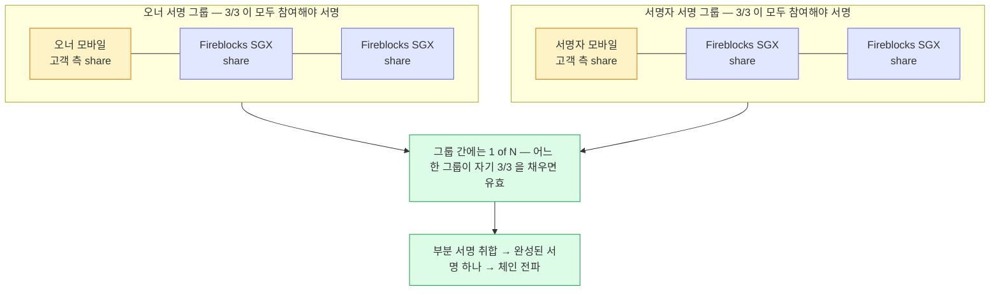

2장은 MPC 를 쓰는 이유였고, 이 장은 Fireblocks 가 실제로 돌리는 프로토콜 하나를 들여다본다 —
share 를 어떻게 합치고, 서명에 몇 곳이 참여하며, 몇 라운드를 주고받는지까지.

## 이름부터 — CMP 는 사람 이름 셋

MPC-CMP 는 Fireblocks 가 구현한 threshold 서명 프로토콜이고, **CMP 는 논문 저자 세 명의 머리글자**다 — Canetti, Makriyannis, Peled. 논문 제목은 *UC Non-Interactive, Proactive, Threshold ECDSA* 이고 **NIST 2020 과 ACM CCS 2020** 에 실렸다. 사내 자체 발명품이 아니라 공개 검증을 받은 프로토콜을 구현한 것이고, 구현 일부는 공개 저장소에 있다.

적용 대상은 **ECDSA 와 EdDSA 둘 다**다. 우리가 다루는 체인은 이 두 곡선 안에 들어간다 — 이더리움·Base 가 ECDSA, 솔라나가 EdDSA 다. 그래서 워크스페이스에는 키셋이 곡선마다 하나씩 존재하고, 백업 파일도 곡선별로 갈린다.

## share 를 더한다 — additive secret sharing

MPC-CMP 가 쓰는 분할 방식은 **additive secret sharing** 이다. Fireblocks 문서는 이것을 "임계값을 참여자 수와 같게 잡은 Shamir 분할(t=n)" 이라고도 부른다. 이름 그대로 **share 를 합치는 연산이 덧셈 하나**라서 Shamir 의 다항식 보간보다 계산이 싸다.

여기서 중요한 성질이 둘 나온다.

- **share 하나가 새도 비밀에 대한 정보가 한 조각도 새지 않는다** — 모든 share 를 다 모으기 전까지는 정보 이론적으로 아무것도 알 수 없다. 이걸 perfect secrecy 라 한다.
- **완전한 비밀이 어느 시점에도 실체화되지 않는다** — 서명할 때만 그런 게 아니라 키를 만드는 과정 중에도 그렇다. Fireblocks 는 이것을 "단일 개인키라는 개념 자체를 없앴다"고 표현한다.

두 번째 성질이 순진한 분할과 갈리는 지점이다. 개인키를 만들어 놓고 셋으로 자르는 방식은 자를 때 한 번, 합칠 때 한 번 완전한 키가 존재한다. 그 순간의 메모리가 곧 표적이 된다.

| | 개인키를 만들어 쪼개는 방식 | additive secret sharing | 멀티시그 |
|---|---|---|---|
| share 하나가 샜을 때 | 비밀의 일부가 드러난다 | **아무 정보도 드러나지 않는다** | 해당 키 하나가 노출된 것 |
| 완전한 키가 존재하는 순간 | 생성 시점과 합치는 시점 | **없다 — 생성 과정 중에도** | 키가 여러 개 따로 존재 |
| 서명 규칙 변경 | 다시 쪼개야 한다 | **가능 — 다른 기기에 영향 없이** | 어렵다. 처음 규칙이 컨트랙트에 고정 |
| 서명자 추가 | 전체 재분할 | **가능 — 새 share 세트를 파생** | 규칙 변경이라 사실상 재구성 |
| 체인 지원 | 체인 무관 | **체인 무관** — 서명 하나만 올라간다 | 체인이 멀티시그를 지원해야 한다 |

멀티시그와의 차이 중 실무에 바로 걸리는 건 마지막 줄이다. MPC 는 체인에 올라가는 결과물이 **평범한 서명 한 건**이라 체인이 멀티시그를 지원하는지 따질 필요가 없다.

## 서명 지점 셋과 임계값 두 층

서명에 참여하는 지점은 **3곳**이고, 각자 자기 share 를 쥔다.

- **고객 측 1곳** — 모바일 기기, 또는 고객이 운영하는 SGX 서버(API Co-Signer). 무인 자동화가 필요하면 후자다.
- **Fireblocks 측 2곳** — Fireblocks 가 운영하는 Intel SGX 서버. 담당자 확답으로는 AWS·Azure·GCP 에 지역 분산되어 있다(공개 문서에는 Azure SGX 로만 적혀 있다).

각 지점은 자기 share 를 만들 때 쓴 난수를 **다른 지점과 공유하지 않는다**. 지갑 주소가 되는 공개키는 세 지점이 함께 계산해서 얻는다.

임계값은 두 층으로 갈린다. 서명 권한이 있는 사용자가 늘어나면 그 사용자마다 **자기만의 3-share 세트**가 새로 생기고, 그 세트는 **오너의 세트에서 파생**된다. 문서 표현으로는 "서명 기기 둘이 같은 share 세트를 공유하는 일은 없다".



색: **노랑 = 고객이 쥔 share · 남색 = Fireblocks 가 쥔 share · 초록 = 취합 단계**. 그룹 안은 전원 참여(3/3), 그룹 사이는 택일(1 of N)이라는 두 층 구조가 요점이다.

이 구조가 운영에 뜻하는 것:

- **어느 한쪽도 혼자 서명하지 못한다** — Fireblocks 도, 고객도. 양쪽 share 가 모두 필요하다.
- **서명자를 늘려도 지갑 주소가 바뀌지 않는다** — 새 세트가 오너 세트에서 파생되므로 마스터 키가 그대로다.
- **오너 세트가 파생의 뿌리**다. 오너 기기·오너 passphrase 의 무게가 다른 사용자와 같지 않은 이유가 여기 있다.
- **Fireblocks 측 co-signer 가 정책을 검증한다** — 금액 임계와 목적지 주소 무결성을 서명 참여 조건으로 본다. 문서는 이것을 "고객이 쥔 키가 탈취된 경우의 안전장치"로 설명한다. 우리 출금 흐름의 서명 직전 검증이 이 자리와 겹친다([블록체인 매니저 — 흐름](../../BC/설계/02-bcm-flow.md)의 서명 직전 검증 절).

## 라운드 4개 — 왜 CMP 를 골랐는가

threshold ECDSA 는 참여자끼리 메시지를 여러 번 주고받아야 서명 하나가 완성된다. 이 왕복 횟수가 곧 지연이고, 이전 세대 프로토콜인 GG18 은 8라운드였다.

| | GG18 | MPC-CMP |
|---|---|---|
| 서명 라운드 | 8 | **4** |
| 사전 계산 | — | **4 중 3 라운드를 거래 전에 미리** |
| 마지막 라운드 | 온라인 | **QR 로 오프라인 전달 가능** |

Fireblocks 는 이 차이를 "800% 빠르다"고 표현한다. 벤더 수치지만 라운드 수 감소 자체는 프로토콜 성질이다.

```anim
mpc-rounds
```

실무에서 더 큰 쪽은 두 번째·세 번째 줄이다. 3라운드를 미리 돌려 두면 거래가 들어온 뒤 남는 왕복이 하나뿐이고, 그 하나를 QR 로 넘길 수 있으면 **서명 기기를 네트워크에서 완전히 떼어 놓을 수 있다**. 콜드월렛 계층을 프로토콜 수준에서 받쳐 주는 성질이다.

문서가 함께 명시하는 프로토콜 성질 셋:

- **proactive security** — share 를 주기적으로 갱신해, 오래 걸쳐 share 를 하나씩 모으는 공격을 무력화한다. 갱신 주기와 절차는 공개 문서에 없다.
- **universal composability** — 다른 프로토콜과 함께 돌려도 안전성이 유지된다.
- **accountability** — 규약을 어긴 참여자를 식별할 수 있다.

## 키를 만들 때의 난수 — 0장의 사슬이 벤더 쪽에 있는 모습

0장에서 본 사슬(난수 → 시드 → 키)은 MPC 에서도 사라지지 않고, share 마다 하나씩 존재한다. Fireblocks 가 그 자리에 대해 명시하는 것:

- **Intel RDRAND** 하드웨어 난수 생성기를 쓰고 **NIST SP 800-90A** 를 따른다.
- 각 share 는 **하드웨어로 격리된 구성요소 안에서** 무작위화된다.
- **수동 단계가 없다** — 키 생성 의식 전체가 자동이다.
- **생성이 실패하면 키가 만들어지지 않는다.** 절반만 만들어진 약한 키가 남지 않는다는 뜻이다.
- 워크스페이스 확장 키는 어디에도 저장되지 않는다.

키가 만들어지는 순간에 세 지점이 각자 무엇을 쥐고 무엇을 함께 계산하는지, 단계로 따라가면 이렇다.

```anim
mpc-keygen
```

1장의 Coldcard 사고와 대조하면 차이가 뚜렷하다. 그쪽은 하드웨어 난수원이 있었는데도 빌드 설정 때문에 실제로는 다른 경로가 쓰였고, 아무도 몰랐다. 위 목록은 **명세**이고, 명세가 실행된다는 확인은 아니다 — 우리가 확인할 수단은 감사 리포트와 인증뿐이라는 2장의 결론이 그대로 남는다.

**예외 하나**: 위 "어디에도 저장되지 않는다"의 유일한 예외가 워크스페이스 키 백업이다. 재해 대비로 share 를 암호화해 recovery package 로 내보낸다. 이 조합이 새 단일 실패점이 되는 이야기는 [2장의 "MPC 가 해결하지 않는 것"](02-why-mpc.md)에 있다.

## 배포 형태 셋 — share 를 누가 쥐는가

같은 MPC-CMP 를 쓰면서도 share 소유가 다른 형태가 있다. 우리가 어느 형태를 쓰는지가 곧 수탁 경계다.

| | 고객 측 share | Fireblocks share | 서명 주체 |
|---|---|---|---|
| **SaaS MPC** (기본) | 1 — 모바일 또는 고객 SGX | **2** | 3-지점 MPC |
| **Hosted MPC** | **3** — Primary Co-Signer 1 + Guard Co-Signer 2, 전부 고객 환경 | **0** | 3-지점 MPC, 전부 고객 측 |
| **Key Link** | MPC share 라는 개념이 없다 | 0 | **고객 HSM 단독 서명**, Fireblocks 는 검증만 |

Hosted MPC 는 Fireblocks 가 share 를 하나도 갖지 않으므로 서명 의식에 참여하지 못한다. 대신 위에 적은 "Fireblocks 측 co-signer 가 정책을 검증한다"는 안전장치도 고객 몫으로 넘어오고, 3 share 전부의 백업 책임도 고객이 진다. Key Link 는 아예 MPC 평면이 없다 — 키가 Fireblocks 쪽에 존재한 적이 없고, 고객 HSM 이 서명한 결과를 Fireblocks 가 검증 키로 확인하는 구조다.

## 확인 필요

- **share 파생의 암호학적 메커니즘** — 오너 세트에서 서명자 세트가 파생된다는 사실과 시점(오너 승인 선행)은 확정이지만, 파생 연산·라운드·중간 실패 처리는 공개 문서에 없다.
- **proactive refresh 의 주기와 절차** — 성질로만 명시되어 있다. 언제 어떤 조건으로 share 가 갱신되는지, 그 사이 서명이 막히는지 확인 필요.
- **Fireblocks 측 SGX 서버의 실제 클라우드 분포** — 담당자 확답(AWS·Azure·GCP 지역 분산)과 공개 문서(Azure) 가 어긋난다.

## Sources

- [MPC-CMP — Fireblocks Support](https://support.fireblocks.io/hc/en-us/articles/6984668676124-MPC-CMP) — 프로토콜 정체, 3-지점 분포, 임계 구조 두 층, additive secret sharing, 라운드 수, 키 생성 난수 명세, 백업 예외
- Canetti · Makriyannis · Peled, *UC Non-Interactive, Proactive, Threshold ECDSA* — NIST 2020 / ACM CCS 2020
- [MPC 101 — Fireblocks](https://www.fireblocks.com/report/what-is-mpc) — 완전한 개인키가 존재하지 않는다는 원칙
- Fireblocks 담당자 확답 (2026-08) — 서명 기기 1개당 share 3개, Fireblocks 측 2개는 SGX 서버에 지역·클라우드 분산

## Related

- [2. MPC 를 쓰는 이유](02-why-mpc.md) — 단일키 지갑과의 대조, MPC 가 해결하지 않는 것
- [0. 시드와 엔트로피](00-seed-and-entropy.md) — 난수 → 시드 → 키 사슬
- [1. Coldcard 엔트로피 사건](01-coldcard-entropy-incident.md) — 난수 명세와 실제 실행이 갈린 사례
- [블록체인 매니저 — 흐름](../../BC/설계/02-bcm-flow.md) — 서명 직전 검증이 붙는 자리
