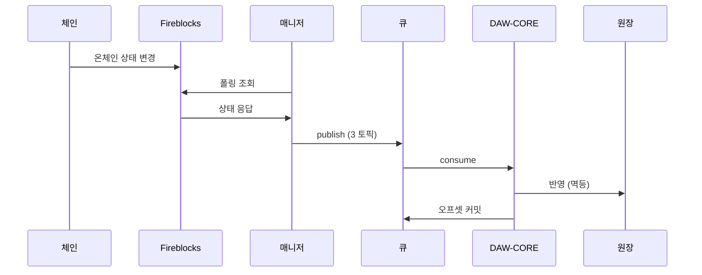

DAW-CORE(Service·Admin)와 스펙을 맞추는 연동 계약 — HTTP 엔드포인트·공통 규약·메시지 큐 이벤트·타입 전체.
정본은 bcm-api-docs/openapi.yaml — 이 문서는 build.py 가 만든 export 라 직접 고치지 않는다.

# Blockchain Manager API

`v0.0.2`

블록체인 매니저는 사내의 별도 서비스로, 온체인 거래(노드 연동)를 담당한다.
DAW-CORE(Service·Admin)는 이 HTTP API 로 계정·주소·잔액·거래를 다루고,
온체인 상태 변경은 메시지 큐 이벤트로 받는다.

아래 규약은 **모든 엔드포인트에 공통** 적용된다.

## 응답 형식

성공·목록·에러 모두 같은 구조로 돌려준다. `meta.requestId` 로 요청을 추적한다.

단일 리소스:

```json
{
  "data": {
    "ref": "ACT-000123",
    "accountId": "acct_01H8X"
  },
  "meta": {
    "requestId": "3f9a1c2e-7b4d-4e2a-9c1f-0a2b3c4d5e6f"
  }
}
```

페이지네이션 목록:

```json
{
  "data": [
    { "txId": "tx_9f2a", "status": "COMPLETED", "amount": "1.5" }
  ],
  "meta": {
    "requestId": "3f9a1c2e-7b4d-4e2a-9c1f-0a2b3c4d5e6f"
  },
  "pagination": {
    "nextCursor": "eyJsYXN0IjoxNzUxMzM2MDAwMDAwfQ",
    "hasMore": true
  }
}
```

에러:

```json
{
  "error": {
    "code": "ACCOUNT_NOT_FOUND",
    "message": "account not found"
  },
  "meta": {
    "requestId": "3f9a1c2e-7b4d-4e2a-9c1f-0a2b3c4d5e6f"
  }
}
```

## 데이터 포맷

- **시각** — ISO 8601, UTC, 밀리초. 예: `2026-07-13T04:05:06.789Z`
- **금액** — 문자열(decimal). 예: `"1.5"`. float 가 아니라 decimal 로 파싱한다.
- **필드명** — camelCase (`externalTxId` · `numOfConfirmations`)
- **요청 추적** — 모든 응답에 `meta.requestId`
- **온체인 해시** — 전파 후 채워짐(그 전엔 null), `txHash`

## 에러 코드

판단은 `error.code` 로 한다.

| 코드 | HTTP | 뜻 |
|---|---|---|
| `VALIDATION_FAILED` | 400 | 요청 형식·값이 규약에 안 맞음 |
| `ACCOUNT_NOT_FOUND` | 404 | 계정 없음 (주소 미발급과 구분) |
| `NOT_FOUND` | 404 | 그 밖의 리소스 없음 |
| `CONFLICT` | 409 | 상태·멱등 충돌 (예: 이미 쓴 externalTxId) |
| `RELAY_REJECTED` | 502 | 대납 relay 가 전송을 못 대거나 거절 |
| `INTERNAL` | 500 | 서버 내부 오류 |

`INTERNAL`(500) 은 모든 엔드포인트에서 날 수 있어, 오퍼레이션별 응답 표기에서는 생략한다.

## 페이지네이션

목록은 **커서 방식**이다. `limit`(기본 200, 최대 500)으로 크기를 정하고, 응답 `pagination.nextCursor` 를 다음 요청 `cursor` 로 넘겨 이어받는다. 지금 이어받을 페이지가 있는지는 `hasMore` 로 판단한다 — false 면 현재 시점 마지막 페이지다.

`nextCursor` 는 **마지막 페이지에서도 항상 채워진다** — 이번 응답 마지막 항목의 다음 위치를 가리킨다. `order=asc` 조회에서는 이 커서를 보관했다가 나중에 같은 값으로 재요청하면 그 사이 새로 쌓인 내역만 이어받는다(증분 폴링). `order=desc`(기본, 최신순)는 커서가 과거 방향으로 진행하므로 페이지 순회용이다.

`cursor`/`nextCursor` 는 **불투명 토큰**이라 파싱·구성 대상이 아니며, 받은 값을 그대로 전달한다(다음 위치·필터·정렬 방향이 토큰에 담겨 있다). 커서 요청에서는 첫 요청의 조회 조건이 토큰으로 이어지므로, 함께 보낸 다른 파라미터는 무시된다.

## 멱등

- **생성** — `createAccount` 는 `ref`, `createDepositAddress` 는 `(accountId, asset)` 로 멱등하다. 같은 값으로 재요청하면 매니저가 같은 결과를 돌려준다(DAW-CORE가 별도 멱등키를 넣지 않는다).
- **출금 제출** — 본문 `externalTxId` 가 멱등 키다. 같은 키로 재제출해도 중복 전송되지 않는다.

## 이벤트 (메시지 큐)

온체인 상태 변경(입금 감지·출금 확정 등)은 이 HTTP API 가 아니라 **메시지 큐 이벤트**로 온다. DAW-CORE는 토픽별 컨슈머로 받는다.



| 토픽 | 담는 이벤트 | 파티션 키 |
|---|---|---|
| `deposit-events` | 고객 입금 (`DEPOSIT` · `UNMAPPED`) | 고객 accountId |
| `withdrawal-events` | 외부 출금 (`WITHDRAWAL`) | 출금 풀 vault 의 accountId |
| `internal-events` | 내부 이체 (`INTERNAL`) | 출발 계정 accountId |

`UNMAPPED`(귀속 불명)은 대응되는 고객 계정이 없어 이벤트의 `accountId` 가 null 일 수 있다.

**ChainEvent** — 큐로 오는 이벤트 형태 (타입 [ChainEvent](#chainevent)):

```json
{
  "type": "WITHDRAWAL",
  "txId": "tx_9f2a",
  "txHash": "0x4e1d...ab",
  "externalTxId": "wd-260713-0042",
  "accountId": "acct_pool_02",
  "asset": "ETH_USDC",
  "to": "0x9f...E2",
  "status": "COMPLETED",
  "numOfConfirmations": 12,
  "subStatus": "CONFIRMED",
  "networkStatus": "CONFIRMED"
}
```

- [`type`](#eventtype) — DEPOSIT · UNMAPPED · WITHDRAWAL · INTERNAL
- [`status`](#txstatus) — 공통 상태 다섯 (아래 "상태 (TxStatus) 기준")
- `txHash` — 전파 후 채워짐
- `subStatus` — 벤더 상세 사유. 분기 필요한 최소 집합만 보고 나머지는 로깅한다
- `networkStatus` — 체인 레이어 상태

전달 보장:

- **at-least-once** — 같은 이벤트가 드물게 두 번 올 수 있다. 이벤트 ID(`txId` 또는 `externalTxId`) 유일 기준으로 **상태 전이만 반영**한다.
- **오프셋 커밋** — 원장 반영이 성공한 뒤에만.
- **순서** — 같은 계정은 파티션 키가 보장.
- **입금 시작 상태** — 입금은 `SUBMITTED` 없이 `CONFIRMING` 부터 온다 (`SUBMITTED` 는 우리가 제출하는 거래에서만 관찰).
- `REJECTED`(일시적) ≠ `FAILED`(영구). 확정은 `numOfConfirmations` 를 체인별 임계와 직접 비교한다.

## 상태 (TxStatus) 기준

거래·이벤트의 `status` 는 이 다섯이 기준이다. 벤더 원어는 매니저가 이 다섯으로 번역하고, `subStatus`·`networkStatus` 는 분기 필요한 최소 집합만 본다.

| 공통 상태 | 뜻 | 벤더(Fireblocks) 원어 | 대표 subStatus | networkStatus | DB `tx_stcd` |
|---|---|---|---|---|---|
| `SUBMITTED` | 제출됨 — 서명·전파 준비 중, 아직 체인 미등장 (출금만 관찰) | PENDING_SIGNATURE · QUEUED · BROADCASTING | — | 서명 단계엔 없음 → BROADCASTING | PENDING |
| `CONFIRMING` | 전파 후 체인 등장, 컨펌 누적 중 (미확정) | CONFIRMING | PENDING_BLOCKCHAIN_CONFIRMATIONS | CONFIRMING | PENDING |
| `COMPLETED` | 확정 — 확정 정책(DCCP) 임계 컨펌 도달 = finality | COMPLETED | CONFIRMED | CONFIRMED | CONFIRMED |
| `REJECTED` | 거부·차단 — 정책·스크리닝에 막힘. 영구 실패가 아니라 사람 개입 여지 | REJECTED · BLOCKED | AUTO_FREEZE · FROZEN_MANUALLY · REJECTED_AML_SCREENING | 출금(전파 전 차단)은 없음 · 입금 동결은 CONFIRMED | — (미정) |
| `FAILED` | 영구 실패 — 사유 동반 (수수료 부족·revert 등) | FAILED | DROPPED_BY_BLOCKCHAIN (reorg 증발) · 그 외 | FAILED (revert) · DROPPED (mempool 누락) | FAILED |

판단은 다섯(`status`)으로 한다. `REJECTED`(일시적) ≠ `FAILED`(영구) 구분이 원장·화면 처리를 가른다.
`DB tx_stcd` 는 DAW-CORE 상태 대응(제안)이다 — `REJECTED` 는 DB 에 짝이 없어 미정, `CHECKING`·`CANCELLED` 는 DB 고유 상태.

## API

### Accounts
계정과 입금 주소

#### `POST` https://{baseUrl}/blockchain/manage-api/accounts

**계정 생성**

`ref`(우리 참조 키)로 vault 를 만들고 `ref ↔ accountId` 매핑을 반환한다. `ref` 는 DB 계정 ID 를 쓴다 — 고객 `ACT-000123`, 운영(관리) `SYS-000001`.
고객 계정뿐 아니라 운영(관리) 계정도 이 오퍼레이션으로 만든다 — 운영 계정은 역할별로 HOT_OPS(운영)·FEE_MGT(가스비)·RESERVE(준비금)이 있다.
같은 `ref` 재요청은 같은 `accountId` 를 돌려준다 (매니저가 `ref` 로 멱등 보장).

_요청 본문_

```json
{
  "ref": "ACT-000123"
}
```

| 필드 | 타입 | 필수 | 설명 |
|---|---|---|---|
| `ref` | string | 필수 | 우리 참조 키 (영구 유일) — DB 계정 ID. 고객 `ACT-000123`, 운영(관리) `SYS-000001` (역할 HOT_OPS·FEE_MGT·RESERVE). |


_응답_

`201` — 생성됨(또는 멱등 재요청)

```json
{
  "data": {
    "ref": "ACT-000123",
    "accountId": "acct_01H8X"
  },
  "meta": {
    "requestId": "3f9a1c2e-7b4d-4e2a-9c1f-0a2b3c4d5e6f"
  }
}
```

| 필드 | 타입 | 필수 | 설명 |
|---|---|---|---|
| `data` | Account | 필수 |  |
| `meta` | Meta | 필수 |  |


`400` — 요청 검증 실패

```json
{
  "error": {
    "code": "VALIDATION_FAILED",
    "message": "amount must be a decimal string"
  },
  "meta": {
    "requestId": "3f9a1c2e-7b4d-4e2a-9c1f-0a2b3c4d5e6f"
  }
}
```

| 필드 | 타입 | 필수 | 설명 |
|---|---|---|---|
| `error` | ErrorBody | 필수 |  |
| `meta` | Meta | 필수 |  |


#### `POST` https://{baseUrl}/blockchain/manage-api/accounts/{accountId}/assets/{asset}/address

**입금 주소 발급**

자산 지갑을 활성화하고 입금 주소를 발급한다. EVM 은 자산당 주소 하나다.
같은 (accountId, asset) 재요청은 같은 주소를 돌려준다 (매니저가 멱등 보장).

_파라미터_

| 이름 | 위치 | 타입 | 필수 | 예시 | 설명 |
|---|---|---|---|---|---|
| `accountId` | path | string | 필수 | acct_01H8X | 매니저가 돌려준 vault 핸들 (DB ext_acnt_id = vaultAccountId) |
| `asset` | path | string | 필수 | ETH_USDC | 자산 식별 (체인 × 토큰) |


_응답_

`201` — 발급됨(또는 멱등 재요청)

```json
{
  "data": {
    "address": "0xAb3...C9",
    "memoTag": null
  },
  "meta": {
    "requestId": "3f9a1c2e-7b4d-4e2a-9c1f-0a2b3c4d5e6f"
  }
}
```

| 필드 | 타입 | 필수 | 설명 |
|---|---|---|---|
| `data` | Address | 필수 |  |
| `meta` | Meta | 필수 |  |


`400` — 요청 검증 실패

```json
{
  "error": {
    "code": "VALIDATION_FAILED",
    "message": "amount must be a decimal string"
  },
  "meta": {
    "requestId": "3f9a1c2e-7b4d-4e2a-9c1f-0a2b3c4d5e6f"
  }
}
```

| 필드 | 타입 | 필수 | 설명 |
|---|---|---|---|
| `error` | ErrorBody | 필수 |  |
| `meta` | Meta | 필수 |  |


`404` — 계정 없음

```json
{
  "error": {
    "code": "ACCOUNT_NOT_FOUND",
    "message": "account not found"
  },
  "meta": {
    "requestId": "3f9a1c2e-7b4d-4e2a-9c1f-0a2b3c4d5e6f"
  }
}
```

| 필드 | 타입 | 필수 | 설명 |
|---|---|---|---|
| `error` | ErrorBody | 필수 |  |
| `meta` | Meta | 필수 |  |


#### `GET` https://{baseUrl}/blockchain/manage-api/accounts/{accountId}/assets/{asset}/address

**입금 주소 조회**

발급된 입금 주소를 조회한다(벤더 왕복 없음).
- 주소 있음 → `data` 에 주소
- 계정은 있으나 주소 미발급 → `data: null` (주소를 만들지 않는다)
- 계정 없음 → `404 ACCOUNT_NOT_FOUND`

_파라미터_

| 이름 | 위치 | 타입 | 필수 | 예시 | 설명 |
|---|---|---|---|---|---|
| `accountId` | path | string | 필수 | acct_01H8X | 매니저가 돌려준 vault 핸들 (DB ext_acnt_id = vaultAccountId) |
| `asset` | path | string | 필수 | ETH_USDC | 자산 식별 (체인 × 토큰) |


_응답_

`200` — 조회 결과(미발급 시 data=null)

```json
{
  "data": {
    "address": "0xAb3...C9",
    "memoTag": null
  },
  "meta": {
    "requestId": "3f9a1c2e-7b4d-4e2a-9c1f-0a2b3c4d5e6f"
  }
}
```

| 필드 | 타입 | 필수 | 설명 |
|---|---|---|---|
| `data` | Address \\| null | 필수 | 미발급 시 null |
| `meta` | Meta | 필수 |  |


`404` — 계정 없음

```json
{
  "error": {
    "code": "ACCOUNT_NOT_FOUND",
    "message": "account not found"
  },
  "meta": {
    "requestId": "3f9a1c2e-7b4d-4e2a-9c1f-0a2b3c4d5e6f"
  }
}
```

| 필드 | 타입 | 필수 | 설명 |
|---|---|---|---|
| `error` | ErrorBody | 필수 |  |
| `meta` | Meta | 필수 |  |


### Balances
잔액 조회

#### `GET` https://{baseUrl}/blockchain/manage-api/accounts/{accountId}/assets/{asset}/balance

**잔액 조회**

vault 단위 잔액을 가용·대기·잠김으로 돌려준다.
벤더가 보는 vault 잔액이라 대사(reconciliation) 재료다 — 고객별 귀속 잔액이 아니다. 고객별 잔액은 DAW-CORE 원장이 정본이다.

_파라미터_

| 이름 | 위치 | 타입 | 필수 | 예시 | 설명 |
|---|---|---|---|---|---|
| `accountId` | path | string | 필수 | acct_01H8X | 매니저가 돌려준 vault 핸들 (DB ext_acnt_id = vaultAccountId) |
| `asset` | path | string | 필수 | ETH_USDC | 자산 식별 (체인 × 토큰) |


_응답_

`200` — 잔액

```json
{
  "data": {
    "available": "10.5",
    "pending": "1.0",
    "locked": "0"
  },
  "meta": {
    "requestId": "3f9a1c2e-7b4d-4e2a-9c1f-0a2b3c4d5e6f"
  }
}
```

| 필드 | 타입 | 필수 | 설명 |
|---|---|---|---|
| `data` | Balance | 필수 |  |
| `meta` | Meta | 필수 |  |


`404` — 계정 없음

```json
{
  "error": {
    "code": "ACCOUNT_NOT_FOUND",
    "message": "account not found"
  },
  "meta": {
    "requestId": "3f9a1c2e-7b4d-4e2a-9c1f-0a2b3c4d5e6f"
  }
}
```

| 필드 | 타입 | 필수 | 설명 |
|---|---|---|---|
| `error` | ErrorBody | 필수 |  |
| `meta` | Meta | 필수 |  |


### Transactions
수수료 견적·출금 제출·거래 조회

#### `POST` https://{baseUrl}/blockchain/manage-api/transactions

**출금 제출**

출금(또는 내부 이체)을 제출한다. `externalTxId` 로 재제출 중복을 차단한다.
응답은 벤더 tx id(`txId`)이며, 이후 상태 진행은 메시지 큐 이벤트로 따라간다(Events).

_요청 본문_

```json
{
  "externalTxId": "wd-260713-0042",
  "from": {
    "type": "ACCOUNT",
    "accountId": "acct_pool_02"
  },
  "to": {
    "type": "ADDRESS",
    "address": "0x9f...E2"
  },
  "asset": "ETH_USDC",
  "amount": "1.5",
  "note": null,
  "travelRule": null
}
```

| 필드 | 타입 | 필수 | 설명 |
|---|---|---|---|
| `externalTxId` | string | 필수 | 우리 요청 키 — 승인 완료된 출금 지시 1건과 1:1. 재제출 중복 차단·완료 대응 |
| `from` | TransferPeer | 필수 | 보내는 쪽 — type=ACCOUNT 만 허용 |
| `to` | TransferPeer | 필수 | 목적지 |
| `asset` | string | 필수 | 자산 식별 (체인 × 토큰) |
| `amount` | string | 필수 | 금액(문자열 · 부동소수 금지) |
| `note` | string \\| null | - | 벤더 거래 기록 메모 |
| `travelRule` | TravelRule \\| null | - | 트래블룰 게이트가 만든 암호화 산출물 — 해외(Notabene) 출금만 싣고, 국내(VerifyVASP)·개인지갑은 null |


_응답_

`202` — 접수됨(제출)

```json
{
  "data": {
    "txId": "tx_9f2a"
  },
  "meta": {
    "requestId": "3f9a1c2e-7b4d-4e2a-9c1f-0a2b3c4d5e6f"
  }
}
```

| 필드 | 타입 | 필수 | 설명 |
|---|---|---|---|
| `data` | SubmitResult | 필수 |  |
| `meta` | Meta | 필수 |  |


`400` — 요청 검증 실패

```json
{
  "error": {
    "code": "VALIDATION_FAILED",
    "message": "amount must be a decimal string"
  },
  "meta": {
    "requestId": "3f9a1c2e-7b4d-4e2a-9c1f-0a2b3c4d5e6f"
  }
}
```

| 필드 | 타입 | 필수 | 설명 |
|---|---|---|---|
| `error` | ErrorBody | 필수 |  |
| `meta` | Meta | 필수 |  |


`409` — 상태·멱등 충돌

```json
{
  "error": {
    "code": "CONFLICT",
    "message": "externalTxId already used"
  },
  "meta": {
    "requestId": "3f9a1c2e-7b4d-4e2a-9c1f-0a2b3c4d5e6f"
  }
}
```

| 필드 | 타입 | 필수 | 설명 |
|---|---|---|---|
| `error` | ErrorBody | 필수 |  |
| `meta` | Meta | 필수 |  |


`502` — relay 가 전송을 대지 못함·거절 (대납 구성)

```json
{
  "error": {
    "code": "RELAY_REJECTED",
    "message": "relay refused to sponsor gas"
  },
  "meta": {
    "requestId": "3f9a1c2e-7b4d-4e2a-9c1f-0a2b3c4d5e6f"
  }
}
```

| 필드 | 타입 | 필수 | 설명 |
|---|---|---|---|
| `error` | ErrorBody | 필수 |  |
| `meta` | Meta | 필수 |  |


#### `GET` https://{baseUrl}/blockchain/manage-api/transactions/{txId}

**거래 단건 조회**

벤더 tx id(`txId`)로 거래 1건을 조회한다. `txId` 는 출금 제출 응답이나 큐 이벤트에서 얻는다.

_파라미터_

| 이름 | 위치 | 타입 | 필수 | 예시 | 설명 |
|---|---|---|---|---|---|
| `txId` | path | string | 필수 | tx_9f2a | 벤더 tx id |


_응답_

`200` — 거래

```json
{
  "data": {
    "txId": "tx_9f2a",
    "txHash": "0x4e1d...ab",
    "externalTxId": "wd-260713-0042",
    "asset": "ETH_USDC",
    "amount": "1.5",
    "from": "0xA1...C9",
    "to": "0x9f...E2",
    "status": "COMPLETED",
    "numOfConfirmations": 12,
    "createdAt": "2026-07-13T04:05:06.789Z",
    "lastUpdated": "2026-07-13T04:06:10.120Z"
  },
  "meta": {
    "requestId": "3f9a1c2e-7b4d-4e2a-9c1f-0a2b3c4d5e6f"
  }
}
```

| 필드 | 타입 | 필수 | 설명 |
|---|---|---|---|
| `data` | Transfer | 필수 |  |
| `meta` | Meta | 필수 |  |


`404` — 리소스 없음

```json
{
  "error": {
    "code": "NOT_FOUND",
    "message": "transaction not found"
  },
  "meta": {
    "requestId": "3f9a1c2e-7b4d-4e2a-9c1f-0a2b3c4d5e6f"
  }
}
```

| 필드 | 타입 | 필수 | 설명 |
|---|---|---|---|
| `error` | ErrorBody | 필수 |  |
| `meta` | Meta | 필수 |  |


#### `GET` https://{baseUrl}/blockchain/manage-api/accounts/{accountId}/transactions

**거래 목록 조회**

거래 이력을 **거래 시각(createdAt) 기준**으로 조회한다 — 기본 최신순, `order=asc` 면 과거→최신. 기간(`after`/`before`)·상태로 좁히고 커서로 페이지네이션한다.
`order=asc` + `before` 생략 조합이면 마지막 `nextCursor` 를 보관했다가 재요청해 새로 쌓인 내역만 이어받는 증분 폴링이 된다.
상태 변경 실시간 감지는 이 목록이 아니라 이벤트 큐가 담당한다(매니저 내부의 lastUpdated 감지 폴링과 별개).

_파라미터_

| 이름 | 위치 | 타입 | 필수 | 예시 | 설명 |
|---|---|---|---|---|---|
| `accountId` | path | string | 필수 | acct_01H8X | 매니저가 돌려준 vault 핸들 (DB ext_acnt_id = vaultAccountId) |
| `after` | query | string (ISO 8601) | 필수 | 2026-07-01T00:00:00.000Z | 시작 시각 — 거래 시각(createdAt) 기준 (ISO 8601 UTC) |
| `before` | query | string (ISO 8601) | - | 2026-07-13T00:00:00.000Z | 종료 시각 — 거래 시각(createdAt) 기준 (ISO 8601 UTC). 생략하면 상한 없음 — 증분 폴링(`order=asc`) 조회는 생략한다. |
| `order` | query | string | - | desc | 정렬 방향 — 거래 시각(createdAt) 기준. 기본 desc(최신순). 마지막 커서를 보관해 새 내역을 이어받는 증분 폴링은 `asc` 조회에서만 성립한다. |
| `status` | query | TxStatus | - | COMPLETED | 상태 필터 (선택) |
| `limit` | query | integer | - | 200 | 페이지 크기 — 기본 200, 최대 500 (벤더 한도). 1 미만이거나 500 초과면 `400 VALIDATION_FAILED`. |
| `cursor` | query | string | - | eyJsYXN0IjoxNzUxMzM2MDAwMDAwfQ | 다음 위치 커서 — 이전 응답의 `pagination.nextCursor` 를 그대로 넣는다. 불투명 토큰이라 직접 만들거나 해석하지 않는다. 첫 요청엔 생략. cursor 가 있으면 조회 조건은 토큰이 우선이라 함께 보낸 `after`/`before`·`status`·`order`·`limit` 는 무시된다. |


_응답_

`200` — 거래 목록

```json
{
  "data": [
    {
      "txId": "tx_9f2a",
      "txHash": "0x4e1d...ab",
      "externalTxId": "wd-260713-0042",
      "asset": "ETH_USDC",
      "amount": "1.5",
      "from": "0xA1...C9",
      "to": "0x9f...E2",
      "status": "COMPLETED",
      "numOfConfirmations": 12,
      "createdAt": "2026-07-13T04:05:06.789Z",
      "lastUpdated": "2026-07-13T04:06:10.120Z"
    }
  ],
  "meta": {
    "requestId": "3f9a1c2e-7b4d-4e2a-9c1f-0a2b3c4d5e6f"
  },
  "pagination": {
    "nextCursor": "eyJsYXN0IjoxNzUxMzM2MDAwMDAwfQ",
    "hasMore": true
  }
}
```

| 필드 | 타입 | 필수 | 설명 |
|---|---|---|---|
| `data` | Transfer[] | 필수 |  |
| `meta` | Meta | 필수 |  |
| `pagination` | Pagination | 필수 |  |


`400` — 요청 검증 실패

```json
{
  "error": {
    "code": "VALIDATION_FAILED",
    "message": "amount must be a decimal string"
  },
  "meta": {
    "requestId": "3f9a1c2e-7b4d-4e2a-9c1f-0a2b3c4d5e6f"
  }
}
```

| 필드 | 타입 | 필수 | 설명 |
|---|---|---|---|
| `error` | ErrorBody | 필수 |  |
| `meta` | Meta | 필수 |  |


`404` — 계정 없음

```json
{
  "error": {
    "code": "ACCOUNT_NOT_FOUND",
    "message": "account not found"
  },
  "meta": {
    "requestId": "3f9a1c2e-7b4d-4e2a-9c1f-0a2b3c4d5e6f"
  }
}
```

| 필드 | 타입 | 필수 | 설명 |
|---|---|---|---|
| `error` | ErrorBody | 필수 |  |
| `meta` | Meta | 필수 |  |


## 타입

### Meta

| 필드 | 타입 | 필수 | 설명 |
|---|---|---|---|
| `requestId` | string | 필수 | 요청 추적 id (모든 응답에 포함) |


### Pagination

| 필드 | 타입 | 필수 | 설명 |
|---|---|---|---|
| `nextCursor` | string | 필수 | 다음 위치 커서 (불투명 토큰) — 다음 요청 `cursor` 로 그대로 전달. 마지막 페이지에서도 항상 채워지며, `order=asc` 조회면 보관해 뒀다가 이후 새로 쌓인 내역을 이어받는 시작점(증분 폴링)으로 쓴다. |
| `hasMore` | boolean | 필수 | 지금 이어받을 다음 페이지가 있는지 — false 면 현재 시점 마지막 페이지 |


### ErrorBody

| 필드 | 타입 | 필수 | 설명 |
|---|---|---|---|
| `code` | string | 필수 | 에러 코드 (API Conventions 표 참조) |
| `message` | string | 필수 | 사람이 읽는 설명 — 분기 판단은 `code` 로 한다 |


### ErrorResponse

| 필드 | 타입 | 필수 | 설명 |
|---|---|---|---|
| `error` | ErrorBody | 필수 |  |
| `meta` | Meta | 필수 |  |


### Account

| 필드 | 타입 | 필수 | 설명 |
|---|---|---|---|
| `ref` | string | 필수 | 우리 참조 키 (DB 계정 ID) — 고객 ACT-000123, 운영 SYS-000001 (역할 HOT_OPS·FEE_MGT·RESERVE) |
| `accountId` | string | 필수 | 매니저가 돌려주는 vault 핸들 (DB ext_acnt_id = vaultAccountId) |


### Address

| 필드 | 타입 | 필수 | 설명 |
|---|---|---|---|
| `address` | string | 필수 | 입금 주소 |
| `memoTag` | string \\| null | - | EVM 은 null. Tag/Memo 체인만 사용. |


### Balance

금액은 문자열(decimal).

| 필드 | 타입 | 필수 | 설명 |
|---|---|---|---|
| `available` | string | 필수 | 가용 |
| `pending` | string | 필수 | 대기(확정 전) |
| `locked` | string | 필수 | 잠김 — 나가는 중(전파 전) 출금 예약분 + AML 동결분 |


### Transfer

거래 1건. 요청의 `from`/`to`(TransferPeer)는 여기선 확정된 온체인 주소 문자열로 나온다.

| 필드 | 타입 | 필수 | 설명 |
|---|---|---|---|
| `txId` | string | 필수 | 벤더 tx id |
| `txHash` | string \\| null | - | 온체인 거래해시 — 전파 후 채워짐 |
| `externalTxId` | string \\| null | - | 우리 요청 키 |
| `asset` | string | 필수 | 자산 식별 (체인 × 토큰) |
| `amount` | string | 필수 | 금액(문자열) |
| `from` | string | 필수 | 발신 (확정 온체인 주소) |
| `to` | string | 필수 | 목적지 (확정 온체인 주소) |
| `status` | TxStatus | 필수 | `SUBMITTED` `CONFIRMING` `COMPLETED` `REJECTED` `FAILED` |
| `numOfConfirmations` | integer | 필수 | 누적 컨펌 수 |
| `createdAt` | string (ISO 8601) | 필수 | 거래 생성 시각 (목록 정렬·기간 필터 기준) |
| `lastUpdated` | string (ISO 8601) | 필수 | 마지막 상태 변경 시각 |


### ChainEvent

큐로 오는 온체인 상태 변경 이벤트 (HTTP 응답이 아니라 메시지 큐로 전달).

| 필드 | 타입 | 필수 | 설명 |
|---|---|---|---|
| `type` | EventType | 필수 | `DEPOSIT` `UNMAPPED` `WITHDRAWAL` `INTERNAL` |
| `txId` | string | 필수 | 벤더 tx id |
| `txHash` | string \\| null | - | 온체인 거래해시 — 전파 후 채워짐 |
| `externalTxId` | string \\| null | - | 우리 요청 키 (출금·내부이체) |
| `accountId` | string \\| null | - | 파티션 키 (vault 핸들). UNMAPPED 은 귀속 계정이 없어 null 일 수 있다 |
| `asset` | string | 필수 | 자산 식별 (체인 × 토큰) |
| `to` | string | 필수 | 목적지 주소 — 입금 판별 |
| `status` | TxStatus | 필수 | `SUBMITTED` `CONFIRMING` `COMPLETED` `REJECTED` `FAILED` |
| `numOfConfirmations` | integer | 필수 | 누적 컨펌 수 |
| `subStatus` | string \\| null | - | 벤더 상세 사유 — 분기 필요한 최소 집합만 |
| `networkStatus` | string \\| null | - | 체인 레이어 상태 |


### TxStatus

공통 상태 다섯.

| 값 | 설명 |
|---|---|
| `SUBMITTED` | 제출 — 체인 미등장 |
| `CONFIRMING` | 컨펌 누적 (미확정) |
| `COMPLETED` | 확정 |
| `REJECTED` | 거부·차단 (일시적) |
| `FAILED` | 영구 실패 |


### EventType

이벤트 분류. 매니저가 발신자가 우리 vault 인지로 가른다.

| 값 | 설명 |
|---|---|
| `DEPOSIT` | 고객 입금 (매핑된 주소로 수신) |
| `UNMAPPED` | 귀속 불명 — 보류 |
| `WITHDRAWAL` | 외부 출금 |
| `INTERNAL` | 내부 이체 (sweep·정산 등) |


### SubmitResult

| 필드 | 타입 | 필수 | 설명 |
|---|---|---|---|
| `txId` | string | 필수 | 벤더 tx id |


### CreateAccountRequest

| 필드 | 타입 | 필수 | 설명 |
|---|---|---|---|
| `ref` | string | 필수 | 우리 참조 키 (영구 유일) — DB 계정 ID. 고객 `ACT-000123`, 운영(관리) `SYS-000001` (역할 HOT_OPS·FEE_MGT·RESERVE). |


### TransactionRequest

| 필드 | 타입 | 필수 | 설명 |
|---|---|---|---|
| `externalTxId` | string | 필수 | 우리 요청 키 — 승인 완료된 출금 지시 1건과 1:1. 재제출 중복 차단·완료 대응 |
| `from` | TransferPeer | 필수 | 보내는 쪽 — type=ACCOUNT 만 허용 |
| `to` | TransferPeer | 필수 | 목적지 |
| `asset` | string | 필수 | 자산 식별 (체인 × 토큰) |
| `amount` | string | 필수 | 금액(문자열 · 부동소수 금지) |
| `note` | string \\| null | - | 벤더 거래 기록 메모 |
| `travelRule` | TravelRule \\| null | - | 트래블룰 게이트가 만든 암호화 산출물 — 해외(Notabene) 출금만 싣고, 국내(VerifyVASP)·개인지갑은 null |


### TransferPeer

벤더 TransferPeerPath 대응. from·to 공통. type 에 따라 필요한 식별 필드가 정해진다.

| 필드 | 타입 | 필수 | 설명 |
|---|---|---|---|
| `type` | PeerType | 필수 | `ADDRESS` `ACCOUNT` `WHITELISTED` |
| `address` | string \\| null | - | 온체인 주소 (type=ADDRESS 일 때 필수) |
| `accountId` | string \\| null | - | 우리 계정 (type=ACCOUNT 일 때 필수) |
| `walletId` | string \\| null | - | 사전 등록 지갑 id (type=WHITELISTED 일 때 필수) |


### PeerType

| 값 | 설명 |
|---|---|
| `ADDRESS` | 온체인 주소 (외부 출금 → ONE_TIME_ADDRESS) |
| `ACCOUNT` | 우리 계정 (내부 이동 → VAULT_ACCOUNT) |
| `WHITELISTED` | 사전 등록 지갑 (→ EXTERNAL_WALLET) |


### TravelRule

트래블룰 게이트가 만든 **암호화 산출물**이다. 이 API(매니저)는 운반만 하고
내용을 파싱하지 않으므로, 여기서는 내부 구조를 펼치지 않고 불투명한 객체로 둔다.

- 실제 구조의 기준은 **IVMS101 표준 + 트래블룰 솔루션 스펙**(게이트 쪽 문서)이다.
- 시나리오별로 실림 여부가 다르다 — 해외(Notabene)=메시지 있음, 국내(VerifyVASP)·개인지갑=없음(`null`).
- 컴플라이언스가 내보내는 `travelRuleMessage`(암호화 문자열)를 DAW-CORE 가 이 필드로 실어 보낸다 — 정확한 형태는 구현 때 확정.

### AccountResponse

| 필드 | 타입 | 필수 | 설명 |
|---|---|---|---|
| `data` | Account | 필수 |  |
| `meta` | Meta | 필수 |  |


### AddressResponse

| 필드 | 타입 | 필수 | 설명 |
|---|---|---|---|
| `data` | Address | 필수 |  |
| `meta` | Meta | 필수 |  |


### AddressNullableResponse

| 필드 | 타입 | 필수 | 설명 |
|---|---|---|---|
| `data` | Address \\| null | 필수 | 미발급 시 null |
| `meta` | Meta | 필수 |  |


### BalanceResponse

| 필드 | 타입 | 필수 | 설명 |
|---|---|---|---|
| `data` | Balance | 필수 |  |
| `meta` | Meta | 필수 |  |


### TransferResponse

| 필드 | 타입 | 필수 | 설명 |
|---|---|---|---|
| `data` | Transfer | 필수 |  |
| `meta` | Meta | 필수 |  |


### TransfersResponse

| 필드 | 타입 | 필수 | 설명 |
|---|---|---|---|
| `data` | Transfer[] | 필수 |  |
| `meta` | Meta | 필수 |  |
| `pagination` | Pagination | 필수 |  |


### SubmitResponse

| 필드 | 타입 | 필수 | 설명 |
|---|---|---|---|
| `data` | SubmitResult | 필수 |  |
| `meta` | Meta | 필수 |  |

