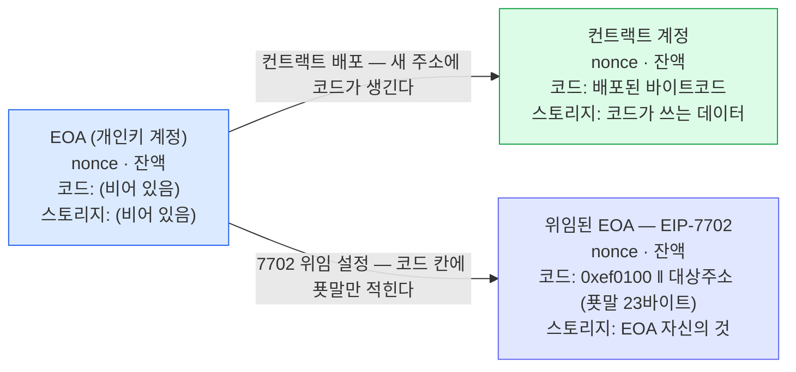
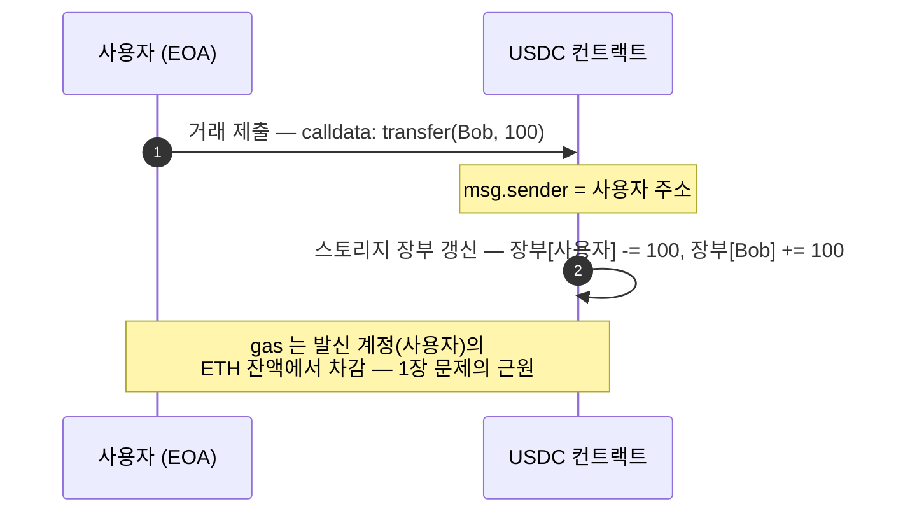
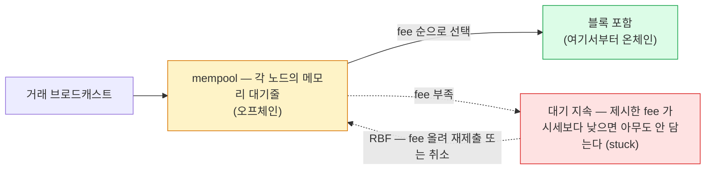

본편 1~10장이 전제하는 이더리움 기초 — 계정·호출·거래·mempool 네 개념을 공개 명세 기준으로 정리한다.
모든 주소는 네 칸짜리 레코드이고 차이는 코드 칸뿐이다. 각 개념이 본문 어디서 쓰이는지는 0.5에 모았다.

## 0.1 계정 — 모든 주소는 네 칸짜리 레코드다

이 장은 이더리움 프로토콜의 공개 기초에 대한 저자 정리다. 본편(1~10장)이 전제하고 있는 개념들을 여기 모았다 — 본편을 읽다가 걸리면 이 장으로 돌아오면 된다. 공개 명세 기준이며, 적용 전 원문 확인을 권장한다.

**EOA 와 컨트랙트의 차이는 "코드 칸이 비어 있는가" 하나다.** 이더리움의 상태(state)는 주소별 레코드 장부다. 어떤 주소든 — 개인 지갑이든 토큰 컨트랙트든 — 레코드의 모양은 같다. 네 칸이다.

| 칸 | 내용 |
|---|---|
| **nonce** | 이 계정이 지금까지 보낸 거래 수 — 재사용·순서 제어에 쓰인다. |
| **잔액** | ETH 잔액. (토큰 잔액이 아니다 — 토큰은 0.2 에서) |
| **코드** | 이 주소가 호출됐을 때 실행할 바이트코드. EOA 는 이 칸이 비어 있고, 컨트랙트는 배포 때 채워진다. |
| **스토리지** | 코드가 쓰는 영구 저장 공간 — 토큰 컨트랙트라면 보유자별 잔액 장부가 여기 있다. |

세 종류처럼 보이지만 레코드 구조는 전부 같다 — 차이는 코드 칸의 내용뿐이다. 비어 있으면 EOA, 바이트코드가 있으면 컨트랙트, 0xef0100 푯말이 있으면 위임된 EOA(9장)다.

- **EOA** — 개인키에서 파생된 주소. 코드 칸이 비어 있고, 거래에 서명할 수 있는 건 이 종류뿐이다. 우리 vault 주소들이 EOA 다.
- **컨트랙트 계정** — 배포된 코드가 있는 주소. 개인키가 없어서 스스로 거래를 시작하지 못하고, 호출을 받아야 움직인다.
- **smart account** — 컨트랙트 계정 중 용도가 "지갑"인 것. 자산을 보관하고 거래 승인 규칙(멀티시그·한도 등)을 자기 코드에 담는다.

## 0.2 호출 — "주소를 호출한다"의 실제 의미

**코드 칸을 꺼내 실행한다 · calldata 로 요청을 전달한다 · msg.sender 로 발신자를 본다.** "어떤 주소를 호출한다"는 말의 실제 의미는 — EVM 이 그 주소 레코드의 코드 칸을 꺼내 실행한다는 것이다. 코드 칸이 비어 있으면(EOA) 실행할 게 없으니 송금만 일어난다.

| 용어 | 뜻 |
|---|---|
| **calldata** | 호출과 함께 전달하는 바이트 — "어떤 함수를 어떤 인자로" 가 인코딩돼 있다. transfer(Bob, 100) 을 호출한다는 건 그 내용이 담긴 calldata 를 보낸다는 것. |
| **msg.sender** | 실행 중인 코드 입장에서 "나를 직접 호출한 주체". 사용자가 토큰 컨트랙트를 직접 호출하면 msg.sender = 사용자. 중간에 다른 컨트랙트가 끼면 msg.sender = 그 컨트랙트다 — GSN 의 발신자 문제(7장)가 여기서 나온다. |
| **tx.origin** | 호출이 몇 단계를 거쳤든 "맨 처음 거래에 서명한 EOA". EOA→A→B 로 이어지면 B 에서 msg.sender = A, tx.origin = EOA 다. |

거래의 to 는 "받는 사람"이 아니다 — **"이 거래로 깨울 코드가 있는 곳"**이다. to = 받는 사람이라는 직관은 ETH 전송에서만 참이다(코드가 없어 송금만 일어나므로 우연히 일치). USDC 전송의 to 는 받는 사람이 아니라 USDC 컨트랙트고, 받는 사람은 calldata 안의 인자다. gasless 전송(9장)은 한 단계 더 가서 to = 보내는 쪽 vault(위임된 EOA) 가 된다 — 깨워야 할 코드(지갑 구현)가 거기 있기 때문이다.

| 전송 종류 | 봉투의 to | 받는 사람은 어디에 |
|---|---|---|
| ETH 전송 | 받는 사람 — 직관 그대로 | to 그 자체 |
| 보통의 USDC 전송 | USDC 컨트랙트 | calldata 안 — transfer(받는사람, 100) 의 인자 |
| gasless USDC 전송 (7702) | 보내는 쪽 vault(EOA) — 지갑 코드를 깨우려고 | calldata 안의 서명된 요청 속 인자 |

토큰 잔액은 내 주소에 있지 않다. USDC 100개를 "가지고 있다"는 것의 실체는 — USDC 컨트랙트의 스토리지 안 장부에 "내 주소: 100" 이라고 적혀 있는 것이다. 그래서 토큰 전송은 내 계정에서 뭔가가 빠져나가는 게 아니라, 토큰 컨트랙트를 호출해서 그 장부의 두 줄을 고치는 일이다.

토큰 전송 한 건의 실체. 토큰 컨트랙트는 "장부[msg.sender] 에서 빼라"로 동작하므로, 누가 호출했는가(msg.sender)가 곧 누구 잔액이 빠지는가다. 대납 표준들이 발신자 문제와 싸우는 이유가 이 한 줄에 있다.

## 0.3 거래 — 서명된 봉투, 그리고 봉투의 서식(타입)

**거래 = 필드 묶음 + 서명 · 타입은 봉투의 서식 버전 · gas 는 opcode 값의 합.** 거래는 필드들을 담고 서명한 봉투다 — 받는 주소(to), 보낼 ETH(value), calldata(data), gas 관련 필드, nonce, 그리고 발신 EOA 의 서명. 이 봉투의 서식이 여러 버전이고, 첫 바이트의 타입 번호로 구분한다.

| 타입 | EIP | 시기 | 추가된 것 |
|---|---|---|---|
| legacy | — | 초기 | 기본 서식 — to · value · data · gasPrice · nonce · 서명. EIP 이전의 원형이다. |
| 0x01 | EIP-2930 | 2021 | access list 필드 — 거래가 건드릴 주소·스토리지를 미리 신고해 gas 를 아끼는 용도. 실무에선 드물게 쓰인다. |
| 0x02 | EIP-1559 | 2021 | 수수료 필드 개편(maxFeePerGas · maxPriorityFeePerGas) — 지금 대부분의 거래가 이 서식이다. |
| 0x03 | EIP-4844 | 2024 | blob 데이터 필드 — 롤업용 대용량 첨부. |
| 0x04 | EIP-7702 | 2025 (Pectra) | authorization_list 필드 — "이 EOA 의 코드 칸에 위임 푯말을 적어 달라"는 승인 목록을 실을 수 있는 칸이 추가된 서식. 9장의 그 거래 타입이다. |

"새 거래 타입"은 새로운 종류의 무언가가 아니라 필드가 한 칸 더 있는 새 봉투 서식이다. 노드는 타입 번호를 보고 어떤 필드가 들어 있고 어떻게 처리할지 안다. "타입 번호가 붙은 봉투"라는 틀 자체는 EIP-2718 이 정의했고, 이후의 서식들이 그 틀 위에 하나씩 추가됐다. 봉투가 완성(서명)되면 그 바이트 전체의 해시가 txHash — 거래 하나를 가리키는 유일 식별자로, 타입(서식 번호)과는 별개다.

### gas — 실행 비용의 단위

**opcode** 는 EVM 의 기계어 명령 하나다. 컨트랙트 코드는 컴파일되면 opcode 의 나열이 된다 — 더하기(ADD), 저장소 쓰기(SSTORE), 현재 블록 시각 읽기(TIMESTAMP), 다른 컨트랙트 호출(CALL) 같은 것들.

opcode 마다 정가가 있다 — 계산이 무겁거나 저장 공간을 쓰는 명령일수록 비싸다. 거래의 gas 사용량 = 실행된 opcode 값의 총합이다. 수수료 = gas 사용량 × 단가이고, 단가(gas price)는 네트워크 혼잡도에 따라 시장에서 정해진다. 이 수수료가 발신 계정의 ETH 잔액에서 차감된다 — 1장 문제의 근원이자, 대납 세트 전체가 다루는 지점이다.

## 0.4 mempool — 온체인이 되기 전의 대기줄

**mem = memory. 블록에 들어가기 전까지 거래는 노드의 메모리에서 대기한다.** 거래를 제출(브로드캐스트)하면 바로 체인에 기록되는 게 아니다. 각 노드의 메모리에 있는 대기줄(mempool) 에 들어가고, 블록 생산자가 수수료 높은 것부터 골라 담는다. 블록에 포함되는 순간부터가 온체인이다.

거래의 대기와 확정. mempool 은 체인이 아니라 노드들의 메모리라서 오프체인이다. fee 를 낮게 내면 대기가 길어지고(stuck), 해결은 같은 nonce 로 fee 를 올려 다시 내는 것(RBF)뿐이다 — Gasless Relay 가 이 재촉을 자동으로 해 주지 않는다는 제약이 3장 운영 caveat 에 있다.

ERC-4337 의 UserOperation mempool(8장)은 같은 개념의 별도 판이다 — 일반 노드들이 아니라 Bundler 들끼리의 망에서 UserOperation 이 대기하고, Bundler 가 handleOps 거래를 제출하는 순간부터 온체인이다.

## 0.5 본문과의 연결 — 어느 개념이 어디서 쓰이나

본편을 읽다가 걸린 지점에서 역으로 찾아오는 표다.

| 이 개념이 | 본문 여기서 쓰인다 |
|---|---|
| gas 는 발신 계정의 ETH 에서 (0.3) | 1장 — 수탁 지갑의 문제 정의 전체가 이 규칙에서 출발한다. |
| msg.sender (0.2) | 7장 — 대납하면 제출자가 바뀌어 msg.sender 가 forwarder 가 되는 것이 GSN 의 발신자 문제. 토큰 장부가 "장부[msg.sender] 에서 빼라"로 동작하기 때문이다. |
| calldata (0.2) | 7장 — forwarder 가 원 서명자 주소를 "calldata 끝 20바이트"에 붙이는 자리. |
| tx.origin (0.2) | 9장 — 7702 가 깨는 전제 중 하나(tx.origin == msg.sender). |
| opcode 와 gas 정가 (0.3) | 8장 — 4337 검증 단계의 opcode 제한(시뮬레이션과 온체인의 결과가 달라지는 명령 금지), Circle 의 deadline=maxUint256 이 그 흔적. |
| 거래 타입 (0.3) | 9장 — 0x04 = authorization_list 칸이 추가된 봉투 서식. |
| 계정의 코드 칸 (0.1) | 9장 — 위임 지정자 0xef0100 ‖ 대상주소 는 빈 코드 칸에 적히는 23바이트 푯말이고, 호출이 오면 EVM 이 푯말을 따라가 그 코드를 EOA 컨텍스트에서 실행한다. |
| mempool (0.4) | 8장 — UserOperation mempool 은 같은 개념의 별도 판. 3장 — stuck 거래의 수동 RBF caveat. |
| smart account (0.1) | 8장 — 4337 의 sender 전제. 9장 — 7702 는 EOA 가 EOA 인 채로 그 코드를 빌려 쓰는 길. |
