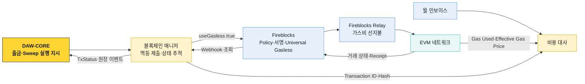

# Universal Gasless 적용 범위

우리 시스템은 EVM 스테이블코인 거래의 가스비를 Fireblocks Universal Gasless와 Fireblocks-managed Relay로 처리한다. 고객 Vault·옴니버스·출금 풀에 가스비 목적의 기본 자산을 배포하지 않고, Relay가 선지불한 네트워크 비용을 월 청구서로 정산한다.

이 결정은 2026-08-13 채택 방식과 [2026-08-18 Fireblocks 담당자 과금 답변](https://github.com/eunsujeo/eunpus/blob/main/blockchain-manager/sources/fireblocks-support/2026-08-18__gasless-relay-billing-conversation.md)을 기준으로 한다.

## 채택 결정

| 항목 | 결정 |
|---|---|
| 대상 | EVM 스테이블코인 Transfer·Contract Call |
| Gasless 제품 | Universal Gasless |
| Relay | Fireblocks-managed Relay |
| Gas Station | 사용하지 않음 |
| Local Relay | 사용하지 않음 |
| External Workspace Relay | 사용하지 않음 |
| 네이티브 자산 전송 | 서비스 범위 밖. Gasless Fallback으로 취급하지 않음 |
| 비용 정산 | Fireblocks 선지불·USD 월말 인보이스·가스 실비 + 월 구독료 |
| 실패 Fallback | 일반 거래 자동 전환 없음 |

가스비 지불 모델과 ERC·EIP 구조는 [디지털 자산 가스 대납 문서](../../디지털%20자산/가스대납/00-overview.md)에 기록한다. 이 문서 묶음은 채택한 방식이 블록체인 매니저의 제출·상태·대사에 미치는 영향만 다룬다.

## 시스템 경계

## 책임

| 주체 | 책임 | 책임이 아닌 것 |
|---|---|---|
| DAW-CORE | 고객 잔액·한도·주소·컴플라이언스·비용 귀속 | Fireblocks Gasless 설정·체인 상태 판정 |
| 블록체인 매니저 | 지원 범위 검증, `useGasless` 제출, 멱등, Vendor ID·Hash·상태·수수료 추적 | 고객 과금 정책, Relay 계약·Policy 편집 |
| Fireblocks | Vault 서명, Policy 평가, EIP-7702 Upgrade, Relay 연결, 상태 제공 | 고객 원장·업무 승인 정본 |
| Fireblocks Relay | 네트워크 비용 선지불, 월 사용량 청구 | 자산 이동 의사·고객 권한 판단 |
| 비용 대사 | 온체인 실비·실행 결과·인보이스 연결 | 거래 제출·서명 |

## 불변조건

- 지원 체인·자산·Operation이 확인되지 않으면 Gasless 거래를 제출하지 않는다.
- 모든 대상 거래는 `useGasless: true`를 명시한다.
- Gasless 실패를 직접 수수료 거래로 자동 재제출하지 않는다.
- Fireblocks Transaction ID·External Transaction ID·Transaction Hash를 같은 실행 건에 연결한다.
- 최초 Upgrade 거래와 이후 거래를 구분하되 고객 Vault 주소는 바꾸지 않는다.
- Relay가 수수료를 부담해도 Transfer·Allowance·Contract Call 권한 검증을 생략하지 않는다.
- Broadcast 전 거절과 온체인 Revert를 같은 실패로 기록하지 않는다.
- 월 청구 금액은 온체인 Receipt와 실행 식별자를 통해 대사한다.

## 문서 구성

| 문서 | 내용 |
|---|---|
| [출금·Sweep 적용 흐름](01-application-scope-and-flow.md) | 제출 위치, `useGasless`, 첫 Upgrade, Approve·Batch 호출 |
| [상태·실패·모니터링](02-state-failures-monitoring.md) | 전파 전 거절, Pending·RBF·Revert, 이벤트와 비용 대사 |
| [PoC·출시 확인 항목](03-poc-and-release-gates.md) | 확인된 범위, 미확정 항목, Sandbox 시나리오와 출시 기준 |
