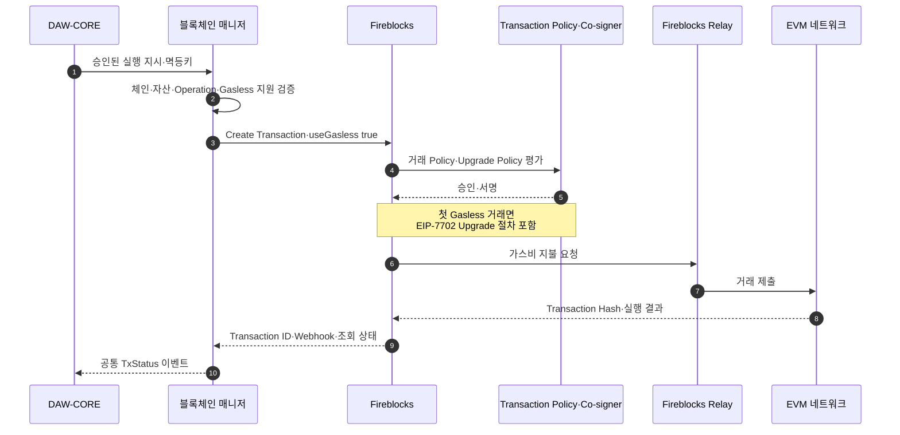
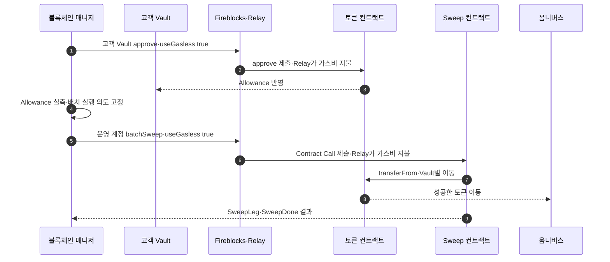

# 출금과 Sweep의 Gasless 제출

블록체인 매니저는 승인된 출금·Sweep 실행 지시를 Fireblocks에 제출할 때 Gasless 경로를 명시한다. Gasless는 수수료 지불 방식만 바꾸며 거래 목적지·금액·Allowance·컨트랙트 권한을 만들거나 변경하지 않는다.

## 공통 제출 흐름

블록체인 매니저가 Fireblocks 접수를 받기 전에 재시도하면 같은 External Transaction ID와 멱등키를 사용한다. 접수 후에는 새 거래를 만들지 않고 기존 Fireblocks Transaction ID를 조회한다.

## 출금

출금은 옴니버스 또는 출금 풀 Vault가 토큰을 수취 주소로 전송하는 경로다.

| 단계 | 블록체인 매니저 처리 |
|---|---|
| 실행 지시 수신 | 업무 승인·컴플라이언스 완료 여부와 멱등키 확인 |
| 지원 검증 | Network·Symbol의 Fireblocks Asset과 Universal Gasless 지원 확인 |
| 제출 | Transfer 또는 Contract Call 요청에 `useGasless: true` 명시 |
| 접수 기록 | Fireblocks Transaction ID와 요청 Snapshot 저장 |
| 상태 추적 | Webhook·조회·체인 결과를 공통 TxStatus로 번역 |
| 비용 연결 | Transaction Hash·Network Fee·Receipt를 비용 대사에 제공 |

Gasless 설정 오류 1455나 Relay 검증 실패가 발생해도 동일 출금을 `useGasless: false`로 자동 재제출하지 않는다. 우리 Vault에는 직접 지불용 기본 자산이 없다는 설계 전제가 있고, 자동 전환은 중복 제출과 Policy 우회를 만들 수 있다.

## 고객 Vault Sweep

채택한 Sweep은 고객 Vault가 Sweep 컨트랙트에 Allowance를 설정하고 운영 계정이 `batchSweep`을 호출하는 `approve + transferFrom` 방식이다.

Gasless가 필요한 온체인 호출은 두 종류다.

| 호출 | 자산 권한 | Gasless의 역할 |
|---|---|---|
| 고객 Vault의 `approve` Contract Call | Sweep 컨트랙트에 제한된 Allowance 설정 | 고객 Vault에 기본 자산 없이 승인 거래 제출 |
| 운영 계정의 `batchSweep` Contract Call | 설정된 Allowance 안에서 여러 Vault의 토큰 이동 | 운영 계정에 기본 자산 없이 배치 거래 제출 |

Universal Gasless의 EIP-7702 위임 코드가 Sweep 권한을 제공하는 것은 아니다. Allowance·Sweep 컨트랙트·TAP·Callback 검증이 자산 이동 권한을 제한한다.

## 첫 Gasless 거래

Universal Gasless는 첫 완료 거래에서 Vault를 Upgrade한다. 구현에서는 다음 상태를 분리해 관찰한다.

- Gasless 요청 접수
- Upgrade Policy 승인
- Relay 요청
- 첫 온체인 거래 완료
- Vault의 Delegate Code 설정 확인

Upgrade가 완료되기 전 재시도와 완료 후 재시도는 같은 조건이 아니다. 결과가 불명확하면 Fireblocks Transaction ID와 온체인 Account Code를 조회하고 새 Upgrade 요청을 만들지 않는다.

고객 Vault 주소와 키는 유지되므로 DAW-CORE의 계정·주소 매핑은 바꾸지 않는다. 다만 블록체인 매니저의 운영 정보에는 Upgrade 여부·Delegate 주소·확인 시점을 연결할 수 있어야 한다.

## 지원 범위 검증

다음 조합을 배포 설정으로 관리한다.

| 축 | 예시 |
|---|---|
| Network | Ethereum·Base 등 활성 계약 체인 |
| Asset | Network별 Fireblocks Asset ID |
| Operation | Transfer·Contract Call |
| Source Vault 역할 | 고객 입금·옴니버스·출금 풀·Sweep 운영 |
| Gasless | Universal Gasless 활성·Relay 연결 |
| Policy | Upgrade·Transfer·Contract Call 규칙 |

Fireblocks 문서에 체인이 보인다는 사실만으로 운영 지원을 켜지 않는다. Workspace 활성화, Relay 계약, 자산과 Operation, Policy PoC가 모두 확인된 조합만 허용한다.

## 수수료 견적과 실제 비용

Gasless 거래도 고객에게 표시할 예상 수수료가 필요할 수 있다. 예상값은 Network Fee 추정이고 실제 Relay 청구액은 Receipt의 Gas Used와 당시 네트워크 단가에 따라 달라진다.

- 제출 전 예상값과 제출 후 실제값을 같은 필드로 덮어쓰지 않는다.
- Fireblocks Relay는 담당자 답변 기준 건별 가스비 상한을 받지 않는다.
- 수수료 급등 시 블록체인 매니저가 임의로 직접 지불 경로로 바꾸지 않는다.
- 비용 한도는 업무 승인·일시 중지·체인별 운영 정책으로 제어한다.
