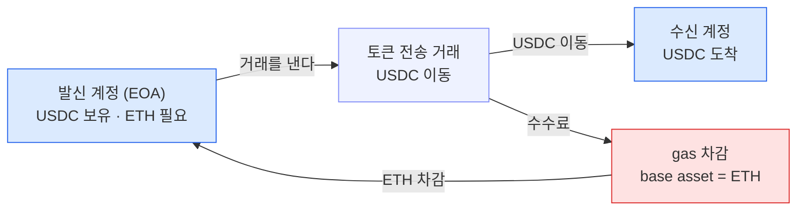

EVM 은 토큰을 보낼 때도 수수료(gas)를 base asset 으로, 그 거래를 내는 발신 계정에서 차감한다.
수탁 지갑에서는 이 규칙이 두 지점을 아프게 한다 — 고객 vault 마다 gas 용 ETH 를 심어야 하고, 운영 전반에서 gas 용 ETH 를 상시 들고 있어야 한다.

## gas 는 어디서 나가는가

EVM 의 수수료는 **거래를 내는 계정의 base asset(이더리움·Base 에서는 ETH)** 에서 나간다. USDC 같은 토큰을 옮기는 거래도 예외가 아니다 — 옮기는 것은 토큰이지만, 그 거래를 처리하는 gas 는 여전히 발신 계정의 ETH 에서 빠진다. 즉 **토큰만 있고 ETH 가 없는 계정은 그 토큰을 스스로 움직이지 못한다.**

옮기는 자산이 토큰이어도 gas 는 별도로 ETH 로 나간다 — 그래서 발신 계정에는 옮길 토큰과 별개로 **ETH 잔고가 항상 붙어 있어야** 한다. 수탁 지갑처럼 계정이 수만 개로 늘어나면 이 "ETH 가 항상 붙어 있어야 한다"는 조건이 운영 부담으로 바뀐다.

## 수탁 지갑에서 아픈 두 지점

| 지점 | 왜 아픈가 |
|---|---|
| **고객 vault → 중앙 vault 이동(sweep)** | 고객별 vault 가 수만 개인데, 그 안의 토큰을 옮기려면 vault **각각에 ETH 가 있어야** 한다 — ETH 배포·잔고 모니터링·충전이 수만 계정 규모의 대량 운영이 된다. |
| **운영 전반의 ETH 보유** | gas 용 ETH 를 **상시 조달·보관**해야 한다 — 은행 관점에서 "운영 목적의 가상자산 상시 보유"는 재무·회계·리스크 처리 부담이 크다. |

첫 번째는 **규모**의 문제다. 블록체인매니저 설계의 sweep(고객 vault 에 모인 입금을 중앙으로 모으는 운영)은 vault 마다 토큰 전송 거래를 내야 하는데, 그 하나하나가 발신 vault 의 ETH 를 요구한다. 계정이 수만 개면 ETH 를 뿌리고, 잔고가 마르지 않는지 지켜보고, 마르기 전에 채워 넣는 일이 계정 수만큼 곱해진다.

두 번째는 **성격**의 문제다. gas 를 대려면 조직이 ETH 를 늘 손에 쥐고 있어야 하는데, 이는 곧 운영을 돌리기 위한 목적으로 가상자산을 상시 보유한다는 뜻이다. 규제·회계 관점에서 이 보유 자체가 처리해야 할 리스크가 된다.

## 이 문제가 향하는 곳

두 지점 모두 뿌리는 같다 — **gas 가 base asset 으로, 발신 계정에서 나간다**는 EVM 의 규칙이다. 그래서 다음 물음은 자연스럽게 "그렇다면 발신 계정에 ETH 를 넣어 둘 것인가, 아니면 gas 를 남이 대신 내게 할 것인가"로 이어진다. 그 두 갈래(충전 vs 대납)를 2장에서 견주고, 대납 쪽에서 Fireblocks 가 실제로 제공하는 방식을 3장 Fireblocks Gasless Service 에서 다룬다.

---

이 문서 묶음에서 **Fireblocks Gasless Service · Gas Station 은 Fireblocks 공식 문서로 확인한 사실**이다. 뒤에 나오는 GSN · ERC-4337 Paymaster 등 일반 EVM 표준 절은 공개 명세에 대한 저자 정리이므로, 실제 적용 전 1차 자료 검증을 권장한다. 정산 단가처럼 **미확정**으로 표시한 항목은 Fireblocks 담당 매니저(CSM)나 지원팀에 확인할 대상이다.
