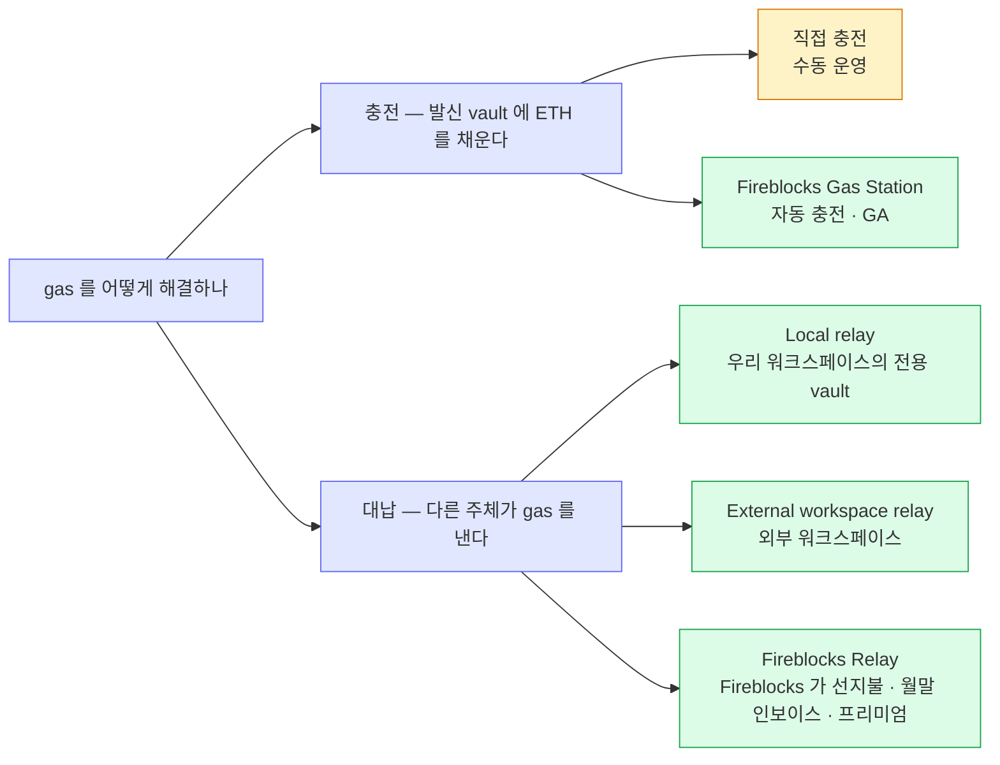

gas 를 해결하는 길은 두 갈래다 — 발신 vault 에 ETH 를 채우거나(충전), 다른 주체가 gas 를 내거나(대납).
Fireblocks 는 양쪽 다 제품이 있고, 어느 가지를 고르느냐에 따라 우리가 떠안는 ETH 보유가 "vault 수만 개"에서 0 까지 줄어든다.

## 두 갈래 — 충전과 대납

노랑은 수동 운영이라 규모가 커지면 비현실적이고, 초록은 벤더 기능이다. 왼쪽 가지(충전)는 ETH 보유가 그대로 남고, 오른쪽 가지(대납)는 relay 를 고를수록 우리가 들고 있어야 할 ETH 가 줄어 Fireblocks Relay 에서 0 이 된다.

## 선택지 다섯 — ETH 보유와 비용·운영

| 선택지 | ETH 보유 | 비용·운영 |
|---|---|---|
| **직접 충전** | 필요 — vault 마다 | 조달·모니터링·충전이 전부 수동. 규모가 커지면 비현실적. |
| **Gas Station** (충전 자동화) | 필요 — 단 자동 충전 | vault 입·출금 감지 시 임계(gasThreshold) 밑이면 자동 충전. 단, Gas Station 재원 지갑은 직접 채운다. |
| **Gasless — Local relay** | relay vault 1곳만 | ETH 운영이 "vault 수만 개"에서 "relay 하나"로 집약된다. ETH 조달 자체는 남는다. |
| **Gasless — External workspace** | 우리 쪽은 필요 없음 | gas 부담이 외부 워크스페이스로 넘어간다 — 그쪽과의 정산은 계약 나름. |
| **Gasless — Fireblocks Relay** | 필요 없음 — ETH 0 | Fireblocks 가 선지불하고, 월말 통합 인보이스(gas 실비 + 구독료)로 정산. 프리미엄 — CSM 경유 활성화, testnet 30일 체험. |

충전 가지(직접 충전·Gas Station)는 자동화 정도만 다를 뿐 ETH 를 우리가 조달해 vault 에 넣는다는 뼈대는 같다. 대납 가지는 relay 를 어디에 두느냐가 핵심이다 — Local relay 는 ETH 운영을 relay vault 한 곳으로 집약하고, External workspace 는 그 부담을 바깥으로 넘기며, Fireblocks Relay 는 조달 자체를 없애 ETH 0 으로 만든다.

## "ETH 필요 없음"의 정확한 뜻

"ETH 필요 없음"은 **토큰 전송 기준**이다. 공식 문서가 명시하듯 Universal Gasless 는 ETH 네이티브 전송은 대납하지 않는다 — gas 를 대신 내주는 대상은 어디까지나 토큰(ERC-20) 이동이다.

우리 서비스는 스테이블코인 전용이라 ETH 자체를 취급하지 않는다. 그래서 ETH 네이티브 전송을 대납받지 못한다는 이 제약은 우리에게 걸리지 않고, 결과적으로 ETH-free 운영이 성립한다.
