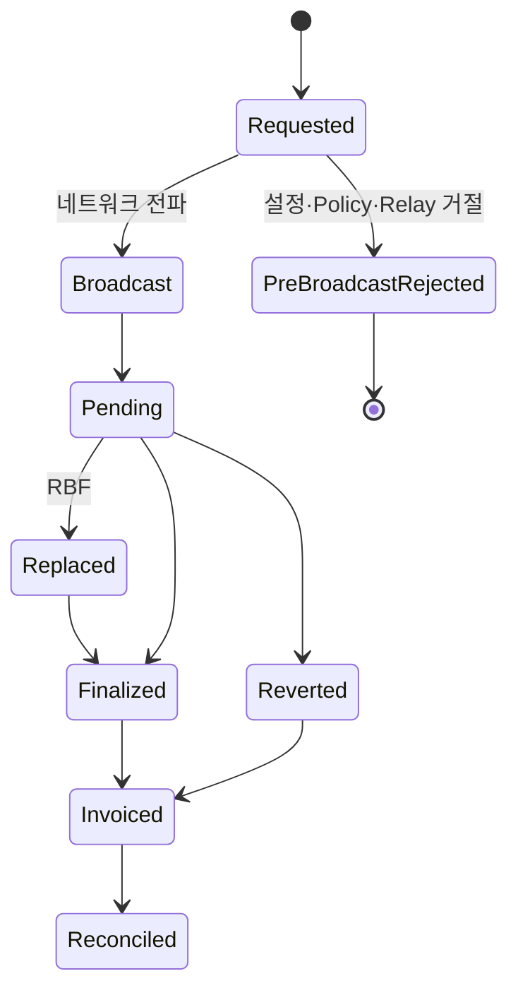

# Relay 상태와 온체인 상태

Gasless 요청에는 Fireblocks 접수, Policy·Relay 승인, 네트워크 전파, 온체인 실행과 비용 청구가 연속해서 발생한다. 블록체인 매니저는 이 신호를 하나의 성공·실패 Boolean으로 합치지 않고 단계별 근거와 공통 TxStatus를 함께 기록한다.

## 단계별 기록

| 단계 | 관찰 근거 | 기록할 식별자·상태 | 비용 |
|---|---|---|---|
| 요청 생성 | 내부 실행 의도 | External Transaction ID·요청 Hash | 없음 |
| Fireblocks 접수 | API 응답 | Fireblocks Transaction ID·접수 시각 | 없음 |
| Policy·Relay 판정 | Fireblocks 상태·SubStatus | 차단·거절·설정 오류 원인 | Broadcast 전이면 없음 |
| 네트워크 전파 | Transaction Hash | 제출 시각·nonce·Network | 가스 소비 가능 |
| Pending | Fireblocks 조회·RPC | 마지막 관찰 블록·체류 시간 | 확정 전 |
| 확정·Revert | Receipt·Fireblocks 완료 상태 | Block·Gas Used·Effective Gas Price·Result | 발생 |
| 월 청구 | Fireblocks 인보이스 | 청구 기간·항목·USD 금액 | 계약 비용 확정 |

공통 TxStatus의 정의와 이벤트 발행은 [상태·이벤트·대사](../개요/05-state-events-reconciliation.md)를 따른다. Gasless 전용 상태를 공통 Enum에 추가하는 대신 Vendor 원인·Relay 단계·비용 상태를 별도 상세로 보존한다.

## 실패 분류

| 실패 | 재시도 전 확인 | 자동 처리 |
|---|---|---|
| Gasless 미설정·Error 1455 | Workspace·Asset·Relay 활성화 | 설정 수정 전 재시도 금지 |
| Policy 차단 | 위반 Rule·요청 Snapshot | 같은 요청 반복 금지 |
| Relay 거절 | Relay 가용성·계약·지원 Operation | 직접 지불 전환 금지 |
| Co-signer 결과 불명 | Fireblocks Transaction ID 존재 여부 | 조회로 복구 |
| Broadcast 결과 불명 | Transaction Hash·nonce·Vendor 조회 | 새 거래 생성 금지 |
| 장기 Pending | nonce·Mempool·Network Fee | 운영 승인 후 RBF |
| 온체인 Revert | Receipt·Revert 원인·Allowance·Contract 상태 | 원인 수정 후 새 실행 의도 |
| Webhook 누락·역순 | 조회 API·Checkpoint | 주기 대사로 수렴 |

## Pending과 RBF

Fireblocks Gasless Relay는 자동 Boost를 제공하지 않는다. 장기 Pending 거래는 일반 거래와 같은 Stuck 탐지 작업에서 찾고, 다음 순서로 처리한다.

1. Fireblocks Transaction ID와 Transaction Hash를 조회한다.
2. 동일 nonce의 확정·교체 거래가 있는지 확인한다.
3. 체인별 체류 기준과 현재 수수료를 확인한다.
4. 운영 권한으로 RBF Boost를 요청한다.
5. 원본과 교체 거래를 같은 실행 건으로 연결한다.
6. 최종 Receipt와 Fireblocks 상태를 대사한다.

RBF 요청을 새 고객 출금으로 발행하지 않는다. 교체 거래는 같은 nonce와 업무 실행 ID를 사용하며 고객 원장 이벤트도 최종 결과 한 번으로 수렴해야 한다.

## 비용 발생 상태

- Pre-Broadcast Rejected: 네트워크 비용 없음
- Finalized: 확정 Receipt의 실비가 청구 대상
- Reverted: 자산 이동은 실패했지만 소비 가스는 청구 대상
- Replaced: 최종 포함된 교체 거래의 비용을 대사
- Invoiced: 월 구독료와 가스 실비를 분리

## 모니터링

| 지표·경보 | 목적 |
|---|---|
| Error 1455·Relay 거절 증가 | 설정·지원 범위·벤더 장애 탐지 |
| Policy 차단 Rule별 건수 | 잘못된 요청과 Policy 변경 영향 구분 |
| Fireblocks 접수 후 Hash 미생성 시간 | 서명·Relay 단계 정체 탐지 |
| Network·Operation별 Pending P95·최대 | Stuck 임계 조정 |
| RBF·Revert 비율 | 수수료 정책·컨트랙트 실패 감시 |
| 첫 Upgrade 실패율 | EIP-7702·Policy·Co-signer 결합 문제 탐지 |
| Webhook 지연·누락·역순 | 이벤트 수렴 상태 확인 |
| Gas Used·Effective Gas Price | 체인 실비 계산 |
| 월 인보이스 미대사 금액·건수 | 청구 오류·식별자 누락 탐지 |

## 비용 대사

블록체인 매니저는 거래 실행 근거를 제공하고, 회계 정산 시스템이 월 인보이스와 연결한다.

대사 키에는 다음 정보가 필요하다.

- 내부 실행 ID·External Transaction ID
- Fireblocks Transaction ID
- Transaction Hash·Network·nonce
- 최종 Receipt의 Gas Used·Effective Gas Price
- 성공·Revert·RBF 관계
- Fireblocks 청구 기간과 인보이스 항목

월 구독료는 특정 거래의 Network Fee로 배분하지 않는다. 고객 과금에 포함할 경우 DAW-CORE의 별도 배부 정책이 필요하다.

## 장애 시 금지 사항

- Gasless 장애를 이유로 모든 거래를 `useGasless: false`로 전환
- Fireblocks 접수 결과가 불명확한 상태에서 새 External Transaction ID 발급
- Pending 거래를 실패로 끝내고 동일 출금을 새 nonce로 제출
- Revert 거래의 가스비를 성공 거래 비용에서 누락
- 월 인보이스 금액을 온체인 Receipt 대사 없이 고객에게 전가
