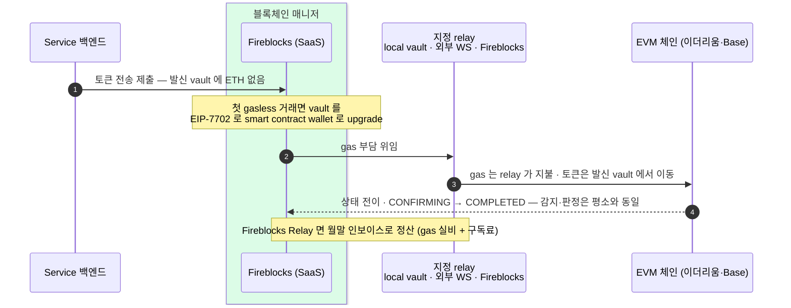

Gas Station 과 별개 제품으로, 지원 토큰의 gas fee 지불을 relay(전용 vault·외부 워크스페이스·Fireblocks)에 위임하는 Fireblocks 공식 서비스다.
Universal Gasless 는 첫 거래 때 vault 를 smart contract wallet 로 upgrade 해 모든 이더리움 자산의 gasless 전송을 지원한다. 도입에는 relay 계약과 TAP(거래 승인 정책) 두 종이 붙고, 대납이어도 남는 운영 항목이 있다.

## 서비스 정의

지원 토큰의 fee 지불을 **전용 vault · 외부 워크스페이스 · Fireblocks** 중 하나에 위임하는 서비스다. 공식 문서가 명시한다 — "Gasless Service 는 Gas Station 과 별개 제품이고, 다른 프로토콜을 쓴다." Gas Station 은 발신 계정에 ETH 를 미리 채워 두는 방식(2장의 충전)이고, Gasless Service 는 애초에 발신 계정이 gas 를 낼 필요가 없게 만드는 대납이다.

## 항목별 정리

| 항목 | 내용 |
|---|---|
| **메커니즘** | ERC-3009 · ERC-2771 · EIP-7702 — ERC-4337 paymaster 가 아니다. |
| **Limited Gasless (구)** | 이더리움의 USDC·DAI(ERC-3009) + tokenization mint/burn(ERC-2771)에 한정된다. |
| **Universal Gasless (신)** | EIP-7702 기반 — 첫 gasless 거래 때 vault(EOA)가 smart contract wallet 로 자동 upgrade 된다. 이후 모든 이더리움 자산(ERC-20/721/1155)의 Transfer · Contract Call · Mint · Burn 을 지원한다. |
| **지원 체인 (Universal)** | Ethereum(1) · Optimism(10) · Base(8453) · Arbitrum(42161) · Polygon PoS(137) · BSC(56) + 각 testnet. Solana·Tron(GasFree)은 별도 메커니즘이다. |
| **설정** | Console 의 Settings → General → Gasless transactions — relay 3택 + 기본값 3모드(On by default / Off by default / Off, 거래별 재정의 가능) + Policies 연동. |
| **API** | 트랜잭션 API 에 Gasless(meta-tx) 경로가 있다 — 미설정 시 error 1455 "Missing Gasless configuration (relayer/fee payer)". |
| **Fireblocks Relay 지원 범위** | 위 6체인 통합과 별개로, Relay 서비스 자체는 "모든 EVM 호환 체인 + 그 위 모든 토큰"을 지원한다 — 일부 non-EVM(특정 USDC 오퍼레이션 포함)은 CSM 문의. |

Limited Gasless 는 특정 토큰·오퍼레이션만 대납하던 구세대이고, Universal Gasless 는 vault 를 한 번 upgrade 해 두면 그 vault 의 이더리움 자산 전반을 대납 대상으로 삼는 신세대다. 발신 계정의 **주소·키는 upgrade 전후로 불변**이다 — 계정에 코드가 붙을 뿐이다.

## 도입 절차 (Fireblocks Relay)

Fireblocks 가 직접 relay 를 맡는 경로는 다음 순서로 켠다.

1. **Console 설정** — Settings → General → Gasless transactions 에서 Fireblocks relay 선택.
2. **Support 요청** — 서비스 활성화 신청.
3. **CSM 협의** — 대상 체인 · 월 거래량 · 유스케이스 조율.
4. **서비스 계약 서명**.
5. **활성화**.

## gasless 거래 한 건의 흐름

발신 vault 에 ETH 가 없어도 토큰이 이동하고, gas 는 지정 relay 가 낸다. 첫 gasless 거래라면 이 시점에 vault 가 EIP-7702 로 smart contract wallet 로 upgrade 된다. 상태 전이·확정 판정(DCCP·numOfConfirmations)은 일반 거래와 동일하다 — 블록체인 매니저 설계의 감지·확정 흐름을 그대로 탄다. Fireblocks Relay 를 쓰면 정산은 온체인 gas 가 아니라 월말 인보이스(gas 실비 + 구독료)로 잡힌다.

### approve + transferFrom sweep에 적용

채택한 batch sweep에는 gasless 거래가 두 종류 있다.

| 단계 | 발신 vault | Fireblocks 제출 | gasless의 역할 |
|---|---|---|---|
| allowance 준비 | 고객 입금 vault | `CONTRACT_CALL + approve calldata` | 고객 vault에 ETH를 넣지 않고 approve의 gas를 relay가 부담 |
| batch 실행 | sweep 운영 계정 vault | sweep 컨트랙트 `batchSweep` CONTRACT_CALL | 최상위 batch tx의 gas를 relay가 부담 |

Universal Gasless는 gas 지불자를 바꿀 뿐 자산 이동 권한을 만들지 않는다. 고객 자산을 가져오는 권한은 토큰 컨트랙트의 allowance와 sweep 컨트랙트의 `transferFrom`에 있다. 따라서 gasless를 켰다고 approve가 생략되거나 Fireblocks의 EIP-7702 위임 코드가 직접 sweep을 수행하는 것은 아니다.

제품 문서상 Contract Call은 Universal Gasless 범위지만, [approve batch PoC](../../BC/설계/95-approve-pull-poc-result.md)는 vault에 ETH를 직접 넣어 수행했다. 운영 전에는 두 CONTRACT_CALL 모두 `useGasless`로 완료되는지, TAP `APPROVE`·`applyForApprove`가 어느 규칙에 매칭되는지, gasless batch에서 컨트랙트가 관찰하는 `msg.sender`가 등록 운영자와 일치하는지, relay 처리량과 initiator/signer 제약을 sandbox에서 실측한다. 이 확인은 방식 재선정 조건이 아니라 출시 게이트다.

## 운영 caveat — 대납이어도 남는 것

대납은 gas 조달을 relay 로 옮길 뿐, 운영 부담을 없애지는 않는다. 네 가지가 그대로 남거나 새로 생긴다.

- **새 실패 모드가 생긴다.** 공식 문서 명시 — relay 가 요청을 거절하거나 gas 를 대지 못하면 gasless 거래는 실패한다. relay 상호작용은 서명·거래 생성 단계(체인 전송 전)에 일어나므로, 상태 처리에 "relay 거절" 실패 사유가 추가되고 **relay 잔고·정책이 모니터링 대상**이 된다.
- **stuck 거래 auto-boost 는 없다.** 공식 문서 명시 — Gasless Relay 는 auto-boost 를 지원하지 않는다. 제시한 fee 가 낮아 체인에서 처리되지 않고 대기 중인 거래는 **수동 RBF boost** 로 재촉해야 하므로, 막힘 점검과 boost·cancel 운영은 대납을 써도 그대로 필요하다.
- **비용은 사라지는 게 아니라 지불 수단이 바뀐다.** 온체인 ETH → 월말 청구서(법정화폐)로 형태만 이동하고, 정산은 회계 층의 일이 된다. 단가·구독료 수준은 **미확정 — 확인 필요**(CSM).
- **MPC 서명 ↔ EIP-7702 위임의 내부 결합**은 공식 문서에 상세가 없다. **미확정 — 확인 필요**(PoC/CSM).

## 도입 시 붙는 거버넌스·구현 요건

| 요건 | 내용 |
|---|---|
| **TAP 정책 2종 (Admin 몫)** | ① Vault account upgrade policy — upgrade 된 vault 의 gasless 발신을 Allow 하는 rule. ② relay 측 Contract call policy 에 Gasless-Orchestrator 를 initiator 로 명시하는 rule — anyone initiator rule 이 있어도 별도로 필요하며, initiator 와 signer 는 같을 수 없다. |
| **API Co-Signer** | relay 역할을 하는 워크스페이스는 API Co-Signer 필수. 본 설계는 이미 co-signer 를 운용하므로 충족한다. |
| **upgrade 시점** | vault 자산의 upgrade 는 첫 gasless 거래가 완료된 뒤 적용된다. |
| **건별 제어** | Transfer 단위로 gasless ↔ direct fee 전환이 가능하다 — 기본값(On/Off by default)과 별개로 거래마다 재정의한다. |
| **규제 대응 사례 (external relay)** | 공식 문서 명시 사례 — "US 워크스페이스는 스테이블코인만 보유하고, EU 워크스페이스가 ETH 를 보유해 gas 를 지불한다. US 워크스페이스는 컴플라이언스를 유지한다." — "sweeping 워크스페이스의 ETH 보유 금지" 요건에 대응하는 패턴이다. |
| **Solana 는 다른 모델** | EIP-7702 가 아니라 Solana Fee Payer — local relay 와 token owner 두 vault 가 공동 서명하며, relay 와 key set 을 공유하는 vault 에서만 가능하다. SOL 자체는 제외된다. |
