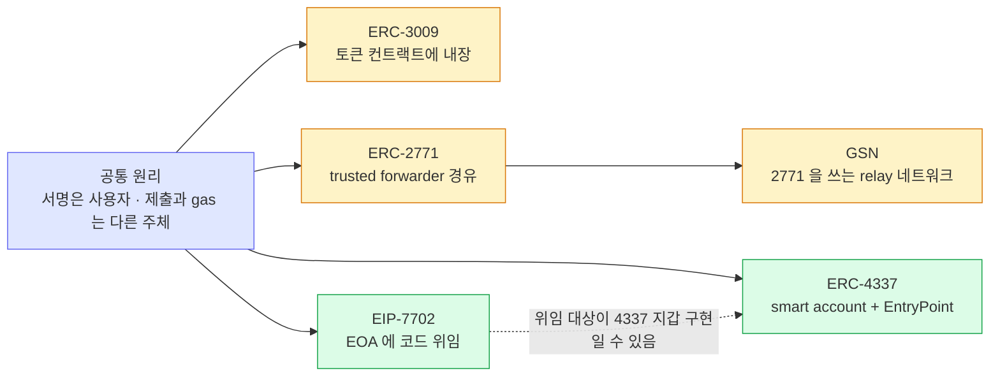

사용자는 서명만 하고 제출과 gas 지불은 다른 주체가 맡는다 — 모든 gas 대납 표준이 하는 일은 이 하나로 같고, 차이는 그 분리를 어느 계층에서 구현하느냐다.
이 장은 여기부터 시작하는 일반 표준 상세의 도입부다.

## 이 장의 근거

이 장부터의 일반 표준 서술은 공개 명세를 근거로 한 저자 정리다. ERC-3009 · ERC-2771 · ERC-4337 · EIP-7702 의 원문 명세와 OpenGSN 공식 문서, Circle Paymaster 개발자 문서를 바탕으로 정리했다. Fireblocks 공식 문서의 확정 사실과는 성격이 다르며 — Fireblocks 쪽 확정 사실은 3장에 있다 — 본인 환경에 적용하기 전 명세 원문을 검증하기를 권한다. 아래 서술은 모두 "명세 기준"으로 읽어야 한다.

## 하나의 공통 원리

EVM 의 기본형에서는 거래를 보내는 계정이 서명하고, 제출하고, gas 를 낸다 — 세 역할이 한 계정에 묶여 있다. gas 대납 표준들은 예외 없이 같은 한 가지를 한다. "무엇을 하겠다"는 서명은 사용자가 만들고, 그것을 체인에 제출하며 gas 를 내는 일은 다른 주체가 맡는다. 서명·제출·gas 지불이라는 세 역할 중 뒤의 둘을 사용자에게서 떼어내는 것이다.

표준들이 갈리는 지점은 이 분리를 **어느 계층에서** 구현하느냐 하나다.

| 표준 | 분리를 구현하는 계층 | 한 줄 동작 |
|---|---|---|
| **ERC-3009** (2020) | 토큰 컨트랙트 안 | 토큰 자체에 `transferWithAuthorization` 함수가 있다 — 보유자의 EIP-712 서명을 아무나 제출하고 gas 를 낼 수 있다. USDC 가 채택. |
| **ERC-2771** (2020) | 수신 컨트랙트 + forwarder | trusted forwarder 가 서명·nonce 를 검증해 대신 제출하고, 원 서명자 주소를 calldata 끝 20바이트에 붙여 전달한다. 수신 컨트랙트는 `msg.sender` 대신 `_msgSender()` 로 읽는다. |
| **ERC-4337** (2023) | 앱 계층 인프라 | 거래 대신 UserOperation 객체를 별도 mempool 에 넣고, Bundler 가 묶어 제출한다. gas 는 smart account 본인 또는 Paymaster 가 낸다. 컨센서스 변경 없음. |
| **EIP-7702** (2025, Pectra) | 프로토콜 자체 | 새 거래 타입(0x04)으로 EOA 에 컨트랙트 코드를 위임한다 — EOA 가 주소를 유지한 채 smart account 처럼 동작하고, 제3자가 제출·gas 지불(sponsorship)할 수 있다. |

위에서 아래로 갈수록 분리를 심는 계층이 낮아진다. ERC-3009 은 특정 토큰 컨트랙트 안에서만, ERC-2771 은 수신 컨트랙트와 forwarder 라는 애플리케이션 계약 수준에서, ERC-4337 은 컨센서스를 건드리지 않는 앱 계층 인프라에서, EIP-7702 은 프로토콜 자체에서 분리를 제공한다.

## 계보 한눈에

노랑은 초기 계보로, 개별 컨트랙트가 지원해야 동작한다 — ERC-3009 은 그 함수를 가진 토큰에서만, ERC-2771 과 그 위의 GSN 은 대응하는 수신 컨트랙트가 있어야만 쓸 수 있다. 초록은 현재 주류다. EIP-7702 은 ERC-4337 과 경쟁이 아니라 **수렴**한다 — 위임 대상 코드로 4337 지갑 구현을 그대로 지정할 수 있다고 명세가 밝힌다. 둘은 배타적 선택지가 아니라 겹쳐 쓰는 관계다.

## Fireblocks Gasless 와의 연결

Fireblocks 의 두 Gasless 제품은 이 계보 위에 놓인다. Limited Gasless(구)가 ERC-3009 + ERC-2771 계보이고, Universal Gasless(신)가 EIP-7702 노선이다. 즉 위 표의 초기 계보와 최신 프로토콜 계층이 각각 Fireblocks 의 구·신 제품에 대응한다. 자세한 대응은 3장에 있다.
