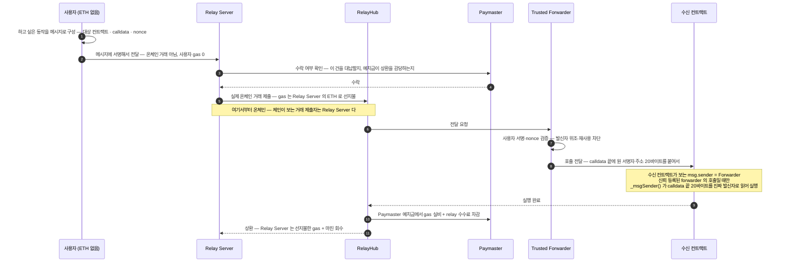

ERC-2771 meta-transaction 을 공용 인프라로 만든 GSN(Gas Station Network)의 구성요소 다섯을 역할·주체로 갈라 정리하고, 거래 한 건의 흐름과 세 가지 한계를 짚는다.
GSN 은 공개 명세에 대한 저자 정리이므로, 실제 적용 전 명세 원문 확인을 권한다.

## 공용 relay 네트워크란

GSN(Gas Station Network)은 ERC-2771 meta-transaction 을 공용 인프라로 만든 것이다. 개별 dApp 이 자기 relay 서버를 운영하는 대신, 네트워크에 참여한 relay 들이 아무 dApp 의 meta-transaction 이나 대신 제출한다. 6장의 "서명·제출 분리"를 여러 서비스가 함께 쓰는 공용 시설로 끌어올린 셈이다.

## 구성요소 다섯

| 구성요소 | 역할 | 구현·운영 주체 |
|---|---|---|
| **RelayProvider** (클라이언트) | 사용자 쪽 라이브러리 — 온체인 거래 대신 "하고 싶은 동작"을 담은 메시지에 서명해 relay 서버로 보낸다. 사용자는 ETH 가 없어도 된다. | 구현은 OpenGSN(오픈소스). 자기 프론트엔드에 통합하는 건 서비스 몫. |
| **Relay Server** | 서명 메시지를 받아 검증하고 자기 ETH 로 실제 거래를 제출한다 — 제출 비용 + 마진을 Paymaster 가 갚을 수 있는지 먼저 확인한다. | 소프트웨어는 OpenGSN, 실제 운영은 제3자 독립 운영자들. 선지불 gas 에 마진을 붙여 상환받는 게 수익 모델이고, 이 운영자 풀이 "네트워크"의 실체다. |
| **RelayHub** | 네트워크의 조정자 컨트랙트 — relay 발견, 검열 방지, 그리고 Paymaster 가 relay 에게 gas 와 수수료를 상환하도록 보증한다. | OpenGSN 이 체인마다 하나씩 배포해 둔 컨트랙트. 서비스마다 따로 만들지 않고, 그 체인의 모든 relay·Paymaster·사용자가 같은 주소 하나를 공유한다. 등록·예치금·상환 정산이 전부 여기서 일어나는 만남의 장소라 하나여야 한다. |
| **Paymaster 컨트랙트** | RelayHub 에 ETH 를 예치해 두고, 어떤 meta-transaction 을 대납할지 수락/거절하는 비즈니스 로직을 구현한다 — 사용자 화이트리스트, 토큰으로 되받기 등. (ERC-4337 의 paymaster 와 이름·역할이 같다 — 이 개념의 원조다) | 서비스 개발자가 직접 구현·배포하고 예치금도 채운다 — 대납 정책은 서비스마다 다르기 때문. |
| **Trusted Forwarder** | 서명·nonce 를 검증하고 수신 컨트랙트로 호출을 전달하는 작은 컨트랙트 — ERC-2771 의 그 forwarder. | OpenGSN 이 표준 구현을 제공. 수신 컨트랙트가 이를 신뢰 대상으로 등록하는 건 수신 컨트랙트 개발자 몫. |

주체를 묶으면 세 부류다 — **배관(Hub·Forwarder·소프트웨어)은 OpenGSN**, **relay 운영은 제3자**, **지불 정책(Paymaster)과 수신 측 ERC-2771 지원은 서비스 개발자**. 이 3분할은 ERC-4337 에도 그대로 이어진다: EntryPoint = 모두가 공유하는 표준 컨트랙트, Bundler = 제3자 인프라 사업자, Paymaster = 서비스 구현 또는 상용(8장 Circle).

## 거래 한 건이 흐르는 길

GSN 거래 한 건의 상세 흐름이다. 사용자의 gas 는 0 이고(1~2), 선지불은 Relay Server(5), 최종 부담은 Paymaster 예치금이다(10~11). 핵심은 발신자 문제다 — 온체인 제출자가 Relay Server 로 바뀌기 때문에(5), forwarder 가 원 서명자 주소를 calldata 끝에 붙이고(8) 수신 컨트랙트가 `_msgSender()` 로 바꿔 읽어야 사용자의 잔액이 움직인다. 이 마지막 단계가 수신 컨트랙트에 미리 구현돼 있어야 하는 게 GSN 의 전제다.

## 왜 못 쓰는 경우가 많은가

### 수신 컨트랙트가 지원해야 한다

대납하면 실제 거래 제출자가 forwarder 라서, 수신 컨트랙트가 보는 발신자(`msg.sender`)도 사용자가 아니라 forwarder 가 된다. 일반 ERC-20 의 `transfer()` 는 `msg.sender` 의 잔액에서 빼므로 이대로는 사용자 토큰이 움직이지 않는다. 그래서 수신 컨트랙트가 `_msgSender()` 로 원 서명자를 바꿔 읽도록 **배포 시점부터** 만들어져 있어야 하고, 그 코드 없이 이미 배포된 일반 ERC-20 에는 못 쓴다.

USDC 가 gas 대납을 지원하는 건 ERC-2771 이 아니라 자체 내장한 **ERC-3009** 경유다 — 컨트랙트가 보유자의 서명 자체를 검증하므로 `msg.sender` 가 누구인지 아예 보지 않는다.

### 신뢰가 한 점에 몰린다

명세가 직접 경고한다: "악의적인 forwarder 는 `_msgSender()` 값을 위조해 사실상 아무 주소에서나 거래를 보낼 수 있다." 수신 컨트랙트의 forwarder 신뢰 설정이 보안의 전부가 된다.

### 생태계가 떠났다

OpenGSN 문서 기준 v2.2.5 가 마지막 안정판, v3 는 beta 에서 멈췄고 문서 최종 갱신이 2023년이다. 같은 문제를 푸는 자리가 ERC-4337 로 이동했다 — 그 노선은 8장에서 다룬다.
