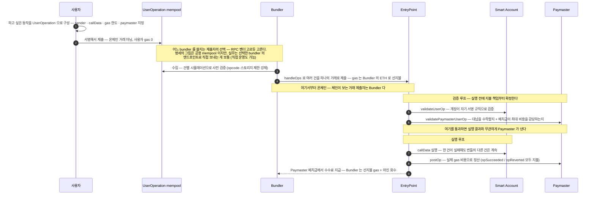
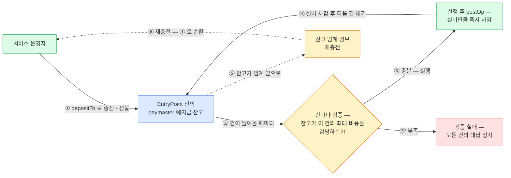

거래가 아니라 UserOperation 을 서명한다 — Bundler 가 여러 건을 묶고, EntryPoint 한 컨트랙트가 검증·실행·정산을 처리하며, Paymaster 가 예치금을 선불로 채워 두고 건별로 차감한다.
ERC-4337 은 공개 명세에 대한 저자 정리이므로 적용 전 명세 원문 확인을 권한다. 상용 사례로 gas 를 USDC 로 받는 Circle Paymaster 를 끝에서 함께 본다.

## 프로토콜은 그대로, 앱 계층에 파이프라인을 더한다

ERC-4337 은 프로토콜을 바꾸지 않는다. 대신 앱 계층에 거래 파이프라인을 하나 더 만든다. 사용자는 거래 대신 **UserOperation** 이라는 객체에 서명하고, 이 객체들은 일반 mempool 과 별개의 mempool 을 돈다.

바꿔 말하면 4337 은 하드포크가 필요 없는 표준이다 — EOA·거래·mempool 이라는 기존 세계는 그대로 두고, 그 위에 smart account·UserOperation·별도 mempool·Bundler·EntryPoint·Paymaster 라는 두 번째 파이프라인을 얹는다.

## 구성요소 — 역할과 주체

| 구성요소 | 역할 | 구현·운영 주체 |
|---|---|---|
| **UserOperation** | "의도" 객체 — sender(smart account 주소) · nonce · callData · gas 한도들 · maxFeePerGas · paymaster 주소 + paymasterData(선택) · signature 필드로 구성. | 형식은 표준이 정의. 객체를 만들고 서명하는 건 사용자 쪽 지갑(클라이언트 SDK). |
| **별도 mempool** | UserOperation 전용 P2P mempool — Bundler 들이 여기서 수집한다. | Bundler 들이 P2P 로 공동 운영 — 특정 소유자가 없다. |
| **Bundler** | UserOperation 여러 건을 시뮬레이션으로 사전 검증한 뒤 하나의 온체인 거래로 묶어 제출한다. 이 거래의 gas 를 선지불하고, EntryPoint 정산에서 돌려받는다. | 제3자 인프라 사업자(Pimlico·Alchemy 등). 직접 운영할 수도 있지만, GSN 의 Relay Server 처럼 운영자 층이 이미 있다. |
| **EntryPoint** | `handleOps()` 한 호출 안에서 건별로 검증 루프(계정·paymaster 검증 + 대금 확보)와 실행 루프(callData 실행 + 정산)를 돈다. | 표준 팀이 구현·감사해 체인마다 하나씩 배포 — 서비스마다 만들지 않고 모두가 같은 주소를 공유한다. 검증·실행·정산이 전부 여기서 일어나는 만남의 장소라 하나여야 한다(7장 RelayHub 와 같은 이유). |
| **Smart account** | 사용자 지갑 — `validateUserOp()` 을 구현한 컨트랙트여야 한다. EOA 는 그대로 못 쓴다(EIP-7702 로 위임하면 가능 — 9장). | 지갑·서비스 개발자 몫 — 직접 짜기보다 감사된 오픈소스 구현을 가져다 쓰는 게 보통이다. |
| **Paymaster** | gas 대납자 — 아래 상세. | 서비스가 구현·배포하고 예치금·stake 를 채우거나, 상용(아래 Circle Paymaster)을 갖다 쓴다. |

여기서 4337 이 GSN 과 갈리는 결정적 지점이 드러난다. GSN 은 *받는 쪽 컨트랙트*가 ERC-2771 을 지원해야 했지만(7장), 4337 은 *보내는 쪽 지갑*을 smart account 로 바꾸고 EntryPoint·Bundler 라는 별도 실행 인프라를 깐다.

## 한 건이 흐르는 길 — UserOperation 부터 정산까지

Paymaster 가 붙은 UserOperation 한 건의 상세 흐름이다. 요약하면:

- **돈의 경로** — 사용자의 gas 는 0 이고(1~2), 선지불은 Bundler(4), 최종 부담은 Paymaster 예치금이다(8~9).
- **검증 루프(5~6)와 실행 루프(7~8)의 분리** — 검증을 통과한 순간 지불 책임이 확정되므로, 실행이 revert 해도 Bundler 와 Paymaster 가 gas 를 떼이지 않는다.
- **발신자 문제 없음** — GSN 과 달리 실행 주체가 사용자의 smart account 자체라서, 토큰 컨트랙트가 보는 `msg.sender` 가 계정 본인이다. forwarder 도, 수신 컨트랙트의 사전 지원도 필요 없다.

## Paymaster — 수락·정산의 2단계

Paymaster 는 한 건을 두 번 만진다. 실행 전에 "낼지 말지"를 정하고, 실행 후에 "얼마를 냈는지"를 정산한다.

| 단계 | 내용 |
|---|---|
| **① 검증 — validatePaymasterUserOp** | 이 UserOperation 을 대납할지 판단한다 — 대상 사용자·컨트랙트 제한, 오프체인 승인 서명 확인 등 임의 로직. 이때 EntryPoint 에 예치해 둔 잔고(deposit)가 최대 비용을 감당해야 통과한다. |
| **② 정산 — postOp** | 실행이 끝난 뒤 실제 gas 비용으로 정산한다. 모드가 성공(opSucceeded)이든 실행 실패(opReverted)든 Paymaster 가 지불한다 — 검증을 통과시킨 순간 비용 책임이 확정되기 때문이다. |

### deposit 과 stake — 두 개의 잔고

Paymaster 가 EntryPoint 에 넣어 두는 돈은 성격이 다른 둘이다.

- **deposit** — gas 를 실제로 내는 잔고. 건별 정산이 여기서 차감된다.
- **stake** — 별도의 잠금 담보. 벌금으로 몰수되지 않고(명세: stake 는 slash 되지 않는다), DoS 방지·평판용이다. stake 를 건 paymaster 는 검증 단계의 스토리지 접근 제한이 완화된다.

### 운영 유형

명세는 메커니즘만 정의하고, 유형은 사업자 구현이다.

| 유형 | 내용 |
|---|---|
| **전액 스폰서형** | 서비스가 gas 를 전부 부담 — 온보딩·프로모션. |
| **ERC-20 수취형** | gas 를 USDC 등 토큰으로 되받음 — 상용 사례가 아래 Circle Paymaster 다. |
| **오프체인 승인형** | 건별로 서비스 서버가 서명해 준 것만 대납. |

## 돈의 시점 — 예치금 선불, 건별 차감

Paymaster 의 돈은 먼저 들어가 있어야 한다. 온체인 컨트랙트는 외상을 줄 수 없으므로 — 지불 능력이 검증 시점에 온체인에서 증명돼야 하므로 — 월말 정산 같은 후불 구조가 표준 안에 없다.

4337 paymaster 의 돈의 흐름은 선불이다. 요약하면:

- **정상 순환** — 예치금을 미리 채워 두고(①) 건마다 확인(②)·차감(③~④)하며, 점선(⑤~⑥)이 그 순환을 유지하는 운영 루프다.
- **바닥나면 멈춘다** — 잔고가 바닥나면(③′) 그 순간부터 전 서비스의 대납이 멈추므로, 잔고 임계 경보와 재충전 운영이 paymaster 운영의 상수가 된다.
- **Fireblocks 와 반대인 점** — 건별 제어는 같지만 **돈의 시점이 반대**다. Fireblocks Relay 는 벤더가 신용을 껴주는 후불(gas 선지불 후 월말 통합 인보이스, 3장)이라 예치금 운영이 없다.

## 4337 을 직접 운영한다는 것의 무게

Paymaster 를 자체 운영하면 다음이 전부 우리 몫이 된다.

- **예치금 잔고 관리** — 떨어지면 전 서비스의 대납이 멈춘다.
- **stake** — DoS 방지·검증 완화용 잠금 담보.
- **Bundler 확보** — 직접 운영하거나 외부에 의존.
- **검증 로직의 보안** — validatePaymasterUserOp 이 곧 대납 정책이자 공격 표면.

그리고 예치금과 stake 는 ETH 로 넣는다 — 1장의 "운영 목적의 ETH 상시 보유" 문제가 그대로 돌아온다는 뜻이다. 사용자에게 gas 를 USDC 로 받는 유형이라도 체인에 내는 건 예치금의 ETH 라서, "USDC 받고 ETH 내는" 환전 재고 운영까지 더해진다. 벤더 relay(3장)가 대신해 주는 것이 정확히 이 운영이다.

## 실제 사례 — Circle Paymaster: gas 를 USDC 로 낸다

위 표의 ERC-20 수취형을 USDC 발행사인 Circle 이 직접 상용 운영한다. permissionless 라서 Circle 계정·API 키 없이 아무 ERC-4337 호환 지갑이나 붙일 수 있고, 네이티브 토큰 잔고 관리는 Circle 이 맡는다.

| 항목 | 내용 |
|---|---|
| **지원** | 여러 EntryPoint 버전(v0.7·v0.8)에 걸쳐 여러 EVM 체인을 지원한다. v0.8 흐름은 EIP-7702 계정 기반 — 9장의 "4337 과 7702 의 수렴"이 상용 제품에서 확인된다. |
| **과금** | 실제 gas 에 일정 비율의 할증을 USDC 로 받고, 부담자는 최종 사용자다 — 개발자가 gas 를 스폰서하는 Circle 의 다른 제품(Gas Station — Fireblocks 의 Gas Station 과 무관한 동명의 별개 제품)과 대비된다. |
| **흐름** | 사용자가 EIP-2612 permit(USDC 사용 승인)을 오프체인 서명 → paymasterData 에 인코딩해 UserOperation 에 첨부 → validatePaymasterUserOp 이 permit 을 검증하고 allowance 확보 → postOp 이 실비만큼 USDC 인출. 정산마다 UserOperationSponsored 이벤트(토큰·환율·실비 필드)를 남겨 대사할 수 있다. |
| **검증 규칙의 실물** | permit 의 deadline 을 만료 없는 값으로 둔다 — 검증 단계에서 paymaster 가 `block.timestamp` 에 접근할 수 없다는 4337 opcode 제한 때문이다. 앞서 설명한 검증 규칙이 실제 구현을 어떻게 제약하는지 보여주는 예다. |

### 수탁 관점의 차이

Circle Paymaster 는 gas 를 최종 사용자의 USDC 에서 건별 공제하는 모델이고, Fireblocks Gasless 는 수탁자(relay)가 부담하고 월말 인보이스로 정산하는 모델이다(3장). "gas 비용을 고객 자산에서 공제"하는 과금 설계를 검토한다면 참고가 되는 쪽은 Circle 모델이다.
