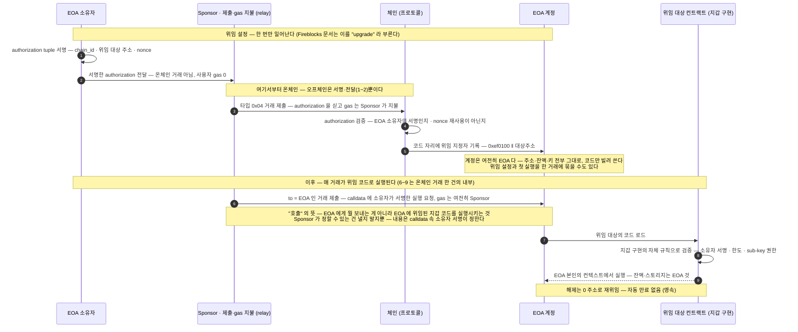

2025년 Pectra 업그레이드로 프로토콜에 들어간 방식이고, Fireblocks Universal Gasless 가 올라탄 실제 메커니즘이다.
4337 이 "지갑을 처음부터 컨트랙트로" 만드는 것과 달리, 7702 는 기존 EOA 가 주소·키를 유지한 채 컨트랙트 코드를 갖게 한다.

## 무엇이 다른가 — 주소는 그대로, 동작은 smart account

이 장은 앞선 일반 표준 서술의 연장선이다 — 공개 명세(EIP-7702)를 근거로 한 저자 정리이며, 본인 환경에 적용하기 전 명세 원문 검증을 권한다. Fireblocks 쪽 확정 사실(3. Fireblocks Gasless Service)과는 성격이 다르다.

EIP-7702 은 2025년 Pectra 업그레이드로 이더리움 프로토콜에 들어갔다. 우리 설계가 실제로 올라탈 메커니즘이며, Fireblocks Universal Gasless 의 기반이다. ERC-4337 이 "지갑을 처음부터 컨트랙트로 만들라"는 정공법인 것과 달리, 7702 는 **기존 EOA 가 주소를 유지한 채 컨트랙트 코드를 갖게** 한다. 새 거래 타입 0x04 와 위임 지정자, 이 둘이 핵심이다.

| 항목 | 내용 |
|---|---|
| **메커니즘** | 새 거래 타입 0x04 에 authorization tuple `[chain_id, address, nonce, 서명]` 을 실어 보내면, 프로토콜이 그 EOA 의 코드 자리에 위임 지정자 `0xef0100 ‖ 대상주소` 를 기록한다. 이후 이 EOA 를 호출하면 위임 대상 컨트랙트의 코드로 실행된다. |
| **대납이 되는 이유** | authorization 서명(EOA 소유자)과 거래 제출이 분리돼 있다 — 제3자가 거래를 제출하고 gas 를 내는 sponsorship 을 명세가 핵심 용례로 든다. 배칭(approve + 사용을 한 거래로)도 같은 원리로 가능하다. |
| **4337 과의 관계** | 경쟁이 아니라 수렴 — 위임 대상 코드로 기존 ERC-4337 지갑 구현을 그대로 지정할 수 있다. EOA 가 4337 파이프라인의 sender 가 되는 길이기도 하다. |
| **주의점** | 위임은 영속이다 — 자동 만료가 없고, 해제하려면 0 주소로 재위임한다. 위임된 코드가 계정 잔액을 움직일 수 있으므로 **어떤 코드를 위임하느냐가 보안의 전부**다. |

## 구성 요소와 주체 — 배관·운영·정책 3분할

7·8장과 같은 3분할이 여기서도 보인다 — 배관은 프로토콜, 운영은 제출자, 정책은 위임 코드 선택이다.

| 구성 요소 | 역할 | 구현·운영 주체 |
|---|---|---|
| **거래 타입 0x04 · 위임 지정자** | authorization 을 검증하고 EOA 의 코드 자리에 위임을 기록하는 프로토콜 기능. | 체인 자체 — Pectra 를 채택한 EVM 이면 내장돼 있다. 만들 것도 배포할 것도 없다 — 7702 에 EntryPoint·RelayHub 같은 공용 컨트랙트가 없는 이유. |
| **authorization tuple** | "이 컨트랙트 코드로 위임한다"는 EOA 소유자의 서명 — chain_id · 대상 주소 · nonce. | 서명 주체는 EOA 키 보유자 — 수탁 모델에서는 vault 키, 즉 수탁자다. Fireblocks 는 첫 gasless 거래 때 이걸 자동 처리한다. |
| **Sponsor (제출자)** | authorization 을 실은 거래를 제출하고 gas 를 낸다. | 아무나 가능 — 자체 relay 를 돌리거나, 벤더 relay(Fireblocks 의 relay 3택) 또는 paymaster SaaS 를 쓴다. |
| **위임 대상 컨트랙트** | EOA 가 실행하게 될 지갑 구현 — 배칭·sub-key·거래별 검증 규칙이 여기 들어 있다. | 감사된 지갑 구현을 지정한다 — 무엇을 위임하느냐가 보안의 전부라, Fireblocks 는 벤더가 코드를 정하고 Vault account upgrade policy 로 통제한다. |

## 한 사이클의 흐름 — 위임 설정 한 번, 이후 매 거래

위임 설정(1~5)은 첫 한 번이고, 이후 모든 거래(6~9)가 위임 코드로 실행된다. 요약하면:

- **온·오프체인 경계는 하나뿐** — 오프체인은 서명·전달(1~2)이고, Sponsor 의 제출(3)부터 실행(9)까지 전부 온체인이다.
- **계정 종류가 바뀌는 게 아니다** — EOA 가 EOA 인 채로 smart account 의 코드를 빌려 쓰는 것이고, Fireblocks 문서의 "upgrade" 가 이 위임 설정을 가리킨다.
- **대납의 근거** — authorization 서명자(1)와 거래 제출자(3)가 달라도 되므로, 사용자는 처음부터 끝까지 gas 0 이다.
- **위임 후 보안은 두 겹** — 체인은 위임 자체의 진위만 검증하고(4), 거래별 허용 여부는 위임된 지갑 구현의 규칙이 검증한다(8).
- GSN 처럼 수신 컨트랙트의 협조가 필요 없고, 4337 정공법처럼 주소를 옮길 필요도 없다 — 코드만 위임되고 주소·잔액은 그대로다.

## Fireblocks 와의 연결

Universal Gasless 의 "첫 gasless 거래 때 vault(EOA)가 smart contract wallet 로 자동 upgrade 되고 주소·키는 그대로"라는 동작(3. Fireblocks Gasless Service)이 바로 이 메커니즘이다. 위임 코드 선택·relay 운영·정책 연동을 벤더가 감싼 형태고, 그래서 도입 요건에 "Vault account upgrade policy" 같은 위임 통제가 들어간다. 다만 MPC 서명과 7702 위임의 내부 결합은 공식 문서에 상세가 없다 — 3장의 확인 대상 그대로다.

## 메커니즘 상세 — authorization 과 위임 지정자

이 표는 두 가지 바탕을 전제한다 — 거래에 "타입(봉투 서식)"이 있다는 것과, 모든 계정 레코드에 "코드 칸"이 있다는 것.

| 항목 | 내용 |
|---|---|
| **authorization tuple 의 필드** | `[chain_id, address, nonce, y_parity, r, s]` — 어느 체인에서 유효한지(chain_id), 어떤 코드로 위임하는지(address), 재사용 차단(nonce — EOA 의 nonce 와 연동), 그리고 EOA 소유자의 서명(y_parity·r·s). 이 여섯 개가 위임 한 건의 전부다. |
| **위임 지정자가 `0xef0100` 인 이유** | EOA 코드 자리에 기록되는 값은 `0xef0100 ‖ 대상주소` 다. 첫 바이트 `0xef` 는 일반 컨트랙트 코드가 가질 수 없는 금지 바이트라, "진짜 코드"와 "위임 표시"가 온체인에서 절대 섞이지 않는다 — 조회하는 쪽은 이 접두어만 보고 위임 여부를 판별할 수 있다. |
| **gas 비용 (명세)** | authorization 1건 처리에 12,500 gas, 위임받는 계정이 빈 계정이면 +25,000 gas. 위임 해석 시 cold access 2,600 gas. 위임 설정은 한 번이라 반복 비용이 아니다. |
| **한 거래에 여러 건** | 타입 0x04 거래는 authorization 목록을 싣는다 — 여러 EOA 의 위임 설정을 한 거래로 묶을 수 있다. 대량 vault 를 운영하는 수탁 모델에서 의미 있는 형태다. |
| **의도적으로 뺀 것** | 위임 시점의 initcode 실행 없음 · 컨트랙트 생성 없음 · blob 미지원 — 명세가 공격 표면 축소를 이유로 명시한 생략이다. 위임은 "이미 배포·감사된 코드를 가리키는 것"만 할 수 있다. |

## 깨지는 전제 세 가지 — 명세가 직접 인정한다

7702 는 이더리움의 오래된 불변식 세 개를 깬다. 명세가 이를 명시적으로 인정하고 "기존 보호 수단으로 감당 가능하다"는 입장을 밝히는데, 이 가정 위에 지어진 우리 쪽 로직이 있는지가 점검 포인트다.

| 깨지는 전제 | 수탁 관점 함의 |
|---|---|
| **"EOA 잔액은 본인이 서명한 거래로만 줄어든다"** | 위임 설정 후에는 위임 코드가 잔액을 움직일 수 있다. 잔액 변화의 근거를 "그 주소가 보낸 거래"에서만 찾는 대사 로직이 있다면 깨진다 — 근거 거래는 항상 온체인 기록·벤더 거래 기록에서 역추적해야 한다. |
| **"EOA 의 nonce 는 한 거래에 1씩 오른다"** | 위임 설정 거래에서는 nonce 가 한 번에 여러 번 오를 수 있다. nonce 연속성으로 거래 누락을 검사하는 로직이 있다면 오탐한다. |
| **"tx.origin == msg.sender 면 EOA 의 직접 호출이다"** | 이 검사로 "컨트랙트 경유 호출"을 차단해 온 기존 컨트랙트들의 전제가 무너진다. 우리가 만들 로직보다는, 우리가 상호작용할 외부 컨트랙트가 이 가정을 쓰고 있는지가 문제가 된다. |

## 위임의 수명 — 영속, 해제, 재위임

- **만료가 없다** — 위임은 코드 자리의 기록이라 시간이 지나도 그대로다. "한시적으로 빌려 쓰는" 모델이 아니다.
- **해제 = 0 주소로 재위임** — 위임 대상을 `0x0000…0000` 으로 바꾸면 계정이 EOA 상태로 복귀한다. 명세는 잔여 패널티 없이 깨끗하게 돌아온다고 명시한다.
- **재위임 = 덮어쓰기** — 새 대상 주소로 authorization 을 다시 처리하면 교체된다. 마지막 위임이 이긴다.

따라서 위임 상태가 감사 항목이 된다 — "이 vault 가 지금 어떤 코드에 위임돼 있는가"는 잔액처럼 조회·기록할 수 있는 상태다(코드 자리의 `0xef0100 ‖ 주소` 를 읽으면 된다). Fireblocks 에서 이 통제를 담당하는 것이 Vault account upgrade policy 다.

## 도입 전 확인 목록 — Fireblocks 결합 기준

| 항목 | 상태 | 내용 |
|---|---|---|
| **고객 입금 주소 영향** | 확정 — 없음 | 주소·키 불변이 공식 명시. upgrade 돼도 입금 주소 재발급·재고지가 필요 없다 — 수탁 모델에서 7702 노선의 최대 이점. |
| **upgrade 시점** | 확정 | vault 자산의 upgrade 는 첫 gasless 거래가 완료된 뒤 적용된다. |
| **TAP(거래 승인 정책) 2종** | 확정 | Vault account upgrade policy + relay 측 Gasless-Orchestrator rule — Admin 이 미리 넣어야 한다. |
| **relay 실패 모드** | 확정 | relay 가 거절하거나 gas 를 못 대면 거래 실패 — 실패 사유 처리와 relay 잔고 모니터링이 우리 몫. |
| **ETH 네이티브 전송** | 확정 — 제외 | 대납 불가(공식). 다만 스테이블코인 전용 결정이라 ETH 자체의 이동이 없어 해당 없음. |
| **MPC 서명 ↔ 7702 결합** | 미확정 — 확인 필요 | vault 키(MPC)가 authorization 서명을 어떻게 만드는지 공식 문서에 상세가 없다 — CSM/PoC 확인 대상. |
| **위임 대상 코드의 정체** | 미확정 — 확인 필요 | Fireblocks 가 위임시키는 지갑 구현의 공개 여부·감사 리포트, 그리고 upgrade 된 vault 의 위임 상태 조회·해제 수단 — 공식 문서에 없다. CSM 확인 대상. |

블록체인매니저 설계의 sweep·출금 운영에서 vault 의 첫 gasless 거래가 이 위임 설정을 함께 처리한다 — 그 접점의 상세는 이 장이 맡고, 표준 계보 전체는 6. 계보 — 서명과 제출의 분리, 4337 정공법과의 대비는 8장에 있다.
