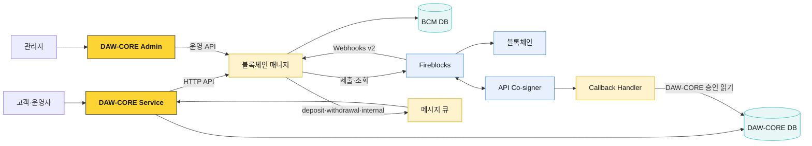
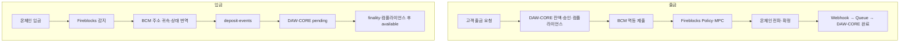

# 블록체인 매니저 업무 구조

블록체인 매니저는 DAW-CORE와 Fireblocks·블록체인 사이의 실행 계층이다. DAW-CORE가 고객·계정·잔액·승인과 컴플라이언스를 책임지고, 블록체인 매니저는 벤더 식별자와 체인 차이를 숨기면서 계정·주소·거래 실행과 상태 이벤트를 제공한다.

## 전체 배치



## 책임 경계

| 영역 | DAW-CORE | 블록체인 매니저 | Fireblocks·체인 |
|---|---|---|---|
| 고객·계정 | 고객 정본, 상품 계정, 내부 잔액 | 내부 ref와 vendor vault 매핑 | Vault Account |
| 주소 | 어느 네트워크를 지원할지 결정 | 자산 매핑, 주소 발급·조회·귀속 | 자산 wallet·온체인 주소 |
| 입금 | 고객 귀속, pending·available, 컴플라이언스 | 감지·확정 번역, 이벤트 발행 | 체인 transaction·confirmation |
| 출금 | 잔액 잠금, 승인, 트래블룰, 최종 회계 | 멱등 제출, 상태 추적, 자동 boost | Policy·MPC 서명·broadcast |
| sweep | 고객 잔액은 그대로 유지 | 대상·allowance·배치 실행·항목 대사 | Contract call·receipt |
| 감사 | 고객 요청·승인·원장 journal | vendor request·event·outbox | Audit Log·transaction·txHash |

블록체인 매니저는 고객 잔액의 정본이 아니다. `balancesOf`가 반환하는 값은 온체인 Vault의 관찰 잔액이며, 고객별 권리와 가용 잔액은 DAW-CORE 원장에서 관리한다.

## 외부에 제공하는 계약

```text
DAW-CORE → 블록체인 매니저 HTTP API
  createAccount
  createDepositAddresses
  depositAddressesOf
  submitTransaction
  balancesOf
  transactionsOf
  transactionOf

블록체인 매니저 → 메시지 큐
  deposit-events
  withdrawal-events
  internal-events
```

DAW-CORE는 Fireblocks의 Vault ID, asset ID, status, subStatus를 직접 사용하지 않는다. 블록체인 매니저가 `accountId`, `network`, `symbol`, `TxStatus`로 번역한다. 벤더가 바뀌어도 고객 유스케이스와 원장 계약을 유지하기 위한 경계다.

## 문서 구성

| 문서 | 다루는 범위 |
|---|---|
| [계정·주소·자산](./01-account-address-asset.md) | account ref, Vault, asset master, 주소 발급과 조회 |
| [입금 처리](./02-deposit-flow.md) | 감지, pending, finality, 컴플라이언스, 가용 전이, reorg |
| [출금 처리](./03-withdrawal-flow.md) | 업무 승인, 멱등 제출, Policy·서명, 상태, 실패와 boost |
| [Sweep과 자금 배치](./04-sweep-and-treasury.md) | intermediate·omnibus·withdrawal pool, allowance, batch, hot·cold |
| [상태·이벤트·대사](./05-state-events-reconciliation.md) | TxStatus, webhook, inbox·outbox, 큐, 잔액·거래 대사 |
| [운영·보안](./06-operations-and-security.md) | 권한 분리, 관측, 장애, 비상 중지, 복구와 배포 점검 |

## 한 건의 출금과 입금



## 공통 원칙

- 벤더 API 호출과 내부 원장 반영을 하나의 동기 transaction으로 가장하지 않는다.
- 생성·제출에는 멱등 키를 쓰고 DB UNIQUE 제약으로 장기 유일성을 보장한다.
- Webhook은 알림이다. 서명 검증, 영속 inbox, outbox, 조회 대사를 함께 둔다.
- `CONFIRMED`는 체인 등장 단계이고 고객 가용 전이는 `FINALIZED` 이후다.
- 출금은 컴플라이언스 승인 전에 블록체인 매니저로 제출하지 않는다.
- 입금은 체인 확정만으로 고객 가용 잔액이 되지 않는다.
- sweep은 보관 위치를 옮기며 고객 원장을 변경하지 않는다.
- 실패한 대사 차이를 자동으로 잔액 보정하지 않는다.
