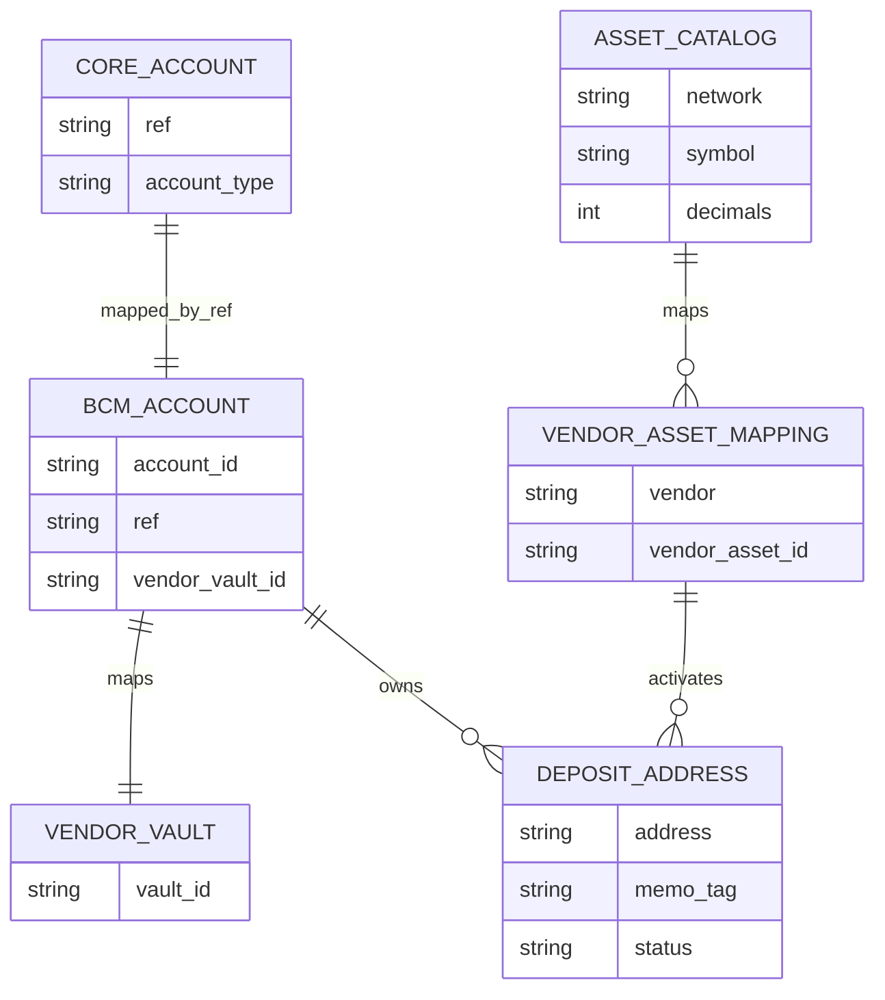
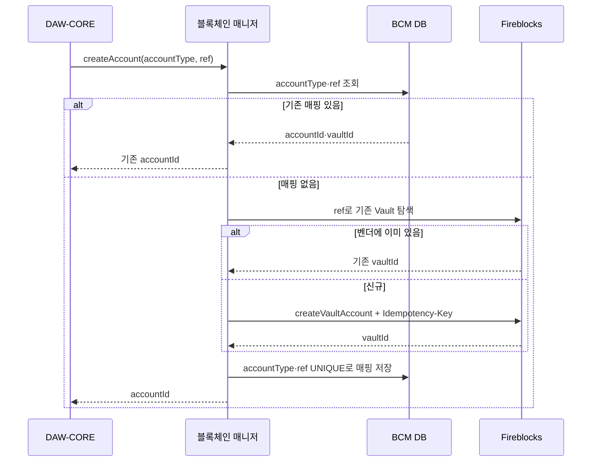
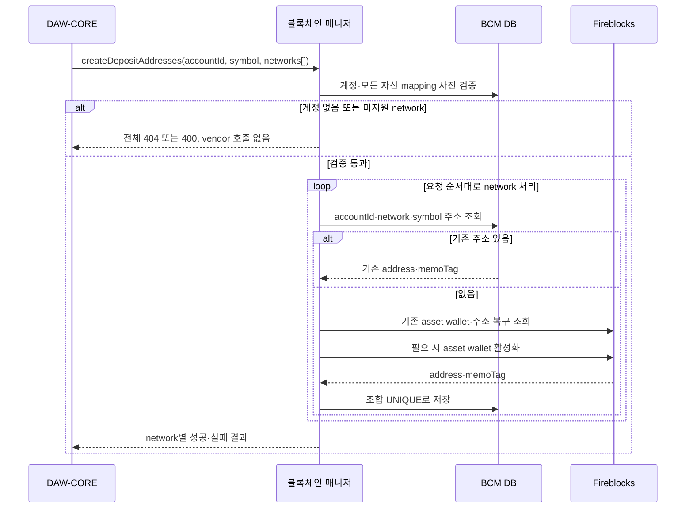

# 계정과 입금 주소

블록체인 매니저는 DAW-CORE의 안정적인 `ref`를 Fireblocks Vault Account에 연결하고, `(accountId, network, symbol)`마다 발급한 주소를 관리한다. 백엔드는 vendor vault ID와 asset ID를 알지 않는다.

## 식별자 모델

| 식별자 | 만든 곳 | 의미 |
|---|---|---|
| `ref` | DAW-CORE | 고객·상품 계정을 가리키는 안정적인 업무 참조 |
| `accountId` | 블록체인 매니저 | 외부 API에 노출하는 vendor 중립 계정 ID |
| `vaultId` | Fireblocks | 특정 Workspace 안의 Vault Account ID |
| `(network, symbol)` | 자산 master | 우리 상품이 인식하는 체인·토큰 쌍 |
| `vendorAssetId` | Fireblocks | 벤더 API가 요구하는 자산 식별자 |
| `address·memoTag` | 체인·벤더 | 실제 입금 route |

## 계정 생성

벤더 idempotency key의 유효기간만 믿지 않는다. `accountType + ref`에 DB UNIQUE 제약을 두어 시간이 지난 재시도와 동시 요청도 하나의 계정으로 수렴시킨다. Fireblocks 생성 뒤 DB 저장 전에 장애가 난 경우에는 재시도 때 벤더를 먼저 조회해 기존 Vault를 복구한다.

### 경합 처리

두 요청이 동시에 계정이 없다고 읽을 수 있다. 둘 다 vendor 호출에 성공하더라도 최종 DB insert의 승자만 정본이 되어서는 안 된다. 생성 전에 분산 lock이나 DB claim을 사용하고, vendor에서 같은 idempotency key를 사용한다. 예상 밖의 중복 Vault가 생기면 자동 삭제하지 않고 격리·조사한다.

## 자산 master

블록체인 매니저가 관리할 상품 정보는 `(network, symbol) → vendorAssetId` 변환이다. 어떤 토큰을 어느 네트워크에서 고객에게 제공할지는 DAW-CORE의 상품 결정이다.

| 소유자 | 관리 데이터 |
|---|---|
| DAW-CORE | 상품 노출 여부, 고객 한도, 입출금 활성화, 표시명 |
| 블록체인 매니저 | network·symbol 정규화, decimals, vendorAssetId, 실행 가능 상태 |
| Fireblocks | 실제 지원 asset ID, wallet 활성화 상태, 주소·잔액 |

`USDC`만으로 네트워크를 추론하지 않는다. Ethereum USDC와 Base USDC는 서로 다른 자산 mapping이다. vendor catalog 동기화가 기존 운영 mapping을 자동으로 덮어쓰지 않도록 발견과 활성화를 분리한다.

## 주소 생성

### 여러 네트워크와 부분 성공

- 요청 전에 알 수 있는 미지원 network가 하나라도 있으면 전체를 400으로 거절한다.
- vendor 호출 중 일부가 실패하면 성공한 주소를 되돌리지 않는다. 주소 발급은 되돌릴 수 없는 외부 상태다.
- 결과는 요청 network 순서대로 반환하고 항목마다 성공·오류를 표현한다.
- 같은 network가 중복되면 한 번만 발급하고 같은 결과를 각 위치에 반환한다.
- 같은 요청을 재시도하면 성공분은 DB에서 읽고 실패분만 다시 vendor 경로를 탄다.
- 한 요청의 network 수에 상한을 둬 순차 vendor 호출의 지연을 제한한다.

EVM은 일반적으로 Vault Account의 자산 wallet당 주소 하나다. 같은 고객·자산에 추가 EVM 주소가 필요하면 주소 생성 호출이 아니라 Vault 설계를 다시 검토한다. UTXO 체인의 다중 주소와 XRP·Stellar 계열의 tag·memo는 별도 기능·저장 규칙이 필요하다.

## 주소 조회

`depositAddressesOf(accountId, symbol?, network?)`는 BCM DB만 읽는다. 가장 자주 불리는 읽기 경로를 vendor 지연과 rate limit에서 분리한다.

| 상황 | 결과 |
|---|---|
| accountId가 없음 | `AccountNotFound` 오류 |
| 계정은 있지만 주소를 아직 만들지 않음 | 빈 목록 |
| 주소가 있음 | 저장된 address·memoTag·network·symbol |
| mapping은 있으나 비활성·격리 | 상태를 포함하거나 운영 정책에 따라 조회 차단 |

계정 없음과 주소 미발급을 같은 `null`로 처리하지 않는다. 호출자가 잘못된 accountId를 신규 발급 대상으로 오해할 수 있기 때문이다.

## 주소 정규화와 보안

- 원본 주소와 표시용 주소를 구분하고 체인별 checksum 규칙을 적용한다.
- 모든 체인의 주소를 일괄 소문자로 저장하지 않는다.
- `memoTag`가 필요한 네트워크는 주소와 tag를 하나의 route로 검증한다.
- 주소가 BCM DB에 저장되고 감시 범위가 확인되기 전에는 고객에게 노출하지 않는다.
- Vault·address 이름과 note에 고객 이름·이메일 같은 PII를 넣지 않는다.
- 주소 mapping 변경·격리는 일반 CRUD가 아니라 감사 대상 운영 action으로 처리한다.

## 장애 복구

| 장애 지점 | 복구 |
|---|---|
| Vendor 생성 전 timeout | 같은 idempotency key로 제한 재시도 |
| Vendor 생성 후 응답 유실 | ref 또는 Vault·asset 조회로 기존 상태 탐색 |
| Vendor 성공 후 DB 저장 실패 | 재시도 때 vendor 상태를 발견해 DB mapping 복원 |
| DB에는 있으나 vendor 자산 없음 | 자동 재생성하지 않고 정합성 장애로 격리 |
| 중복 Vault·주소 발견 | 정본을 임의 선택하지 않고 입금 가능성을 조사 |

## 구현 점검

- [ ] accountType·ref와 address 조합에 영구 UNIQUE 제약이 있다.
- [ ] 생성 timeout 뒤 기존 vendor 객체를 탐색한다.
- [ ] 자산 지원 여부를 모든 network에 대해 vendor 호출 전에 검증한다.
- [ ] 부분 성공을 보존하고 같은 요청을 안전하게 재시도할 수 있다.
- [ ] 주소 조회는 vendor를 호출하지 않는다.
- [ ] network·symbol·vendorAssetId mapping 변경에 승인·감사가 있다.
- [ ] tag·memo 체인을 지원하기 전 데이터 모델과 고객 UI가 준비돼 있다.
