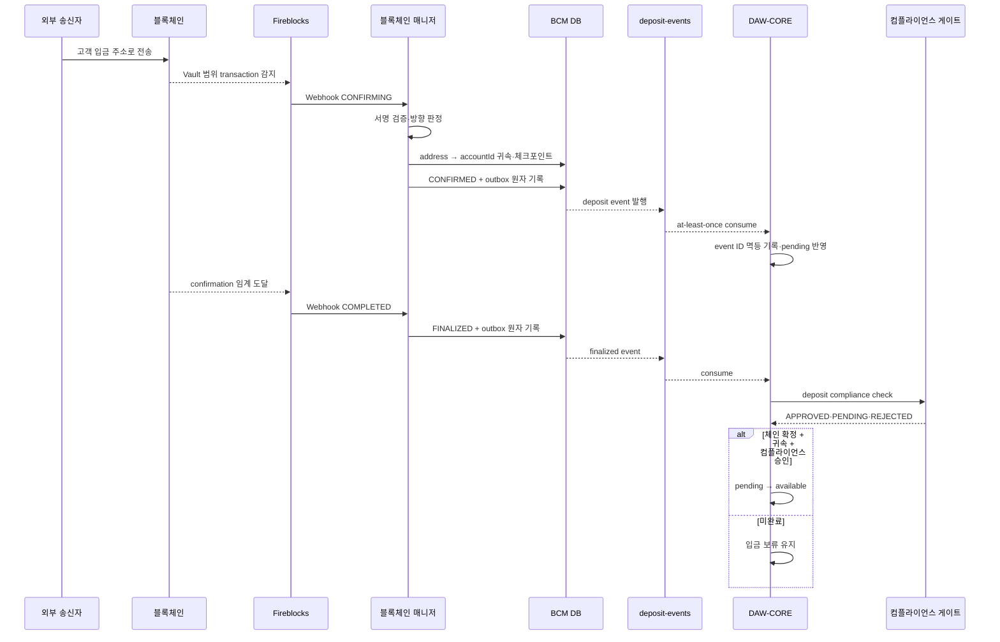
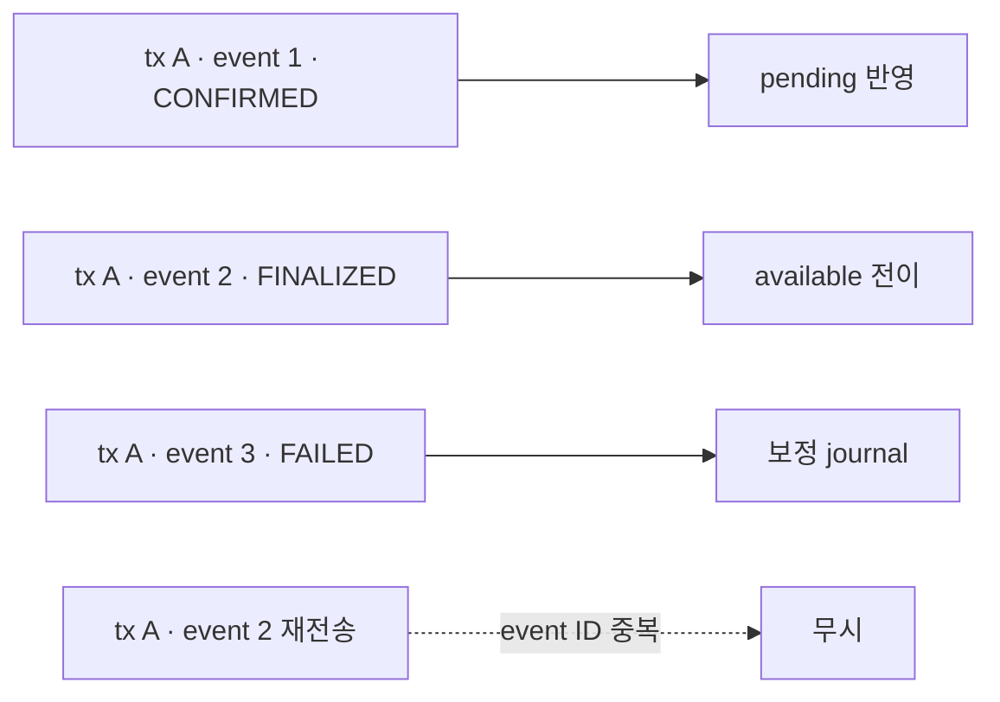

# 입금 감지부터 가용 잔액까지

입금은 블록체인에 기록되는 것을 막을 수 없다. 블록체인 매니저가 Fireblocks webhook으로 감지·확정 상태를 번역해 `deposit-events`에 발행하고, DAW-CORE가 고객 귀속·컴플라이언스와 내부 원장을 처리한다.

## 전체 시퀀스



## 단계별 책임

| 단계 | 블록체인 매니저 | DAW-CORE |
|---|---|---|
| 감지 | Webhook 인증, vendor transaction 적재 | 직접 vendor webhook을 받지 않음 |
| 방향 | source·destination과 Vault mapping으로 입금 판정 | 업무 유형을 재분류하지 않음 |
| 귀속 후보 | 주소 mapping으로 accountId를 찾음 | 실제 고객·계정의 유효성과 상품 상태 확인 |
| 확정 | vendor 상태를 `CONFIRMED`·`FINALIZED`로 번역 | pending·available 원장 전이 |
| 컴플라이언스 | PII·트래블룰 내용을 해석하지 않음 | 게이트를 호출해 가용 여부 결정 |
| 회계 | 고객 잔액을 쓰지 않음 | journal·가용 잔액·보류 상태의 정본 |

## 입금 상태

| TxStatus | 체인·벤더 상황 | DAW-CORE 잔액 |
|---|---|---|
| `CONFIRMED` | 블록에 포함됐지만 정책 임계 전 | pending 증가, available 불변 |
| `FINALIZED` | DCCP confirmation 임계 도달 | 다른 조건 충족 시 available 전이 |
| `REJECTED` | AML 동결·수동 동결 등 업무상 잠김 | 가용 금지, 운영자 해소 대기 |
| `FAILED` | dropped·reorg 무효화 등 영구 실패 | 기존 pending 또는 반영분을 보정 journal로 취소 |

입금에는 `SUBMITTED`가 없다. 우리가 생성한 outgoing transaction이 아니므로 체인에 등장하기 전 단계를 관찰하지 않는다.

## 가용 조건

```text
고객 available 반영
= TxStatus FINALIZED
  AND address·account 귀속 완료
  AND 자산·network 상품 활성
  AND 컴플라이언스 APPROVED 또는 NOT_REQUIRED
  AND 동일 event·transaction 미반영
```

체인 finality와 컴플라이언스 승인은 서로 다른 조건이다. 어느 한쪽이 늦어도 입금 record와 pending 상태는 보존한다. 고객에게는 `온체인 확인 중`, `정보 확인 중`, `운영 검토 중`처럼 실제 대기 원인을 구분해 보여준다.

## 이벤트 멱등성

같은 transaction은 감지와 확정, 경우에 따라 무효화 이벤트를 여러 번 만든다. 따라서 dedup key는 `txId`가 아니라 이벤트 ID다.



- 이벤트 ID에 UNIQUE 제약을 둔다.
- 원장 반영과 event 처리 완료를 하나의 DB transaction으로 묶는다.
- 성공한 뒤에만 queue offset을 commit한다.
- 같은 accountId를 partition key로 사용해 감지·확정의 소비 순서를 유지한다.
- 상태 순서를 숫자 비교하지 않고 명시적인 허용 전이표를 사용한다.

`FINALIZED → FAILED`는 일반적인 역행이 아니라 reorg 무효화이므로 허용해야 한다.

## 귀속 불명 입금

destination이 우리 Workspace에 속하지만 BCM DB의 주소 mapping으로 accountId를 찾지 못한 경우 고객 이벤트를 만들지 않는다. 잘못된 고객에게 귀속하는 것보다 별도 운영 큐에서 조사하는 것이 안전하다.

운영 큐에는 다음 메타데이터를 남긴다.

- vendor transaction ID와 txHash
- network·asset·amount
- destination address·memoTag
- 최초 감지·최종 갱신 시각
- Vault·asset wallet 식별자
- mapping 탐색 결과와 격리 사유

수동 mapping이 승인되면 원 webhook을 수정하지 않고 새 귀속 action과 재처리 event를 만든다. 운영자가 잔액 숫자를 직접 올리지 않는다.

## 동결과 해제

AML 동결은 온체인 거래가 사라진 것이 아니다. 자산은 Vault에 도착했지만 vendor의 `frozen` 잔액으로 묶여 출금할 수 없다.

- `REJECTED`와 동결 원인은 운영 UI에서 구분한다.
- 해제 권한은 Admin 절차에 두고 일반 서비스 계정에 주지 않는다.
- 해제 뒤 vendor 상태와 실제 available·frozen 값을 다시 조회한다.
- DAW-CORE의 고객 가용 전이는 운영 action과 컴플라이언스 승인에 연결한다.
- 해제 전후의 actor, 근거, vendor audit ID를 보존한다.

## Reorg와 무효화

확정 임계를 두는 것이 1차 방어다. 그래도 이미 반영한 입금이 `FAILED`와 dropped 사유로 바뀌면 기존 record를 삭제하지 않는다.

1. 무효화 이벤트를 별도 event ID로 수신한다.
2. 원 입금과 기존 journal을 찾는다.
3. available로 전이되지 않았다면 pending을 취소한다.
4. 이미 available·사용된 경우 보정 journal과 위험 상태를 만든다.
5. 마이너스 잔액·추가 출금 차단 등 고객 정책을 적용한다.
6. 대사와 사고 조사에 원 transaction·무효화 기록을 모두 남긴다.

## Sweep 연결

입금이 `FINALIZED`가 되면 블록체인 매니저는 해당 고객 Vault·자산을 sweep 대상으로 표시할 수 있다. 이 동작은 고객 원장 이벤트가 아니다.

```text
고객별 intermediate Vault → omnibus Vault
온체인 보관 위치 변경
고객 DAW-CORE 잔액 변화 없음
deposit-events 추가 발행 없음
```

컴플라이언스가 아직 `PENDING`인 자산을 sweep할 수 있는지는 보관 정책으로 명시한다. 물리적으로 중앙 보관하는 것과 고객에게 가용하게 하는 판단을 혼동하지 않는다.

## 구현 점검

- [ ] Webhook 서명 검증 뒤 원문을 inbox에 영속화한다.
- [ ] address mapping 없는 입금은 고객 queue가 아닌 운영 큐로 보낸다.
- [ ] `CONFIRMED`에서는 available을 올리지 않는다.
- [ ] event ID 멱등성과 accountId partition ordering을 사용한다.
- [ ] `FINALIZED → FAILED` 무효화 전이를 처리한다.
- [ ] 체인 확정·귀속·컴플라이언스가 모두 끝나야 가용 처리한다.
- [ ] sweep과 고객 원장 변경을 분리한다.
