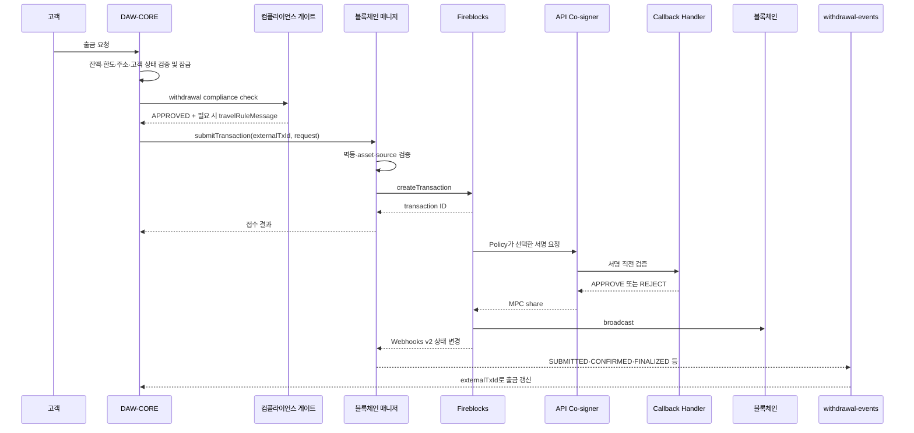
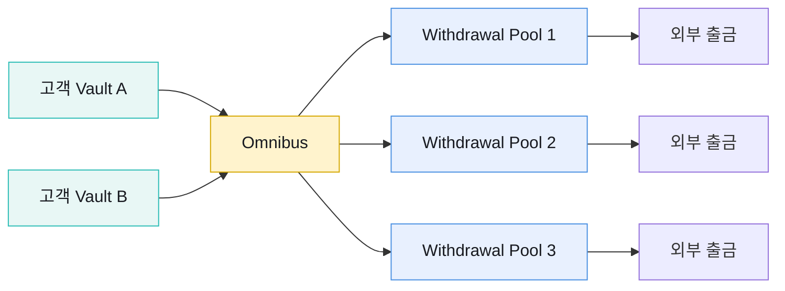
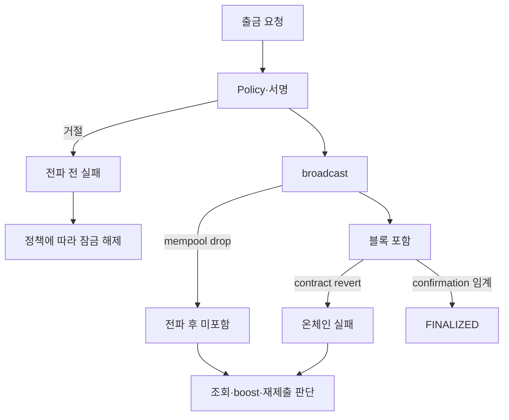

# 출금 승인부터 확정까지

출금은 DAW-CORE가 고객 의사·잔액·한도·컴플라이언스를 확정한 뒤에만 블록체인 매니저로 넘어온다. 블록체인 매니저는 승인 여부를 새로 판단하지 않고 요청을 멱등하게 Fireblocks에 제출하고 상태를 공통 이벤트로 돌려준다.

## 전체 시퀀스



## 제출 계약

```json
{
  "externalTxId": "wd_20260819_00042",
  "from": {
    "type": "ACCOUNT",
    "accountId": "withdrawal_pool_eth_02"
  },
  "to": {
    "type": "ADDRESS",
    "address": "0x..."
  },
  "network": "ETHEREUM",
  "symbol": "USDC",
  "amount": "2500.00",
  "travelRule": {
    "provider": "...",
    "message": "encrypted-or-provider-reference"
  }
}
```

`from`은 우리 계정만 허용한다. 외부 주소가 source인 거래를 블록체인 매니저 출금 API로 만들지 않는다. `to`는 일회성 주소, 내부 account, 사전 등록 wallet 등 destination type에 따라 vendor 경계에서 변환한다.

트래블룰 message는 컴플라이언스 게이트가 만든 산출물이다. 블록체인 매니저는 전달·참조만 하고 PII 내용을 파싱하거나 판정을 변경하지 않는다.

## 멱등성

`externalTxId`는 DAW-CORE 출금 ID와 1:1이다.

| 재호출 | 처리 |
|---|---|
| 같은 key·같은 정규화 payload | 최초 transaction ID와 현재 결과 반환 |
| 같은 key·다른 주소·금액·자산 | `Conflict`로 거절 |
| create timeout | 같은 key로 vendor 접수 여부 조회 후 제한 재시도 |
| vendor 성공·BCM DB 저장 실패 | externalTxId로 transaction을 복구해 mapping 저장 |
| 이미 txHash가 있는 실패 건 | 새 거래로 자동 재제출 금지 |

요청 payload의 canonical hash를 저장해 `같은 내용`을 판단한다. note, JSON key 순서처럼 업무 의미가 없는 차이와 주소·금액 같은 의미 있는 차이를 구분한다.

## 출금 Pool

고객별 intermediate Vault에서 직접 출금하지 않는다. 확정 입금은 omnibus로 모으고, 고객 출금은 전용 withdrawal pool에서 보낸다.



EVM transaction은 발신 계정 nonce가 직렬화되므로 여러 pool을 round-robin 또는 부하 기준으로 선택한다. 선택기는 network·asset 지원, available balance, pending nonce, 운영 중지, 진행 중 transaction 수를 함께 본다. 선택 결과를 출금 record에 고정하고 재시도 때 다른 pool로 조용히 바꾸지 않는다.

## 서명 직전 검증

Callback Handler는 DAW-CORE 승인 record의 읽기 전용 복제본과 Fireblocks transaction을 비교한다.

| 검증 | 차단하는 문제 |
|---|---|
| externalTxId와 활성 출금 존재 | 임의 transaction·삭제된 요청 |
| source pool·network·asset | 다른 Vault·체인의 자산 이동 |
| destination·memoTag | 주소 변조와 tag 누락 |
| amount·fee 상한 | 금액 변조·비정상 수수료 |
| 컴플라이언스·업무 승인 상태 | 승인 전·취소·만료 요청 |
| 서명 소비 여부 | 같은 승인으로 두 번째 서명 |
| 운영 차단 상태 | freeze·network disable 중 우회 |

DB나 policy snapshot을 읽을 수 없으면 승인하지 않는다. Handler 장애를 자동 승인으로 우회하지 않는다.

## 상태와 회계

| TxStatus | 의미 | DAW-CORE 처리 |
|---|---|---|
| `SUBMITTED` | Policy·승인·서명·broadcast 준비 | 출금액 잠금 유지 |
| `CONFIRMED` | 체인 포함, 임계 전 | 잠금 유지, txHash 노출 가능 |
| `FINALIZED` | confirmation 정책 임계 도달 | 출금 완료 journal·수수료 확정 |
| `REJECTED` | Policy·스크리닝·사람 승인 거절 | 원인 확인 후 반려·잠금 해제 |
| `FAILED` | 영구 기술 실패·revert·drop | txHash·subStatus를 조사해 재처리 결정 |

고객에게 `FAILED`만 보여주지 않는다. 체인 전파 전 실패, mempool drop, 컨트랙트 revert를 구분해 안내와 운영 action을 정한다. vendor의 errorDescription 문자열을 파싱해 자동 회계 분기를 만들지 않는다.

## 실패 시점



- 전파 전 `REJECTED`·`FAILED`는 txHash가 없을 수 있다.
- mempool drop은 같은 nonce·대체 transaction과의 관계를 확인한다.
- revert는 블록에 포함돼 수수료가 발생할 수 있다.
- txHash가 생긴 뒤에는 고객 요청을 새 transaction으로 자동 복제하지 않는다.
- 재출금이 필요하면 새 externalTxId와 새 승인·컴플라이언스를 사용한다.

## 막힘과 boost

상태 변화가 없는 오래된 `CONFIRMED`·제출 건은 webhook으로 새 알림이 오지 않는다. 블록체인 매니저의 주기 작업이 BCM DB에서 체류 시간을 조회한다.

1. network별 대기 임계를 넘은 outgoing transaction을 찾는다.
2. 이미 boost 중이거나 최대 시도에 도달한 건을 제외한다.
3. 정책이 허용한 범위에서 fee를 높여 boost한다.
4. 원 transaction과 boost transaction을 연결한다.
5. 상태 변화는 정상 webhook·queue 경로로 처리한다.
6. 최대 시도 뒤에도 정체하면 운영 경보로 보낸다.

입금은 우리가 발신자가 아니므로 boost하지 않는다. 출금 cancel은 체인·nonce 상태에 따라 성공이 보장되지 않는 예외적 운영 action이다.

## 구현 점검

- [ ] 컴플라이언스 승인 전에 `submitTransaction`을 호출할 수 없다.
- [ ] externalTxId와 canonical request hash로 영구 멱등성을 보장한다.
- [ ] 출금 Pool 선택 결과를 재시도 중 바꾸지 않는다.
- [ ] Callback Handler가 DAW-CORE 승인과 실제 서명 payload를 fail-close로 대조한다.
- [ ] Fireblocks ID·externalTxId·txHash를 서로 검색할 수 있다.
- [ ] txHash 생성 전후의 실패와 회계 처리가 구분돼 있다.
- [ ] boost·cancel·재출금이 원 거래와 감사상 연결된다.
